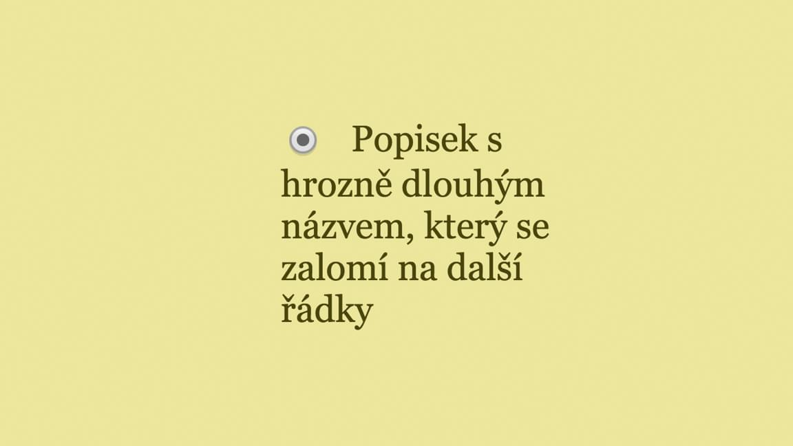
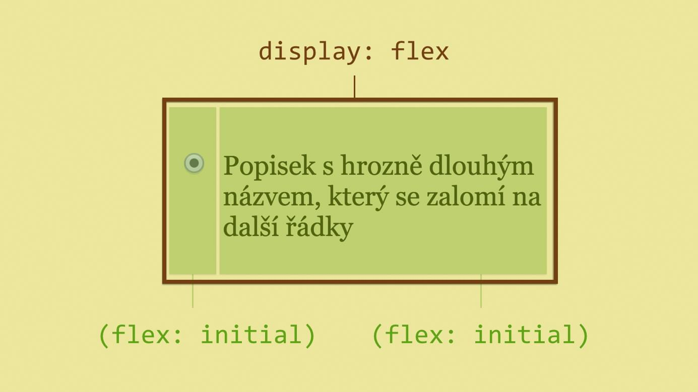
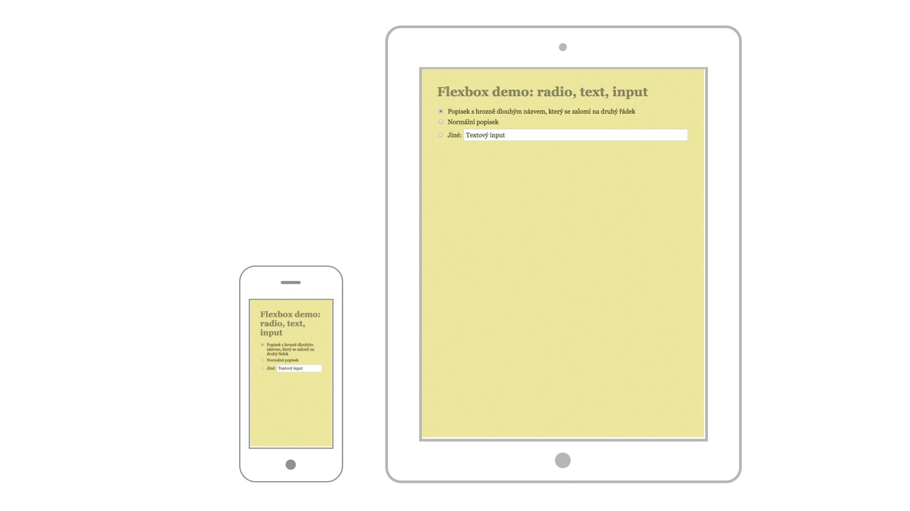

# Flexbox: praktické příklady

## První příklad: základy pružnosti

Vezměme toto HTML:

```html
<label>
  <input type="radio"> Popisek s hrozně dlouhým
    názvem, který se zalomí na další řádky
</label>
```

V prohlížeči to bude nezarovnané. Za to bychom od klienta pochvalu nedostali:



Samozřejmě chceme, aby text nepřetékal pod přepínač (radio button). Zvládli bychom to jistě i bez flexboxu, ten z toho ale dělá velmi jednoduchou záležitost. Stačí nám totiž jedna deklarace:

```css
label { display: flex }
```

Tím jsme z `<label>` udělali kontejner flexboxu a z přímých potomků jeho položky.

Asi je dobře vidět, že za položku flexboxu se považuje i prázdný textový uzel, tedy text nezanořený do tagu. V našem případě onen „Popisek s hrozně dlouhým názvem…".

Pojďme si vzniklou situaci ještě ukázat na obrázku:



Technicky vzato má totiž každá položka vlastnost `flex` a její výchozí nastavení na `initial`. Jak si ukážeme v referenční příručce, `flex` je zkratka pro další vlastnosti. Hodnota `initial` znamená, že se položka umí s ubývajícím prostorem smršťovat, ale neroztáhne se, ani když dostane dostatek volného místa.

Příklad si můžete vyzkoušet na CodePenu [cdpn.io/e/raqXZX](http://cdpn.io/e/raqXZX).

## Příklad druhý: kombinování jednotek


Náš formulář rozšíříme. Podívejte se hlavně na poslední řádek. V tomto případě kombinujeme různé jednotky.

Šířku přepínače jako součásti rozhraní prohlížeče chceme nadefinovat v pixelech. Jenže šířka textového popisku závisí spíše na velikosti písma, proto definujeme v `em`. Pak bychom rádi, aby textový input zabral zbytek plochy. A nechceme přepínač a textový popisek zvětšovat či zmenšovat. S flexboxem to půjde snadno. Prohlížeč si s kombinacemi jednotek poradí sám:



Všimněte si, že jsme přepínači a textu nastavili `flex: none`. Nechceme totiž aby se smršťovaly nebo roztahovaly. Prostě drží šířku za každou cenu. A naopak – textovému formulářovému políčku jsme pomocí `flex: auto` přikázali, aby se vždy smršťovalo a roztahovalo co mu šířka rodiče dovolí.

Příklad si opět můžete vyzkoušet na CodePenu [cdpn.io/e/jEJbmg](http://cdpn.io/e/jEJbmg).

## Příklad třetí: svislé centrování boxu neznámé výšky


Také jste se s tímto úkolem dřív trápili? S flexboxem už nebudete! Z `<body>` uděláme flex kontejner a roztáhneme jej na 100 % výšky okna – pomocí nové jednotky `vh`. Pak už jen stačí flex položce pomocí `align-self` přikázat, ať se centruje.

Centrování v obou směrech je s flexboxem bezproblémové. Kromě `align-self` se do následující referenční příručky podívejte i na vlastnosti `justify-content` a `align-items`.

CodePen ukázka je na [cdpn.io/e/zxydom](http://cdpn.io/e/zxydom).

## Příklad čtvrtý: změna vizuálního pořadí položek

Potřebujete v HTML pořadí položek jedním způsobem, ale zobrazovat je zase jiným způsobem? I tady flexbox pomůže. Zapamatujte si [vlastnost `order`](css-order.md), která slouží pro změnu pořadí flex položek.


V kódu máme pořadí: A) C) B). Na malých displejích ale chceme vizuální pořadí změnit. C) bude následovat až po B). Uděláme to takto, protože vlastnost pořadí se počítá od nuly:

```css
.item-C { order: 2 }
```

V prohlížeči vyzkoušíte na adrese [cdpn.io/e/JoqxJe](http://cdpn.io/e/JoqxJe).

Změna vizuálního pořadí se hodí i třeba pro řazení od konce abecedy. Do příručky se podívejte na vlastnost flex-direction.

## Příklad pátý: navigace s neznámým počtem položek

Představte si horizontální navigaci, u které předem neznáte počet položek. Ale nepředstavujte si ji prosím moc dlouho, abyste z toho nedostali nějakou ošklivou vyrážku.

Toto je její HTML:

```html
<div class="nav">
  <ul>
    <li><a href="/produkty">Produkty</a></li>
    <li><a href="/cenik">Ceník</a></li>
    <li><a href="/o-nas">O nás</a></li>
    <li><a href="/kontakty">Kontakty</a></li>
    <!-- Další položky přidané
      v redakčním systému… -->
  </ul>
</div>
```

A takhle chceme, aby vypadala:


Bez flexboxu problém dokážeme vyřešit pomocí `display: table`. Ale trápily by nás nevýhody v podobě nutnosti přidání elementu s `display: table-row` a třeba nemožnost absolutního pozicování uvnitř „buněk tabulky".

O flexboxu už toho víme dost, a tak nás řešení asi nepřekvapí:

```css
.nav ul {
  display: flex;
}

.nav li {
  flex: auto;
}
```

Když ovšem přidáme další – nezvykle dlouhou – položku, vezme si daleko více prostoru. Je to kvůli relativní distribuci volného prostoru flex-basis: auto, která je skrytá ve zkratkové deklaraci `flex: auto`.


Můžeme ale chtít, aby všechny položky byly stejně široké, že ano? Pak změníme model pružnosti na absolutní tím, že nastavíme `flex-basis: 0`.

Co je absolutní model pružnosti? Podíl pro rozšiřování položky do volného místa se počítá z její celkové šířky. U relativního modelu se počítá jen z prostoru, který zbývá mezi šířkou obsahu a celkovou šířkou.


Takhle nám to vyhovuje. V prohlížeči vyzkoušíte na adrese [cdpn.io/e/NPevjg](http://cdpn.io/e/NPevjg).
