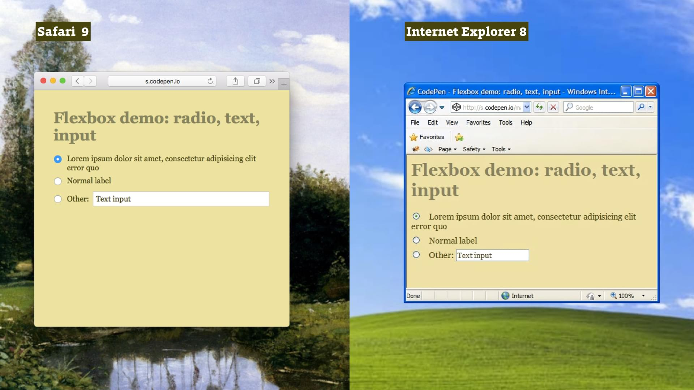
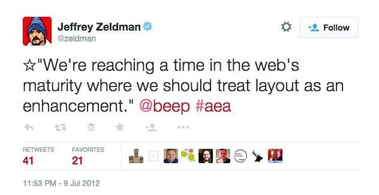

# Flexbox: podpora v prohlížečích

Není špatná. V době psaní článku je to v ČR 92–95 % a s pomocí rozumných fallbacků pro starší prohlížeče není důvod jej nepoužít hned.

## Tři syntaxe v moderních prohlížečích

Raději rovnou píšu, že plnou podporu v moderních prohlížečích vám zajistí dobře nakonfigurovaný [Autoprefixer](autoprefixer.md), o kterém byla řeč v úvodu ebooku. Dále proto čtěte, jen pokud vás zajímají detaily.

V moderních prohlížečích má flexbox tři verze syntaxe.

* **Finální syntaxe.** `display: flex` a další vlastnosti, tak jak ukazujeme v ebooku. Podporují poslední verze všech prohlížečů, včetně IE11 nebo Opery Mini.
* **Mezisyntaxe (tweener) z roku 2012.** `display: flexbox`. Dnes už vyžaduje snad jen IE10.
* **Stará (legacy) syntaxe z roku 2009.** Kdekoliv uvidíte `display: box` nebo lépe `-webkit-display: box`. Webkit ve verzi 20 a starší, tzn. třeba iOS6 nebo starší Androidy.

## Jak v prohlížečích bez podpory?

Týká se jen IE9 a starších. Raději se podívejte do statistik vašeho projektu, kolik uživatelů vlastně mají.

### Nulový fallback – podporu vůbec neřešíme

Je ale dobré si ujasnit a v praxi vyzkoušet, co to znamená „neřešit podporu flexboxu ve starších prohlížečích“.

Vidět je to na následujícím obrázku. Pro layout formuláře se tam docela hojně využívá flexbox. V Safari se zobrazuje, tak jako bylo plánováno. V IE8 nevyplní textový input celou zbývající plochu a popisek „Jiné“ se nebude zvětšovat se zvětšující se velikostí písma:



Je to příklad, který už známe z [cdpn.io/e/jEJbmg](http://cdpn.io/e/jEJbmg).

Formulář tedy zůstává použitelný. Jen některé prvky nebudou uživatelsky tak přívětivé. No jistě. Nejen zaoblené rohy, ale i layout můžeme brát jako vylepšení uživatelského prožitku:



### Detekce vlastností a alternativní řešení

Nulový fallback ovšem nemůžeme použít u příkladu s centrováním boxu doprostřed stránky. Pokud by v konkrétní aplikaci bylo potřeba dodržet alespoň obdobný vzhled, museli bychom si vypomoci alternativním řešením v CSS nebo případně Javascriptu.

Jak už bylo zmíněno v úvodní kapitole, pomohl by nám detekční skript Modernizr a jeho třída `.no-flexbox`.

Principiálně by řešení vypadalo takto:

```css
.vertical-centered {
  /* Flexbox centrování */
}

.no-brainer .vertical-centered {
  /* Centrování bez flexboxu */
}
```

Takto lze udělat alternativní layout například pomocí `display: table|table-row|table-cell`.

### Definovaný fallback

Flexbox je jen nová hodnota vlastnosti display. S tím je možné pracovat hlavně u typů fallbacků, kdy chceme, aby se i původně `inline` nebo `inline-block` elementy naskládaly pod sebe. V prohlížečích bez podpory flexboxu se tedy naskládají pod sebe, často podobně jako na mobilních zařízeních.

```css
.box {
  display: block;
  display: flexbox;
}
```

Snadno se například dělá fallback pomocí vlastnosti `float`, protože ta se na flexboxové položky nedá aplikovat:

```css
.container {
   display: flexbox;
}

.box {
  display: block;
  float: left;
}
```

### flexbugs – nejčastější chyby prohlížečů

Jak už jste si jistě všimli, flexbox je dost složitý standard a to – spolu s jeho relativní čerstvostí – způsobuje řadu drobných chyb v prohlížečích.

Kromě standardního hledání na Google nebo StackOverflow doporučuji projekt **flexbugs**. Phillip Walton a komunita tam sbírá, dokumentuje a hledá řešení nejčastějších chyb. [vrdl.in/fbugs](https://github.com/philipwalton/flexbugs)
