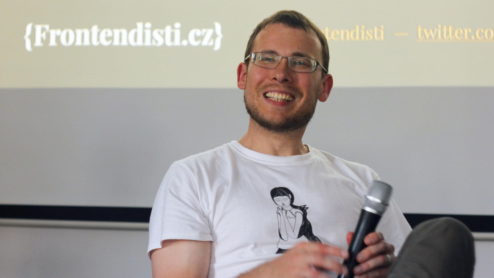

## Děkuji!

Ještě jednou díky za zakoupení ebooku „Vzhůru do CSS3“. Vážím si vaší důvěry. Díky ní mohu ebook dále vylepšovat a rozšiřovat. 

Pokud se k vám náhodou dostal jinou cestou, nebojte nic není ztraceno. Stále můžete dát vše do pořádku koupí licence na webu [vrdl.cz/ebook](http://www.vzhurudolu.cz/ebook).

## Zpětná vazba

I když jsem udělal vše proto, abych se jim vyhnul, nezbývá než se smířit s tím, že i v tomto ebooku nějaké chyby zůstaly. Moc pomůže, když je nahlásíte. Všichni uživatelé dostanou jednou za čas aktualizovanou verzi.

Moc rád si přečtu i obecnou zpětnou vazbu nebo rovnou recenze ebooku. Pište na [martin@vzhurudolu.cz](mailto:martin@vzhurudolu.cz).

## Proč a pro koho?

Základy pro ebook „Vzhůru do CSS3“ pokládá leta aktualizovaná CSS3 příručka na webu Vzhůru dolů – [vrdl.cz/prirucka/css3](http://www.vzhurudolu.cz/prirucka/css3).

Text, který jste právě začali číst provádí vývojáře aktuálním stavem ve vývoji webového uživatelského rozhraní (UI).

Bude se hodit jako každodenní pomocník při používání vlastností v praxi hlavně začínajícím a mírně pokročilým. Zkušení ale ocení první podrobný český text [o Flexboxu](css3-flexbox.md) nebo [úvodní shrnutí](kapitola-1-perex.md) principů kódování pro současný web.

Zabýváme se kodéřinou, tedy UI vývojařinou. Nikoliv frontend programováním a Javascriptem.

## O co tady půjde?

Text má dvě části:

**O dnešním kódování webů** – jak se vývoj webového uživatelského rozhraní v posledních letech změnil a jaké nástroje, technologie a postupy se dnes hodí využívat.

**Referenční příručka CSS3 vlastností** –  ukázky jejich využítí a nejčastější špeky, na které si dát pozor v praxi.

## Autor

Martin Michálek je frontend designér na volné noze. Navrhuje a implementuje  uživatelská rozhraní responzivních webů, například pro [VašeČočky.cz](http://www.vasecocky.cz). Píše blog [Vzhůru dolů](http://www.vzhurudolu.cz/) a ebook [Vzhůru do CSS3](http://www.vzhurudolu.cz/ebook). Spoluzaložil a vede spolek [Frontendisti.cz](http://frontendisti.cz/).

Pořádá školení se zaměřením na moderní webový frontend – CSS, responzivní design, rychlost načítání, framework Bootstrap, SVG nebo Javascript. [vrdl.cz/kurzy](http://www.vzhurudolu.cz/kurzy)

[vrdl.cz/martin](http://www.vzhurudolu.cz/martin)

