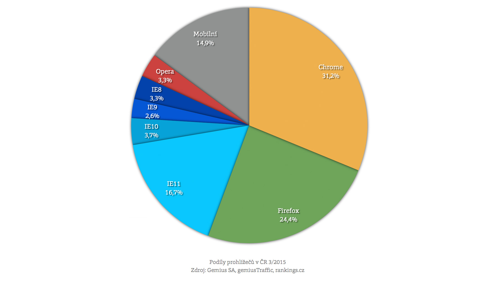
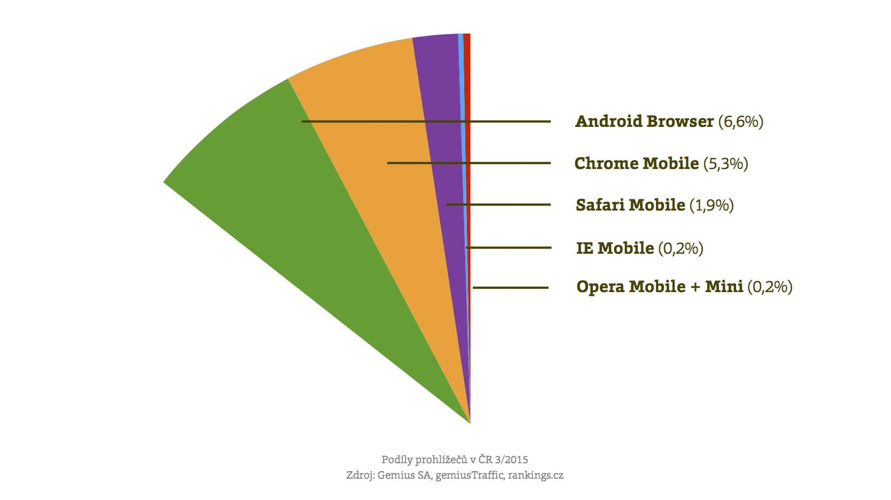

# Mnoho prohlížečů, kodérova smrt

Příchodem Chrome na desktopu začaly nové „Browser Wars“ a zároveň se první bitva války prohlížečů spustila na mobilních zařízeních. Ano, z tohoto pohledu už kodéři zažívali lepší časy.

Pojďme si jen tak z legrace všechny v Česku relevantní prohlížeče vyjmenovat:

- Desktop: Chrome, Firefox, Internet Explorer (verze 11, 10, 9, 8), Opera, *Safari*
- Mobilní zařízení: Android Browser (*verze 2.3*, 4.x a 5), Safari Mobile, Chrome Mobile, *Internet Explorer Mobile*, *Opera Mini*, *Opera Mobile*

Kurzívou jsem vyznačil prohlížeče, které je potřeba více řešit jen u velké návštěvnosti nebo ve speciálních případech. Dívejte se do vlastních statistik, abyste zjistili, zda se vám optimalizace vyplatí.

Optimalizovat pro všechny tyhle prohlížeče? Nebojte se. Zajistit dostupnost hlavního obsahu je možné úplně ve všech prohlížečích, a to i s použitím moderních CSS3 technologií z tohoto textu.

Mrkněme ještě na aktuální podíly návštěvnosti na velkých českých webech podle Gemiusu (rankings.cz):

Na mobilech je pak situace taková:

Verze Internet Exploreru je na rozdíl od ostatních prohlížečů potřeba oddělovat, protože se u některých CSS3 vlastností chovají trochu jinak. Druhý důvod je chybějící automatická aktualizace známá z ostatních prohlížečů.

Více se o jednotlivých mobilních prohlížečích dočtete na [vrdl.cz/blog/18-mobilni-prohlizece](http://www.vzhurudolu.cz/blog/18-mobilni-prohlizece).

U jednoho ale uděláme výjimku a chvíli se na něj zaměříme.

## Mobilní Chrome

Podíl návštěv z Chrome na mobilech roste, a tak je dobré zmínit, že na nových Androidech nahrazuje původní prohlížeč. Ten s ikonou zeměkoule a názvem „Internet“.

Na rozdíl od staršího bratrance bude mobilní Chrome mít — alespoň na některých zařízeních — automatickou aktualizaci. A co do podpory CSS3 a dalších HTML5 technologií je určitě lepší. Viz třeba [html5test.com](https://html5test.com/results/mobile.html).

Chrome existuje i ve verzi pro iOS. Tam je to ovšem  takový pseudo-Chrome.

## Pseudoprohlížeče

Na iOS totiž není možné instalovat prohlížeč s vlastním vykreslovacím jádrem. Takže iOS Chrome a všechny ostatní alternativní prohlížeče jsou pouhým uživatelským rozhraním. Stránky dále vykresluje mobilní Safari.

V některých statistikách můžete vidět přístupy na web z rozhraní Facebooku. Zobrazování webu uvnitř aplikací téhle sociální sítě se děje také v rámci pseudoprohlížeče. Vykreslení probíhá jádrem výchozího prohlížeče na dané platformě. Pomocí Chrome, Android Browseru na Androidu, mobilního Safari na iOS nebo třeba Internet Exploreru na Windows Phone. Více na [vrdl.cz/blog/19-prohlizec-facebook](http://www.vzhurudolu.cz/blog/19-prohlizec-facebook)
