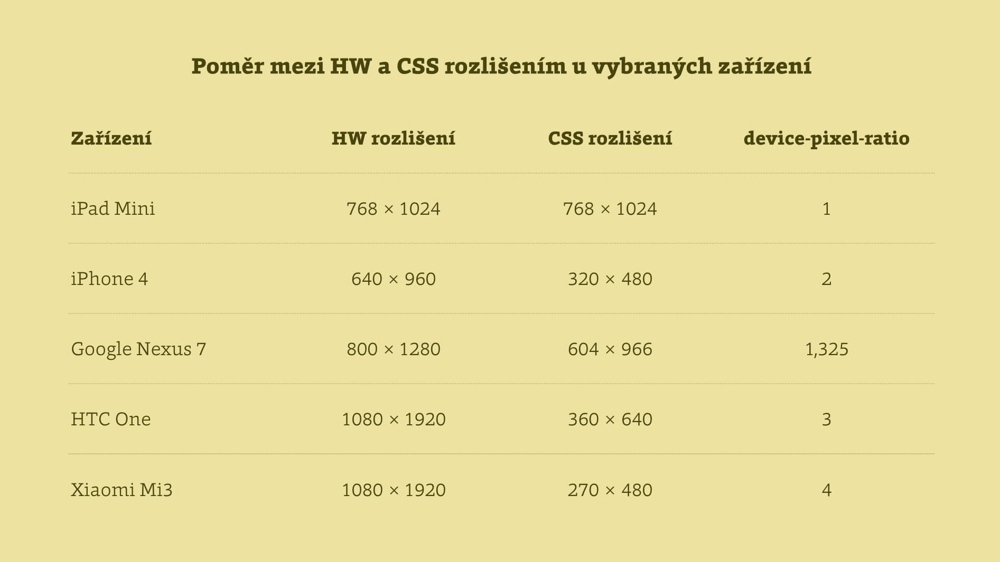

# CSS pixel přichází

CSS pixel. Referenční pixel. Ať už tomu říkáme jakkoliv, pixel už holt není, co za našeho mládí býval.

Retina, Amoled, QuadHD… Asi jste si všimli, že mobilní zařízení mají v poslední době dost šílená rozlišení. A trend nekončí u mobilních zařízení, viz MacBook Pro s Retina displejem.

Autoři webů se ale nemusejí bát zobrazování v hardwarových rozlišeních. Prohlížeče jej totiž přepočítají do takzvaného „CSS rozlišení“.

Pro přepočet mezi hardwarovým a CSS rozlišením se užívá technického pojmenování `device-pixel-ratio` nebo nověji `resolution`. To druhé je v českém prostředí docela matoucí, takže v textech zůstaneme u prvního.

A teď ještě – jaký vliv má `device-pixel-ratio` na práci vývojáře uživatelského rozhraní? To se dozvíte v následujícím odstavci.
