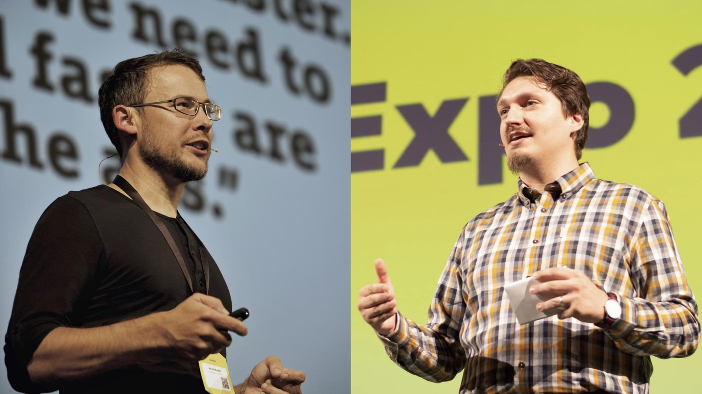

# Autoři

## Martin Michálek

Martin je webový expert na volné noze s více než dvacetiletou praxí a zaměřuje se na rychlost webů a CSS. Jako poradce v posledních letech pomáhal značkám, jako je Livesport, Rohlik.cz nebo Svobodná Evropa. Píše Vzhůru dolů, blog určený zejména profesionálním webovým vývojářům. Organizuje školení a vede spolek Frontendisti.cz, který se zaměřuje na vzdělávání komunity frontendových vývojářů a vývojářek, organizuje srazy a publikuje přednášky. Se ženou a dvěma syny žije a pracuje v pražských Kunraticích.  
[vzhurudolu.cz/martin](https://www.vzhurudolu.cz/martin)

## Robin Pokorný

Robin je javascriptový vývojář ve společnosti NewStore. V minulosti se podílel na responzivním redesignu portálu Jobs.cz. S Martinem spoluzakládal spolek Frontendisti.cz, nyní spolu zpovídají hosty v podcastu. Žije a pracuje v Berlíně, kde také organizuje srazy a přednáší. Na svém YouTube kanále pravidelně zveřejňuje videa pro webové vývojáře.  
[robinpokorny.com](https://robinpokorny.com/)

Robin připravil pro knihu příklady, testy na konci kapitol a text podkapitoly „Tutoriál: Jak převést do AMP blogpost?“. Obsahu také výrazně pomohl odbornými konzultacemi a jako hlavní obsahový recenzent.

## Odborné připomínky

* Jirka Kosek, [kosek.cz](https://www.kosek.cz/)
* Marek Prokop, [marekp.cz](http://www.marekp.cz/)
* Luděk Roleček, [rolecek.cz](http://www.rolecek.cz/)
* Michal Voják, [designdev.cz](https://designdev.cz/)
* Dále přispěli: Pavel Jašek ([jasek.info](http://www.jasek.info/)), Martin Hassman ([met.cz](https://www.met.cz/)), Martin Kocourek ([sazka.cz](https://www.sazka.cz/)), Tomáš Krejčí ([superkoders.com](https://superkoders.com/)), Michal Matuška ([superkoders.com](https://superkoders.com/)), Radek Pavlíček ([poslepu.cz](https://poslepu.cz/o-mne/)), Jan Polzer ([polzer.cz](https://www.polzer.cz/)), Daniel Střelec ([danielstrelec.cz](https://www.danielstrelec.cz/)), Michal Špaček ([michalspacek.com](https://www.michalspacek.com/)), Zuzana Šumlanská ([superkoders.com](https://superkoders.com/)), Pavel Ungr ([pavelungr.cz](https://www.pavelungr.cz/))

Děkujeme všem spolupracovníkům!
