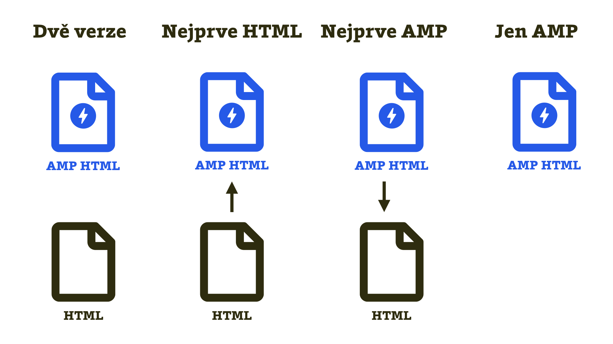

# Kapitola 3: Vazby AMP a non-AMP verze

AMP verze vaší stránky musí nějak koexistovat vedle běžného responzivního webu a přitom se dělit o stejného rodiče – backendový kód a databázi.

Analogie s rodičem je tady docela na místě. AMP a váš běžný web mají vlastně sourozenecký vztah. V momentě návrhu architektury obou verzí si tak můžete zahrát na pánaboha a nastavit vztah podle stvořitelových potřeb:

* [Dvě oddělené verze](https://docs.google.com/document/d/1wY4VwtXLwg-3R84OL0cYc5HP9unQXQCVpkO8yNI5mZE/edit#heading=h.5kif1xtv30b) – AMP a HTML jsou oddělení sourozenci, kteří o sobě prakticky nevědí. Vám se ale může brzy začít protivit, že na péči o ně potřebujete dvakrát tolik času.
* [Nejprve HTML, pak AMP](https://docs.google.com/document/d/1c1Rf5sfu9rTTh9taijEnO-gn6WlCRBDYKdZpzWAxsJQ/edit#) – vaše AMP sdílí podstatnou část frontendového i backendového kódu s běžným webem. Je to vlastně klon. Vy jen během klonování upravíte některé části (DNA) kódu.
* [Nejprve AMP, pak HTML](https://docs.google.com/document/d/1n53DCtZUdKgPnVrW4w--iGkMa8KkmEYHi79TcZl3GPY/edit#heading=h.y18ovrv0p9vc)– tady to platí naopak. Prvorozená je v tomhle případě AMP verze. Pomocí výjimek v kódu z ní pak vytvoříte plnohodnotnou responzivní verzi.
* [Jen AMP](https://docs.google.com/document/d/1dMX8R881Xds7cpCCyYfAZm_tp-lz3rmEFZiKjZdxVOs/edit#) – nejefektivnější cesta, ale ne pro každého. Prostě si nadělíte jedináčka. Frontendový kód vycházející striktně z AMP vám řeší obě varianty distribuce.

I když to z názvů metod soužití obou verzí nemusí být patrné, jde vlastně o míru upřednostnění AMP a velikosti sdíleného kódu.

<figure>

<figcaption markdown="1">
_Obrázek: Zjednodušené schéma přístupů k implementaci AMP._
</figcaption>
</figure>

Pokud se bavíme o technických možnostech implementace, zmiňme dvě zvláštnosti:

* V rámci implementace do populárních redakčních systémů se hodí vědět o existenci [pluginů](https://docs.google.com/document/d/1rc3Ntq4w8eKdFS2QnjsbmV0Vpz67VS5Vi624123f3LY/edit#), které vám mohou ušetřit opravdu hodně času při vývoji, ať už zvolíte kteroukoliv z metod stvoření popsaných výše.
* AMP se dá také skvěle [kombinovat s PWA](https://docs.google.com/document/d/1jY-eyx3uAKEJ9I9FSG12yW6EAJEK_jI-IFLx-KcyTUw/edit#) (progresivními webovými aplikacemi), což může být vlastně jakýkoliv moderní web.

Pojďme se teď podívat na variantu, kterou sice z dlouhodobé perspektivy příliš nedoporučujeme, je ale skvělá v situaci, kdy si chcete nasazení AMP vyzkoušet. Třeba proto, že zase tak moc nevěříte tomu, že tady bude ještě za pět let.
