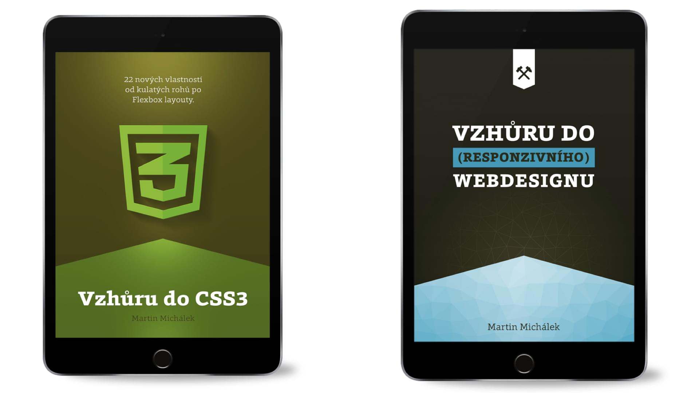
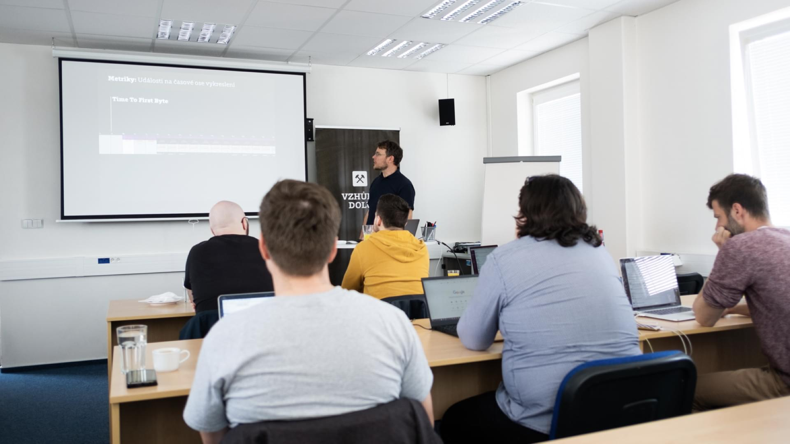

# Kam dál? E-booky, školení a blog

## Další e-booky

### Vzhůru do (responzivního) webdesignu

Kompletní průvodce návrhem a implementací designu responzivních webů. Vydáno v roce 2017, aktualizováno 2018. 311 stránek. E-book i tištěná kniha.  
[vzhurudolu.cz/kniha-responzivni-design](https://www.vzhurudolu.cz/kniha-responzivni-design)

### Vzhůru do CSS3

Základy CSS3 vlastností a flexbox do hloubky. Vydáno v roce 2015, naposledy aktualizováno v roce 2017.  
[vzhurudolu.cz/ebook-css3](https://www.vzhurudolu.cz/ebook-css3)

## Školení

Vzhůru dolů pořádá kurzy moderních frontendových technologií pro profesionální webové vývojáře.

<figure>

<figcaption markdown="1">
_Obrázek: Školení „Optimalizace rychlosti webu“ v Brně. Foto: Zuzana Šumlanská, SUPERKODERS_
</figcaption>
</figure>

Školíme JavaScript, CSS, rychlost načítání a další technologie. Dvakrát ročně v Praze a jednou v Brně.

[vzhurudolu.cz/kurzy](https://www.vzhurudolu.cz/kurzy)

## Vzhůru dolů

[vzhurudolu.cz](https://www.vzhurudolu.cz/) – [facebook.com/vzhurudolu](https://www.facebook.com/VzhuruDolu/) – [twitter.com/vzhurudolu](https://twitter.com/vzhurudolu)
