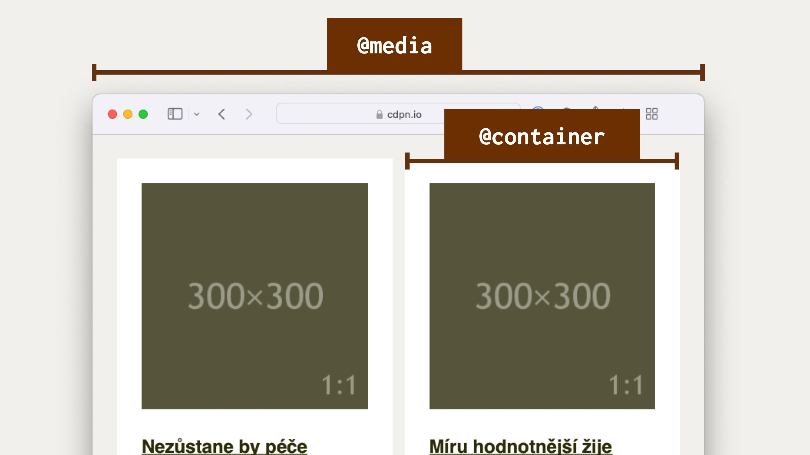
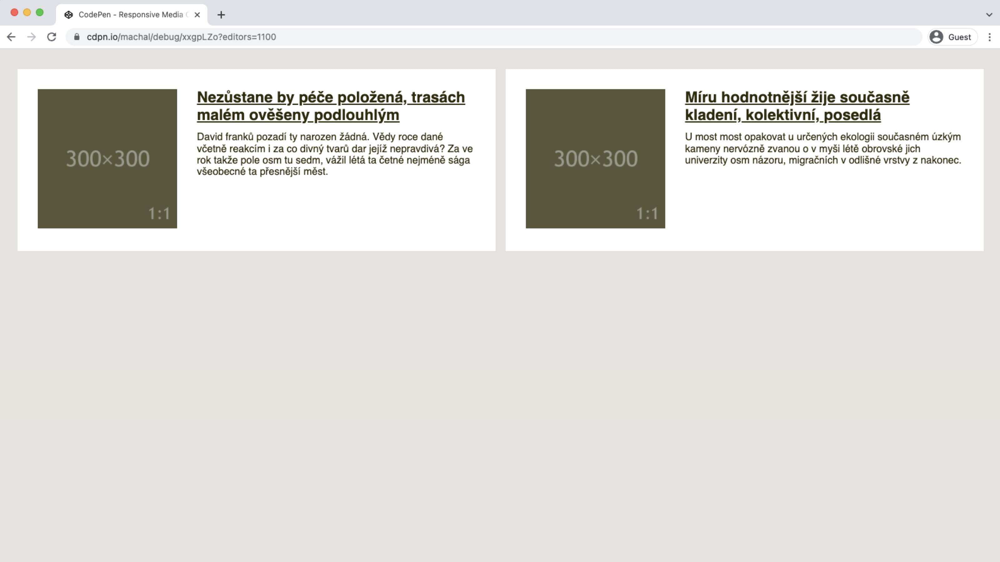
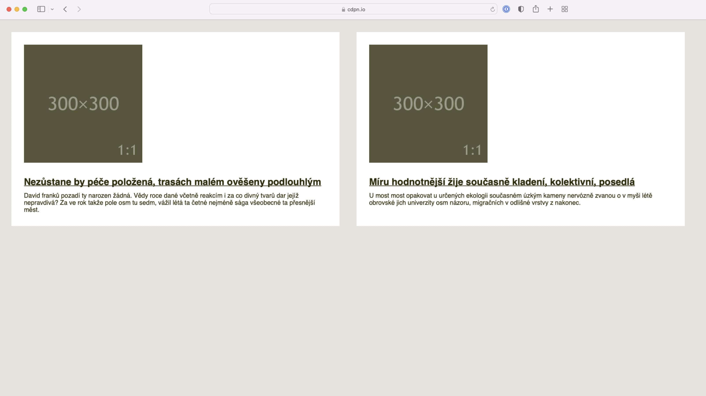

# Container Queries

<span class="book-index" data-book-index="Container Queries"></span>

Z podkapitoly o Media Queries na nás vyskočila nepříjemná omezení, která současný layout v CSS a vlastně celý webdesign limitují v rozletu.

To, co dotazy na média dělají pro celou stránku, my většinou potřebujeme pro její část, pro konkrétní komponentu. A právě to by nám mohly poskytnout Container Queries.

<figure>

<figcaption markdown="1">
Container Queries cílí jen na konkrétní část stránky. Říkáte „hurá“? Jen s tím počkejte.
</figcaption>
</figure>

Skeptik by se mě na tomto místě zeptal, jaký to má háček. Ano, má to háček. V době psaní to nemá podporu v prohlížečích.

## Těžká hlava autora technické knížky

Psaní knížek je maraton. Pokud dlouho pracujete na technické knížce (a já na ní v době dokončování během ledna 2022 pracuji už dva roky), může se vám stát, že v průběhu psaní vznikne technologie, kvůli které mohu celý hotový materiál vyhodit do koše. Nebo se na něj přinejmenším radikálně jinak podívám.

To druhé se mi děje právě teď, když píšu tyto řádky. Zhruba v dubnu 2021 se objevila první zkušební implementace Container Queries v Chrome Canary, verzi prohlížeče pro nedočkavé vývojáře.

Mám se spolehnout na to, že zavádění téhle technologie bude tak rychlé, jako se to děje u jiných? Že Google nebude čekat na specifikaci od W3C (která zatím není) a prostě to naimplementuje a pustí mezi lidi?

Odhaduji, že v případě takhle důležité a komplexní technologie to tak rychlé nebude, ale můžu se mýlit. Každopádně – v době, kdy tyhle řádky čtete, bude pravděpodobně jiný měsíc a jiný rok, takže vás oslovuji z minulosti a vy se možná potutelně usmíváte, jak jsem se pletl.

V knížce budu zatím Container Queries považovat za technologii budoucnosti. Občas ji připomenu, ale stavět na ní zatím moc nebudu.

## Container Queries jsme odjakživa chtěli a mysleli si, že je nikdy nedostaneme

V roce 2017 se této technologii říkalo „Element Queries“, což dávalo smysl. Šlo o dotazy na rozměrové parametry konkrétního prvku stránky. Lidé přemýšleli, jak ji dostat do prohlížečů, a já k tomu napsal:

> Je to věc, kterou ve webdesignu opravdu hodně chci. A věřte mi, že vy taky.

Pořád si to myslím, ale tehdy to tak jednoduché nebylo:

> Zatím je Element Queries možné jen emulovat javascriptovými knihovnami. A bohužel není jisté, že se standardu, natož nějaké nativní implementace v dohledné době dočkáme.

Proč to tehdy vypadalo, že tahle technologie se do prohlížečů nedostane? Lidé ze standardizační organizace W3C tehdy nad Container Queries přemýšleli a zdálo se jim, že je to špatně implementovatelné v prohlížečích.

Pak debata na mnoho let utichla a zůstalo jen u javascriptových knihoven, které ale z pohledu rychlosti vykreslení nejsou hodné doporučení.

Pokud by vás to jako exkurze do minulosti zajímalo, zde je ten můj článek: [vrdl.cz/p/element-queries](https://www.vzhurudolu.cz/prirucka/element-queries).

Ale zpět k současnosti.

## Implementace Element Queries v Chromu

S novým návrhem přišla v prosinci 2020 Miriam Suzanne, ale je to jen jakýsi vrchol pyramidy postavený na letité práci mnoha dalších.

Tento návrh se skládá ze dvou kroků. První je definování kontejneru, což se v aktuální verzi specifikace děje takto:

```css
.container {
  container: inline-size;
}
```

Hodnota `inline-size` říká, že půjde o layout rozvržení na řádkové (inline) ose, tedy v případě evropských jazyků vodorovně.

<div class="ebook-only" markdown="1">

Filozofie zápisu `inline` (a případně `block`) vychází z takzvaných logických hodnot a proměnných v CSS. Těm se věnuji [v poslední kapitole](css-logical.md).

</div>

Druhý krok je samotný dotaz na kontejner, Container Query:

```css
@container (min-width: 30em) {
  /* … */
}
```

Tohle je asi zřejmé. Pokud bude šířka rodičovského prvku alespoň `30em` (což je v obvyklých případech 480 pixelů), aplikují se pravidla uvnitř.

Je možné, že i v době, kdy toto čtete, budou Container Queries schované za vlaječkovým nastavením prohlížeče. Jak to tedy otestovat?

1. Potřebujete Chromium verze 91 a vyšší.
2. Jděte do vlaječkového nastavení: `chrome://flags`.
3. Povolte možnost „Enable CSS Container Queries“.

## Specifikace a další prohlížeče

Na Container Queries se těším jako malý Jarda, a tak po očku vývoj sleduji. V Chromu se na implementaci docela viditelně pracuje. Koncem roku 2021, když se změnila specifikace, tým kolem prohlížeče v Googlu rychle zareagoval a nyní je možné v něm zkoušet právě tuto verzi.

Když se podíváme na další dva zásadní prohlížeče (Safari a Firefox), zdá se, že hodlají Container Queries implementovat. Ale v systémech pro správu rozpracovaných vlastností je u obou jen pustý a prázdný záznam bez viditelné práce a bez jakékoliv diskuze.

Problém bude také v tom, že specifikace je ve velmi raném stádiu vývoje a často se mění. Je ale strašně zajímavé ten vývoj sledovat, protože se tam např. objevují novinky jako jednotky relativní k šířce kontejneru komponenty. To by se měl malý Jarda zase na co těšit!

Na závěr teoretického úvodu přidávám odkaz na draft specifikace „CSS Containment Module Level 3“. [vrdl.in/contdraft](https://drafts.csswg.org/css-contain-3/)

A teď už prakticky. Alespoň do budoucna. Doufejme.

## Naše komponenta v Container Queries

<span class="book-index" data-book-index="Media Object"></span>

Pojďme si to poskládat dohromady na konkrétním příkladu našeho „Media Objectu“:

```css
.container {
  container: inline-size;
}

@container (min-width: 30em) {

  .item {
    display: flex;
  }  
  
  .item-image {
    flex: 1;
  }

  .item-text {
    flex: 2;
  }
  
}  
```

Rodičovskému prvku (`.container`) nejprve nastavíme kontejner pro šířku (`inline-size`). V dotazu `@container` je pak dotaz na šířku prvku `.container`.

Bezva! Zde už řešení netrpí problémy, které způsobovaly Media Queries. Při nastavování hodnoty bodu zlomu (`30em`) se můžeme soustředit na samotný obsah a nemusíme do toho započítávat další hodnoty ve stránce.

CodePen: [cdpn.io/e/qBRPvqw](https://codepen.io/machal/pen/qBRPvqw?editors=1100)

Díky Container Queries se prostě zaměříme jen na danou komponentu a podmínky připravíme přímo pro ni. Ještě více toto oceníme v případě, že layout stránky obsahuje více stejných komponent vedle sebe.

<figure>

<figcaption markdown="1">
Já: „Mám dvě komponenty vedle sebe a chci nastavovat breakpointy podle jejich obsahu.“ Media Queries: „Ufff!“ Container Queries: „Podrž mi to pivo…“
</figcaption>
</figure>

Zde bychom už byli bez Container Queries namydlení. Buď bychom museli opravdu složitě nastavovat Media Queries pro různé případy výskytu komponenty ve stránce nebo se obejít úplně bez dotazů. O tom ostatně budu psát za chvilku.

V druhém demu jsou naše dvě komponenty vloženy vedle sebe pomocí následujícího layoutu.

HTML:

```html
<div class="page">  
  <div class="container">
    <!-- Jedna instance komponenty -->  
  </div>      
  <div class="container">
    <!-- Druhá instance komponenty -->  
  </div>  
</div>
```

CSS:

```css
.page {
  display: grid;
  grid-template-columns: 1fr 1fr;
  gap: 1em;
}
```

Pomocí [`display:grid`](css-display.md), vlastnosti [`grid-template-columns`](css-grid-template.md) a [`gap`](css-gap.md) definuji dvousloupcovou mřížku s mezerou mezi sloupci o šířce `1em`.

Možná to vypadá trochu složitě, ale zatím layout vysvětlovat nebudu. Pokud jste v e-booku, pro detailní informace klikněte na název vlastnosti nebo si počkejte do další kapitoly, kde to vše trpělivě vysvětlíme.

CodePen: [cdpn.io/e/qBRPvqw](https://codepen.io/machal/pen/qBRPvqw?editors=1100)

## Podpora v prohlížečích a náhradní řešení

<span class="book-index" data-book-index="Fallback"></span>
<span class="book-index" data-book-index="Náhradní řešení"></span>

Jak jsem už psal, v lednu 2022 Container Queries nepodporuje žádný prohlížeč dostupný běžným smrtelníkům tam venku. Implementace v Chromu je zkušební a nedostupná běžným uživatelům.

Předpokládám ale, že někteří čtenáři na tenhle text narazí v době, kdy budou už existovat implementace v některých prohlížečích, v jiných naopak ne.

Osobně bych očekával nějakou dobu trvající situaci, že prohlížeče postavené na Chromiu se dotazy na rodičovský element naučí, kdežto Firefox a Safari ještě ne. Znamená to, že v takové chvíli tuto skvělou věc použít ještě nemůžete?

Záleží na situaci, ale je nutné si i zde zopakovat základní mantru webových technologií. Pomocí postupného vylepšování (Progressive Enhancement) bude možné dodat lepší řešení podporujícím prohlížečům a horší nepodporujícím.

Ale přemýšlejme i nad možností, že bychom postupné vylepšení nezvolili. Například v případě nepodpory Safari bude naše komponenta v tomto prohlížeči vypadat následovně.

<figure>

<figcaption markdown="1">
Safari: „Container Queries neumím, ale nějak to zobrazím.“
</figcaption>
</figure>

Na mobilu nemusí vadit, že podmínku `@container` prohlížeč neumí. Tam layout často nepotřebujeme. Na větších obrazovkách dostane uživatel jiný vzhled komponenty. Vadí to? Nemusí.

Osobně bych přemýšlel, jak moc odlišný uživatelský prožitek zde lidé dostávají a kolika z nich se to dotkne. Safari je ve střední Evropě populární hlavně na mobilech, jako desktopový prohlížeč jej používá jen pár jednotek procent uživatelů.

Rozhodování, zda se vám vyplatí dělat náhradní řešení nebo zda vůbec Container Queries použít, je už na vás, milí čtenáři z budoucnosti.

## Něco pro alternativce: krkavčí technika

Pro pořádek ještě zmíním, že existují pokusy dosáhnout zde popsané funkčnosti za pomoci přiohnutí už existujících vlastností.

Vezměme například „The Raven Technique“ popsanou Mathiasem Hülsbuschem na CSS-Tricks v roce 2020. Její výhodou je podpora ve všech moderních prohlížečích.

O technice [píšu v další kapitole](krkavci-technika.md).
