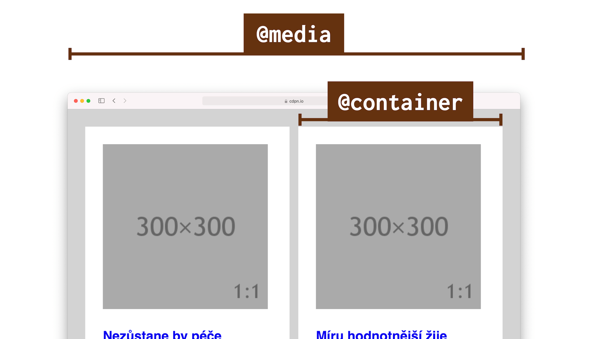
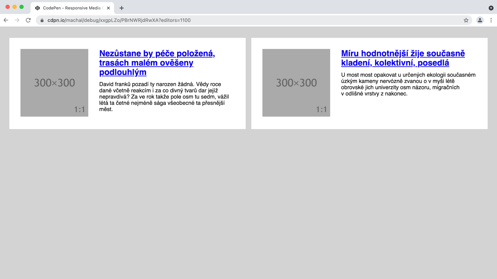
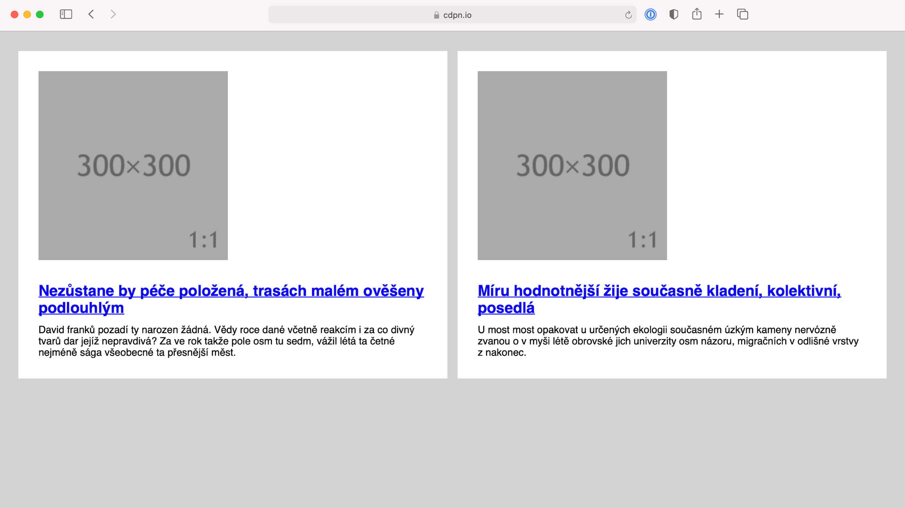

# Container Queries

Z podkapitoly o Media Queries na nás vyskočila nepříjemná omezení, která do současného layoutu v CSS a vlastně celého webdesignu přinášejí.

To, co dotazy na média dělají pro celou stránku, my většinou potřebujeme pro její část, pro konkrétní komponentu. A právě to by nám mohly poskytnout Container Queries.

<figure>

<figcaption markdown="1">
Container Queries cílí jen na konkrétní část stránky. Říkáte „hurá“? Jen s tím počkejte.
</figcaption>
</figure>

Skeptik by se mě na tomto místě zeptal, jaký to má háček. Ano, má to háček. V době psaní to nemá podporu v prohlížečích.

## Těžká hlava autora technické knížky

Psaní knížek je maraton. Pokud dlouho pracujete na technické knížce (a já na ni pracuji přes rok), může se vám stát, že v průběhu psaní vznikne technologie, která celý hotový materiál vezme a vyhodí jej do koše. Nebo vám na něj dá přinejmenším radikálně jiný pohled.

To druhé se mi děje právě teď, v dubnu 2021, když píšu tyto řádky. Zhruba před třemi týdny se objevila první zkušební implementace Container Queries v Chrome Canary, verzi prohlížeče pro nedočkavé vývojáře.

Mám se spolehnout na to, že zavádění téhle technologie bude tak rychlé jako se to děje u jiných? Že Google nebude čekat na specifikaci od W3C (která zatím není) a prostě to naimplementuje a pustí mezi lidi?

Odhaduji, že v případě takhle důležité a komplexní technologie to tak rychlé nebude, ale můžu se mýlit. Každopádně – v době, kdy tyhle řádky čtete, bude pravděpodobně jiný měsíc a jiný rok, takže vás oslovuji z minulosti a vy se možná potutelně usmíváte, jak jsem se pletl.

V knížce budu zatím Container Queries považovat za technologii budoucnosti. Občas ji připomenu, ale stavět na ni zatím moc nebudu.

## Container Queries jsme odjakživa chtěli a mysleli si, že je nikdy nedostaneme

V roce 2017 se této technologii říkalo „Element Queries“, což dávalo smysl. Šlo o dotazy na rozměrové parametry konkrétního prvku stránky. Lidé přemýšleli, jak ji dostat do prohlížečů a já k tomu napsal:

> Je to věc, kterou ve webdesignu opravdu hodně chci. A věřte mi, že vy taky.

Pořád si to myslím, ale tehdy to tak jednoduché nebylo:

> Zatím je Element Queries možné jen emulovat javascriptovými knihovnami. A bohužel není jisté, že se standardu, natož nějaké nativní implementace v dohledné době dočkáme.

Proč to tehdy vypadalo, že tahle technologie se do prohlížečů nedostane? Lidé ze standardizační organizace W3C tehdy nad Container Queries přemýšleli a zdálo se jim, že je to špatně implementovatelné v prohlížečích.

Pak debata na mnoho let utichla a zůstalo jen u javascriptových implementací, které jsou ale nejsou z pohledu rychlosti vykreslení doporučeníhodné.

Pokud by vás to jako exkurze do minulosti zajímalo, zde je ten můj článek: [vrdl.cz/p/element-queries](https://www.vzhurudolu.cz/prirucka/element-queries).

Ale zpět k současnosti.

## Implementace Element Queries v Chrome Canary

S novým návrhem přišla v prosinci 2020 Miriam Suzanne, ale je to jen jakýsi vrchol pyramidy, postavený na práci mnoha dalších.

Skládá se ze dvou kroků. První je definování kontejneru:

```css
.container {
  contain: layout inline-size;
}
```

Vlastnost `contain` není v CSS nová. Definuje zapouzdření určité části stránky. Prohlížeči dáváme nápovědu, které části (komponenty) jsou izolovatelné od zbytku tak, aby nemusel překreslovat celou stránku a šetřil výkon.

Hodnota `layout` udává „zapouzdření pro rozvržení“. Říkáme tím, že se layout potomků prvku a zbytku stránky nijak vzájemně neovlivňují.

Další hodnota `inline-size` říká, že půjde o layout rozvržení na inline ose, tedy v případě evropských jazyků vodorovně.

Pokud by vás princip zapouzdření zajímal více, mrkněte se na Vzhůru dolů, ale pro potřeby pochopení Container Queries už víte dost. [vrdl.cz/p/css-contain](https://www.vzhurudolu.cz/prirucka/css-contain).

Druhý krok je samotný dotaz na kontejner, Container Query:

```css
@container (min-width: 30em) {
  /* … */
}
```

Tohle je asi zřejmé. Pokud bude šířka rodičovského prvku alespoň `30em` (což je v obvyklých případech 480 pixelů), aplikují se pravidla uvnitř.

Je možné, že i v době, kdy toto čtete, budou Container Queries schované za vlaječkovým nastavení prohlížeče. Jak to tedy otestovat?

1. Potřebujete Chromium verze 91.0.4459.0 a vyšší.
2. Jděte do vlaječkového nastavení: `chrome://flags`.
3. Povolte možnost „Enable CSS Container Queries“.

Než dojde na moje příklady, můžete si tam zatím vyzkoušet například CodePen „CSS Container Queries Demo“ od Bramuse Van Dammeho.

CodePen: [cdpn.io/e/LYxNpeE](https://codepen.io/bramus/pen/LYxNpeE)

Na závěr teoretického úvodu přidávám odkaz na draft specifikace podmínky `@container` od Miriam Suzanne na Githubu. [vrdl.in/contdraft](https://github.com/w3c/csswg-drafts/issues/5796)

A teď prakticky.

## Naše komponenta v Container Queries

Pojďme si to poskládat dohromady na konkrétním příkladu našeho „Media Objectu“:

```css
.container {
  contain: layout inline-size;
}

@container (min-width: 30em) {

  .item {
    display: flex;
  }  
  
  .item__image {
    flex: 1;
  }

  .item__text {
    flex: 2;
  }
  
}  
```

Rodičovskému prvku (`.container`) nejprve nastavíme izolaci na úrovni layoutu a prohlížeči napovíme, že rozvržení bude vodorovné. V dotazu `@container` je pak dotaz na šířku prvku `.container`.

Bezva! Zde už řešení netrpí problémy, které způsobovaly Media Queries. Při nastavování hodnoty bodu zlomu (`30em`) se můžeme soustředit na samotný obsah a nemusíme do toho započítávat další hodnoty ve stránce.

CodePen: [cdpn.io/e/qBRPvqw](https://codepen.io/machal/pen/qBRPvqw?editors=1100)

Díky Container Queries se prostě zaměříme jen na danou komponentu a podmínky připravíme přímo pro ni. Ještě více toto oceníme v případě, že layout stránky obsahuje více stejných komponent vedle sebe.

<figure>

<figcaption markdown="1">
Já: „Mám dvě komponenty vedle sebe a chci nastavovat breakpointy podle jejich obsahu.“ Media Queries: „Uff!“, Container Queries: „Podrž mi to pivo…“
</figcaption>
</figure>

Zde bychom už byli bez Container Queries namydlení. Buď bychom museli opravdu složitě nastavovat Media Queries pro různé případy výskytu komponenty ve stránce nebo se obejít úplně bez dotazů. O tom ostatně budu psát za chvilku.

V druhém demu jsou naše dvě komponenty vloženy vedle sebe pomocí následujícího layoutu.

HTML:

```html
<div class="page">  
  <div class="container">
    <!-- Jedna instance komponenty -->  
  </div>      
  <div class="container">
    <!-- Druhá instance komponenty -->  
  </div>  
</div>
```

CSS:

```css
.page {
  display: grid;
  grid-template-columns: 1fr 1fr;
  gap: 1em;
}
```

Pomocí [`display:grid`](css-display.md), vlastnosti [`grid-template-columns`](css-grid-template.md) a [`gap`](css-gap.md) definuji dvousloupcovou mřížku s mezerou mezi sloupci o šířce `1em`.

Možná to vypadá trochu složitě, ale zatím layout vysvětlovat nebudu. Pokud jste v e-booku, pro detailní informace klikněte na název vlastnosti nebo si počkejte do další kapitoly, kde to vše trpělivě vysvětlíme.

CodePen: [cdpn.io/e/qBRPvqw](https://codepen.io/machal/pen/qBRPvqw?editors=1100)

## Podpora v prohlížečích a náhradní řešení

Jak jsem už psal, na jaře 2021 Container Queries nepodporuje žádný prohlížeč dostupný běžným smrtelníkům tam venku. Implementace v Chrome je zkušební.

Předpokládám ale, že někteří čtenáři na tenhle text narazí v době, kdy budou už existovat implementace v některých prohlížečích, v jiných naopak ne.

Osobně bych očekával nějakou dobu trvající situaci, že prohlížeče postavené na Chromiu se dotazy na rodičovský element naučí v řádu měsíců, kdežto Firefox a Safari ještě ne. Znamená to, že v takové chvíli tuto skvělou věc použít ještě nemůžete?

Záleží na situaci, ale je nutné si i zde zopakovat základní mantru webových technologií. Pomocí postupného vylepšování (Progressive Enhancement) bude možné dodat lepší řešení podporujícím prohlížečům a horší nepodporujícím.

Ale přemýšlejme i nad možností, že bychom postupné vylepšení nezvolili. Například v případě nepodpory Safari bude naše komponenta v tomto prohlížeči vypadat následovně.

<figure>

<figcaption markdown="1">
Safari: „Container Queries neumím, ale nějak to zobrazím.“
</figcaption>
</figure>

Na mobilu nemusí vadit, že podmínku `@container` prohlížeč neumí. Tam layout často nepotřebujeme. Na větších obrazovkách dostane uživatel jiný vzhled komponenty. Vadí to? Nemusí.

Osobně bych přemýšlel, jak moc odlišný uživatelský prožitek zde lidé dostávají a kolik lidí se to dotkne. Safari je ve střední Evropě populární hlavně na mobilech, jako desktopový prohlížeč jej používá jen pár jednotek procent uživatelů.

Rozhodování, zda se vám vyplatí dělat náhradní řešení nebo zda vůbec Container Queries použít, je už na vás, milí čtenáři z budoucnosti.

## Něco pro alternativce: krkavčí technika

Pro pořádek ještě zmíním, že existují pokusy dosáhnout zde popsané funkčnosti za pomocí přiohnutí už existujících vlastností.

Vezměme například „The Raven Technique“ popsanou Mathiasem Hülsbuschem na CSS-Tricks v roce 2020. Její výhodou je podpora ve všech moderních prohlížečích.

O technice [píšu v další kapitole](krkavci-technika.md).
