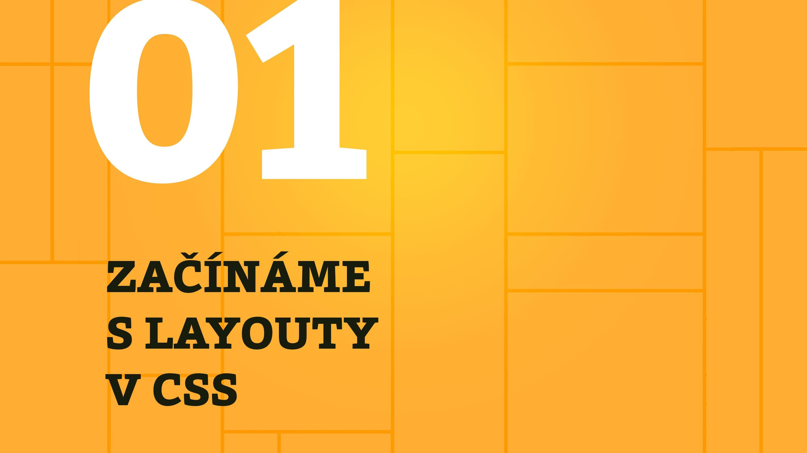

# Kapitola 1: Začínáme s layouty v CSS

V první kapitole se s jednotlivými typy layoutů nejprve seznámíme na jednoduchých příkladech a pak si je představíme v širším kontextu – nejprve historickém a potom ještě v souvislostech s dřívějšími metodami návrhu stránky a nakonec porovnáme mezi sebou.

A teď už: Vzhůru do layoutů v CSS!

