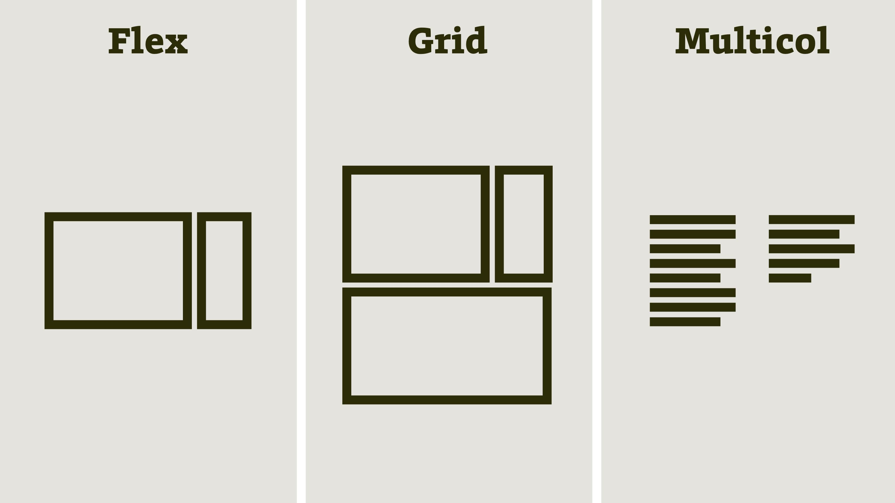
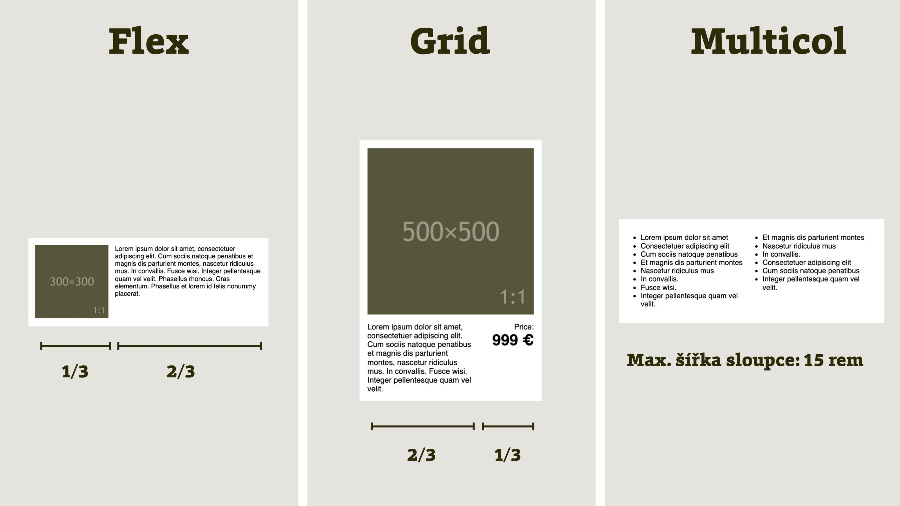

# Seznamka

Doba je rychlá a inovace zvýšily tempo řešení situací, které lidem dříve zabíraly velké množství času.

Vezměme třeba seznamování. Když jsem byl v pubertě, bylo potřeba obléct sváteční kostkovanou košili, co nejpodobnější té, jakou nosil Kurt Cobain, vyrazit na vesnickou zábavu, investovat do vstupného a do tekutin, které zajistí uvolněnost a zábavnost, předvést se v tanci na 2 Unlimited a celou dobu hlídat, až budou hrát Nothing Else Matters, a v tu chvíli sprintovat pro dívku snů… Bylo to složité a v mém případě s nejistým výsledkem.

Dnešní seznamovací aplikace jako Tinder jsou s efektivitou úplně jinde, člověk párkrát klikne a je to.

V první kapitole potřebujeme s tématem nějak začít, vytvořit si první náčrt mapy, kterou se vám pokusím během čtení knížky vytvářet v hlavě. A bylo by nejlepší začít svižně. Tohle tedy bude rychlé seznámení s gridem, flexem a vícesloupcovým layoutem, třemi hlavními hrdiny této knížky.

Tohle bude Tinder pro systémy layoutu v CSS.

<figure>

<figcaption markdown="1">
*To jsou oni. Seznamte se.*
</figcaption>
</figure>

Zatímco na skutečném Tinderu máte k ruce vystajlované fotky možných partnerek nebo partnerů, CSS layouty jsou sexy asi jako návod na sestavení nábytku z IKEA.

Něco vizuálně poutavého na nich je, ale flex, grid a multicol jsou intelektuálové, kteří na vás mluví řečí symbolů. Žádné obrázky z posiloven, žádné „duckface“, žádné výstřihy, a dokonce ani žádné instagramové filtry…

Jsou to od pohledu relativně nudní patroni, takže vám o nich budu muset něco říct:

- [Flexbox](css-flexbox.md) je skvělý pro jednosměrná rozložení prvků na stránce. Ze všech tří je to největší parťák, kamarádi mu říkají krátce „flex“. Nezkazí žádnou legraci a všichni jej mají rádi. (Specifikace o flexboxu mluví jako o „CSS Flexible Box Layout“ a já pak více ve čtvrté kapitole.)
- [Grid](css-grid.md) výborně zvládá obousměrné layouty. Je mladší než flex a trošku arogantní, protože toho zvládá o dost více. (Gridu se ve specifikaci říká „CSS Grid Layout“, píšu o něm v páté kapitole.)
- [Multicol](css-multicol.md), neboli vícesloupcový layout, je nenápadný introvert. Mnozí si jej ani nevšimnou, protože pasuje jen do několika životních situací týkajících se zalomení textu do sloupců. Když ale takovou řešíte, za vztah s ním budete opravdu rádi. (Plný název podle specifikace je „CSS Multi-column Layout“ a můj detailní rozbor je v šesté kapitole.)

Tak a teď máte nové kamarády, gratuluji vám.

V knížce asi zjistíte, že první pohled někdy klame a to, co vám tady tvrdím, nemusí být vždycky pravda. Od toho jsou ale knížky. Aby vás zbavily povrchního pohledu a ukázaly všechna „ale“.

## Box Align, čtvrtý vzadu

Ta paralela s Tinderem samozřejmě trošku skřípe, ale pojďme u ní ještě chvilku zůstat.

Znáte to, když jdete s jednou (jedním) na rande a přijdou dvě (dva)? Ona (on) s nejlepší kámoškou (kámošem), pro jistotu?

Přesně tohle by se vám stalo i při seznamování s našimi layouty. Když řekneme flex, grid a multicol, musíme říct Box Align.

„CSS Box Alignment“, což je plný název podle specifikace, rozebereme [v sedmé kapitole](css-box-alignment.md).

Obstarává celý aparát zarovnávání boxíků v rozvrženích. Bez zarovnání boxů a vlastností, jako je `justify-items` nebo `align-self`, se systémy layoutu (a hlavně flexbox a grid) neobejdou a na rande samy nevyrazí.

## Pojďme si je otestovat

Pokud bychom byli při seznamování v reálném životě důslední, chtěli bychom vidět chování partnerky nebo partnera v různých životních situacích. Chtěli bychom co nejrychleji a nejefektivněji zjistit, co je zač.

Tady se proto nabízí spíše paralela s přijímacím pohovorem na pracovní pozici a testy, které zaměstnavatelé svým potenciálním zaměstnancům dávají.

My se teď pokusíme na jednoduchých příkladech ukázat, co je který systém rozvržení zač. Ostatně takhle to budeme dělat v celé knížce.

<figure>

<figcaption markdown="1">
*Tři systémy a tři zadání pro příklad.*
</figcaption>
</figure>

Začneme tím nejpopulárnějším parťákem.

## Flexbox: příklad s obrázkem a textem

Cílem je dosáhnout rozvržení, kde na jedné straně je obrázek, který zabírá třetinu šířky, a na druhé text. Mezi nimi jsme si ještě vymysleli mezeru o šířce `1rem`, ta ve schématu není vidět.

Začneme asi s HTML, což?

```html
  <figure class="figure">
    <p class="figure-image">
      
    </p>
    <figcaption class="figure-figcaption">
      Lorem ipsum…
    </figcaption>
  </figure>
```

Na tom asi nic složitého není, takže pojďme pokračovat.

Používáme zde nejvděčnějšího parťáka z naší trojice, flexbox, a proto nebude složité vytvořit rozvržení:

```css
.figure {
  display: flex;
}
```

Už jen tímto zápisem dosáhneme toho, aby se potomci (prvky `figure-image` a `figure-figcaption`) zarovnali vedle sebe.

<div class="ebook-only" markdown="1">

Pokud je tu někdo, kdo by potřeboval vysvětlit vlastnost `display` v CSS, nechť zabrousí [do poslední kapitoly](css-display.md), kde se jí věnuji do detailu. Ale v tuhle chvíli nám bude stačit vědět, že zapíná flexboxový layout.

</div>

Dále víme, že mezera mezi prvky v rozvržení bude zabírat `1rem`. Proč zrovna `rem`? O jednotkách něco napíšu ke konci této podkapitoly.

Mezery dosáhneme pomocí [vlastnosti `gap`](css-gap.md), která v layoutech umí jednoduše udělat mezery:

```css
.figure {
  display: flex;
  gap: 1rem;  
}
```

Máme rozvržení, ale to ještě nezná své rozměry. Zapíšeme je následovně:

```css
.figure-image {
  flex: 1;
}

.figure-figcaption {
  flex: 2;
}
```

[Vlastností `flex`](css-flex.md), což je zkratka (shorthand) pro nastavení šířky a způsobu rozpínání a smršťování prvku, jsme nastavili podíl na celkové šířce.

<figure>

<figcaption markdown="1">
*Flexbox pod rentgenem. Výsledné rozvržení prohlížené ve vývojářských nástrojích Firefoxu.*
</figcaption>
</figure>

Vytvořili jsme rozvržení, kde prvek `figure-image` bude zabírat jednu třetinu šířky (`flex:1`) a prvek `figure-figcaption` vyplní zbylé dvě třetiny (`flex:2`).

Tento layout by se dal ještě dále vylepšovat, například o variantu pro menší displeje. Nicméně jako první demonstrační ukázka knížky je to myslím dostačující.

Zájemce nyní odkážu na zdrojové kódy ve službě CodePen, což ostatně v knížce budu dělat často.

CodePen: [cdpn.io/e/eYvZqYd](https://codepen.io/machal/pen/eYvZqYd?editors=1100)

## Grid: příklad s kartou produktu

V obrázku se zadáním vidíme, že u gridu jsem vybral rozvržení, které má dva směry - vodorovný i svislý. Obrázek zabírá celou horní polovinu, druhý řádek je rozdělený poměrem 2 : 1. Mezery mezi prvky jsou opět v šířce `1rem`.

Ano, i toto rozlišení bychom mohli udělat flexboxem, respektive dvěma flexboxy. Jenže by to nebylo tak elegantní jako řešení s pomocí gridu.

Pojďme se podívat na zjednodušené HTML:

```html
<div class="box">
  <p class="box-image">
    
  </p>
  <p class="box-text">
    Lorem ipsum…
  </p>
  <p class="box-price">
    Price:<br>
    <strong class="price">
      999 €
    </strong>
  </p>
</div>
```

Máme tedy rodiče (`box`) a tři prvky v něm. Jak z nich uděláme kýžený tvar? Poměrně snadno:

```css
.box {
  display: grid;
  grid-template-columns: 2fr 1fr;
  gap: 1rem;
}
```

Pomocí `display:grid` „zapneme“ mřížku, ale ještě se (na rozdíl od flexboxu) nic nestane.

Layout vzniká až prostřednictvím [vlastnosti `grid-template-columns`](css-grid-template-rows-columns.md), která definuje šablonu pro počet a rozměry sloupců. Zápisem `2fr 1fr` pak rozděluji plochu na sloupečky o šířce dvou třetin a jedné třetiny. Je to podobné, jako jsem to udělal u flexboxu pomocí `flex:2` a `flex:1`.

[Vlastnost `gap`](css-gap.md) zde slouží k vykreslení mezery mezi prvky, v našem případě o šířce `1rem`.

Pokud bychom zůstali u tohoto kódu, kýženého layoutu bychom nedosáhli. Jde o rozvržení 2 × 2, tedy čtyři buňky. V našem HTML ale jako potomky prvku `box` máme jen tři HTML prvky.

Díky „autoplacementu“, vlastnosti gridu, která prvky automaticky umísťuje do mřížky, by byl obrázek v první buňce, text v druhé a cenovka ve třetí. Čtvrtá buňka by zůstala prázdná a naše nadšení pro grid by skončilo uprostřed prvního rande.

Automatické umístění zrušíme tímto kódem:

```css
.box-image {
  grid-column: 1 / 3;
}
```

[Vlastnost `grid-column`](css-grid-row-column.md) (dále v páté kapitole) slouží k výslovnému umístění určitého prvku na konkrétní místo mřížky.

V tomto případě mezi první a třetí linku mřížky. Linka je čára, která mřížku dělí na řádky, sloupce a pak jednotlivé buňky. Pokud si grid přirovnáte k tabulce, pak linky jsou úsečky tvořící její rámeček. (I linkám se věnuji v páté kapitole.)

Nejlépe to uvidíme na následujícím obrázku, který je zároveň doporučením, abyste věnovali pozornost [vývojářským nástrojům prohlížečů](css-layout-devtools.md) (více v osmé kapitole). Ty umí být při práci s layouty opravdovými pomocníky.

<figure>

<figcaption markdown="1">
DevTools Firefoxu (ale i Chromu) krásně ukážou, co je myšleno termínem „linka gridu“.
</figcaption>
</figure>

Nerad bych vám zatajil poslední část kódu. Sice nemá s moderními CSS layouty nic společného, ale bez ní nedosáhneme vzhledu, který vidíte na obrázku. Text v cenovce zarovnáme doprava:

```css
.box-price {
  text-align: right;
}
```

I tady máte možnost projít si, vyzkoušet a případně upravit kompletní zdrojový kód.

CodePen: [cdpn.io/e/YzZqmwj](https://codepen.io/machal/pen/YzZqmwj?editors=1100)

## Vícesloupcové rozvržení: příklad s odrážkovým seznamem

Vraťme se opět očima k obrázku se zadáním. V případě multicol layoutu je úkolem pro první rande zajistit, aby se odrážkový seznam skládal do sloupců, které nebudou mít větší šířku než `15rem`.

V HTML máme 15 položek seznamu, ale pro potřeby ukázky v knížce jsem si vystačil se třemi:

```html
<div class="box">
  <ul>
    <li>
      Lorem ipsum dolor sit amet
    </li>
    <li>
      Consectetuer adipiscing elit
    </li>
    <li>
      Cum sociis natoque penatibus
    </li>
    <!-- … -->
  </ul>
</div>
```

S pomocí flexboxu ani gridu bychom zde neuspěli, protože pro rozdělení do sloupců bychom museli mezi jednotlivé `<li>` vkládat prvky jako `<div>`, které by layout nesly.

Navíc bychom zde s pomocí těchto dvou typů rozvržení nebyli schopni snadno dosáhnout automatického generování vhodného počtu sloupečků. Layout bychom prostě museli doslovně definovat.

Toto je síla CSS Multi-column Layout. Chcete rozvržení o šířce sloupce maximálně `15rem` se šířkou mezery `1rem`? Není nic snazšího:

```css
.box {
  columns: 15rem;
  gap: 1rem;
}
```

K [vlastnosti `columns`](css-multicol-columns.md) se ještě dostaneme, vlastnost `gap` už trochu znáte.

<figure>

<figcaption markdown="1">
*Výsledek ve Firefoxu. Je ale dobré vědět, že v různých šířkách okna bude počet sloupečků různý.*
</figcaption>
</figure>

Ten vícesloupcový layout vypadá skvěle, viďte? Než jej ale pozvete na druhé rande, měli byste vědět, že se hodí opravdu hlavně jen pro textový obsah, takže na nějaké parády se všemi `div`y světa zde raději zapomeňte.

CodePen: [cdpn.io/e/JjWXgNL](https://codepen.io/machal/pen/JjWXgNL?editors=1100)

## Poznámka k jednotkám

Už v první části knížky jsem použil několik jednotek a myslím, že by bylo vhodné je trošku představit, spolu s jejich kolegyněmi, které budu používat nejčastěji:

- `rem` (root em) je velikost písma v dokumentu. Pokud nenastavíme jinak, jde většinou o `16px`. Používám ji všude, kde se hodí vycházet z velikosti písma.
- `em` (em) je velikost písma v daném prvku. Na rozdíl od `rem` ji může zvětšit kaskáda v CSS, například uvnitř nadpisů. Používám ji pro lokální změnu velikosti.
- `%` (procenta). Používám je pro změnu výchozí velikosti v dokumentu a občas pro šířky či výšky v layoutu.
- `px` (CSS pixely). Používám je hlavně u dekorací, jako je šířka rámečku.

V Media Queries v knížce používám jednotně `em`, ale v praxi je možné použít také `rem` a pokud vám nevadí velmi specifické problémy se zvětšování stránky v Safari, lze využít také `px`.

Velice často zde také budu používat bezjednotkového hodnoty, které určují podíl prvku na rozměrech celku. Jde o čísla ve vlastnosti `flex`, zde již použité, hodnoty s jednotkou `fr` ve gridu. Ale nebudeme předbíhat.

Více o používání jednotek v CSS píšu [v poslední, přílohové kapitole](jednotky.md).

Prostřednictvím Tinderu a prvního rande jsme se tedy seznámili se třemi hlavními protagonisty knížky a jejich nejlepším kamarádem. Ještě se nám ale bude hodit lépe poznat dva nejžhavější kandidáty.
