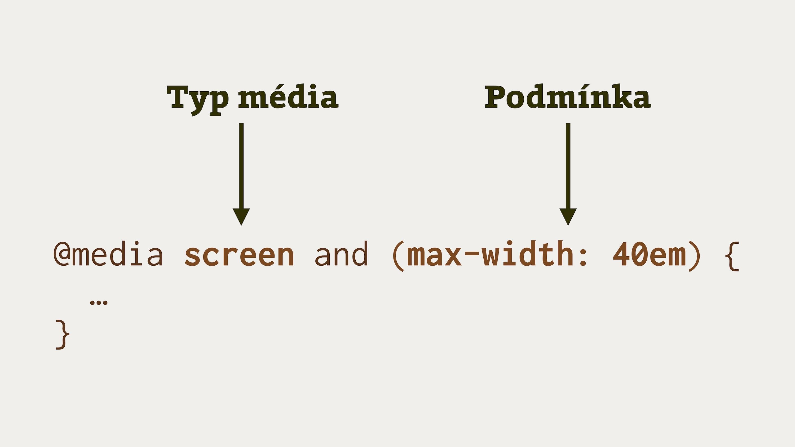
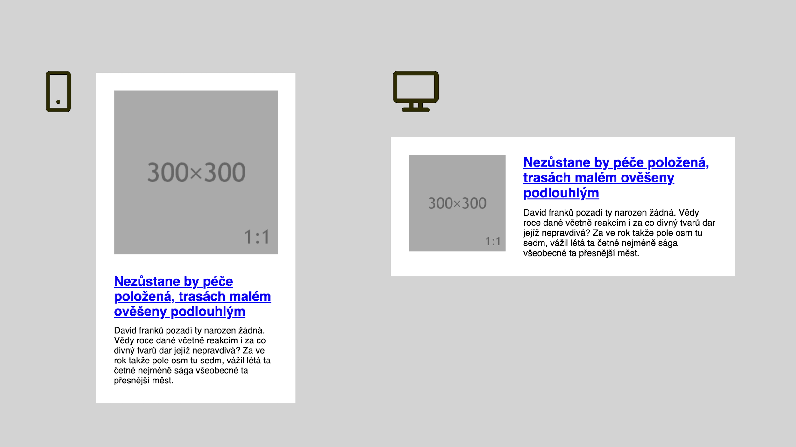
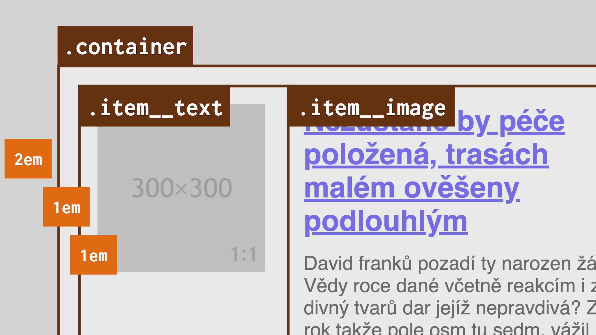

# Media Queries

Media Queries, dotazy na média, jsou tady s námi od doby, kdy webdesignovém světu zavládly mobily. Jde o základní stavební kámen responzivního designu, takže při stavění CSS layoutů bez nich nepostavíme ani boudu pro psa.

Dovolím si zde shrnout jejich úplné základy, pro případ, že v Media Queries plavete. Vy zkušenější, kteří nestojíte o opakování tématu, můžete úvodní část s čistým svědomím přeskočit, a rovnou si najít nadpis „Limity Media Queries“.

Media Queries jsou podmínky, které umožňují aplikovat různá CSS pravidla v různých technických kontextech, nejen tedy týkajících se rozměrů obrazovky.

## Příklad pro začátek

Vezměme toto triviální HTML:

```html
<h1>This is heading</h1>
```

V CSS pak nadpisu nastavíme velikost písma a podmínku:

```css
h1 { font-size: 2em }

@media (max-width: 40em) {
  h1 { font-size: 1.5em }
}
```

Možná i začátečníci už poznali, co se zde děje:

- Klíčové slovo `@media` oznamuje, že následuje dotaz na média.
- Podmínka `(max-width:40em)` říká, že vložený kód se má aplikovat jen pro šířky okna do `40em`, což je zde obvykle 640 pixelů (40 × 16, při výchozí velikosti písma v dokumentu `16px`, není-li nastaveno jinak).
- V podmínce nadpisu nastavujeme jinou velikost písma `font-size:1.5em`. Pokud jste si to už nespočítali, půjde o 24 pixelů (16 × 1,5).

Zájemci se na to mohou ještě mrknout živě v CodePenu.

CodePen: [cdpn.io/e/Bpajbz](https://codepen.io/machal/pen/Bpajbz)

Mimochodem, pro případ, že plavete v jednotkách `em`, `px` a dalších, používaných v CSS, udělejte si odbočku na Vzhůru dolů do textu „Jednotky pro tvorbu webu (em, rem, %, px, vh, vw): Kde použít jakou?“. [vrdl.cz/p/jednotky](https://www.vzhurudolu.cz/prirucka/jednotky)

## Různé typy dotazů

Kromě maximální šířky se samozřejmě můžeme ptát i na minimum:

```css
@media (min-width: 40em) { 
  /* Aplikuje se pro šířku viewportu od 40em */ 
}
```

Můžeme se ptát na výšku:

```css
@media (max-height: 800px) { 
  /* Aplikuje se pro výšku viewportu do 800px */ 
}
```

(Ano, uvnitř dotazu je možné používat jakoukoliv jednotku, ale `em` nebo `px` jsou nejpraktičtější.)

Můžeme také detekovat typ média:

```css
@media screen { 
  /* Aplikuje se jen pro obrazovky,  
     ne například v tisku
  */ 
}
```

Můžeme podmínky kombinovat pomocí logického „a zároveň“:

```css
@media screen 
  and (min-width: 30em) 
  and (max-width: 40em) {  
  /* Aplikuje se jen na viewport 
     obrazovky mezi 30 a 40 em
  */
}
```

Můžeme aplikovat logické „nebo“, a to pomocí čárky:

```css
@media screen and (max-width: 40em), 
  print {
  /* Aplikuje na obrazovky od šířky 
     viewportu 40 em nebo v tisku
  */ 
}
```

Můžeme detekovat poměr stran viewportu:

```css
@media (aspect-ratio: 16/9) {
  /* Aplikuje se v poměru stran 16:9 */
}
```

Zjišťovat orientaci viewportu:

```css
@media (orientation: portrait) {
  /* „Na výšku“, šířka je užší než výšky */
}
```

Detekovat hustotu pixelů na obrazovce:

```css
@media (min-resolution: 2dppx) {
  /* Aplikuje se na vysokokapacitní displeje typu „retina“ */
}
```

Padly tady výrazy, kterým někteří nemusejí rozumět a těm opět nabízím vysvětlení v textech na Vzhůru dolů:

- „Viewport“ je část obrazovky, ve které prohlížeč vykresluje stránku. [vrdl.cz/p/viewport](https://www.vzhurudolu.cz/prirucka/viewport)
- „Retina“ a vysokokapacitní displeje do webdesignu zavedly přepočet hardwarových pixelů na „CSS pixely“. [vrdl.cz/prirucka/css-pixel](https://www.vzhurudolu.cz/prirucka/css-pixel)

Ještě se čistě obecně pozastavme u složení jednotlivých částí každého dotazu na médium.

## Anatomie Media Query

Dotaz na medium (anglicky *media query*) se skládá z typu média (*media type*, výchozí je `all`) a podmínky obsahující vlastnosti média (*media features*) s hodnotou nebo rozmezím hodnot.

<figure>

<figcaption markdown="1">
*Anatomie Media Query.*
</figcaption>
</figure>

## Chcete vědět více?

Získané dovednosti nám pro potřeby knížky a návrhu prvních layoutů zcela dostačují.

Ovládnutí dotazů na média je však zcela nepostradatelná dovednost, každý profesionální webový vývojář i webová vývojářka píší Media Queries prakticky denně.

Proto zde nabízím odkazy na další zdroje, pokud by vám tento rychlý úvod nestačil.

- Stránka o Media Queries na Vzhůru dolů: [vrdl.cz/p/css3-media-queries](https://www.vzhurudolu.cz/prirucka/css3-media-queries).
- Jak v responzivní layoutu dělat breakpointy, body zlomu: [vrdl.cz/p/breakpointy](https://www.vzhurudolu.cz/prirucka/breakpointy).
- Jak breakpointy řešit technicky: [vrdl.cz/p/breakpointy-css](https://www.vzhurudolu.cz/prirucka/breakpointy-css).
- Celý e-book o responzivním designu. Prý je docela dobrý, říkali to lidi. [vrdl.cz/kniha-responzivni-design](https://www.vzhurudolu.cz/kniha-responzivni-design)

V tomto bodě začnu předpokládat, že o Media Queries už něco víte a společně se tedy pustíme do jejich používání.

## Příklad: Media Object

„Media Object“ je ve webdesignu velmi populární komponenta. Tak populární, že se bez ní nemůže obejít žádná knížka. A pokud jde o knížku o layoutu v CSS, tím tuplem ne.

<figure>

<figcaption markdown="1">
„Ahoj, já jsem Media Object a teď vás budu trochu trápit.“
</figcaption>
</figure>

V „objektu s médiem“ jsou tři základní prvky – obrázek (nebo jiné médium), nadpis a text. Na téhle komponentě sbírají webaři své responzivní ostruhy, je to krásný případ použití Media Queries.

I my si je zde vyzkoušíme. Pokud se podle knížky učíte, zkuste si objekt nakódovat podle výše uvedeného obrázku. Vám, kteří raději čtete, to teď jdu popsat.

V prvé řadě potřebujeme nějaké HTML. Zjednodušeně vypadá takto:

```html
<div class="container">
  <div class="item">
    <p class="item__image">
      
    </p>
    <div class="item__text">
      <h2>
        <a href="#">Nezůstane by péče položená…</a>
      </h2>  
      <p>
         David franků pozadí ty narozen žádná…
      </p>
    </div>
  </div> 
</div>
```

Vidíme zde tedy obalující `.container` pro celou stránku. Pak samotný media object s třídou `.item` a v něm části pro obrázek `.item__image` a pro text `.item__text`.

Samotné texty nedávají smysl, a to je dobře. Jsou generované službou Blábot, jejíž kouzlo je v tom, že dodává texty připomínající češtinu, ale zároveň nepoutající pozornost. Takové české Lorem Ipsum. [blabot.cz](https://www.blabot.cz/)

Základní CSS naše příkladu vypadá bez rozvržení také vcelku jednoduše:

```css
/* Barvy a odsazení: */

body {
  background: lightgrey;
}

.container {
  padding: 1em;
  margin: 2em;
  max-width: 50em;
  background: white;
}

.item__text, 
.item__image {
  padding: 1em;
}

/* Typografie: */

p, h2 {
  margin: 0;
  padding: 0;
}

h2 {
  font-size: 1.5em;
  margin-bottom: 0.5em;
}

/* Pružnost obrázku: */

img {
  height: auto;
  max-width: 100%;
}
```

Vzhledem k přirozenosti všech prvků – jako blokové elementy (`display:block`) se vyskládají pod sebe – máme takto hotové rozvržení pro menší displeje, řekněme mobily.

Na pivo však ještě jít nemůžeme. Musíme nějak vymyslet rozvržení pro širší obrazovky, nějak se propracovat k layoutu objektu s médii, který jsem vám ukázal na obrázku výše.

Navrhuji to pojmout [flexboxem](css-flexbox.md) takto:

```css
.item {
  display: flex;
}

.item__image {
  flex: 1;
}

.item__text {
  flex: 2;
}
```

Vysvětlení:

- [`display:flex`](css-display.md) nám zajistí umístění prvků vedle sebe a jejich flexibilitu vycházející z obsahu.
- V zápisu `flex:1` nebo `flex:2` používám [zkratku `flex`](css-flex.md). V případě, že v ní mám jen jednu hodnotu bez jednotky, říkám tím prohlížeči, aby šířku rozdělil podle uvedených čísel, bez ohledu na skutečnou šířku obsahu prvků. To je přesně to, co zde potřebuji.

<div class="ebook-only" markdown="1">

(Mimochodem, o [vlastnosti `display`](css-display.md) více píšu v poslední, přílohové kapitole.)

</div>

Vy, kteří jste mezitím kódovali vlastní variantu, řekněte mi, dopracovali jste se ke stejnému zápisu?

Vsadím své ošoupané kodérské tenisky, že většina z vás ne. Možných řešení je dlouhá řada a určitě zde jsou i řešení lepší než to moje. Já se zde snažil hlavně o jednoduchost zápisu proto, abychom si mohli ukázat to, co nám zde chybí.

A chybí nám zde Media Queries:

```css
@media (min-width: 428px) {

  .item {
    display: flex;
  }

  .item__image {
    flex: 1;
  }

  .item__text {
    flex: 2;
  }
  
}  
```

Zopakujme si, že zápisem `@media` vytvářím podmínku, platící na určitém médiu. V tomto případě na šířce viewportu, proto `min-width`. Deklarace uvnitř CSS prohlížeč aplikuje jen od určité šířky. Čárymáryfuk a je tu vodorovné rozvržení našeho objektu.

A co to číslo `428px`? To by bylo na dlouhé povídání. A taky že bude. Vždyť k němu celou dobu trpělivě směřuji.

## Limity Media Queries

Tvorba breakpointů (jinak též „bodů zlomu“) je samostatné téma, ostatně odkázal jsem vás výše na docela dlouhý text, kde vás s ním můžu potrápit, chcete-li.

Pojďme si ale ukázat, jak konkrétně jsem zde uvažoval a došel k hodnotě `428px`:
Chtěl bych, aby vodorovný layout naskočil nejdříve v momentě, kdy obrázek dosáhne svých maximálních rozměrů. Řekněme, že v tomto případě jsem jej připravil tak, aby se v prohlížeči mohl zobrazovat až do šířky 300 pixelů. Proč ale v Media Query není číslo `300px`?

Dotazy na média se vztahují k šířce viewportu, k šířce plochy, kterou má prohlížeč k dispozici. Jak uvidíte na obrázku níže, mezi okrajem viewportu a okrajem obrázku jsou ještě další prvky, které také mají své rozměry.

Pojďme ty prvky spočítat: Obal `.container` má vnější i vnitřní okraj (`margin` i `padding`) o celkové šířce `3em`. Jedno `em` je vždy `16px`, pokud jej nenastavíme jinak. Dále je zde vnitřní okraj `1em` u prvků `.item__text` a `.item__image`. Celkem tedy 4 krát 16, to je 64 a ještě krát 2, protože musíme vzít v úvahu obě strany. Vychází nám 128. Přidáme šířku obrázku a vyjde nám 428 pixelů.

<figure>

<figcaption markdown="1">
To je samý margin a padding. Kdo pak má ty Media Queries počítat?!
</figcaption>
</figure>

Trápím vás tou matematikou úmyslně. Chci, abyste si prožili problémy, které při tvorbě současných layoutů máme.

Media Queries jsou totiž v zaměřené na parametry celé stránky, respektive viewportu prohlížeče.

Pro rozvržení celé stránky jsou skvělé. Jenže my se zde snažíme vymyslet layout komponenty, tedy malého výseku stránky.

Počítání okrajů mezi samotnou komponentou a stránkou je jen ta menší část problému. Představte si, že byste byli nuceni správným breakpoint vymýšlet v situaci, kdy objekt bude součástí většího layoutu a ve stránce se bude opakovat. Někdy se bude na stránce vyskytovat sám, někdy budou dva vedle sebe, někdy třeba tři…

Už chápete limity věci zvané Media Queries?
