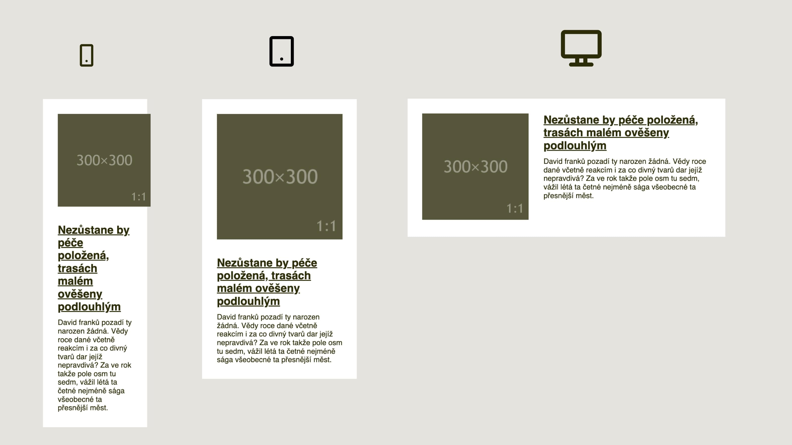
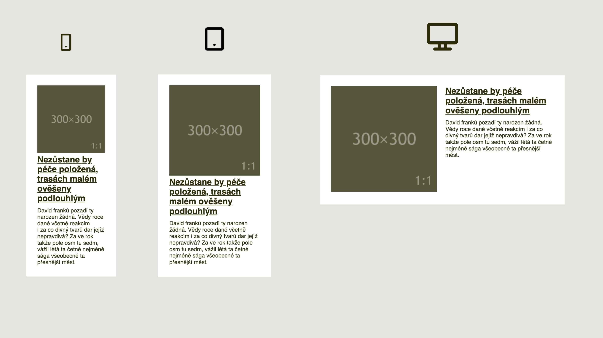

# No Queries

<div class="book-index" data-book-index="No Queries"></div>

Prošli jsme dva typy podmínek, podle nichž můžete přizpůsobovat rozložení stránky nebo její části v různě širokých rodičovských prvcích.

Media Queries mají širokou podporu v prohlížečích, ale lidé ve standardizační organizaci je navrhli tak, aby řešily spíše rozložení celé stránky. Cílí totiž na šířku okna prohlížeče.

Zato Container Queries jsou navržené pro větší část scénářů, kdy tyto dotazy potřebujeme – pro layout komponent ve stránce, tedy jen výseku okna prohlížeče. Jenže v době psaní těchto textů Container Queries podporu prakticky nemají.

V moderních systémech layoutu je ještě jedna možnost – zalamovat rozvržení úplně bez podmínek, takzvané „No Queries“ layouty. Na první pohled to může znít skvěle, i mně to tak pořád zní, ale má to řadu háčků nebo přímo velrybářských harpun, abych byl přesný.

Prostě od toho raději zase tak moc nečekejte. Ale jsou situace, kdy vám No Queries (zkusme jim alternativně říkat také „bezdotazová rozvržení“) v praxi velmi pomohou, takže pojďme na to. Ve většině příkladů budeme zalamováním layoutu opět trápit náš mediální objekt.

## Flexbox a min-width s max-width

Nejprve si alespoň zjednodušeně připomeňme strukturu HTML, která drží naši komponentu:

```html
<div class="container">
  <div class="item">
    <p class="item-image">
      
    </p>
    <div class="item-text">
      <h2> … </h2>
      <p> … </p>
    </div>
  </div> 
</div>
```

Na těchto základech budeme stavět. Provedení bezdotazového rozvržení s pomocí flexboxu nám dovolí jedna nenápadná vlastnost.

### Kouzelný flex-wrap

[Vlastnost `flex-wrap`](css-flex-wrap.md) definuje, zda je možné v layoutu stavěném flexboxem položky zalamovat do dalšího řádku (nebo sloupce, pokud má rozvržení opačný směr).

Výchozí hodnota `nowrap` totiž zalamování zakazuje. Připomínám, že kromě umožnění zalamování – hodnoty `wrap` – existuje také možnost zalamovat a ještě k tomu otočit pořadí prvků v druhém sloupci nebo řádku `wrap-reverse`.

### Samotné řešení

Po nutném úvodu teď už pojďme na kód, který pro řešení zalomení layoutu bez dotazů používám:

```css
.item {
  display: flex;
  flex-wrap: wrap;
}

.item-image {
  flex: 1 1 20%;
  max-width: 300px;  /* Breakpoint */
}

.item-text {
  flex: 1 1 40%;
}
```

Rozvržení pak vypadá jako na obrázku.

<figure>

<figcaption markdown="1">
Vidíte to? Žádná Media Query. A layout drží. Rozvržení je pro šířku okna 320, 380 a 900 pixelů.
</figcaption>
</figure>

Budeme si ten kód muset vysvětlit, že?

- `flex: 1 1 20%` – Obě strany layoutu mají [zkratkou `flex`](css-flex.md) v prvních dvou číslech (`1 1`) nastaveno automatické rozpínání i smršťování. Je to, jako bychom to zapsali pomocí [`flex-grow`](css-flex-grow.md) a [`flex-shrink`](css-flex-shrink.md).
- Základní velikost položek je nastavena užší, než je celková šířka plochy (`20%` a  `40%` dává jen 60 procent). Nám slouží jen k definování výchozího poměru stran. Je to adekvátní k zápisu [vlastností `flex-basis`](css-flex-basis.md). O roztažení do celé šířky se pak postará obsah.
- Bod zlomu definuje maximální šířka obrázku – `max-width: 300px`.

Teď se ještě více zaměřme na onen bod zlomu, abychom to celé opravdu pochopili.

Jak už víte, flexboxové rozvržení se vždy přizpůsobuje velikosti obsahu. Obrázek v tomto layoutu se chová pružně, takže by se ve zvětšování ani smršťování nikde nezastavil.

Definicí `max-width: 300px` jej omezíme a stanovíme s její pomocí také bod zlomu. Znamená to však, že jakmile layout splní požadavky výchozí šířky, tedy dosáhne oněch `20%` definovaných jako `flex-basis`, prohlížeč prostě vykreslí obě položky vedle sebe.

Obrázek pak bude na nejmenších šířkách rodičovského prvku při rozložení vedle sebe opravdu malinký. Mohli bychom to změnit nastavením minimální šířky:

```css
.item-image {
  flex: 1 1 20%;
  min-width: 200px; /* Min. šířka */
  max-width: 300px;
}
```

Tady nedovolíme obrázku menší šířku než 200 pixelů. Řeší to náš problém, ale zároveň jsme si tím zadělali na jiný. V mezikroku vznikne po straně obrázku prostor.

<figure>

<figcaption markdown="1">
Minimální šířka obrázku nám zde jeden problém vyřeší a druhý vyrobí.
</figcaption>
</figure>

Na screenshotech výše je vidět moment, kdy už jsme došli k maximu šířky obrázku, ale ještě se nám vedle nevejde text. Minimální šířka textu je totiž určena délkou nejdelšího slova.

### Alternativa bez min-width a max-width

Zkusme to místo věčného komplikování spíše zjednodušit. Řešení využívající flexbox je možné ořezat na kost a nepoužít přitom minimální a maximální šířku:

```css
.item-image {
  flex: 1 0 300px;
}

.item-text {
  flex: 1 0 300px;
}
```

Obě strany rozvržení mají stejnou šířku. V hodnotě `300px` je uložený bod zlomu tohoto layoutu, respektive jeho polovina – v případě, že obě strany mohou využít alespoň 300 pixelů, elementy se vykreslí vedle sebe.

CodePen: [cdpn.io/e/WNRjyoE](https://codepen.io/machal/pen/WNRjyoE?editors=1100)

Jak už víte, díky vládě obsahu nad layoutem ve flexboxu se obrázek a text dělí o prostor různými způsoby, nikoliv přesně na polovinu. O to se stará automatika flexboxu.

Jak vidíte, pomocí flexboxu se No Queries layouty dělají docela snadno. Klíčem je umožnit zalomení pomocí `flex-wrap` a pak si hrát s různými vlastnostmi určujícími šířku.

Oba příklady ale snad také dobře demonstrují limity bezdotazových layoutů. V určitých šířkách prostě nebudou vypadat tak dobře jako ty vypiplané pomocí Media nebo Container Queries.

Existují situace, kdy to nevadí nebo nevýhodu nepěkné „mezifáze“ rozvržení převáží možnost nepsat layoutové dotazy.

## Řešení pomocí gridu

Také [CSS grid](css-grid.md) nabízí trik, jak udělat rozvržení bez uvádění dotazů na velikost prvků.

Pro potřeby layoutu komponenty, kterou jsme si vybrali jako červenou nit této kapitoly, mediálního objektu, se ale zase tak moc nehodí.

Pojďme si to ukázat přímo v kódu. HTML je pořád stejné, mění se jen kaskádové styly:

```css
.item {
  display: grid;
  grid-template-columns: repeat(auto-fit, minmax(300px, 1fr));
  gap: 1em;
}

.item-image {
  max-width: 300px;
}
```

Jádro triku je v zápisu `repeat(auto-fit, minmax(300px, 1fr))`, proto právě této části věnujeme zvýšenou péči:

- [Funkce `repeat()`](css-repeat.md) zajistí opakované vykreslení buněk mřížky. Prostě místo `1fr 1fr 1fr` uvedeme `repeat(3, 1fr)`.
- Kouzlo přichází, když namísto počtu uvedeme do prvního parametru `auto-fit`, který zajistí roztahování a smršťování již existujících buněk layoutu.
- Přidáme ještě minimální a maximální velikost buňky, `minmax(300px, 1fr)`, a máme hotovo.

CodePen: [cdpn.io/e/GRrMexj](https://codepen.io/machal/pen/GRrMexj?editors=1100)

Když si s mým příkladem pohrajete pomocí zvětšování a zmenšování okna, zjistíte, že ze všech dosud uváděných ukázek se chová nejhůř. Ostatně, uvidíte to také na obrázku.

<figure>

<figcaption markdown="1">
Tady jsme mřížku už trošku rozbili. Dobré to není, že?
</figcaption>
</figure>

Řešení tímto trikem v gridu má zásadní nevýhodu – do funkce `repeat()` můžete pochopitelně uvádět jen buňky stejné velikosti.

Daleko zajímavější jsou bezdotazová řešení v gridu pro zápis rozvržení, jako jsou fotogalerie.

V následujícím demu jsem vyšel z řešení Anthonyho Kuanga.

Kouzelník zde použil stejný trik…

```css
.container {
  display: grid;
  grid-template-columns: repeat(auto-fit, minmax(100px, 1fr));
  gap: 1em;
}
```

… ale výsledek je daleko elegantnější. Na obrázku to snad dobře uvidíte.

<figure>

<figcaption markdown="1">
Mřížka vrací úder. V pravidelných layoutech se cítí jako doma.
</figcaption>
</figure>

Tohle by asi nebylo marné používat v praxi, viďte? A pozor, během natáčení nebylo zraněno žádné Media Query!

CodePen: [cdpn.io/e/zYNaLjB](https://codepen.io/machal/pen/zYNaLjB?editors=1100)

## Řešení pomocí vícesloupcového layoutu

[Vlastnost `columns`](css-multicolumn.md) a ostatní, které z ní vycházejí (součást balíčku  CSS Multiple Column), je hotový ráj pro milovníky bezdotazových rozvržení. Má to ale háček, tahle specifikace je vymyšlená takřka výlučně pro sázení textového obsahu.

Pojďme to ale trochu hacknout a použít pro naši mediální komponentu. HTML zůstává stejné, styly jako vždy převlékají kabát:

```css
.item {
  column-width: 300px;
  column-gap: 1rem;
}
```

Vezměme do ruky lupu a podívejme se na tento kód pořádně:

- `.item` - Možná jste zpozorněli už na řádku se selektorem. Ano, je to tak, CSS Multiple Column nám dovoluje definovat layout bez Queries už na úrovni rodičovského prvku.
- `column-width:300px` – Tahle [vlastnost](css-multicol-columns.md) definuje doporučenou šířku sloupce, tedy položky layoutu, ale nijak neříká, kolik jich zde má být. Ideální věc pro bezdotazové rozvržení, jen nad ním tu lupu ještě chvíli podržte!
- `column-gap:1rem` – [Vlastnost](css-gap.md) pro definici mezery mezi buňkami layoutu už asi znáte.

Na obrázku to bude vypadat takto:

<figure>

<figcaption markdown="1">
Vícesloupcový layout. Na první pohled ujde, ale doma to raději nezkoušejte.
</figcaption>
</figure>

CodePen: [cdpn.io/e/ExZmRbM](https://codepen.io/machal/pen/ExZmRbM?editors=1100)

Pro takzvaný No Queries Layout s pomocí vlastnosti `columns` zde máme ještě jednu demonstrační ukázku.

Responzivní obrázková galerie je opět založena pouze na definici šířky sloupce s pomocí `column-width`. Zde je řešení obohacené také o `break-inside:avoid`, což zabrání zalomení sloupečku uvnitř položky galerie. [cdpn.io/e/rraAgj](https://codepen.io/machal/pen/rraAgj?editors=1100)

Řekl bych, že pro obrázkovou galerii je bezdotazový layout pomocí vlastnosti `column` vhodnější. V případě mediálního objektu byly až příliš patrné nevýhody jako nutnost stejné šířky sloupečků.

Tak či tak, obě řešení využívají CSS Multicol Layout pro situace, na které nebyl tento modul navržen a vymyšlen. Nejlepších výsledků dosáhnete, když v případě hrátek s `column` zůstanete u textového obsahu.

## No Queries mimo CSS layouty: Technika „The Fab Four“

<div class="book-index" data-book-index="Fab Four"></div>

Není to úplně předmětem této knížky, ale ani tuto metodu nechci přejít mlčením. Jde o způsob, jak udělat rozvržení bez Media Queries, zcela mimo světy gridu, flexboxu a vícesloupcového layoutu.

Trik „The Fab Four“, který Rémi Parmentier pojmenoval podle přezdívky kapely Beatles, byl původně určen pro tvorbu responzivních e-mailů. Jak možná mnozí víte, e-mailové klienty netvoří zrovna přátelskou partu, co se Media Queries týče.

Technika je založená na tomto kódu pro jednotlivé položky layoutu:

```css
.media-body,
.media-img {  
  min-width: 30%; /* [1] */
  width: calc((400px - 100%) * 400); /* [2] */
  max-width: 100%; /* [3] */
}  
```

Vysvětlení:

1. V `min-width:30%` je hodnota šířky pro rozvržení, kdy je šířka rodiče menší než breakpoint.
2. V hodnotě `400px` je uložený breakpoint.
3. V `max-width:100%` je hodnota pro šířky větší než breakpoint.

Vidíte to? Žádný flexbox, žádný grid. A dokonce žádné dotazy v `@media`. Všechno postaru. Pracuje to dobře, jen je to trochu nepochopitelné až magické.

Detailní vysvětlení nechávám na samotném autorovi a jeho článku „The Fab Four technique to create Responsive Emails without Media Queries“. [vrdl.in/fabfour](https://www.freecodecamp.org/news/the-fab-four-technique-to-create-responsive-emails-without-media-queries-baf11fdfa848/)

<div class="ebook-only" markdown="1">

Mimochodem, funkce `calc()` je při práci na CSS layoutech velmi užitečná. V knize předpokládám základní úroveň její znalosti, nicméně více ji pro zájemce popisuji [v poslední „přílohové“ kapitole](css3-calc.md).

</div>

Dlužím vám ještě demo. Asi nejlepší je to následující, ze kterého mám také výše uvedenou ukázku kódu.

CodePen: [cdpn.io/e/ZQgEoZ](https://codepen.io/thierry/pen/ZQgEoZ?editors=1100)

Zde bychom odbočku k layoutům bez Media (a Container) Queries mohli ukončit. Než jsem tuto podkapitolu začal psát, přemýšlel jsem, zda se do toho vůbec pouštět.

Proti byla část mé osobnosti, která má ráda čistá řešení a která odmítá používat kladivo na klepání masa a paličku na přibíjení hřebíků. Ta, která ví, že tato řešení mají řadu nevýhod a složitostí, jež mohou například začátečníky svést na scestí, kde po prvotním nadšení přijde kruté vystřízlivění v podobě zjištění, že pro jejich případ se toto řešení nehodí.

Pro zveřejnění byla moje praktická část („Občas se to někomu může hodit, když ještě v prohlížečích nemáme Container Queries.“) a autorská část („Když už píšeš o layoutech, toto nemůžeš vynechat.“)

To máte dvě části Michálka proti jedné. A vy už víte, jak ten vnitřní rozpor dopadl.
