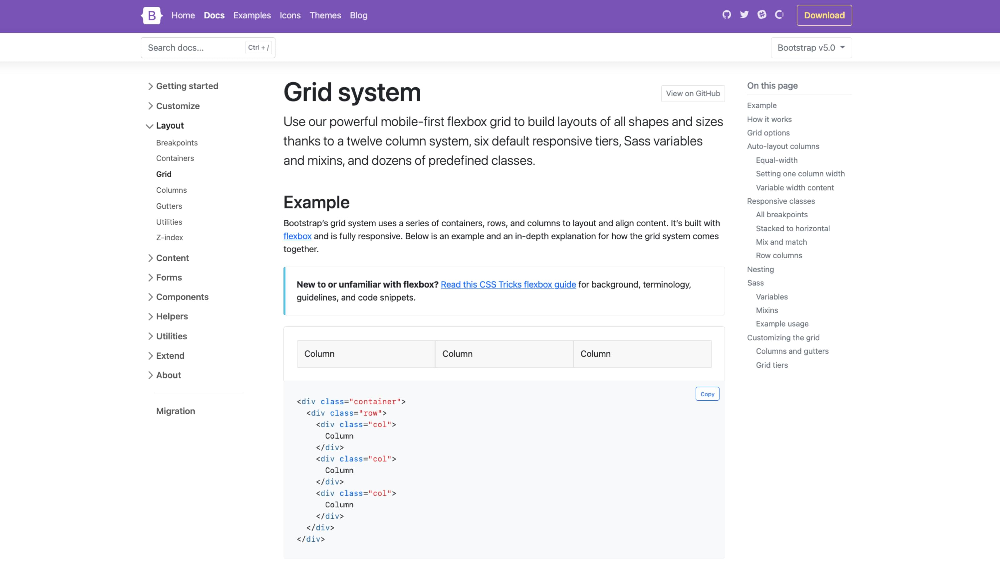

# Mřížka jako v Bootstrapu

<div class="book-index" data-book-index="Bootstrap"></div>

Pokud tento text nečtete v krytu, kde se mnoho let připravujete na zombie apokalypsu, nebo pokud jste se právě teď nedozvěděli, že existuje něco jako webová vývojařina, myslím, že můžu předpokládat, že znáte framework Bootstrap.

Tento frontendový framework se proslavil snadností stavby uživatelského rozhraní, zejména pro vývojáře nebo amatéry, kterým nejsou CSS, HTML a JavaScript úplně blízké.

<figure>

<figcaption markdown="1">
Tohle určitě vidíte poprvé. Nebo taky ne…
</figcaption>
</figure>

Mnoho vývojářek a vývojářů však ze všech vlastností Bootstrapu používá jen jednu část – mřížku pro tvorbu rozvržení stránky. Tvořit layout pomocí tohoto nebo podobných frameworků je totiž úžasně jednoduché.

Například pomocí následujícího HTML kódu můžeme vytvořit rozvržení o dvou sloupcích třetinové a dvoutřetinové šířky:

```html
<div class="row">
  <div class="col col-4">
    <strong>.col-4</strong>
  </div>
  <div class="col col-8">
    <strong>.col-8</strong>
  </div>
</div>
```

Pro neznalé připomínám, že pomocí třídy `.row` se tvoří „řádek“ rozvržení, pomocí `.col` definujeme sloupec a pomocí třídy `.col-` s číslem podíl na výchozí dvanáctisloupcové mřížce. Stačí zapsat HTML, přiložit CSS soubor Bootstrapu a šup – layout máte hotový.

CodePen: [vrdl.in/d8l4m](https://codepen.io/machal/pen/zYwBYjR?editors=1000)

V přiloženém CSS souboru bychom pak viděli, že layout je – alespoň v aktuální páté verzi Bootstrapu – tvořen pomocí flexboxu. Dříve to bylo pomocí `display:inline-block` a ještě dříve díky vlastnosti pro obtékání – `float`.

## Proč nepoužít Bootstrap?

Pokud opravdu nebaštíte konzervy v zemljance a neotevřeli jste knížku náhodně právě na této stránce, z dřívějších textů víte, že pro layout typu „mřížka“ by se daleko více hodila… no… mřížka. Překvapivě.

Bootstrap zatím CSS grid nepodporuje, hlavně kvůli [kompatibilitě s Internet Explorerem](msie.md), ale to se v další verzi změní. Můžete však mít i jiné důvody, proč nepoužít pro rozvržení nejpopulárnější webové frameworky.

Prvním problémem může být zbytečných 20–30 kilobajtů CSS, které musíte v podobě Bootstrapu kvůli layoutu stahovat. Jestliže máte přísné požadavky na rychlost načítání stránky, je to určitě nemalá nevýhoda.

Druhým teoretickým problémem je vaše touha mít layout definovaný v CSS, nikoliv v HTML. Dobrých důvodů pro něco takového může být hodně – od nemožnosti upravovat HTML na vašem projektu po specifický způsob organizace frontendového kódu.

Nyní se tedy dostáváme k jádru pudla. Tento layout bychom chtěli napsat v CSS gridu a ušetřit tak stažení zbytečného frameworku.

<div class="colored-box" markdown="1">

Zadání pro vás tedy zní: K HTML uvedenému výše napište CSS pomocí gridu tak, aby rozvržení vypadalo stejně.

</div>
<!-- .colored-box -->

## Řešení pomocí CSS gridu

Začneme s definicí mřížky na rodičovském prvku `.row`:

```css
.row {
  display: grid;
  grid-template-columns: repeat(12, 1fr);
  gap: 30px;
}
```

Pomocí [funkce `repeat()`](css-repeat.md) vykreslíme 12 prvků mřížky a zápisem [vlastnosti `gap`](css-gap.md) přidáme 30pixelovou mezeru mezi nimi.

Díky autoplacementu, automatickému umístění potomků rodiče do mřížky, se nám oba vnitřní prvky `div` vloží na pozici prvního a druhého sloupečku. To ale nechceme, že?

Další deklarace v CSS budou směřovat k řešení tohoto problému:

```css
.col-4 {
  grid-column: 1 / 5;
}

.col-8 {
  grid-column: 5 / 13;
}
```

První prvek jsme umístili mezi první a pátou linku gridu, tedy do prvních čtyř sloupců, druhý mezi pátou a poslední třináctou linku, tedy do dalších osmi sloupců.

Toto řešení je ovšem nepraktické, protože explicitně umísťuje prvky na konkrétní místa mřížky. Co kdybychom například chtěli prvek s třídou `.col-8` umístit před prvek `.col-4`? Výše uvedeným řešením ztrácíme flexibilitu, kterou nám poskytuje Bootstrap, což je krok zpět.

Proto sáhneme k lepšímu řešení:

```css
.col-4 {
  grid-column: span 4;
}

.col-8 {
  grid-column: span 8;
}
```

[Klíčové slovo `span`](css-grid-row-column.md) specifikuje počet sloupečků, který v mřížce daná buňka zabírá. Vykreslovat se začne tam, kde končí předchozí prvek. A to je přesně ta flexibilita, kterou jsme chtěli mít.

Shrňme si to v kompletním CSS kódu:

```css
.row {
  display: grid;
  grid-template-columns: repeat(12, 1fr);
  gap: 30px;
}

.col-4 {
  grid-column: span 4;
}

.col-8 {
  grid-column: span 8;
}

.col {
  border: 1px solid darkgrey;
}

.container {
  max-width: 1000px;
}
```

CodePen: [vrdl.in/93bir](https://codepen.io/machal/pen/MWpzqdv?editors=1100)

<figure class="figure-thirds">

<figcaption markdown="1">
*Rozvržení 4/8 jako v Bootstrapu s překryvnou vrstvou vyznačující neviditelné sloupečky gridu a mezery mezi nimi.*
</figcaption>
</figure>

Určitě si umíte představit i možnou náhradu dalších variant používání layoutu v Bootstrapu, včetně responzivních tříd pro různě široké displeje.

Pokud takovou představivost nemáte, namíchal jsem pro vás ještě jeden CodePen s dalšími ukázkami.

CodePen: [vrdl.in/e2f5h](https://codepen.io/machal/pen/dJxBGz?editors=1100)

Zpráva, která by se vám na konci tohoto příkladu měla zapsat do paměti, zní: Pokud hledáte jednoduchou možnost tvorby layoutu v mřížce jako nativně podporovanou alternativu k Bootstrapu a podobným frameworkům, zvažte CSS grid.
