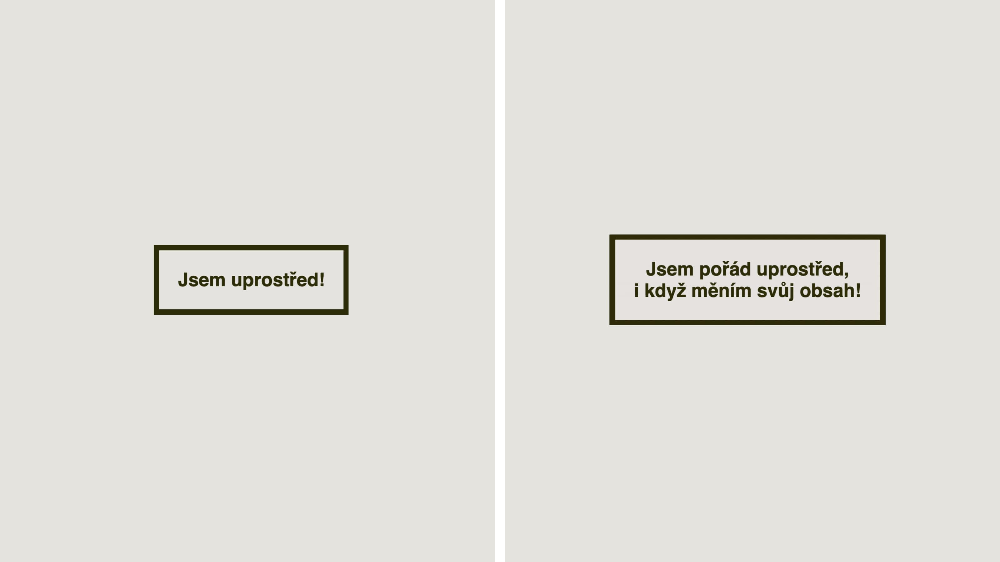

# Centrování boxu

Zatímco na vyrovnání textu na střed s pomocí CSS nic složitého není, při centrování prvků layoutu jsme se ve stylech dlouho drbali levou nohou za pravým uchem. Před příchodem flexboxu a gridu to nic příjemného nebylo.

V tomto jednoduchém příkladu otevřeme bránu do světa zarovnávání boxů, který má na starosti [CSS Box Alignment Module](css-box-alignment.md).

Cílem je to, co vidíte na obrázku. Boxík, který ve viditelné ploše obrazovky zůstane vycentrovaný vodorovně i svisle, i když se jeho obsah změní.

<figure class="figure-thirds">

<figcaption markdown="1">
*Centruj, centruj, vykrúcaj!*
</figcaption>
</figure>

Opět dám chvilku těm z vás, kteří si chcete řešení vymyslet sami. Jeho podmínky jsou tyto:

- Prvek `.item` je centrovaný vodorovně i svisle uprostřed stránky.
- Maximální šířka `.item` je `20em`, výšku vždy určuje obsah prvku, který může být proměnlivý.

Toto je výchozí HTML:

```html
<div class="container">
  <div class="item">
    Jsem uprostřed!
  </div>
</div>
```

<div class="colored-box" markdown="1">

💻 Také CodePen se zadáním už čeká na váš fork a následné procvičování mozkových závitů. Jen pozor, použijte jen vlastnosti ze specifikací no&shy;vé&shy;ho layoutu – gridu, flexboxu a zarovnávání boxů.

CodePen: [vrdl.in/8mr7c](https://codepen.io/machal/pen/xxdOJOX?editors=1100)

</div>
<!-- .colored-box -->

Čtenáři mezi vámi nechť směle pokračují dál.

## Středění boxu v boxu a poněkud komplikovaný flexbox

Začneme jednodušší variantou příkladu, ve které budeme centrovat boxík uvnitř jiného boxu.

K HTML výše přidáme zhruba toto CSS, které doplňuje zadání o omáčku kolem:

```css
.container {
  min-height: 10rem;
  padding: 1rem;
}

.item {  
  padding: 1em;
  max-width: 20em;  
}
```

Jak vidíte, přidali jsme vnitřní okraje (`padding`), nastavili minimální výšku pro rodiče (`.container`) a maximální šířku dle zadání pro samotný centrovaný boxík (`.item`).

Ve skutečnosti je ve výsledném CodePenu stylů více. Slouží ale jen k nastavení vzhledu, s rozvržením nemají nic společného.

Náš první centrovací pokus učiníme s pomocí flexboxu:

```css
.container {
  display: flex;
}
```

Je nám jasné, že toto žádné zázraky neučiní. Spíše naopak – připraví nám to problémy. Boxík je teď roztažený na celou výšku rodiče.

Toto je častá potíž začátečníků s flexboxem. Výchozí hodnota vlastnosti, která určuje zarovnání na výšku, je totiž nastavená na maximální rozpínavost.

O jakou vlastnost jde? Tady máme dobrou příležitost ukázat si tahák, který převezmeme z referenční příručky k CSS Box Alignment.

<figure class="figure-thirds">

<figcaption markdown="1">
*CSS Box Alignment v celé své složité kráse.*
</figcaption>
</figure>

Vidíme, že vlastnosti ve výchozím směru layoutu (vodorovně) začínají na `justify-` a ty v příčném směru (ve výchozím nastavení svisle) na `align-`. Snad i chápeme, že dotčená vlastnost se týká položek, takže hlavním podezřelým je zde [vlastnost `align-items`](css-align-items.md).

Ano, je to tak. Ve flexboxu má výchozí hodnotu `stretch`, která je příčinou onoho roztažení na výšku.

My však chceme zarovnávat doprostřed:

```css
.container {
  display: flex;
  align-items: center;
}
```

Povedlo se nám zařídit centrování ve svislém směru. Teď ještě vodorovně, že ano… Podívejte se do taháku na obrázku. Patrně zjistíte, že ve vodorovném směru (`justify-`) potřebujete zarovnávat položky (`-items`).

Jenže znovu ouha! Ve světě flexboxu vám v tuto chvíli `justify-items:center` fungovat nebude. Nejen hodnota, ale rovnou vlastnost `justify-items`, a tedy i [`justify-self`](css-justify-self.md) je ve specifikaci i prohlížečích pro použití ve flexboxu pro&shy;zatím zapovězena. Pokud vás to zajímá více, mrkněte se na podkapitoly o těchto vlastnostech v příručkách dále.

Tento typ zarovnávání se ve flexboxu dělá starým dobrým `margin:auto`:

```css
.container {
  display: flex;
  align-items: center;
}

.item {
  margin: auto;
}
```

CodePen: [vrdl.in/rfbc0](https://codepen.io/machal/pen/abWZjVE?editors=1100)

Můžeme s tím být spokojení, protože naše řešení funguje. Ale víte, co vám řeknu? Já s tím spokojený nejsem. Hlavně proto, že znám lepší řešení pomocí gridu, které není tak komplikované.

Než k němu přejdeme, zmíním ještě jednu možnost, poměrně populární u zkušených kodérů: k centrování využijte [vlastnost `justify-content`](css-justify-content.md):

```css
.container {
  display: flex;
  align-items: center;
  justify-content: center;
}
```

Tohle řešení bude v řadě případů pro centrování z obou stran ve flexboxu fungovat perfektně.

O jeho „čistotě“ se ovšem můžeme dlouho přít. Zkušenější již mohou `justify-content` dobře znát, a tedy se při jeho použití ve složitějších příkladech nenapálit.

Pro méně zkušené může být nepříjemný fakt, že vlastnost neslouží k zarovnání položek, ale prostoru mezi nimi. Tohle vás může někdy doběhnout.

CodePen: [vrdl.in/2wyrl](https://codepen.io/machal/pen/poWLQRX?editors=1100)

Teď ale už pojďme na ten elegantní grid.

## Středění boxu v boxu: situaci zachraňuje grid

Asi už víte, že zarovnávací vlastnosti CSS Box Align, jako je `align-items`, můžete s drobnými výjimkami použít jak pro flexbox, tak pro grid. V gridu jsou však tyto vlastnosti k dispozici řekněme v plné míře.

Naše původně zvažované řešení pro zarovnání položek na výšku i šířku by zde krásně fungovalo:

```css
.container {
  display: grid;
  align-items: center;
  justify-items: center; 
}
```

Já ale znám ještě elegantnější možnost:

```css
.container {
  display: grid;
  place-items: center;
}
```

[Vlastnost `place-items`](css-place-items.md) je totiž zkratkou pro nám již známé `align-items` a `justify-items`. Poskytuje tedy možnost zarovnávat v obou směrech, což je pro naši potřebu úplně dokonalé.

CodePen: [vrdl.in/x0wkl](https://codepen.io/machal/pen/wvGLEvJ?editors=1100)

Vlastnost `place-items` má u layoutů tvořených gridem samozřejmě podporu ve všech třech aktuálních prohlížečích.

## Středění boxu ve stránce

Zatím jsme se zaměřovali na zarovnávání doprostřed rodičovského prvku. Zadání pro tento příklad ovšem hovořilo o centrování uvnitř viditelné části stránky.

Předpokládáme tedy HTML tohoto typu:

```html
<body>
  <div class="item">
    Jsem uprostřed!
  </div>
</body>
```

Řešení by mohlo být nasnadě:

```css
body {
  display: grid;
  place-items: center;
}
```

Pokud si to takto vyzkoušíte v prohlížečích, zjistíte, že na větších displejích vás boxík jaksi neposlechne a o centrování na výšku nemůže být řeč.

Problém je v povaze výšky prvku `<body>`, která je vždy určená obsahem. Pokud tedy máme ve stránce málo obsahu, tělo stránky je nižší než celý viewport.

Můžeme jej roztáhnout s pomocí jednotky `vh`, viewport height, na sto procent výšky viewportu:

```css
body {
  display: grid;
  place-items: center;
  height: 100vh;
}
```

Obsah se bude centrovat na výšku i šířku. V CodePenu si pak můžete vyzkoušet přímo v prohlížeči editovat obsah prvku `.box`. I při výrazném bobtnání obsahu bude prvek stále uprostřed.

CodePen: [vrdl.in/d2yht](https://codepen.io/machal/pen/VwbjBPB?editors=1100)

Na tomto příkladě jsme si mohli vyzkoušet základy zarovnávání pomocí vlastností modulu CSS Box Alignment. Jak jste viděli, k dispozici jsou ve flexboxu i gridu, ale ten druhý k nim má řekněme plný přístup a pro zarovnávání tedy bývá efektivnější použít právě mřížku.
