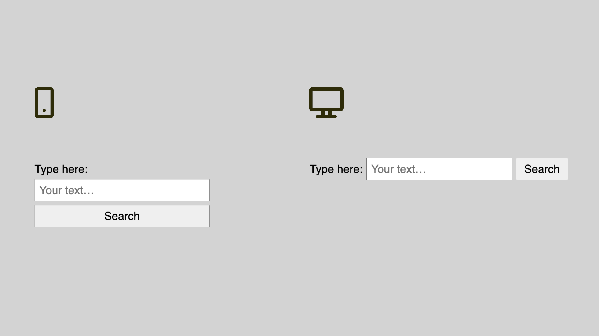

# Formulář pro vyhledávání

V další ukázce zkusíme nakódovat jednoduchý vyhledávací formulář. Vyzkoušíme opět něco ze zarovnávání boxů (CSS Box Alignment) a oba systémy layoutu – flexbox i grid.

Zadání obnáší návrhový vzor, na který každá kodérka a každý kodér jednou narazí.

<figure>

<figcaption markdown="1">
*Co budeme vyhledávat dneska? Co třeba řešení tohoto příkladu?*
</figcaption>
</figure>

Jak asi vidíte, jde o vyhledávací formulář obnášející tři prvky – textovým popisek `<label>`, textovým vstupem `<input>` a tlačítkem `<button>`.

HTML vypadá takto:

```html
<form action="" class="form">
  <label for="input" class="form__label">
    Type&nbsp;here:  
  </label>
  <input size="10" class="form__input" id="input"
     type="text" placeholder="Your text…">
  <button class="form__button">
    Search
  </button>
</form>
```

Zadání je následující:

- Na menších displejích (do 499 pixelů šířky) budou prvky jednoduše pod sebou.
- Na větších velikostech obrazovky (od 500 pixelů šířky) se vyskládají vedle sebe.
- V druhém případě mají popisek a tlačítko šířku obsahu a textový vstup se roztahuje, aby vyplnil maximální šířku.
- V obou případech je mezi prvky mezera o polovině `rem`.

Přikládám výchozí CodePen. Pokud chcete kódovat sami, což vám doporučuji, neváhejte odložit knížku nebo e-book a začít.

CodePen: [cdpn.io/e/qBZzMRW](https://codepen.io/machal/pen/qBZzMRW?editors=1100)

Spolu s ostatními budeme pokračovat.

## Řešení flexboxem

Nejprve si připravíme jeviště pro tvorbu layoutu:

```css
.form {
  display: flex;
  align-items: baseline;  
}
```

Rodičovský prvek musí být flexboxem a tak pomocí [vlastnosti `display`](css-display.md) nastavíme hodnotu `flex`. To je snad jasné.

### Zarovnání na účaří

[Vlastnost `align-items`](css-align-items.md) nás možná přinutí si vzpomenout na tahák z dřívějších podklapitol. Zde chceme zarovnávat položky layoutu (`-items`) na příčné ose (`align-`).

Hodnota `baseline` je velmi zajímavá – umožní nám zarovnávat prvky na _účaří_. Jde o typografický pojem, pod kterým si můžete představit neviditelnou linku, na kterou se zapisují jednotlivé znaky, asi jako jste to dělali ve škole do sešitu. Jinak se jí ještě říká _základní dotažnice_, případně anglicky _baseline_.

Typografické prvky je pro lepší čitelnost lepší vedle sebe zarovnat právě na účaří, nikoliv třeba doprostřed.

### Menší displeje

Na menších displejích chceme, aby se všechny tři prvky vyskládaly pod sebe. Toho v případě flexboxu dosáhneme změnou směru layoutu:

```css
@media (max-width: 499px) {
  
  .form {
    flex-direction: column;
  }

  .form__label,
  .form__input, 
  .form__button {
    width: 100%;
    margin-bottom: 0.5rem;
    box-sizing: border-box;
  }
  
}  
```

Komentáře:

- [Vlastností `flex-direction`](css-flex-direction.md) a hodnotou `column` měníme směr rozvržení z výchozího vodorovného na svislý.
- Mezeru mezi jednotlivými prvky děláme pomocí vnějšího okraje (`margin-bottom:0.5rem`), ve flexboxu (zatím) není možné použít vlastnost `gap`.
- Pomocí `width:100%` roztáhneme všechny prvky na celou šířku a pomocí `box-sizing:border-box` prohlížeči sdělíme, že šířku chceme počítat i s vnitřním okrajem a rámečkem. Pokud tu druhou vlastnost neznáte, podívejte se na Vzhůru dolů. [vrdl.cz/p/css3-box-sizing](https://www.vzhurudolu.cz/prirucka/css3-box-sizing)

### Větší displeje

Kód této části bude o něco jednodušší. Přirozené rozvržení, které nám vznikne nastavením `display:flex` zde jen trochu upravíme.

```css
@media (min-width: 500px) {

  .form__label {
    margin-right: 0.5rem;
  }

  .form__input {
    margin-right: 0.5rem;
    flex: auto;
  }
  
}
```

Pár myšlenek k tomu:

- Asi je evidentní, že pomocí `margin-right:0.5rem` opět dodáváme mezery mezi jednotlivé prvky layoutu.
- [Vlastnost `flex`](css-flex.md) je zkratkou pro nastavení velikosti a faktoru zvětšování či smršťování položky flexboxu. Hodnotou `auto` povolíme rovnoměrné zvětšování i smršťování a nastavíme šířku podle potřeby obsahu. Prvky `.form__label` a `.form__button` se tedy roztahovat nebudou, prvek `.form__input` ano.

Celý kód flexboxového řešení je zde:

```css
.form {
  display: flex;
  align-items: baseline;  
}

@media (max-width: 499px) {
  
  .form {
    flex-direction: column;
  }

  .form__label,
  .form__input, 
  .form__button {
    width: 100%;
    margin-bottom: 0.5rem;
    box-sizing: border-box;
  }
  
}  

@media (min-width: 500px) {

  .form__label {
    margin-right: 0.5rem;
  }

  .form__input {
    margin-right: 0.5rem;    
    flex: auto;
  }
  
}
```

CodePen: [cdpn.io/e/VwbpjKK](https://codepen.io/machal/pen/VwbpjKK?editors=1100)

Pojďme si ale položit otázku, zda by zde nebylo vhodnější vyřešit úkol pomocí mřížky. Zmizel by nám minimálně problém s nutností nastavovat mezery mezi prvky vlastností `margin`, která je tak… _oldschool_!

Příjímám sázky. Umožní nám grid více sexy řešení?

## Řešení gridem

Šance flexboxu porazit grid u tohoto příkladu se myslím sníží už zápisem kódu pro rodičovský prvek, který má rozvržení držet:

```css
.form {
  display: grid;
  gap: 0.5rem;
  align-items: baseline;
}
```

Vysvětlivky:

- `display:grid` nastaví formátovací kontext gridu a jen připomínám, že žádné rozvržení sám o sobě nevytvoří.
- [Vlastnost `gap`](css-gap.md) umožní vytvořit mezery mezi prvky a to prosím pěkně jakýmkoliv směrem a bez použití vnějšího okraje, tedy bez vlastnosti `margin`.
- Zarovnávání na účaří pomocí `align-items:baseline` můžeme samozřejmě zapsat i do gridového layoutu, protože vlastnosti [CSS Box Alignment](css-box-alignment.md) jsou univerzální.

### Menší displeje

Kód pro menší viewporty je díky propracovanosti gridu velmi jednoduchý:

```css
@media (max-width: 499px) {
  .form {
    grid-template-rows: repeat(3, auto);
  }  
}
```

Co jsme zde udělali?

- Šabloně layoutu ([vlastnosti `grid-template-`](css-grid-template-rows-columns.md)) nastavíme směr do řádků (`-rows`).
- V layoutu pak máme 3 prvky a každý si ponechá šířku podle obsahu, což definujeme klíčovým slovem `auto`.
- Abychom nemuseli zapisovat `grid-template-rows:auto auto auto` použijeme [funkci `repeat()`](css-repeat.md), která nám to zápisem `repeat(3, auto)` usnadní.

Je to jednoduché, že? Ale teď vám řeknu, že vás u této ukázky trošku tahám za nos. Mohlo by to totiž být ještě jednodušší.

Ve skutečnosti bychom zde nemuseli zapisovat žádný kód. Možná už totiž víte, že [CSS grid](css-grid.md) řádky layoutu vytváří automaticky. Při automatickém vytvoření řádku se prvek na řádku roztáhne na celou šířku (což chceme) a výšku má podle obsahu (což také chceme).

Takže si klidně ušetřeme práci a pro malé displeje tuto deklaraci zcela vynechme.

### Větší displeje

Na větších displejích už nějaký ten layout máme, takže si jej pojďme zapsat:

```css
@media (min-width: 500px) {
  .form {
    grid-template-columns: auto 1fr auto;
  }  
}
```

Poznámky:

- Šabloně layoutu ([vlastnosti `grid-template-`](css-grid-template-rows-columns.md)) nastavíme směr do sloupečků (`-columns`), tedy vodorovný.
- První a třetí člen (zde `.form__label` a `.form__button`) mají mít šířku podle obsahu – to obstará klíčové slovo `auto`.
- Prostřední prvek (`.form__input`) se má roztáhnout do zbylého prostoru – k tomu využijeme [zlomkovou jednotku `fr`](css-jednotka-fr.md).

Kompletní rozvržení bychom tedy gridem zapsali takto:

```css
.form {
  display: grid;
  gap: 0.5rem;
  align-items: baseline;
}

@media (min-width: 500px) {
  .form {
    grid-template-columns: auto 1fr auto;
  }  
}  
```

Není to prostě _sexy_?

CodePen: [cdpn.io/e/poPebVB](https://codepen.io/machal/pen/poPebVB?editors=1100)

Došli jste ke stejnému nebo jinému řešení? V čem je to vaše lepší? Klidně se mi ozvěte.

## Media nebo Container Queries?

Tady se samozřejmě musím pozastavit u využití dotazů na média - [Media Queries](media-queries.md). V předchozí kapitole vcelku jasně píšu, že ty se hodí hlavně pro rozvržení celé stránky.

Jenže v tomto případě jsme se zaměřili na jednu malou komponentu. Tu navíc můžou naší zlovolní vývojářští a designérští kolegové umísťovat do různých míst stránek, přesně podle dnešního způsobu práce se systémy komponent.

Zde by se prostě daleko víc hodilo namísto dotazů na média a klíčového slova `@media` hodilo použít dotazy na rodičovský element a slovo `@container`. Jak ale už také víte, [Container Queries](container-queries.md) jsou v době psaní jen zkušebně implementovány v prohlížeči Chrome a vůbec není jisté, že se ujmou.

## Co jsme se naučili?

Rád bych tady ještě shrnul, co jsem se pokusil vás tímto příkladem naučit, nebo vám alespoň připomenout:

1. Pro rozvržení jednoduše skládaná do jednoho nebo druhého směru, ve kterých se hodně pracuje s mezerami, se více hodí CSS grid.
2. Dozvěděli jsme se, že grid umí automaticky vytvářet řádku a členy těchto řádků roztahuje do plné šířky, takže to nepotřebujeme dělat ručně, jako u flexboxu.
3. Naučili jsme se vlastnost `align-items` a hodnotu `baseline`, velmi užitečnou pro vyrovnávání typografických elementů.
4. Zpochybnili jsme používání Media Queries pro rozvržení komponent, ale to je tak všechno, co s tím teď můžeme prakticky dělat.

Zbývá nám ještě pár příkladů, takže neváhejme a pojďme dál.
