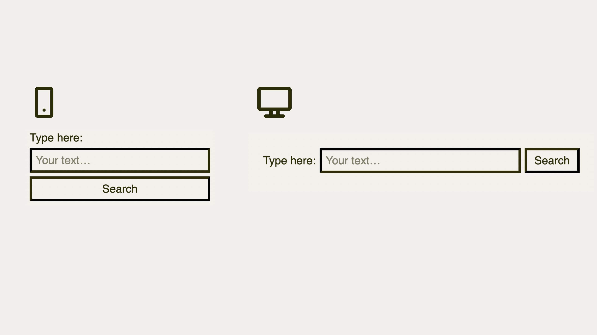

# Formulář pro vyhledávání

V této ukázce zkusíme nakódovat jednoduchý vyhledávací formulář. Vyzkoušíme opět něco ze zarovnávání boxů ([CSS Box Alignment](css-box-alignment.md)) a oba systémy layoutu – [flexbox](css-flexbox.md) i [grid](css-grid.md). Zadání přichází s návrhovým vzorem, na který jednou narazí každá kodérka i každý kodér.

<figure class="figure-thirds">

<figcaption markdown="1">
Co budeme vyhledávat dneska? Třeba řešení tohoto příkladu?
</figcaption>
</figure>

Jak asi vidíte, jde o vyhledávací formulář obsahující tři prvky – textový popisek `<label>`, textový vstup `<input>` a tlačítko `<button>`.

HTML vypadá takto:

```html
<form class="form">
  <label for="input" class="form__label">Type here:</label>
  <input size="10" class="form__input" id="input"
     type="text" placeholder="Your text…">
  <button class="form__button">Search</button>
</form>
```

Zadání je následující:

- Na menších displejích (do `499px`, tedy `31.24999em` šířky) budou prvky jednoduše pod sebou.
- Na větších velikostech obrazovky (od `500px` šířky, `31.25em`) se prvky vyskládají vedle sebe.
- V druhém případě mají popisek a tlačítko šířku obsahu a textový vstup se roztahuje, aby vyplnil maximální šířku.
- V obou případech je mezi prvky mezera o polovině `rem`.

<div class="colored-box" markdown="1">

💻 Pokud chcete kódovat sami, což vám doporučuji, neváhejte odložit knížku nebo čtečku s e-bookem a vrhněte se na CodePen se zadáním.

CodePen: [vrdl.in/hvuif](https://codepen.io/machal/pen/qBZzMRW?editors=1100)

</div>
<!-- .colored-box -->

Spolu s ostatními budeme pokračovat.

## Řešení flexboxem

Nejprve si připravíme jeviště pro tvorbu layoutu:

```css
.form {
  display: flex;
  align-items: baseline;  
  gap: 0.5rem;
}
```

Rodičovský prvek musí být flexboxem, a tak pomocí [vlastnosti `display`](css-display.md) nastavíme hodnotu `flex`.

Snad je evidentní, že pomocí `gap:0.5rem` přidáváme mezery mezi jednotlivé prvky layoutu.

### Zarovnání na účaří

[Vlastnost `align-items`](css-align-items.md) nás možná přinutí si vzpomenout na tahák z předchozího příkladu. Zde chceme zarovnávat položky layoutu (`-items`) na příčné ose (`align-`).

Hodnota `baseline` je velmi zajímavá – umožní nám zarovnávat prvky na _účaří_. Jde o typografický pojem, pod nímž si můžete představit neviditelnou linku, na kterou se zapisují jednotlivé znaky, asi jako jste to dělali ve škole do sešitu. Jinak se jí ještě říká _základní dotažnice_, případně anglicky _baseline_.

Typografické elementy, jako je text a formulářové prvky typu vstupní pole nebo tlačítka, je pro lepší čitelnost vhodnější zarovnat právě na účaří, nikoliv třeba doprostřed.

### Menší displeje

Na menších displejích chceme, aby se všechny tři prvky vyskládaly pod sebe. Toho v případě flexboxu dosáhneme změnou směru layoutu:

```css
@media (max-width: 31.24999em) {
  
  .form {
    flex-direction: column;
  }

  .form__label,
  .form__input, 
  .form__button {
    width: 100%;
    box-sizing: border-box;
  }
  
}  
```

Moje komentáře:

- [Vlastností `flex-direction`](css-flex-direction.md) a hodnotou `column` měníme směr rozvržení z výchozího vodorovného na svislý.
- Pomocí `width:100%` roztáhneme všechny prvky na celou šířku a pomocí `box-sizing:border-box` prohlížeči sdělíme, že šířku chceme počítat i s vnitřním okrajem a rámečkem. Pokud tu druhou vlastnost neznáte, podívejte se na Vzhůru dolů. [vrdl.in/cssbs](https://www.vzhurudolu.cz/prirucka/css3-box-sizing)

### Větší displeje

Kód této části bude o něco jednodušší. Přirozené rozvržení, které nám vznikne nastavením `display:flex`, zde jen trochu upravíme.

```css
@media (min-width: 31.25em) {

  .form__input {
    flex: auto;
  }
  
}  
```

[Vlastnost `flex`](css-flex.md) je zkratkou pro nastavení velikosti a faktoru zvětšování či smršťování položky flexboxu. Hodnotou `auto` povolíme rovnoměrné zvětšování i smršťování a nastavíme šířku podle potřeby obsahu. Prvky `.form__label` a `.form__button` se tedy roztahovat nebudou, prvek `.form__input` ano.

Celý kód flexboxového řešení je zde:

```css
/* Flexbox layout: */

.form {
  display: flex;
  align-items: baseline;  
  gap: 0.5rem;
}

@media (max-width: 31.24999em) {
  
  .form {
    flex-direction: column;
  }

  .form__label,
  .form__input, 
  .form__button {
    width: 100%;
    box-sizing: border-box;
  }
  
}  

@media (min-width: 31.25em) {

  .form__input {
    flex: auto;
  }
  
}
```

CodePen: [vrdl.in/atpbj](https://codepen.io/machal/pen/VwbpjKK?editors=1100)

Pojďme si ale položit otázku, zda by i zde nebylo vhodnější vyřešit úkol pomocí mřížky. Přijímám sázky. Umožní nám grid více sexy řešení?

## Řešení gridem

Šance flexboxu porazit grid u tohoto příkladu se myslím sníží už zápisem kódu pro rodičovský prvek, který má rozvržení držet:

```css
.form {
  display: grid;
  gap: 0.5rem;
  align-items: baseline;
}
```

Vysvětlivky:

- `display:grid` nastaví formátovací kontext gridu (více [v páté kapitole](css-grid-formatting-context.md)), ale žádné rozvržení sám o sobě nevytvoří.
- Zarovnávání na účaří pomocí `align-items:baseline` můžeme samozřejmě zapsat i do gridového layoutu, protože vlastnosti [CSS Box Alignment](css-box-alignment.md) jsou univerzální.

### Menší displeje

Kód pro menší viewporty je díky propracovanosti gridu velmi jednoduchý:

```css
@media (max-width: 31.24999em) {
  .form {
    grid-template-rows: repeat(3, auto);
  }  
}
```

Co jsme zde udělali?

- Šabloně layoutu ([vlastnosti `grid-template-`](css-grid-template-rows-columns.md)) nastavíme směr do řádků (`-rows`).
- V layoutu pak máme tři prvky a každý si ponechá šířku podle obsahu, což definujeme klíčovým slovem `auto`.
- Abychom nemuseli zapisovat `grid-template-rows:auto auto auto`, použijeme [funkci `repeat()`](css-repeat.md), která nám to zápisem `repeat(3, auto)` usnadní.

Je to jednoduché, že? Ale teď vám řeknu, že vás u této ukázky trošku tahám za nos. Mohlo by to totiž být ještě jednodušší.

Ve skutečnosti bychom zde nemuseli zapisovat žádný kód. Možná už totiž víte, že [CSS grid](css-grid.md) vytváří řádky layoutu. Při automatickém vytvoření řádku se prvek roztáhne na celou šířku (což chceme) a výšku má podle obsahu (což také chceme). Takže si klidně ušetřeme práci a pro malé displeje tuto deklaraci zcela vynechme.

### Větší displeje

Na větších displejích už nějaký ten layout máme, takže si jej pojďme zapsat:

```css
@media (min-width: 31.25em) {
  .form {
    grid-template-columns: auto 1fr auto;
  }  
}
```

Poznámky:

- Šabloně layoutu ([vlastnosti `grid-template-`](css-grid-template-rows-columns.md)) nastavíme směr do sloupečků (`-columns`), tedy vodorovný.
- První a třetí člen (zde `.form__label` a `.form__button`) mají mít šířku podle obsahu – to obstará klíčové slovo `auto`.
- Prostřední prvek (`.form__input`) se má roztáhnout do zbylého prostoru – k tomu využijeme [zlomkovou jednotku `fr`](css-jednotka-fr.md).

Kompletní rozvržení bychom tedy gridem zapsali takto:

```css
.form {
  display: grid;
  gap: 0.5rem;
  align-items: baseline;
}

@media (min-width: 31.25em) {
  .form {
    grid-template-columns: auto 1fr auto;
  }  
}  
```

Není tohle opravdu sexy?

CodePen: [vrdl.in/9g56h](https://codepen.io/machal/pen/poPebVB?editors=1100)

Došli jste ke stejnému, anebo jinému řešení? V čem je to vaše lepší? Klidně se mi ozvěte.

## Media nebo Container Queries?

Tady se samozřejmě musím pozastavit u využití dotazů na média – [Media Queries](media-queries.md). V předchozí kapitole vcelku jasně píšu, že ty se hodí hlavně pro rozvržení celé stránky.

Jenže v tomto případě jsme se zaměřili na jednu malou komponentu. Tu navíc mohou naši zlovolní vývojářští a designérští kolegové umísťovat do různých míst stránek, přesně podle dnešního způsobu práce se systémy komponent.

Zde by se prostě daleko víc hodilo namísto dotazů na média a klíčového slova `@media` použít dotazy na rodičovský element a slovo `@container`. Jak ale už také víte, [Container Queries](container-queries.md) jsou v době psaní jen zkušebně implementovány v prohlížeči Chrome a vůbec není jisté, že se ujmou.

## Co jsme se naučili?

Rád bych tady ještě shrnul, co jsem se vás pokusil tímto příkladem naučit, nebo vám to alespoň připomenu:

1. Pro rozvržení jednoduše skládaná do jednoho nebo druhého směru, ve kterých se hodně pracuje s mezerami, se více hodí CSS grid.
2. Dozvěděli jsme se, že grid umí automaticky vytvářet řádku a členy těchto řádků roztahuje do plné šířky, takže to nepotřebujeme dělat ručně jako u flexboxu.
3. Naučili jsme se vlastnost `align-items` a hodnotu `baseline`, velmi užitečnou pro vyrovnávání typografických elementů.
4. Zpochybnili jsme používání Media Queries pro rozvržení komponent, ale to je tak všechno, co s tím teď můžeme prakticky dělat.

Zbývá nám ještě pár příkladů, takže neváhejme a pojďme dál.
