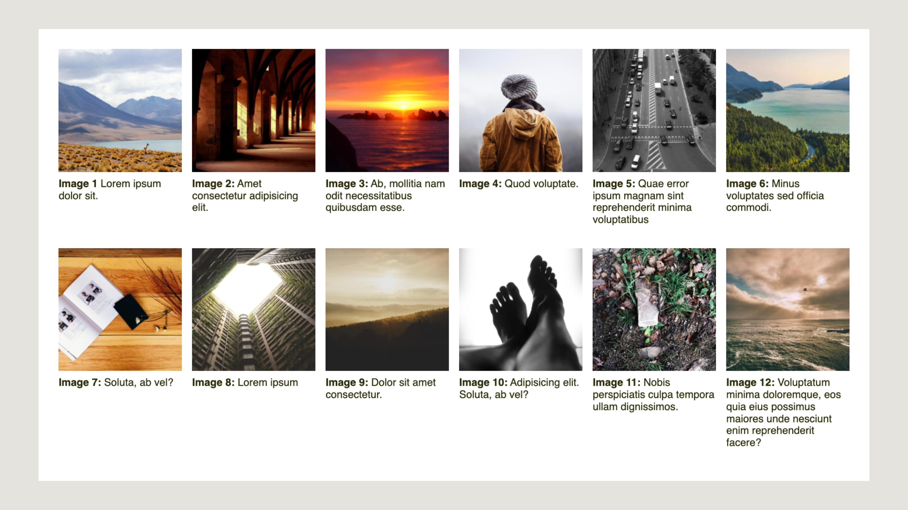
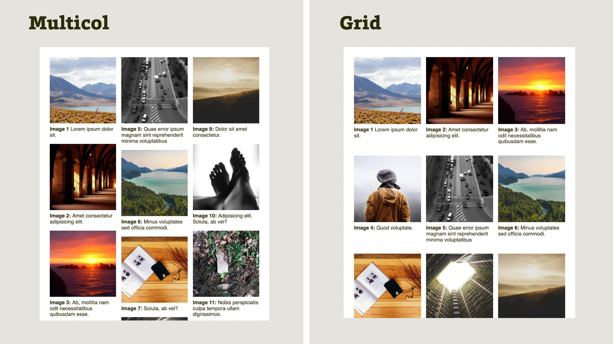

# Galerie bez Media Queries

<div class="book-index" data-book-index="No Queries"></div>

Fotogalerie, nebo prostě seznam položek vyskládaný do mřížky, to je návrhový vzor, kterým se dnešní weby jen hemží a ve vývojářské praxi se mu nedá vyhnout.

V tomto specifickém příkladu předpokládejme kodéra velmi lenivé nátury a pokusíme se vyhnout jakýmkoliv Media nebo Container Queries. V knize jsme o tomto přístupu psali v druhé kapitole jako [o No Queries layoutech](no-queries.md).

<figure>

<figcaption markdown="1">
*Tohle nakódujete za chvilku. Co ale responzivně a bez Media Queries?*
</figcaption>
</figure>

Zadání je následující:

- Máme 12 náhledů fotek ve stránce.
- Maximální šířka jedné fotky je `300px`.
- Fotky mají popisky, které se mohou roztáhnout do více řádků.
- Mezera mezi jednotlivými sloupci layoutu má šířku `1rem`.
- Fotky musí co nejpravidelněji vyplnit prostor na výšku i šířku.
- Nepoužijte přitom Media Queries.

<div class="pbi-avoid" markdown="1">

HTML vypadá zhruba takto:

```html
<div class="container">
  <div class="gallery-item">
    
    <p class="gallery-item-caption">
      <strong>Image 1</strong> Lorem ipsum dolor sit.
    </p>
  </div>
  <div class="gallery-item">
    
    <p class="gallery-item-caption">
      <strong>Image 2:</strong> Amet consectetur adipisicing elit. 
    </p>
  </div>
  …
</div>
```

</div>
<!-- .pbi-avoid -->

<div class="colored-box" markdown="1">

💻 Píše se vám už v hlavě kód?  Vlastně to nemusí být nic složitého, takže vám zde rovnou poskytnu výchozí CodePen se zadáním.

CodePen: [vrdl.in/78cnp](https://codepen.io/machal/pen/eYWWrJY?editors=1100)

</div>
<!-- .colored-box -->

Pracanti nechť zavřou knihu a v klidu pracují. My ostatní si rozdělíme funkce takto: já píšu, vy čtete.

## Řešení pomocí CSS Multi-column Layout

Pokud vás pro tyto případy napadl jako vhodný systém pro rozvržení [CSS Multicol](css-multicolumn.md), byli jste na správné cestě. I já bych po něm při řešení určitých typů fotogalerií sáhl. Je to totiž hotové raz dva:

```css
.container {
  columns: 150px;
  gap: 1em;
}
```

Vysvětlím to:

- [Vlastností `columns`](css-multicol-columns.md), což je zkratka pro nastavení počtu sloupečků nebo jejich doporučené šířky, zde jako šířku nastavuji polovinu šířky sloupce.
- S pomocí druhé vlastnosti, [`gap`](css-gap.md), nastavuji šířku mezi sloupečky. To už znáte.

Chybí mi tady ještě jedna věc, a to zákaz zalomení uvnitř prvku `.gallery-item`, protože bychom velmi neradi viděli popisek z prvku `.gallery-item-caption` mimo samotný obrázek, třeba hned na začátku následujícího sloupce:

```css
.gallery-item {
  break-inside: avoid;
}
```

Také [vlastnost `break-inside`](css-multicol-break.md) si můžete prostudovat v referenční příručce na konci knížky. Celé řešení si pak můžete projít a otestovat v CodePenu.

CodePen: [vrdl.in/pvyf7](https://codepen.io/machal/pen/ZEKKozg?editors=1100)

Zamysleme se však také nad nevýhodami volby vícesloupcového layoutu pro kód zadání.

- Náhledy fotografií se řadí do sloupců pod sebe. Takže druhá fotka bude pod první, nikoliv vedle ní.
- Položky s fotkami netvoří mřížku, ale jsou volně vyskládané, přičemž roli hraje celková výška položky, určená také délkou textu popisku.

Ve spoustě situací to ale může být vhodné řešení, na obrázku uvidíte, že vizuálně působí dobře.

Možná si při pohledu na obrázek vzpomenete na [„zděný layout“ (masonry)](css-masonry.md), o kterém píšu v kapitole s referenční příručkou ke gridu a který bude zřejmě jednou možné udělat bez JavaScriptu, s přímou pomocí CSS gridu. No a když už jsme u gridu, pojďme si tu fotogalerii zkusit ještě navrhnout s ním.

## Řešení pomocí CSS grid a RAM

Pokud bychom nechtěli použít Media Queries, v CSS gridu máme možnost sáhnout po návrhovém vzoru RAM. Nejprve kód a pak vysvětlení:

```css
.container {
  display: grid;
  grid-template-columns: repeat(auto-fit, minmax(150px, 1fr));
  gap: 1em;
}
```

RAM, to je zkratka pro Repeat, Auto, Minmax. V popisování začínám zevnitř závorek:

- [Funkci `minmax()`](css-minmax.md) jsem zde už vysvětloval. Tady ji využíváme k nastavení minimální šířky elementu na `150px` a maximální `1fr`.
- [Funkci `repeat()`](css-repeat.md) už také znáte. Zjednodušuje zápis opakovaných údajů v `grid-template`.
- Namísto čísla v prvním argumentu `repeat()` se na nás ale k našemu překvapení kouká klíčové slovo `auto-fit`, které prohlížeči říká, aby prostor vyplnil maximálním možným roztažením buněk, jež už na řádku existují.

Jinak řečeno – zápisem `repeat(auto-fit,minmax(150px,1fr))` říkáme: Dej na řádek libovolný počet položek. Roztáhni je klidně do jejich maximální obsahové šířky, ale nikdy je nesmršťuj pod 150 pixelů.

Výsledek vypadá jinak než v řešení pomocí CSS Multicol, na obrázku uvidíte srovnání.

<figure class="figure-thirds">

<figcaption markdown="1">
*Kdo je váš favorit, pan Vícesloupec nebo paní Mřížková?*
</figcaption>
</figure>

Položky jsou srovnané do řádků a je možné je číst zleva doprava. Nevýhody zde však vidím taky. Na většině šířek displeje náhledy s popisky nevyplní všechny řádky. Algoritmus prohlížeče vykreslí položky po řádcích, takže můžeme například vidět kombinaci 9 položek v prvním řádku a 3 ve druhém.

Udělat pěknou mřížku, bez vynechaných položek, tedy například 2 × 6, 3 × 4 apod., je samozřejmě s gridem možné, jen bychom to museli specifikovat přesněji s pomocí Media Queries.

<div class="pbi-avoid" markdown="1">

Ještě odkaz na CodePen s řešením využívajícím grid a můžeme to uzavřít.

CodePen: [vrdl.in/b2o1u](https://codepen.io/machal/pen/LYyydoZ?editors=1100)

</div>
<!-- .pbi-avoid -->

## Co jsme se tady naučili?

- Poprvé jsme v kapitole s příklady využili [CSS Multi-column Layout](css-multicolumn.md), a to v situaci, kde funguje velmi dobře – design fotogalerie.
- Vyzkoušeli jsme si dva layouty s „automatickou responzivitou“, bez použití Media Queries.
- V rámci CSS gridu jsme se něco dozvěděli o návrhovém vzoru RAM a klíčovém slově `auto-fit`.
