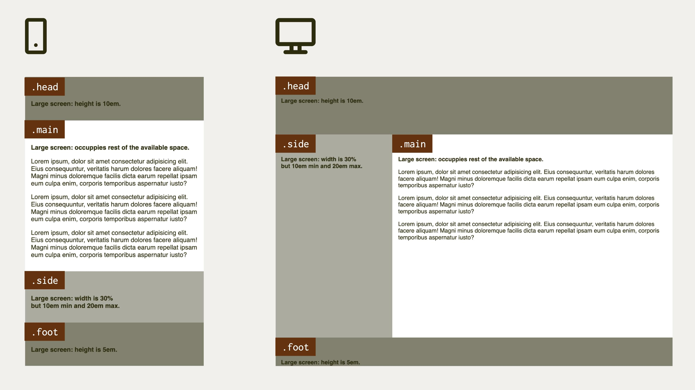
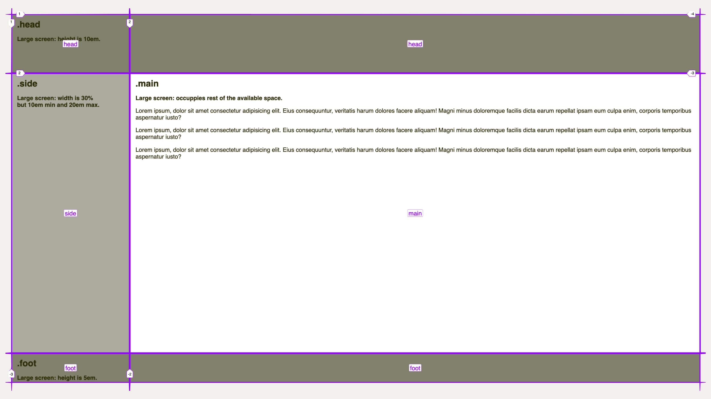

# Svatý grál mezi layouty

<div class="book-index" data-book-index="Svatý grál"></div>

V tomto speciálním příkladu ze světa známých rozvržení začneme citací z Wikipedie:

> Jako svatý grál bývají označovány nedosažitelné předměty nebo myšlenky, které se snaží člověk vyzkoumat nebo rozluštit, čímž by měl dosáhnout zásadního pokroku.

Svatým grálem medicíny je například nalezení léku na rakovinu. Jenže co je „svatý grál“ v oblasti webových layoutů? Nejlépe to opět definuje největší světová encyklopedie:

> Svatým grálem webdesignu je rozvržení, které má více stejně vysokých sloupců. Je běžně žádané a implementované, ale po mnoho let měly různé způsoby jeho implementace všechny možné nevýhody. Z tohoto důvodu bylo nalezení optimální implementace přirovnáváno k hledání nepolapitelného svatého grálu.

Pojďme to raději vizualizovat. Svatý grál mezi layouty vypadá takto:

<figure>

<figcaption markdown="1">
*Hurá, našli jsme svatý grál! Potřebujeme jej ale ještě vůbec?*
</figcaption>
</figure>

Ano, znáte ho. Je to layout, ve kterém byla ještě před lety vysázena každá druhá webovka.

Toto rozvržení jsme implementovali  nejprve pomocí rámů, pak tabulkami, floaty nebo ještě jinak. Bylo to peklo. Vzpomeňte na [exkurzi z první kapitoly](css-layout-versus.md).

Až nyní jsme se přiblížili k optimálnímu a dostatečně jednoduchému řešení. Jak už správně tušíte, svatý grál umíme nakódovat pomocí [CSS gridu](css-grid.md).

Historie má však smysl pro ironii a v případě historie vývoje webdesignu tomu není jinak. Zhruba v těch letech, kdy jsme začali mít možnost tento typ layoutu poprvé v historii nakódovat efektivně a elegantně, od něj  zároveň designérky a designéři začali masově ustupovat ve prospěch jiných, jednodušších typů layoutů.

I přes to bych se svatým grálem mezi rozvrženími nějaký čas v knížce strávil. Historii zatím nepatří. Například pro tvorbu rozhraní webových aplikací je, na rozdíl od tvorby rozhraní prezentačních webových stránek, „holy grail“ pořád nezastupitelný.

A pak… Skvěle se na něm ukazují silné stránky šablonování vlastnostmi začínajícími na `grid-template` v CSS gridu.

<div class="colored-box" markdown="1">

💻 Pokud byste v tuto chvíli chtěli začít kódovat, což vám můžu jedině doporučit, opět nabízím předpřipravený CodePen, který si forkněte – a vzhůru do kódování.

CodePen: [vrdl.in/97oj5](https://codepen.io/machal/pen/ZEePyrM?editors=1100)

</div>
<!-- .colored-box -->

HTML jsem vymyslel takto:

```html
<div class="container">
  <header class="head">
    <h2>.head</h2>
  </header>
  <main class="main">
    <h2>.main</h2>
  </main>
  <aside class="side">
    <h2>.side</h2>
  </aside>
  <footer class="foot">
    <h2>.foot</h2>
  </footer>
</div>
```

## Zadání pro rozvržení

Nejprve je potřeba definovat, jak přesně má layout vypadat a chovat se. Leccos jste asi viděli na obrázku výše. Ještě to ale raději rozepíšu:

- Na malých displejích, zde do šířky okna `599px`, chceme prostě a jednoduše vyskládat všechny prvky layoutu pod sebe dle pořadí v kódu.
- Na větších obrazovkách je layout roztažený na celou viditelnou výšku okna.
- Na výšku bychom rádi drželi tato pravidla: hlavička a patička (prvky `.head` a `.foot`) jsou vysoké přesně `10em` a `5em`. Prostředek zabere zbývající plochu.
- Ve zbývající vnitřní ploše máme dva prvky. Postranní panel (`.side`) má šířku 30 %, ovšem s minimem `10em` a maximem `20em`. Obsahový blok (`.main`) už pak jen dostává zbytek viditelné plochy.

Pakliže si chcete sami zkusit kódovat, teď je ta správná příležitost zavřít knížku a učit se prací.

Čtenáři mezi vámi mohou pokračovat.

<div class="pbi-avoid" markdown="1">

## Řešení příkladu

Nejprve si napíšeme [Media Query](media-queries.md) a provedeme servisní nastavení:

```css
@media screen and (min-width: 37.5em) { 
  .container {
    display: grid;
    height: 100vh;
  }
}
```

</div>
<!-- .pbi-avoid -->

Rodičovskému prvku `.container` jsme nastavili zobrazovací kontext pro [CSS grid](css-grid.md) a výšku na `100vh`, což je sto procent výšky viewportu (`vh` jako „viewport height“). Layout tak bude vždy roztažený v celém okně.

V tomto případě jsem se rozhodl, že budu používat oblasti (`grid-area`), takže do nich můžu prvky DOMu rovnou umístit:

```css
.head {
  grid-area: head;
}

.main {
  grid-area: main;
}  

.side {
  grid-area: side;
}    

.foot {
  grid-area: foot;
}      
```

Jak asi tušíte, toto samo o sobě nic nedělá. Normálně bych začínal od definice šablony layoutu ([vlastnost `grid-template`](css-grid-template.md)), ale právě to vám chci ukázat jako třešničku na dortu tohoto příkladu. Pojďme si ji dát na talíř:

```css
.container {
  grid-template-rows: 10em 1fr 5em; 
  grid-template-columns: 30% 1fr;
  grid-template-areas:
    "head head"
    "side main"
    "foot foot";
}
```

Teď si to vysvětleme. První dvě vlastnosti už znáte:

- Pomocí [`grid-template-rows`](css-grid-template-row-columns.md) definujeme řádky layoutu. Víme, že hlavička má být vysoká `10em`, patička `5em` a zbytek připadá na prostřední část. Tento zbytek definujeme [jednotkou `fr`](css-jednotka-fr.md).
- [Vlastnost `grid-template-columns`](css-grid-template-row-columns.md) nám, jak už víte, pomůže definovat směr rozvržení po hlavní ose, tedy po sloupcích. Postranní panel má zabrat 30 % šířky a pak je tu ten zbytek určený pro obsah.

## Definované oblasti

[Vlastnost `grid-template-areas`](css-grid-template-areas.md) ještě možná neznáte, ale v gridu patří k mým nejoblíbenějším. S její pomocí definujeme jména oblastí a jejich umístění v buňkách mřížky.

Pomocí `grid-template-rows` a `grid-template-columns` jsme vytvořili mřížku 3 × 2, o třech řádcích a dvou sloupcích. Do nich teď můžeme pomocí tohoto „ASCII artu“ umísťovat oblasti.

Asi jste si všimli, že oblasti `head` a `foot` zabírají vždy dvě buňky, což je přesně ten layout, kterého potřebujeme dosáhnout.

Pomocí inspekce mřížky ve Firefoxu (nebo Chromu) se nám teď layout krásně vizualizuje i s pojmenovanými oblastmi:

<figure>

<figcaption markdown="1">
„Holy grail layout“ vizualizovaný ve Firefoxu.
</figcaption>
</figure>

## Minimum, maximum, optimum s pomocí funkce clamp()

Vsadím se, že vám celou dobu vrtá hlavou, proč jsem zatím ignoroval fakt, že dle zadání má mít postranní panel (`.side`) šířku 30 % – ovšem s minimem `10em` a maximem `20em`.

Inu, snažím se vám ty třešničky dávkovat tak, abyste se jich nepřejedli. Další sladkou dobrotou je totiž funkce `clamp()`.

```css
.container {
  /* … */
  grid-template-columns: clamp(10em, 30%, 20em) 1fr;
}
```

Dělá přesně to, co si myslíte: `30%` v prostředním argumentu je optimální velikost. První a poslední argument dodává minimum a maximum. Podpora této funkce v moderních prohlížečích je výborná, takže jí neváhejte využít.

<div class="ebook-only" markdown="1">

Mimochodem, funkci `clamp()`, stejně jako její kolegyně `min()` a `max()`, pro zájemce více popisuji [v poslední, přílohové kapitole](css-min-max-clamp.md).

</div>

Pojďme si to teď zjednodušit, nebo možná zkomplikovat. Záleží, jak se na to budete dívat.

## Používáme zkratky

Zaměříme se na kód, kterým definujeme rozvržení:

```css
.container {
  grid-template-rows: 10em 1fr 5em; 
  grid-template-columns: clamp(10em, 30%, 20em) 1fr;
  grid-template-areas:
    "head head"
    "side main"
    "foot foot";
}
```

Nyní se tento náš kód pokusíme zestručnit. [Vlastnosti `grid-template-rows` a `grid-template-columns`](grid-template-rows-columns.md) můžeme zapsat [zkratkou `grid-template`](css-grid-template.md), která definuje oba směry a odděluje je lomítkem. Jako vždy v CSS i zde uvádíme jako první svislý směr, tedy definice řádků layoutu:

```css
.container {
  grid-template: 10em 1fr 5em / clamp(10em, 30%, 20em) 1fr;
  grid-template-areas:
    "head head"
    "side main"
    "foot foot";
}
```

Jde to zjednodušit ještě více. Také oblasti definované v `grid-template-areas` můžeme vložit do této zkratky – [`grid-template`](css-grid-template.md):

```css
.container {
  grid-template:
    "head head" 10em
    "side main" 1fr
    "foot foot" 5em
    / clamp(10em, 30%, 20em) 1fr;
}
```

K řádkům vždy nejprve uvádíme oblasti, pak rozměry řádku, následuje lomítko a zapíšeme rozměry sloupců. Dle mého to není úplně přehledné, ale proti gustu žádný dišputát.

A mohli bychom to zkrátit ještě více. Do [zkratky `grid`](css-grid-zkratka.md):

```css
.container {
  grid:
    "head head" 10em
    "side main" 1fr
    "foot foot" 5em
    / clamp(10em, 30%, 20em) 1fr;
}
```

Do zápisu `grid` se kromě vlastností pro šablonu (`grid-template`) dají uvádět ještě vlastnosti implicitního gridu (začínající na [`grid-auto`](grid-auto-flow.md)). To je už dost specifická a zapeklitá věc, takže ji zde zatím nechám bez vysvětlení. Najdete ho v referenční příručce k CSS gridu.

Je mi jasné, že pro jedny jsem to sice zjednodušil („Hurá, méně kódu!“), jiným jsem zamotal hlavu („Fuj, kód složitý jako assembler.“). Máte však volbu, jak kód v gridu zapisovat, a vyberte si dle svých preferencí.

Ještě vám dlužím finální CSS kód. Nejprve definujeme grid:

```css
@media screen and (min-width: 37.5em) {
  .container {
    display: grid;
    height: 100vh;
    grid:
      "head head" 10em
      "side main" 1fr
      "foot foot" 5em
      / clamp(10em, 30%, 20em) 1fr;
  }    
}  
```

<div class="pbi-avoid" markdown="1">

Nyní umístíme prvky do mřížky:

```css
@media screen and (min-width: 37.5em) {  
  .head {
    grid-area: head;
  }  
  .main {
    grid-area: main;
  }    
  .side {
    grid-area: side;
  }      
  .foot {
    grid-area: foot;
  }      
}  
```

</div>
<!-- .pbi-avoid -->

CodePen: [vrdl.in/dljik](https://codepen.io/machal/pen/ppVzrg?editors=1100)

A to je vše. Já už se těším na další příklad. Co vy?
