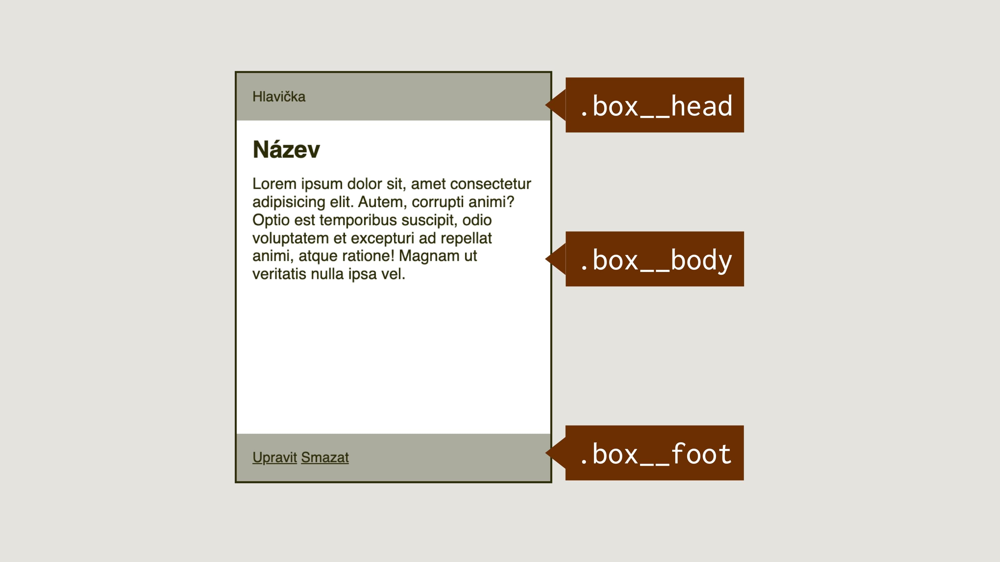

# Hromada lívanců

V dalším relativně častém návrhovém vzoru z uživatelských rozhraní webů zkusíme využít rozvržení mřížkou, tentokrát ale v jiném směru než v předchozí ukázce.

<figure>

<figcaption markdown="1">
*Hromada lívanců. Dáte si to s džemem, ovocem, jogurtem nebo třeba nějakým typem CSS layoutu?*
</figcaption>
</figure>

Tomuto návrhovému vzoru se říká „Pancake Stack“ takže „hromada lívanců“. Často ji uvidíme v různých výpisech prvků ve stránce.

Mimochodem, pokud v „Pancake Stack“ nevidíte žádnou podobnost s lívanci, zkuste jich udělat velkou hromadu a pak se na ně podívat z boku.

V zadání je tato představa:

- Šedivá hlavička (`.box-head`) a patička  (`.box-foot`) bloku má výšku podle svého vnitřního obsahu. První je vždy přilepená nahoře, druhá dole.
- Prostřední část je vždy stejně vysoká – má výšku `20rem`.
- Je potřeba zajistit, aby obsah prvku `.box-body` v případě přetečení nerozbil výšku, protože hromad lívanců máme hned několik vedle sebe.

HTML pro jeden prvek, jednu hromadu lívanců, jsme vymysleli následovně:

```html
<div class="box">
  <header class="box-head">
    Hlavička
  </header>
  <main class="box-body" contenteditable>
    <h2>Název</h2>
    <p>Lorem ipsum dolor sit…</p>
  </main>
  <footer class="box-foot">
    <a href="#">
      Upravit
    </a>
    <a href="#">
      Smazat
    </a>
  </footer>
</div>
```

Všimněte si parametru `contenteditable`. Tímto způsobem dovolujeme, aby bylo přímo do rozhraní možné psát nebo vkládat obsah. V ukázce jsem to povolil proto, abyste si mohli zkusit vložit složitější text, a layout tak rozbít.

<div class="colored-box" markdown="1">

Opět je zde možnost teď zavřít knížku a zkusit si zadání nakódovat. Sledujte předpřipravený CodePen.

CodePen: [cdpn.io/e/poeGQya](https://codepen.io/machal/pen/poeGQya?editors=1100)

</div>
<!-- .colored-box -->

## Výsledný kód

Pro znalce gridu bude CSS opravdu velmi jednoduché:

```css
.box {
  display: grid;
  grid-template-rows: auto 20rem auto;
}
```

V šabloně (vlastnosti [začínající `grid-template`](grid-template-rows-columns.md)) tentokrát nedefinujeme sloupce, ale řádky. Jak vidíte, jsou tři. První a poslední, což jsou v příkladu elementy `.box-head` a `.box-foot`, mají výšku podle vlastního obsahu, tedy `auto`.

Prostřední buňka připadající na prvek `.box-body` má pokaždé výšku `20rem`. Zde zejména proto, že hromad lívanců máme vždy několik vedle sebe a nechtěli bychom, aby některé byly vyšší než jiné.

CodePen: [cdpn.io/e/abJamrr](https://codepen.io/machal/pen/abJamrr?editors=1100)

Ještě doplním, že v „nastavovacím“ kódu, který je v CodePenech schovaný pod komentářem `/* ETC: */`, abych vám ulehčil práci a umožnil soustředit se na psaní kódu, který se týká layoutu, jsou tentokrát poměrně důležité deklarace:

```css
.container {
  display: flex;
  flex-wrap: wrap;
}

.box {
  max-width: 20rem;
  margin: 0 1rem 1rem 0;
}

.box-body {
  padding: 1rem;
  overflow: hidden;
}
```

Kromě okrajů v `margin` a `padding` si prosím povšimněte definice rozvržení flexboxem, umístěné na rodičovském prvku nad jednotlivými hromádkami lívanců. [`display:flex`](css-display.md) už znáte, ale [vlastnost `flex-wrap`](css-flex-wrap.md) jsme v příkladech ještě neměli. Je velmi důležitá, protože prvkům rozvržení umožňuje zalamovat se na další řádky.

Všimněte si i deklarace `overflow:hidden`, která obsahu v prvku `.box-body` zabraňuje v přetečení mimo vyhrazený prostor výšky `20rem`. Zde byste samozřejmě mohli namítnout, že lepší než fixní omezení obsahu by zde bylo mít jakousi vnitřní mřížku, která prvky v jednotlivých hromadách lívanců pěkně propojí a zajistí výšku podle nejvyššího z nich. Řešení se jmenuje [subgrid](css-subgrid.md), píšu o něm v páté kapitole, ale v době psaní zatím není podporováno všemi prohlížeči.

<div class="book-index" data-book-index="Subgrid"></div>

Máte? Tak pojďme dál.
