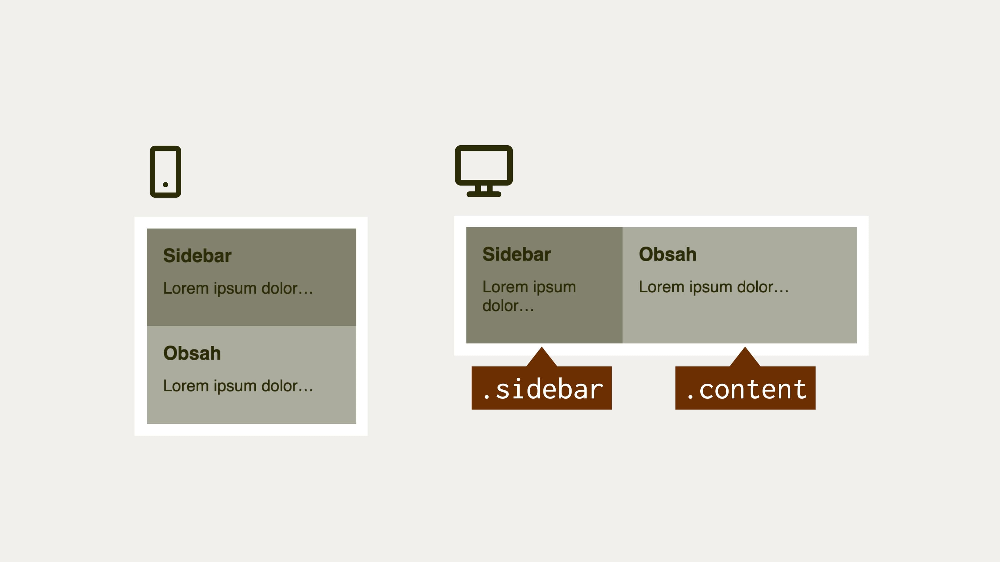

# Boční panel

V této ukázce zkusíme využít flexbox i grid. Jde o jeden z nejčastějších layoutů, jaké můžete na webu zahlédnout.

<figure>

<figcaption markdown="1">
*Tohle už jste na webu někde viděli, že?*
</figcaption>
</figure>

Zadání je následující:

- Boční panel (`.sidebar`) má minimální šířku `200px` a maximální `20%`.
- Oba prvky jsou vedle sebe až od šířky okna `599px`. Od šířky `600px` (`37.5em` pro potřeby Media Queries) je boční panel vlevo a obsah vpravo.

HTML jsme navrhli takto:

```html
<div class="container">
  <aside class="sidebar">
    <h2>
      Sidebar…
    </h2>
    <p>Lorem ipsum…</p>
  </aside>
  <main class="content">
    <h2>
       Obsah…
    </h2>
    <p>Lorem ipsum…</p>
  </main>
</div>
```

<div class="colored-box" markdown="1">

Chcete si to zkusit sami? Jste ve správné části knihy. Text s oranžovým okrajem vás totiž vyzývá k aktivitě, ať už formou kódování nebo psaní testu. Zde můžete využít připravený prázdný CodePen: [vrdl.in/gkuom](https://codepen.io/machal/pen/VwpgEQg?editors=1100)

</div>
<!-- .colored-box -->

Můžete si pak porovnat svůj výsledek s mým, který teď právě představím.

## Varianta s flexboxem

CSS kód je následující:

```css
@media screen and (min-width: 37.5em) {
  .container {
    display: flex;
  }

  .sidebar {
    min-width: 200px;
    max-width: 20%;
  }
}
```

Pomocí [vlastnosti `display`](css-display.md) nastavíme flexový layout. To stačí k tomu, aby se vnitřní prvky naskládaly vedle sebe. Pro definici hranic šířky prvku `.sidebar` pak použijeme klasiku – vlastnosti `min-width` a `max-width`. Prohlédnout si to můžete na výsledném CodePenu.

CodePen: [vrdl.in/xnfvb](https://codepen.io/machal/pen/wvddxWd?editors=1100)

## Varianta s gridem

Zde to máme ještě o trochu jednodušší:

```css
@media screen and (min-width: 37.5em) {
  .container {
    display: grid;
    grid-template-columns: minmax(200px, 20%) 1fr;
  }
}
```

Zápisem [`display:grid`](css-display.md) ještě žádný layout nevzniká. Ten začne platit až s definicí šablony, kterou nejsnadněji uděláme použitím [vlastnosti `grid-template-columns`](css-grid-template-rows-columns.md) (pro definici sloupců layoutu), případně `grid-template-rows` (pro definici jeho řádků).

Využíváme zde drobné parádičky – [funkce `minmax()`](css-minmax.md), která funguje pro definici buněk gridu podobně jako vám asi již známé vlastnosti `min-width` a `max-width`. V prvním parametru je minimální a v druhém maximální hodnota.

[Jednotka `fr`](css-jednotka-fr.md) pak definuje rozdělení zbývající plochy, a jelikož je zde použita jen jednou, druhý sloupeček si prostě vezme celou zbývající plochu. Ještě se mrkněte na výsledný CodePen a tím to můžeme uzavřít. Došli jste ke stejnému řešení?

CodePen: [vrdl.in/2pyos](https://codepen.io/machal/pen/MWyMqwX?editors=1100)
