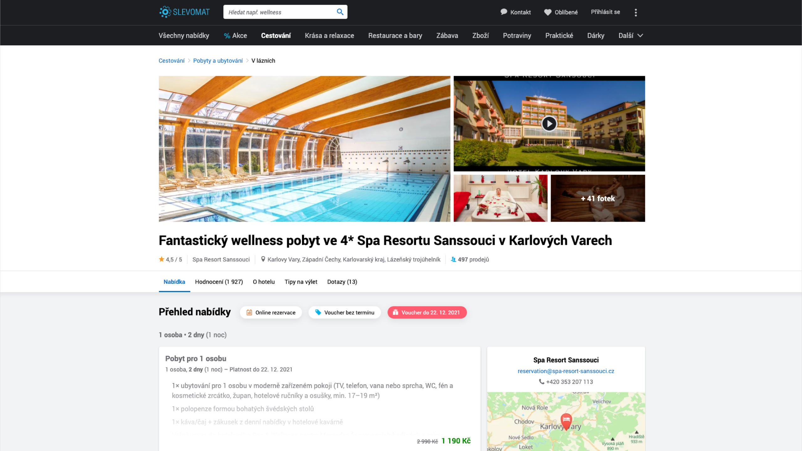
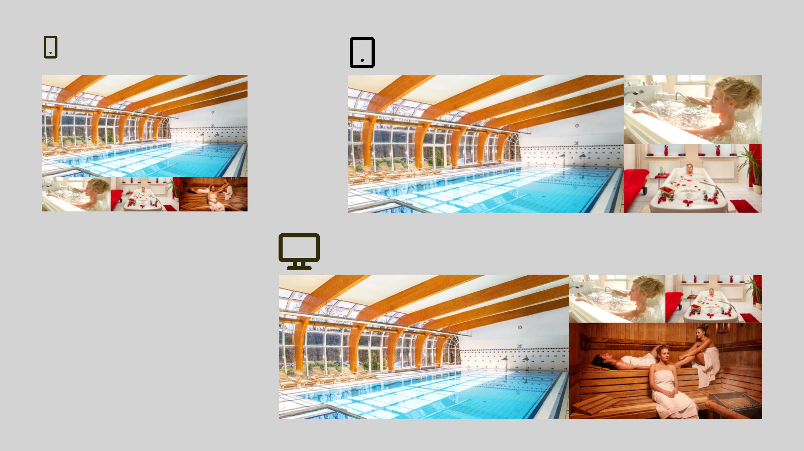
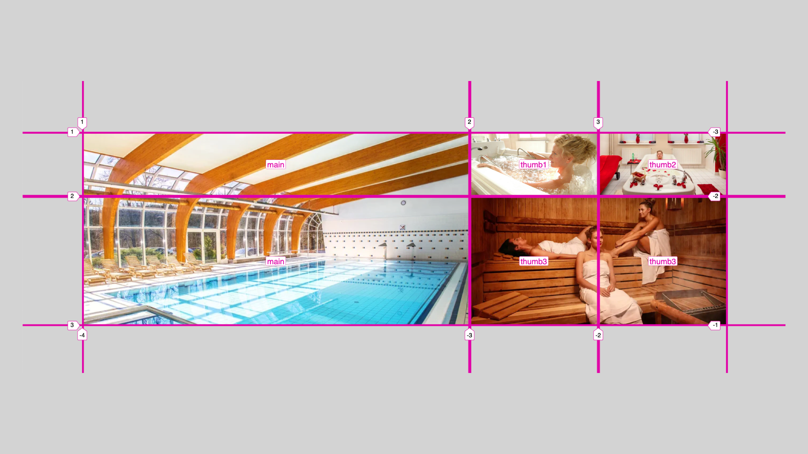

# Responzivní fotogalerie

V předchozí ukázce jsme poměrně intenzivně využili oblasti mřížky definované pomocí [`grid-template-areas`](css-grid-template-areas.md) a umísťované s vlastností [vlastností `grid-area`](css-grid-area.md).

Oblasti jsme zde využili hlavně pro zjednodušení a zpřehlednění kódu. V této ukázce u oblastí zůstaneme, ale jejich využití tady bude ještě intenzivnější a uplatnění na zpřehlednění kódu větší.

Zdrojem pro tuto ukázku je skutečná fotogalerie na Slevomat.cz. Ale takovou jste určitě už viděli i jinde nebo ji dokonce kódovali.

<figure>

<figcaption markdown="1">
*Co takhle si po tom všem kódování dopřát wellness?*
</figcaption>
</figure>

Zadání je ale složitější – tentokrát budeme velmi intenzivně řešit responzivitu, různá zobrazení na různě velkých displejích.

<figure>

<figcaption markdown="1">
*Tři breakpointy, tři různá rozvržení fotogalerie. Tohle asi kodérský wellness nebude, spíše galeje. (Že chybí třetí fotka na tabletu? To není chyba, ale vlastnost.)*
</figcaption>
</figure>

Chcete si to zkusit sami? „Forkněte“ CodePen a vzhůru do toho.

CodePen: [cdpn.io/e/bGqmQEx](https://codepen.io/machal/pen/bGqmQEx?editors=1100)

HTML jsem tentokrát nevymýšlel sám. Půjčil jsem si jej přímo od kodérů Slevomatu, protože používají metodiku BEM a já k jejich HTML téměř nemám co dodat:

```html
<div class="gallery">
  <div class="gallery__main-image">
    
  </div>
  <div class="gallery__thumb gallery__thumb-one">
    
  </div>
  <div class="gallery__thumb gallery__thumb-two">
    
  </div>
  <div class="gallery__thumb gallery__thumb-three">
    
  </div>
</div>
```

Pokud by vás BEM, metodika zápisu tříd pro potřebu tvorby komponent, zajímal víc, mrkněte se na Vzhůru dolů. [vrdl.cz/p/bem](https://www.vzhurudolu.cz/prirucka/bem)

## Oblasti mřížky

V dalším kroku si spárujeme jednotlivé prvky HTML (nebo DOMu, když chcete) s oblastmi gridu.

V CSS kódu to bude vypadat následovně:

```css
.gallery__main-image {
  grid-area: main;
}

.gallery__thumb-one {
  grid-area: thumb1;
}

.gallery__thumb-two {
  grid-area: thumb2;
}

.gallery__thumb-three {
  grid-area: thumb3;
}
```

Jak už víte, toto samo o sobě ještě nic nezařídí. Prohlížeč sice ví, kam chcete který prvek umístit, ale oblasti ani layout zatím nezná.

## Breakpointy

V příkladu jsem za vás pomocí [Media Queries](media-queries.md) definoval tři body zlomu:

```css
@media (max-width: 399px) { }

@media (min-width: 400px) and (max-width: 699px) { }

@media (min-width: 700px) { }
```

Pojďme teď konečně zapracovat na jednotlivých rozvrženích. Mocně zde využijeme právě [zkratku `grid-template`](css-grid-template.md), o které už víte, že jsem si ji poměrně oblíbil.

## Layout na nejmenších displejích

Rozvržení pro nejmenší zařízení typu mobily na výšku bude vypadat takto:

```css
@media (max-width: 399px) {
  .gallery {
    grid-template:
      "main main main"
      "thumb1 thumb2 thumb3" /
      1fr 1fr 1fr;
  }
}
```

Jde o mřížku 3 × 2, tři sloupce a dva řádky. Každý sloupec je stejně široký – `1fr 1fr 1fr` bychom samozřejmě mohli zapsat pomocí [funkce `repeat()`](css-repeat.md) jako `repeat(3, 1fr)`.

Výšku řádků bychom mohli definovat hned za oblastmi. Pokud ji neurčíme, spočítá se podle obsahu, takže má hodnotu `auto`, zde podle výšky obrázků. Jen pro pořádek uvedu odpovídající zápis s definicí výšky řádků layoutu:

```css
@media (max-width: 399px) {
  .gallery {
    grid-template:
      "main main main" auto
      "thumb1 thumb2 thumb3" auto /
      1fr 1fr 1fr;
  }
}
```

Všimněte si klíčového slova `auto`, které přibylo na konci obou řádků.

Podstatné na této ukázce je ale umístění oblastí do mřížky:

- Oblast `main` zabírá první tři buňky mřížky, tedy celý první řádek.
- Oblastem `thumb1` až `thumb3` jsme přidělili jednotlivé buňky na třetím řádku.

Díky tomu, že jsem nejprve propojil elementy DOMu z oblastmi, nemusím nyní vůbec přemýšlet, jak vypadá moje HTML. Prostě umísťuji pojmenované oblasti do požadovaného rozvržení.

## Layout na středních displejích

Pojďme rovnou na kód:

```css
@media (min-width: 400px) and (max-width: 699px) {
  .gallery {
    grid-template:
      "main thumb1"
      "main thumb2" /
      2fr 1fr;
  }
  .gallery__thumb-three {
    display: none;
  }
}
```

Zde musíme poslední náhled „vypnout“ pomocí `display:none`. Grafický návrh nám to káže.

Zde jen umístím vsuvku způsobenou tím, že odborník na rychlost webu ve mě se nyní staví na zadní: „Vypnutí“ obrázku pomocí `display:none` prohlížeči nezakáže obrázek stáhnout. Může to vadit, ale v tomhle případě se budeme tvářit, že ne zase tak moc.

Samotný layout je tentokrát definovaný jako mřížka 2 × 2. První sloupec je dvoutřetinový (`2fr`), druhý zabírá zbylou třetinu prostoru (`1fr`).

Rozmístění oblastí `main`, `thumb1` a `thumb2` do buněk mřížky asi vidíte z „ASCII artu“. Hlavní fotka zabírá celý první sloupec, další dvě jsou vlevo pod sebou.

## Layout na větších displejích

Nyní k největšímu breakpointu. CSS kód vypadá takto:

```css
@media (min-width: 700px) {
  .gallery {
    grid-template:
      "main thumb1 thumb2"
      "main thumb3 thumb3" /
      3fr 1fr 1fr;
  }
}
```

Máme zde mřížku 2 × 3, dělenou na pětiny. Umístění oblastí do buněk gridu je asi zřejmé. V případě potřeby si je porovnejte s rozvržením z obrázků.

<figure>

<figcaption markdown="1">
*Vizualizace mřížky a jejích oblastí ve Firefoxu.*
</figcaption>
</figure>

A máme hotovo! Srovnejte si svá díla s mým CodePenem.

CodePen: [cdpn.io/e/bGqzwMy](https://codepen.io/machal/pen/bGqzwMy?editors=1100)
