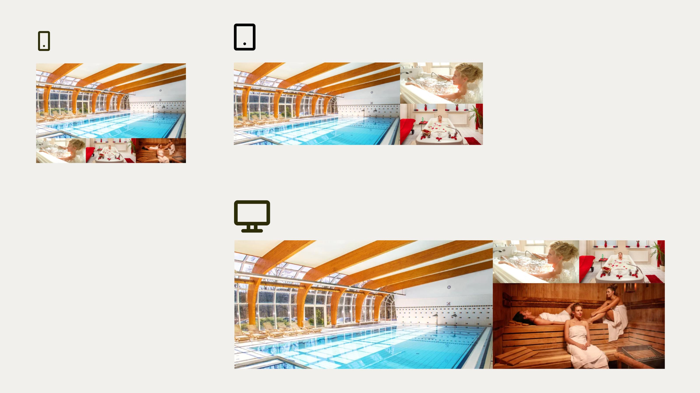
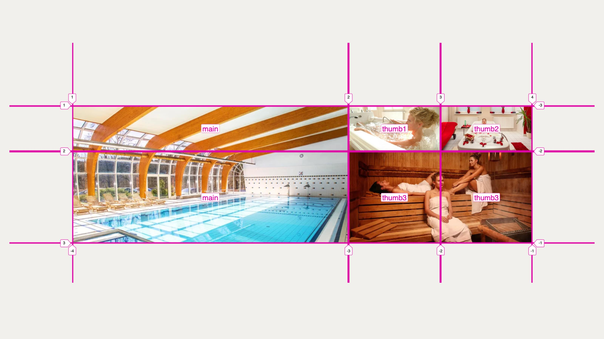

# Responzivní fotogalerie

V předchozí ukázce jsme poměrně intenzivně využili oblasti mřížky definované pomocí [`grid-template-areas`](css-grid-template-areas.md) a umísťované s [vlastností `grid-area`](css-grid-area.md).

Oblasti jsme zde využili hlavně pro zjednodušení a zpřehlednění kódu. V této ukázce u oblastí zůstaneme, ale jejich využití tady bude ještě intenzivnější a vliv na zpřehlednění kódu větší.

Zdrojem pro tuto ukázku je skutečná fotogalerie na Slevomat.cz. Podobnou jste určitě už viděli i jinde, nebo takovou dokonce sami kódovali.

<figure class="figure-thirds">

<figcaption markdown="1">
*Co takhle si po tom všem kódování dopřát wellness?*
</figcaption>
</figure>

Zadání je ale složitější – tentokrát budeme velmi intenzivně řešit responzivitu, různá zobrazení na různě velkých displejích.

<figure class="figure-thirds">

<figcaption markdown="1">
Tři breakpointy, tři různá rozvržení fotogalerie. Tohle asi kodérský wellness nebude, spíše galeje. (Že chybí čtvrtá fotka na tabletu? To není chyba, ale vlastnost.)
</figcaption>
</figure>

<div class="colored-box" markdown="1">

💻 Chcete si to zkusit sami? Forkněte CodePen a vzhůru do toho.

CodePen: [vrdl.in/p75na](https://codepen.io/machal/pen/bGqmQEx?editors=1100)

</div>
<!-- .colored-box -->

HTML bude vypadat takto:

```html
<div class="gallery">
  <div class="gallery-main-image">
    
  </div>
  <div class="gallery-thumb gallery-thumb-one">
    
  </div>
  <div class="gallery-thumb gallery-thumb-two">
    
  </div>
  <div class="gallery-thumb gallery-thumb-three">
    
  </div>
</div>
```

Obrázky, které v této galerii použijeme, musí být v poměru stran 2 : 1. V jiném případě tento layout nebude fungovat, respektive budete si jej muset upravit.

## Oblasti mřížky

V dalším kroku si spárujeme jednotlivé prvky HTML (nebo DOMu, chcete-li) s oblastmi gridu.

V CSS kódu to bude vypadat následovně:

```css
.gallery-main-image {
  grid-area: main;
}

.gallery-thumb-one {
  grid-area: thumb1;
}

.gallery-thumb-two {
  grid-area: thumb2;
}

.gallery-thumb-three {
  grid-area: thumb3;
}
```

Jak už víte, toto samo o sobě ještě nic nezařídí. Prohlížeč sice ví, kam chcete který prvek umístit, ale oblasti ani layout zatím nezná.

## Breakpointy

V příkladu jsem za vás pomocí [Media Queries](media-queries.md) definoval dva body zlomu (400 a 700 pixelů):

```css
@media (max-width: 24.9999em) { }
@media (min-width: 25em) and (max-width: 43.7499em) { }
@media (min-width: 43.75em) { }
```

Pojďme teď konečně zapracovat na jednotlivých rozvrženích. Mocně zde využijeme právě [zkratku `grid-template`](css-grid-template.md), o které už víte, že jsem si ji poměrně oblíbil.

## Layout na nejmenších displejích

Rozvržení pro nejmenší zařízení typu mobily na výšku bude vypadat takto:

```css
@media (max-width: 24.9999em) {
  .gallery {
    grid-template:
      "main main main"
      "thumb1 thumb2 thumb3" /
      1fr 1fr 1fr;
  }
}
```

Jde o mřížku 3 × 2, tři sloupce a dva řádky. Každý sloupec je stejně široký – `1fr 1fr 1fr` bychom samozřejmě mohli zapsat pomocí [funkce `repeat()`](css-repeat.md) jako `repeat(3, 1fr)`.

Výšku řádků bychom mohli definovat hned za oblastmi. Pokud ji neurčíme, spočítá se podle obsahu, takže má hodnotu `auto`, zde podle výšky obrázků. Jen pro pořádek uvedu odpovídající zápis s definicí výšky řádků layoutu:

```css
@media (max-width: 24.9999em) {
  .gallery {
    grid-template:
      "main main main" auto
      "thumb1 thumb2 thumb3" auto /
      1fr 1fr 1fr;
  }
}
```

Všimněte si klíčového slova `auto`, které přibylo na konci obou řádků.

Podstatné na této ukázce je ale umístění oblastí do mřížky:

- Oblast `main` zabírá první tři buňky mřížky, tedy celý první řádek.
- Oblastem `thumb1` až `thumb3` jsme přidělili jednotlivé buňky na třetím řádku.

Díky tomu, že jsem nejprve propojil elementy DOMu s oblastmi, nemusím nyní vůbec přemýšlet, jak vypadá moje HTML. Prostě umísťuji pojmenované oblasti do požadovaného rozvržení.

<div class="pbi-avoid" markdown="1">

## Layout na středních displejích

Pojďme rovnou na kód:

```css
@media (min-width: 25em) and (max-width: 43.7499em) {
  .gallery {
    grid-template:
      "main thumb1"
      "main thumb2" /
      2fr 1fr;
  }
  .gallery-thumb-three {
    display: none;
  }
}
```

</div>
<!-- .pbi-avoid -->

Tady musíme poslední náhled „vypnout“ pomocí `display:none`. Grafický návrh nám to káže.

Zde ale musím něco dodat, protože se ve mně staví na zadní odborník na rychlost webu: „Vypnutí“ obrázku pomocí `display:none` nezakáže prohlížeči obrázek stáhnout.

Kdybyste chtěli tento neduh vyřešit, možná si jako já vzpomenete na líné načtení obrázků. Pokud neviditelnému obrázku přidáme atribut a hodnotu `loading="lazy"`, prohlížeč jej v případě, že nebude viditelný, nestáhne. Více o této technice najdete na Vzhůru dolů. [vrdl.in/llo](https://www.vzhurudolu.cz/prirucka/lazy-loading-obrazku)

Samotný layout je tentokrát definovaný jako mřížka 2 × 2. První sloupec je dvoutřetinový (`2fr`), druhý zabírá zbylou třetinu prostoru (`1fr`).

Rozmístění oblastí `main`, `thumb1` a `thumb2` do buněk mřížky asi vidíte z „ASCII artu“. Hlavní fotka zabírá celý první sloupec, další dvě jsou vlevo pod sebou.

## Layout na větších displejích

Nyní k největšímu breakpointu. CSS kód vypadá takto:

```css
@media (min-width: 43.75em) {
  .gallery {
    grid-template:
      "main thumb1 thumb2"
      "main thumb3 thumb3" /
      3fr 1fr 1fr;
  }
}
```

Máme zde mřížku 2 × 3, dělenou na pětiny. Umístění oblastí do buněk gridu je asi zřejmé. V případě potřeby si je porovnejte s rozvržením z obrázků.

<figure>

<figcaption markdown="1">
*Vizualizace mřížky a jejích oblastí ve Firefoxu.*
</figcaption>
</figure>

A máme hotovo! Srovnejte si svá díla s mým CodePenem.

CodePen: [vrdl.in/7z6ky](https://codepen.io/machal/pen/bGqzwMy?editors=1100)
