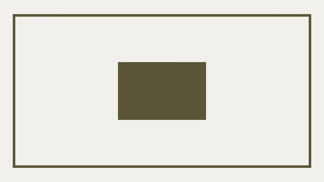

# Seznam ukázek

Jaké příklady spolu ve čtvrté kapitole nakódujeme?

-   
[Boční panel](priklad-sidebar.md)
-   
[Hromada lívanců](priklad-pancakes.md)
-   
[Svatý grál](priklad-holy-grail.md)
-   
[Responzivní fotogalerie](priklad-slevomat-gallery.md)
-   
[Mřížka z Bootstrapu](priklad-bootstrap-grid.md)
-   
[Centrování boxíků](priklad-centrovani.md)
-   
[Vyhledávací formulář](priklad-formular-vyhledavani.md)
-   
[Galerie bez Media Queries](priklad-photogallery.md)
-   
[Krkavčí technika](krkavci-technika.md)

Je dobré předem zmínit, že každý příklad obsahuje zadání i řešení. Pro potřeby učení CSS layoutu vám doporučím načerpat obsah první části, odložit knížku a zkusit si příklad nakódovat.
