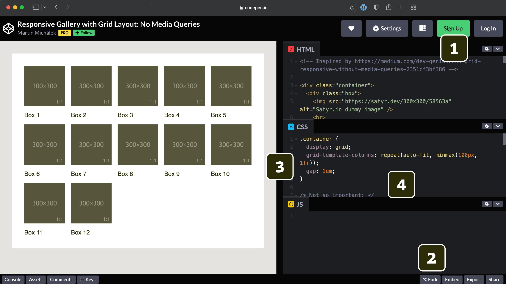
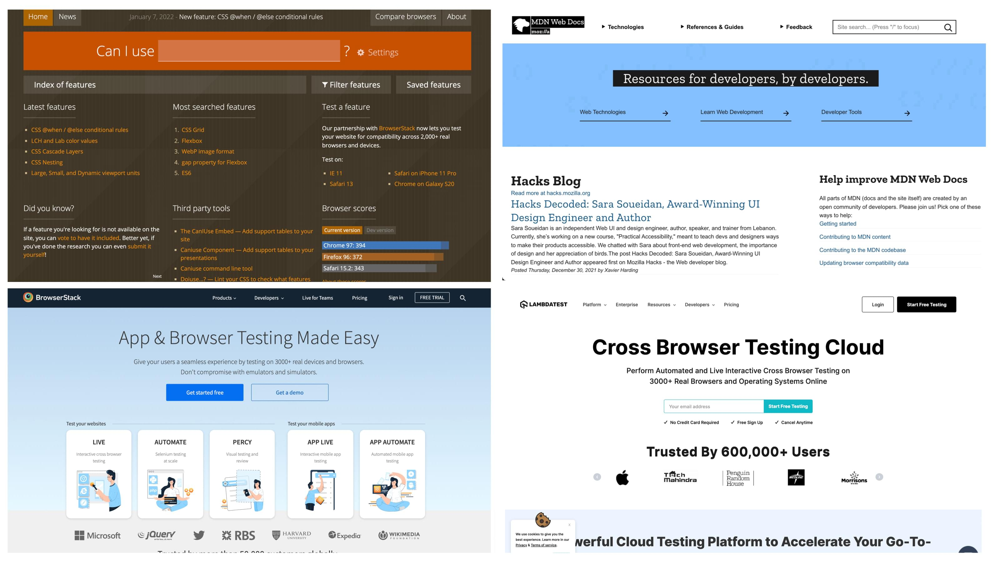

# Pro koho knížka je a jak ji číst?

V knížce jsem cílil na webové vývojáře všech úrovní – od začínajících a orientujících se v problematice až po profesionální specialisty na CSS.

Principy CSS layoutů by ideálně mohly být uložené v obecném povědomí také našich netechnických kolegyň a kolegů – z oblasti designu, grafiky, marketingu, produktového managementu a tak dále. Tentokrát je kniha vyloženě technická, ale věřím, že například v prvních dvou kapitolách si i tato skupina najde svoje.

### Co musíte umět?

Pro pochopení technických částí budete potřebovat alespoň základní znalost HTML a CSS. Text také vyžaduje hrubý přehled o moderních webařských technologiích a postupech. Pokud je to možné, vždy odkazuji na bližší vysvětlení ve zdrojích na webu nebo přímo v knížce.

### Jak knížku číst?

Ideální odpověď by mohla znít: „Slovo od slova, řádek po řádku. Od začátku do konce.“ Jenže takhle se technické knížky nečtou. A nebudu si hrát na to, že tahle by měla být výjimkou.

V prvních dvou kapitolách čtenářům postupně představuji téma, abychom se ve třetí dostali k vrcholu, který představují příklady použití CSS layoutů.

Pátá až devátá kapitola jsou už čistě referenční příručky. Budu moc rád, když si je pročtete – hlavně vy začínající. Ale myslím si, že do nich spíše budete nahlížet, když to budete potřebovat – až narazíte na vlastnost, kterou byste chtěli více pochopit.

Jedno ale doporučím všem – z každé kapitoly si poctivě přečtěte úvod a závěrečný kvíz. V tom druhém se zhruba dozvíte, jak jste na tom se znalostí problematiky. Nakonec třeba uznáte, že jsem netrávil čas zbytečně, když jsem se snažil, aby i referenční kapitoly měly při čtení hlavu a patu.

### CodePen: „Talk is cheap, show me the code“

Vy, kteří čtete moje články na Vzhůru dolů, víte, že ctím heslo, že ukázka je víc než tisíc slov. K tomuto účelu používám skvělý nástroj Chrise Coyiera a jeho týmu CodePen.

Mně samotnému spadla čelist, když jsem spočítal ukázky na CodePenech v téhle knize. Je jich na 170.

<figure>

<figcaption markdown="1">
*To je on, našich srdcí šampión. CodePen.*
</figcaption>
</figure>

Pokud chcete „peny“ zkoušet, což vám velmi doporučuji, udělejte prosím následující:

1. Zřiďte si na CodePenu účet. Je to zdarma a velmi jednoduché.
2. Moje CodePeny si „forkněte“, čili uložte kopii do vlastního účtu.
3. Responzivitu si emulujte v tomto rozložení a pohybem šoupátka ze strany na stranu.
4. Experimentujte s kódem dle libosti. Snažte se ho vylepšit nebo rozbít.

Takhle se naučíte nejvíc.

## Jak se v knížce stavím k podpoře v prohlížečích?

Pokud v následujících řádcích píšu o moderních prohlížečích, mám skoro vždy na mysli tyto tři a jejich poslední verze:

- Chrome od Googlu, což je nyní dominující prohlížeč na mobilech i desktopu.
- Safari od Applu, které se drží hlavně díky uzavřenosti ekosystému, ale s implementací podpory některých modernějších layoutů nespěchá.
- Firefox od Mozilly, což je výborný prohlížeč, ale dnes už bohužel jen s velmi malým tržním podílem v řádu jednotek procent.

Existuje ale ještě minimálně jeden. Pokud jste teď dlouhá léta neleželi v kómatu, nejspíš jej znáte. Až padne jeho jméno, pravděpodobně byste se do kómatu nejraději odebrali.

### Internet Explorer, (téměř) mrtvý prohlížeč

Knížku dopisuji v době, kdy už bych skoro nikomu nedoporučil podporovat při startu nového projektu prohlížeč Internet Explorer (MSIE) – jeho tržní podíl je v ČR kolem 1 % a strmě klesá.

Pak tady ale jsou už starší a existující projekty. Většina příkladů v knize je stavěná tak, aby v Exploreru přímo fungovala. U těch ostatních můžete použít techniky, které obecně zmiňuji. MSIE a podpoře ve starších prohlížečích se věnuji i v podkapitolách o jednotlivých vlastnostech. O podpoře gridu v MSIE píšu v [páté kapitole](css-grid-msie.md), o samotném Exploreru pak [v kapitole osmé](msie.md). Raději se ale zabývám novinkami než zombie prohlížeči.

### Spekulativní sázky na novinky

Během psaní knížky se objevila řada novinek, které ještě nemají plnou podporu v moderních prohlížečích, ale já to nevydržel a píšu tady o nich. Vždy jsem docela dlouho zvažoval, zda je zařadit, protože strašně nerad píšu o technologiích, které jsou sice cool, ale v praxi je použít nemůžete.

Takové [Container Queries](container-queries.md) sice mají zatím jen experimentální podporu v Chromu, ale mohutně se na nich pracuje, a pokud to klapne, zcela to změní způsob tvorby webových uživatelských rozhraní.

Dále jsem neodolal například u [subgridu](css-subgrid.md), který má zatím implementaci jen ve Firefoxu. Opět se ale zdá, že zájem o implementaci jeví všechny prohlížeče a že i tohle výrazně změní tvorbu layoutů.

### Jak hledat podporu a testovat ji

Prakticky každou vlastnost jsem v nějaké době testoval ve všech prohlížečích, ale znáte to – časy se mění a prohlížeče s nimi. Je tedy takřka jisté, že některé informace zde zestárnou.

<figure>

<figcaption markdown="1">
Tyhle weby mějte po ruce. Kdyby něco.
</figcaption>
</figure>

Doporučuji vám brát podporu v prohlížečích zmíněnou v knize jako orientační a doplnit ji ještě dalšími zdroji:

1. Vždy se dívejte na aktuální stav podpory na webech [CanIUse.com](https://caniuse.com/) nebo MDN ([developer.mozilla.org](https://developer.mozilla.org/)).
2. Testujte to. Buď v prohlížečích, které máte u sebe, nebo v cloudových službách, jako je [Browserstack.com](https://www.browserstack.com/) nebo [LambdaTest.com](https://www.lambdatest.com/).

A jsme na konci úvodu. Teď už vám jen přeji, ať se vám knížka líbí a naučíte se mnoho nového!
