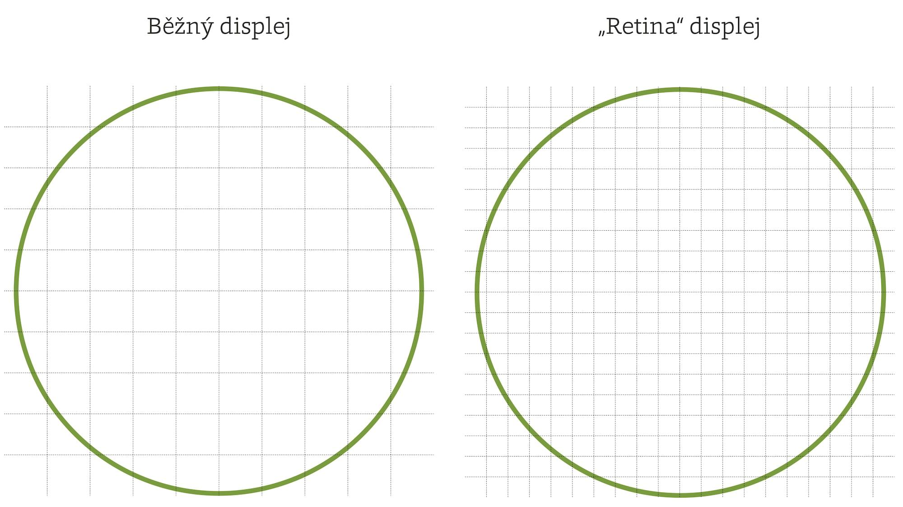

# CSS rozlišení 

Na školeních se stále setkávám se strachem mnohých webových tvůrců z ohromných rozlišení displejů posledních modelů mobilů. Výrobci dnes udávají až FullHD plochu pro zobrazování. To je 1920 × 1080 pixelů. Znamená to, že se na pětipalcových displejích budou weby zobrazovat stejně jako na velkých monitorech a budou jen zmenšené do trpasličí velikosti?

Netrapme se tím. Nás webové tvůrce totiž hardwarové rozlišení vůbec nezajímá. Prohlížeče jej pro nás přepočítávají do „CSS rozlišení“.

V tabulce na příkladu několika zařízení ukazuji hardwarové a CSS rozlišení vybraných modelů telefonů:

| Zařízení | Hardwarové rozlišení| CSS rozlišení |
| -------- | ------------------  | ------------- |
| iPhone 4 | 640 × 960 | 320 × 480 |
| Google Nexus 7 | 800 × 1280 | 604 × 966 |
| HTC One | 1080 × 1920 | 360 × 640 |
| Xiaomi Mi3 | 1080 × 1920 | 270 × 480 |

Vykreslení CSS rozlišení do hardwarového rastru pak obstarají samy prohlížeče.


## „Retina“ displeje

CSS rozlišení má naprostá většina dnešních mobilních zařízení a občas nějaký ten notebook. Většinou se tyto obrazovky označují jako „Retina“ displeje. To není úplně přesné, protože jde o marketingový název dnešních displejů na zařízeních Apple. Nepřesnosti mi ale nevadí. Hlavně, že si budeme rozumět.


## `px` je „CSS pixel“

CSS jednotka „pixel“ dříve vždy odpovídala hardwarovému pixelu, tedy skutečně fyzickému objektu. Dnes už to neplatí. `px` je „CSS pixel“, jednotka, která se na každém zařízení vykresluje do jiného počtu hardwarových pixelů. Detailní technikálie tady ale nejsou tak důležité jako důsledky. 


## Nesprávně vložená bitmapová grafika bude rozostřená

Dejme tomu, že jsme si v grafickém programu připravili obrázek kružnice. Odtamtud ji vyexportujeme ve výšce a šířce 10 pixelů do formátu PNG. Teď ji vložíme do stránky:

```html

```  

<figure>

<figcaption markdown="1">    
*Hustota hardwarových pixelů je na „Retina“ displeji násobně vyšší*
</figcaption> 
</figure> 

Na běžném displeji se soubor s obrázkem obsahující data pro 10 × 10 pixelů vykreslí do mřížky 10 × 10 hardwarových pixelů. Tady je svět ještě v pořádku. 

Jenže na „Retina“ displeji je potřeba vykreslit obrázek do mřížky 20 × 20. Tady vznikají problémy, protože prohlížeč má data jen pro poloviční počet pixelů. Druhou polovinu si tedy musí vymýšlet. Snaží se to dělat chytře, ale obrázek bude působit více či méně rozostřeně.


## Řešení: používejte SVG a responzivní obrázky

Řešením je používat co nejvíce vektorové grafiky. Ta neobsahuje konkrétní pixely, ale informaci o křivkách, které pak prohlížeč vykreslí dokonale ostře. Využívejte [formát SVG](responzivni-svg.md), o kterém píšu v kapitole o obrázcích. 

U fotografií a obecně bitmapových formátů (PNG, JPG…) je k dispozici více řešení. Píšu o nich [opět v kapitole o obrázcích](responzivni-obrazky.md).
