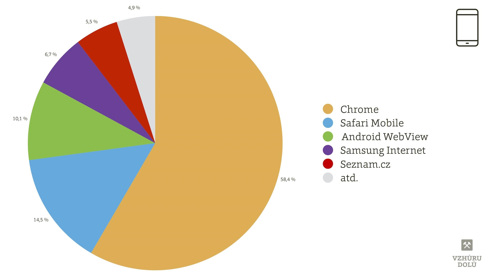

# Úroda prohlížečů

Podívejme se, jak to vypadá na trhu prohlížečů pro počítače a také jejich sourozence pro mobilní zařízení.

## Na desktopu: vede Chrome, staré Explorery vymřely

Když vezmeme trh počítačů, mezi prohlížeči už jednoznačně vede Chrome, následovaný Firefoxem a Explorerem 11. Opera, Safari nebo Edge to dotáhly na podíly jen v řádu jednotek procent. Explorery verzí 10 a starší už prakticky vymřely. A hlavně: prohlížečů je pořád docela hodně.

<figure>

<figcaption markdown="1">
*Obrázek: Podíl desktopových prohlížečů. Zdroj: Google Analytics pro weby cestovky Rekrea v červnu 2018*
</figcaption>
</figure>

## Mobilní zařízení: Chrome a Safari

Na mobilech musíme počítat s Google Chrome a Safari. Menší podíl mají další odvozeniny jádra Chromium, jako je Samsung Internet nebo Android Browser. U Samsungu ale čísla jen odhaduji, protože spolehlivé měření zatím nemáme. Ještě menší podíl pak vykazují Internet Explorery či Edge na platformách Windows Phone nebo Opera Mobile.

<figure>

<figcaption markdown="1">
*Obrázek: Podíl mobilních prohlížečů. Zdroj: Google Analytics pro weby cestovky Rekrea v červnu 2018*
</figcaption>
</figure>

Moc se neví, že na iOS se jádro Safari používá i v Google Chrome a všech dalších prohlížečích. Raději to zmíním už tady. Vykreslování tedy obvykle není potřeba na iOS kontrolovat v Chrome a zároveň Safari.

Ještě méně se ví o nástupu nových malých prohlížečů. Znáte například Samsung Browser? V Česku také nemůžete minout stále významnější prohlížeč od Seznamu.

Sledujte statistiky podílů prohlížečů ve vaší cílové skupině. Na Vzhůru dolů pak najdete aktuální čísla. [vrdl.cz/p/prohlizece](https://www.vzhurudolu.cz/prirucka/prohlizece)
