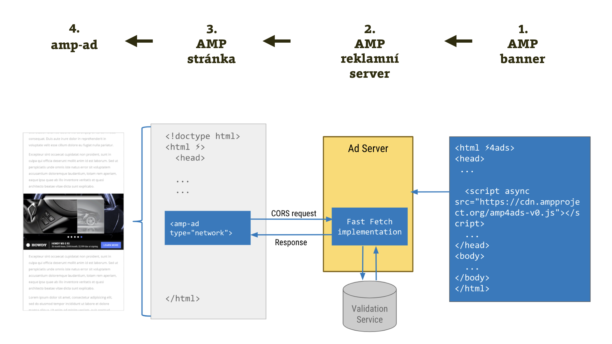

# AMP Ads: Jak mění AMP reklamu?

Ať se nám to líbí, nebo ne, reklama je aktuálně nejdůležitějším zdrojem příjmů pro větší obsahové weby. A reklamní systémy jsou závislé na JavaScriptu, který je v AMP na černé listině.

Je to bludný kruh, jehož výsledkem by mohlo být, že si velcí producenti obsahu nasazením této technologie podřežou už tak ne moc pevnou větev příjmů z webu? Nikoliv.

## Inovace v reklamě je jedním z velkých přínosů AMP

Zrychlovací technologie tohle samozřejmě řeší. A co víc – reklama je jednou z jejích „nejvypiplanějších“ oblastí.

Ať už si o „AMP propagandě“ myslíte, co chcete, následující citaci z webu amp.dev si prosím přečtěte:

> „Nemůžeme vylepšit web, pokud neopravíme reklamu. Dnešní reklama neplní své cíle, protože je pomalá, nepředvídatelná a rušivá.“

Kdo souhlasí, ať zvedne ruku. Jistě je to zbytečný tělocvik. Míra využívání různých blokovačů reklamy, jako je AdBlock, mluví za vše.

Jak řeší AMP reklamu?

* Reklamní systém požádá o zařazení mezi povolené systémy. Je ale potřeba samozřejmě splnit určité technické podmínky jako zabezpečený protokol nebo zamezení změn velikosti reklamní jednotky.
* Autoři reklamy si pak buď pomocí klasického HTML, nebo AMP připraví bannery.
* Autor obsahového webu si do stránky přidá bannerové pozice pomocí značky `<amp-ad>`.
* Technikálie kolem servírování pak obstarává AMP.

Reklama servírovaná pomocí této technologie je asynchronní, takže se na ni nečeká. Je tu navíc možnost neposílat do AMP stránek tradiční reklamu, ale vytvořit ji podle zcela nové specifikace – AMP Ads.

## AMP Ads: Nová specifikace pro tvůrce reklamních formátů

Vypadá to jako významný pokus o sjednocení snah o tvorbu rozumných reklamních jednotek, vycházející z hlavní filozofie AMP: Omezíme možnosti, poskytneme nástroje a nabídneme efektivnější výrobu a hlavně – rychlejší a celkově příjemnější uživatelský prožitek.

Co je to AMP Ads? Obrázek napoví.

<figure>

<figcaption markdown="1">
_Obrázek: Schéma fungování AMPHTML ad. Zdroj: [amp.dev](https://amp.dev/documentation/guides-and-tutorials/learn/intro-to-amphtml-ads)_
</figcaption>
</figure>

Vezměme graf trochu nezvykle zprava doleva:

1. Z pohledu tvůrce banneru jde o HTML dokument, který začíná zvláštním parametrem `<html ⚡4ads>`. K dispozici je také podmnožina AMP komponent. Detaily je možné najít ve specifikaci odkazované níže.
2. Reklama je umístěná na specializovaný reklamní server. Projde automatickou validací, kterou známe z AMP stránek. Následně je pomocí různých technických kejklí zaručujících rychlost dodána do stránky s reklamními pozicemi.
3. Zobrazení na AMP stránce se zajišťuje vložením značky `<amp-ad>`.

Výhoda AMPHTML ad je v tom, že v bodě 3 předchozího grafu vůbec nemusí být AMP stránka, ale běžný HTML web. Takže můžeme servírovat rychlou reklamu i na našich obyčejných responzivních webech.

Jak se to pak projeví na uživatelském prožitku? Když vyjdeme z papírových předpokladů, bude AMP reklama:

* _Výrazně rychlejší_  
Co do rychlosti stažení i následného vykreslování.
* _Datově úspornější_  
Namísto mnoha javascriptových měřících kódů běžných v současných reklamách je zde jen jeden, který měření distribuuje k jednotlivým systémům.
* _Koordinována_  
AMP runtime i zde centrálně řídí zobrazování. Například může vypnout animace, pokud je reklama mimo viditelný viewport.
* _Bezpečná_  
Zákaz vlastního JavaScriptu a automatická validace zajišťuje, že uživatele vašeho webu nebude trápit malware a podobné radosti současných reklamních systémů.

Asi vás bude zajímat více informací, že?

* Zde je úvod: [vrdl.in/ampadintro](https://amp.dev/documentation/guides-and-tutorials/learn/intro-to-amphtml-ads)
* Specifikace: [vrdl.in/ampadspec](https://amp.dev/documentation/guides-and-tutorials/learn/a4a_spec)

Pro techniky mezi námi nebude od věci ukázat výchozí HTML šablonu pro AMP Ad. Jsou zde hezky patrné rozdíly:

```html
<!doctype html>
<html ⚡4ads>
<head>
  <meta charset="utf-8">
  <title>Moje reklama</title>
  <meta name="viewport"
    content="width=device-width,minimum-scale=1">
  <script async
    src="https://cdn.ampproject.org/amp4ads-v0.js">
  </script>
  <style amp4ads-boilerplate>
    body{visibility:hidden}
  </style>
</head>
<body>
  <a target="_blank" href="https://example.com">
    <amp-img width="300" height="300"
        alt="…"
        src="banner.png">
    </amp-img>
  </a>
</body>
</html>
```

Vysvětlíme si to zajímavé:

* `<html ⚡4ads>` – určitě jste si všimli jiného typu dokumentu. I tady můžeme vynechat emoji a nahradit jej `amp4ads`.
* `amp4ads-v0.js` – přesně tak, tento formát má vlastní AMP runtime.
* `<style amp4ads-boilerplate>` – šablona AMP Ads má vcelku vtipné výchozí styly, že? Nápověda pro zvědavé: AMP Ads nutně potřebuje pro své zobrazení JavaScript.
* Může se vám také hodit informace, že vlastní CSS nemohou být větší než 20 kB.

Pro detailnější rozbor vás odkazujeme na tutoriál pro vytvoření reklamního banneru. [vrdl.in/ampadtut](https://amp.dev/documentation/guides-and-tutorials/start/create_amphtml_ad/)

## Které reklamní systémy lze v AMP stránkách používat?

Mezi podporovanými poskytovateli reklamních systémů najdeme i známá jména (AdSense, DoubleClick) nebo české společnosti jako iBillboard. Je jich opravdu hodně, takže se není potřeba bát, že vám přechod na AMP udělá čáru přes reklamní rozpočet. Celý seznam je na stránce „Supported Platforms, Vendors and Partners“. [vrdl.in/ampven](https://amp.dev/community/platform-and-vendor-partners)

Reklama na internetu ale není tak úplně doménou autora těchto řádků. Proto si vystačíme jen se stručným úvodem do této důležité oblasti, jež AMP pokrývá.

V dalším textu se podíváme na nové možnosti, které tato technologie nabídne e-mailům.
