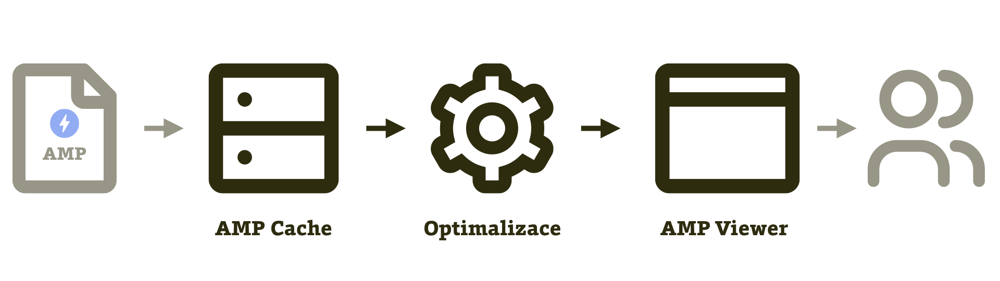
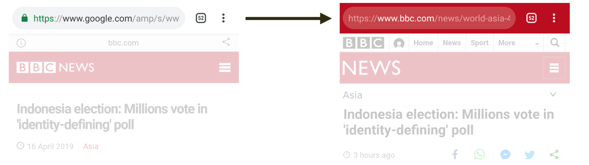

# AMP Cache, URL stránky a rychlost aktualizací

Teď se budeme bavit o úložišti pro AMP stránky, kam se stahují, aby byly blíž uživateli a zobrazovaly se mu [v AMP Vieweru](amp-viewer.md).

Kopie vaší AMP stránky je prostě stažená na adrese pod cizí doménou. Například:

```url
https://www-vzhurudolu-cz.cdn.ampproject.org/v/s/www.vzhurudolu.cz/amp/prirucka/grunt
```

Je to jeden z důležitých článků řetězce, který plní rychlostní cíle AMP. Mezipaměť AMP Cache kromě ukládání zařizuje další optimalizace stránky (jako by jich v AMP formátu nebylo dost, že?).

<figure>

<figcaption markdown="1">
_Obrázek: Než se AMP stránka dostane k uživateli, musí se uložit do serverové keše, projít optimalizacemi a po vyžádání uživatelem se zobrazit v zobrazovači AMP Viewer._
</figcaption>
</figure>

Cesta stránky z vašeho hostingu ke konzumentům obsahu vede přes tři důležité navigační body:

* _AMP Cache_  
Její součástí je optimalizované úložiště, které by mělo být blízko uživatele. Tohle oceníte obzvlášť v případech, kdy oslovujete mezinárodní publikum.
* _Optimalizace_  
Kód stránky je potřeba pro zobrazování z keše upravit. Za chvíli se dostaneme k tomu, co všechno vlastně AMP Cache upravuje.
* _AMP Viewer_  
Pomocník prohlížeče pro vykreslování AMP stránek. Více o něm píšeme [v následujícím textu](amp-viewer.md).

Teď ale přeskočme od účelu AMP Cache k jejím provozovatelům. V době psaní textu víme o třech.

## Bing a Cloudflare: Google není jediný „zloděj“ stránek

AMP stránky si k sobě stahuje také vyhledávač od Microsoftu – Bing. Jedna ze stránek dostupných z výsledků vyhledávání v AMP Vieweru od Microsoftu má například následující adresu:

```url
https://www.bing.com/amp/s/
  amp.usatoday.com/amp/2682535002
```

Dalším provozovatelem AMP Cache je Cloudflare, známý poskytovatel distribuční sítě CDN. Tím končí výčet míst, kam se _mohou_ ukládat naše AMP stránky.

Všimněte si důrazu na „mohou“. Nejde o zásah nejistého editora textu, ale o skutečnost.

### AMP Cache na Bing.com: Pro Česko většinou nezajímavé

Následující adresu například na Bingu v době psaní textu nenajdete:

```url
https://www.bing.com/amp/s/
  www.vzhurudolu.cz/amp/prirucka/http-2
```

Proč? Protože pro Bing není doména Vzhůru dolů zajímavá. A její provozovatel by rád přidal poznámku, že je to ke škodě společnosti Microsoft…

Teď ale vážně: Cílem těchto keší není „ukrást“ všechny AMP stránky světa a držet si je pod svou doménou. Dělají to jen u těch relevantních a pro sebe i uživatele zajímavých.

Na české mutaci Bingu jsme proto v době psaní textu nenašli skoro žádný odkaz na AMP stránku. Pokud ano, šlo o web světového, nikoliv českého média. A ke všemu – odkaz nevedl na Cache, nýbrž na AMP stránku na hostingu daného serveru. Už víte, že taková varianta je z pohledu kouzel, které Cache dělá, poměrně slabým čajem.

Vysvětlení je snadné: Pro Bing není český uživatel a celý český internet nijak zajímavý. Tady vládne Seznam a Google, _sorry_.

### Cache od Cloudflare: Pozoruhodná pro vývojáře

Jak víte, Cloudflare nevyvíjí vyhledávač, sociální síť ani jinou službu, která by vedla uživatele na cizí weby. Motivace tohoto poskytovatele serverové infrastruktury k vytvoření AMP Cache je tedy jiná než u Googlu nebo Microsoftu – cílí na další platformy a vývojáře z médií.

Představte si například, že jste technický šéf Twitteru. Máte to? Snad se v té pozici cítíte dobře…

A teď příklad úkolu, který řešíte: Na mobilním webu a v mobilní aplikaci Twitteru chcete zařídit UX stejného kalibru, jako si díky AMP dovoluje Google ve výsledcích vyhledávání. Skoro okamžité zobrazení odkazů na externí stránky.

Jak na to? Budování vlastní AMP Cache je drahé a využití těch od Microsoftu nebo Googlu pro vás není strategicky výhodné. Jsou to konkurenti, že ano. Můžete ale sáhnout po nezávislé Cache. Nejspíš se tedy, jako novopečený technický šéf Twitteru, přidáte k zákazníkům Cloudflare.

Cache od Cloudflare navíc disponuje inovativními vlastnostmi. Umí například vést uživatele automaticky z jedné AMP stránky na další AMP. Je dobré na tomto místě zmínit, že jinak uživatelé z první AMP stránky přecházejí na běžný web.

Tolik k provozovatelům Cache. Bude jich nejspíš přibývat, ale doporučujeme vám dobře nastudovat si ty stávající, hlavně tu od Googlu. Přidáváme ještě odkazy k dokumentaci:

* Google: [developers.google.com/amp/cache](https://developers.google.com/amp/cache/)
* Bing: [bing.com/webmaster/help/bing-amp-cache-bc1c884c](https://www.bing.com/webmaster/help/bing-amp-cache-bc1c884c)
* Cloudflare: [amp.cloudflare.com](https://amp.cloudflare.com/)

Seznam všech provozovatelů AMP Cache máte k dispozici v následujícím souboru: [ampproject.org/caches.json](https://cdn.ampproject.org/caches.json). Může se vám hodit, když budete potřebovat aktualizovat obsah.

## A co ta ošklivá URL pod Google.com?

Tady se musíme vrátit k URL adrese AMP stránky, která jistě v mnohých z vás vyvolala alergickou reakci.

V předchozím textu jste se dozvěděli, že kromě adresy původního dokumentu na vaší doméně sídlí stránka ještě na jiných.

URL pro AMP Cache:

```url
https://www-vzhurudolu-cz.cdn.ampproject.org/
  v/s/www.vzhurudolu.cz/amp/prirucka/http-2
```

URL pro AMP Viewer:

```url
https://www.google.com/amp/s/
  www.vzhurudolu.cz/amp/prirucka/http-2
```

Na první adresu uživatel běžně nenarazí, ale je to URL, kde reálně dokument najdeme. Na druhé se zobrazuje uvnitř `<iframe>` v AMP Vieweru a takto je i viditelná uživatelům.

Co když bude adresu z AMP Vieweru někdo sdílet například uživateli sedícímu u počítače? Nic se nestane, Viewer umí přesměrovávat na původní kanonickou adresu:

```url
https://www.vzhurudolu.cz/prirucka/http-2
```

### Není principiálně špatně mít stránky na cizí doméně?

Pro mnohé může být. Někteří uživatelé mohou váhat, zda jsou opravdu na vašem webu, pokud adresa začíná na `google.com/amp`. Jindy to zase může škodit – weby šířící lživý obsah mohou důvěru umístěním na Google.com naopak získat.

Jak také upozorňuje bezpečnostní expert Michal Špaček, phishingovým podvodům, využívajícím vzhled známého webu, jen na cizí doméně, to může usnadňovat život: „Web s falešným loginem do Googlu bude těžší rozeznat od toho skutečného jen podle adresy, protože domény budou podobné a významně lišit se bude až kousek URL adresy daleko za doménou.“

Řešení problému je na cestě, ale zatím se to u většiny webů AMP vyřešit nedá. [AMP Viewer](amp-viewer.md), který má na starosti zobrazování těchto stránek, se snaží nevýhodu potlačit přidáním lišty s odkazem na původní adresu. To je vidět hned na dalším obrázku.

### Signed HTTP Exchanges

Tuto nevýhodu by měly řešit nový standard a Signed HTTP Exchanges (SXG), který je součástí širšího návrhu Web Packaging. SXG umožňuje publikování vašeho obsahu na cizím serveru a dovoluje prohlížeči zobrazit vaši URL adresu.

<figure>

<figcaption markdown="1">
_Obrázek: Výhody AMP Cache na vlastním URL? To nezní špatně. Zdroj: [Cloudflare](https://blog.cloudflare.com/announcing-amp-real-url/) _
</figcaption>
</figure>

To je novinka od dubna 2019. Zatím není dostupná všem, ale vypadá velmi zajímavě. Na druhou stranu: Toto řešení zatím nelze považovat za hotové a připravené k nasazení kdykoliv a kdekoliv. Standard SXG například  čelí kritice ohledně bezpečnosti ze strany Mozilly, která jej v době psaní označuje za „škodlivé“ na svých stránkách „Specification Positions“, kde se vyjadřuje k novým standardům. [mozilla.github.io/standards-positions/](https://mozilla.github.io/standards-positions/)

Relativně jednoduchou možnost implementace této vlastnosti nabízí Cloudflare v rámci služby „AMP Real URL“, kterou začíná poskytovat v době psaní textu. [vrdl.in/ampreal](https://blog.cloudflare.com/announcing-amp-real-url/)

Zájemce o více technických informací směrujeme na podrobnější text na Root.cz. [vrdl.in/signedhttp](https://digichef.cz/signed-http-exchanges-aneb-vyuzivejte-amp-s-originalni-url)

A teď skáčeme zpět k naší milé AMP Cache.

## Co vlastně Cache dělá?

Je dobré vědět, že cache se nespokojuje s dodanou AMP stránkou, ale dál ji upravuje.

* Čistí HTML: Hledá neuzavřené HTML tagy pro zabránění XSS útoků, odstraňuje komentáře nebo bílé znaky uvnitř tagů.
* Zpracovává obrázky: Zmenšuje příliš velké, odstraňuje z nich zbytečné hlavičky, konvertuje vše, co může, do úsporného formátu WebP ([vrdl.cz/p/webp](https://www.vzhurudolu.cz/prirucka/webp)), občas také snižuje kvalitu nebo generuje „`srcset` varianty“ ([vrdl.cz/p/srcset-sizes](https://www.vzhurudolu.cz/prirucka/srcset-sizes)).
* Vkládá „`prefetch` značky“, které urychlují stažení obsahu z cizích domén: Například `<link href="https://fonts.gstatic.com" rel="preconnect">` při detekci vložení webfontu z distribuční sítě Googlu.
* Přednačítá komponenty AMP.
* Minifikuje HTML a CSS.
* Může také předrenderovávat webové stránky na pozadí.

Před tím vším ovšem stránku validuje. Pokud ta totiž není platná podle AMP specifikace, máte smůlu – žádné umístění v keši nedostanete a uživatelé budou posíláni „postaru“ na vaši standardní HTML stránku. I [validaci](amp-validace.md) se budeme věnovat, žádný strach.

K dispozici je veřejně a volně dostupná implementace úprav, které AMP Cache dělá. O ní si teď něco povíme.

### AMP Optimizer

Je to software, který provádí výše uvedené úpravy AMP stránek. Je napsaný hlavně pro tvůrce dalších AMP Cache. Mezi ty se ale asi ještě počítat nebudeme, že?

Pro vás může být Optimizer zajímavý, pokud se rozhodnete nechat zobrazovat AMP stránky přímo z vašeho hostingu, například když chcete na AMP [postavit i běžnou verzi webu](amp-implementace-jen-amp.md). Více o AMP Optimizeru: [vrdl.in/ampoptimizer](https://github.com/ampproject/amp-toolbox/tree/master/packages/optimizer).

Znovu se ale vraťme ke keši. Tentokrát k té, která nás v české praxi zajímá nejvíce, AMP Cache od Googlu. Zůstala nám tady jedna nezodpovězená otázka. Jako bychom vás slyšeli: „Tohle všechno je hezké. Ale co když udělám změnu na stránce – jak dlouho budu čekat na aktualizaci AMP Cache?“

## Aktualizace kopie stránky v Cache: Obvykle jen pár minut

Klasik praví, že kešování je v IT největší problém všech dob, ale v případě AMP nám to zase tak tragické nepřipadá.

Asi víte, že aktualizace vašeho záznamu ve výsledcích vyhledávání Googlu může trvat dny až týdny. To se však rozhodně nevztahuje na AMP Cache.

AMP Cache od Googlu používá model „stale-while-revalidate“. Když uživatel navštíví zastaralou kešovanou kopii, na pozadí se vyvolá stažení nové verze. Starou verzi tak v nejhorším případě vidí vždy několik málo uživatelů.

Mezipaměť považuje dokument za čerstvý po dobu minimálně 15 vteřin. Ostatní zdroje jako obrázky nebo webfonty po dobu jedné minuty. AMP Cache se navíc řídí kešovacími hlavičkami, jako je `max-age`. Ze strany provozovatelů AMP Cache je zde tedy snaha o snížení zátěže na server vydavatele kvůli neustálému obnovování mezipaměti.

Prakticky vzato: Když dělal Martin testy se změnou v článcích Vzhůru dolů, aktualizovaná verze se objevila nejpozději za minutu až dvě. Ale i to může být pro některé z vás příliš dlouhý interval. Pak je tu ještě možnost vynucené aktualizace.

### Aktualizace na vyžádání

Provedete ji dotazem podobným tomu následujícímu:

```url
https://example-com.<cache.updateCacheApiDomainSuffix>/
  update-cache/c/s/example.com/article?amp_action=flush
  &amp_ts=<ts_val>&amp_url_signature=<sig_val>
```

Je potřeba mít vygenerovaný RSA klíč pro podepisování automatizovaných výzev k aktualizaci. Jinak na tom ale není nic složitého. Více informací najdete na [google.com/amp/cache/update-cache](https://developers.google.com/amp/cache/update-cache).

AMP Cache teď opustíme a podíváme se na software, který s keší velmi souvisí – zobrazovač AMP, známý též jako AMP Viewer.
