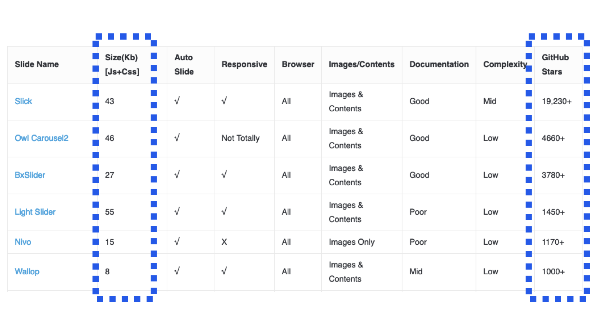

# AMP, framework pro tvorbu webů

AMP nabízí ke dnešku kolem stovky komponent, které by měly plně stačit na vše, co potřebujete na běžných obsahových webech nebo e-shopech.

Komponenty pokrývají tvorbu layoutu, multimédia (např. YouTube přehrávač), komponenty rozhraní (karusely, navigace), dynamický obsah (stahování informací z API), animace, ale také nepostradatelnou analytiku a reklamu. Více o nich píšeme v dalších textech [kapitoly o komponentách](amp-komponenty.md).

## Konec s plněním všech klientských přání

Od každého typu je v AMP k dispozici jen jedna komponenta. Jeden karusel, jeden typ navigace, jeden způsob vložení YouTube videa…

Když chcete do AMP stránky vložit karusel, vypadá to zhruba takto:

```html
<amp-carousel width="450" height="300">
  <amp-img src="obrazek1.jpg" alt="…"
    width="450" height="300"></amp-img>
  <amp-img src="obrazek2.jpg" alt="…"
    width="450" height="300"></amp-img>
</amp-carousel>
```

Přidáte javascriptovou knihovnu a je to. Karusel má už výchozí vzhled i chování. Je ale možné jej nastavovat a používat v různých obměnách. Což je však výhoda i nevýhoda AMP komponent zároveň – máte možnost použít pouze jednu. Není to až moc omezující?

Pokud se pohybujeme v zastarávajícím, ale stále existujícím světě knihovny jQuery a jejích pluginů, můžeme si vybrat mezi desítkami různých karuselů. Však to také vidíte z obrázku. A vidíte i to, o jak velké soubory jde.

<figure>

<figcaption markdown="1">
_Obrázek: Porovnání velikost jQuery karuselů. Ty nejmenší prostě nejsou nejpopulárnější. Hádejte proč. Zdroj: [voidcanvas.com](http://voidcanvas.com/20-best-jquery-slidercarousel-plugin-comparison-with-demo/)_
</figcaption>
</figure>

Velikost populárních knihoven má svůj důvod. Vývojáři obvykle pracují na několika různých webech, které mají různé požadavky na ztvárnění karuselu. Někde klient potřebuje zvláštní verzi obrázku pro mobily, někde navigaci po obrázcích, někde zase něco jiného.

Vývojář si samozřejmě chce vybrat _robustní_ řešení. Takové, které bude moci využít na všech webech. Snaží se tak optimalizovat svůj čas i peníze klienta.  

Nejpopulárnější z karuselů, Slick, má heslo „the last carousel you'll ever need“, poslední karusel, který kdy budete potřebovat. Jenže v takřka 90 kilobajtech zdrojového kódu stahují uživatelé jednoho webu i to, co potřebují uživatelé jiného webu. Přitom hlavní poučka pro výkon webu zní: nestahuj a nespouštěj, co v daném kontextu uživatel nepotřebuje.

Ohromné možnosti, které dnešní webové technologie nabízejí, nás tady dovedly do těžkých dilemat mezi efektivitou a rychlostí. Ano, vývojář může napsat karusel na míru daného projektu. Bude malinký a rychlý. Ale zaplatí mu klient tuhle práci?

Zdrojový kód komponenty `amp-carousel` má kolem 10 kilobajtů. Některé pokročilé věci neumí, ale ty základní má vymyšlené dost dobře na to, aby byl použitelný. A rychlý. Zeptejme se sami sebe: Potřebujeme na každém webu desítky specifických funkcí karuselu? (Neptáme se, zda vůbec potřebujeme karusely, to by bylo na zvláštní knížku.)

Možnosti AMP komponent jsou omezené, takže pokud by chtěl klient rychlý web s AMP a zároveň karusel na míru, bude si muset vybrat jen jedno z toho.

Je to omezující? Je-li pro vás nejvyšší hodnota v plnění cílů webu pomocí uživatelské přívětivosti a rychlosti, pak nikoliv.

Weby jistě nepotřebují desítky typů karuselů, stovky lightboxů a desítky různých způsobů otevírání navigace na mobilech. Nebo jinak – investici vloženou do výběru nebo tvorby řešení na míru nepovažujeme u těchto komponent vždy za efektivní.

I když se zkrátka v tomhle mohou naše názory shodovat, zároveň víme, že právě tady bude prosazování AMP u velké části klientů nemálo bolet.

Tam, kde se to povede, se však stane tvorba rozhraní daleko přímočařejší, a tedy i efektivnější.

Když už jsme u filozofičtějšího pohledu na výběr komponent, pojďme ho rozšířit ještě na celý náš obor. Není náhodou webdesign už trochu moc komplexní? A nezačíná nám ta složitost probublávat do nízké kvality výstupů, třeba právě na úrovni výkonu webu?
