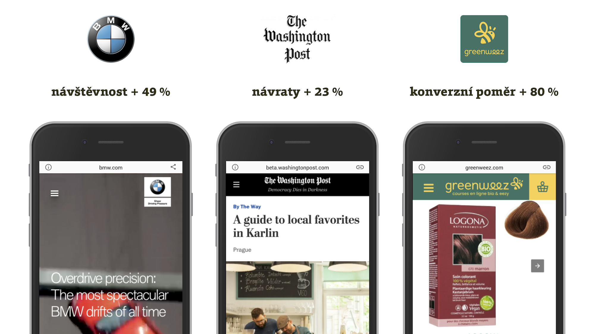
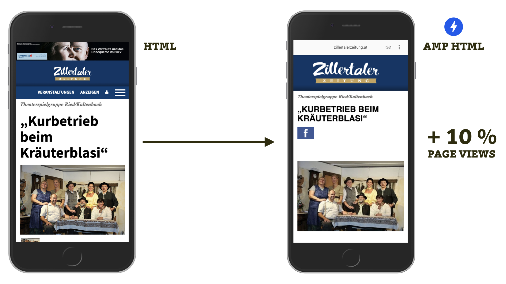

# Co přineslo firmám nasazení AMP?

Podívejme se na několik případových studií úspěšného nasazení [AMP](amp.md).

Předností zrychlovací technologie je zrychlení webů, to víme. A víme i to, že zrychlením webu můžeme zvýšit jeho úspěšnost při plnění obchodních nebo jiných cílů.

Už jsme se rovněž dozvěděli, že Google a další dodavatelé návštěvnosti používají rychlost jako jeden ze signálů kvality webu. Je tedy možné očekávat, že se správně nasazená a měřená AMP stránka nějak pozitivně projeví v číslech. A to si pište, že projeví.

<figure>

<figcaption markdown="1">
_Nasazení AMP pomohlo obsahovým webům slovutných značek, velkým novinám i e-shopům._
</figcaption>
</figure>

Zaměřme se teď na jednotlivé případové studie.

## BMW.com: AMP jako urychlovač vstupu na plnohodnotný web a o 49 % vyšší návštěvnost {#BMW}

BMW.com nasadilo AMP na novém hlavním webu. Slouží k urychlení vstupu do plnohodnotného webu vyrobeného pomocí přístupu PWA (progresivní webová aplikace). Vývoj trval šest měsíců a poté naměřili troj- až čtyřnásobně vyšší rychlost webu a díky tomu kromě jiného o 49 % vyšší návštěvnost z vyhledávačů.

## The Washington Post: snadný vývoj s AMP {#the-washington-post}

The Washington Post, velké americké noviny, nasadily AMP už v polovině roku 2015. Jejich webový tým tím podle případové studie zajistil o 88 % rychlejšího načtení webu (v průměru se dostanou na 400ms načtení). Zajímavý je také 23% nárůst mobilních uživatelů, kteří se k nim během týdne vraceli, když předtím ve vyhledávači viděli některou z AMP Stories.

David Merrell, Senior Product Manager z těchto novin, se v případové studii navíc nechal slyšet, že začít pracovat s AMP bylo snadné, protože je postaveno na tradičních webových technologiích.

## E-shop Greenweez: 5× rychlejší web za dva měsíce práce {#greenweez}

Greenweez, francouzský online prodejce ekovýrobků, získal nasazením AMP dokonce pětinásobné zrychlení mobilního uživatelského prožitku. Před nasazením AMP dosahoval konverzní poměr na mobilech pouhé čtvrtiny desktopové hodnoty. V Greenweez předpokládali, že je to mimo jiné pomalým načtením webu, které v té době zabralo v průměru 10 vteřin.

Na začátku roku 2017 AMP nasadili na produktové stránky a následně na šablonu výpisu produktu v kategoriích. Už v dubnu téhož roku tvořily přístupy přes AMP téměř polovinu celé návštěvnosti webu. Dále ještě uvádějí 80% zvýšení konverzního poměru na mobilech a snížení nákladů na akvizici mobilního uživatele o 66 %. CEO firmy, Simon Le Fur, přitom v případové studii akcentuje, že to celé bylo snadné – migrace na AMP jim trvala jen dva měsíce.

<!-- AdSnippet -->

Případové studie z celého světa a různých oborů činnosti najdete na [amp.dev/success-stories](https://amp.dev/success-stories/).

## Dopady na marketing ve vyhledávačích

Zajímavou případovou studii, navíc z nezávislého zdroje, nabízí analýza 26 webů AMP od Stone Temple. Změny v metrikách chování uživatelů v přirozených výsledcích vyhledávání na mobilech byly oproti běžným webům následující:

* Přístupy uživatelů na web se zvedly o 27 %.
* Zobrazení stránek ve výsledcích bylo o 34 % více.
* Míra prokliku vzrostla o 15 %.

Celý text „Does AMP Improve Rankings, Engagement, and Conversion?“ je na [vrdl.in/ampstone](https://www.stonetemple.com/amp-impact-on-rankings-conversions-engagement/).

## Jak je to v Česku a na Slovensku?

Vývoj v našich zemích sledujeme dlouhodobě a máme radost, že v době psaní tohoto textu, v květnu 2019, je možné uvést docela dost velkých příkladů nasazení:

* Mezi obsahovými weby je například _Reflex.cz_, anebo _Seznam Zprávy_ či _ProŽeny.cz_ z dílny Seznam.cz.
* Z větších e-shopů je to například _Lékárna.cz_, cestovka _Relaxos.cz_, s technologií ale experimentuje i _Alza.cz_.

V Česku se o číslech, která produkují AMP stránky, příliš nemluví. Pokud ano, zapomíná se odfiltrovat nasazení AMP od dalších vlivů nebo se dělají jiné chyby v měření. Čest výjimkám, kterých je ale velmi málo.

<figure>

<figcaption markdown="1">
_AMP verze Zillertaler Zeitung zvýšila počet zhlédnutých stránek o jednu desetinu. Autorem je české studio [Creox.cz](https://www.creox.cz/)._
</figcaption>
</figure>

Čísla ze světových případových studií jsou působivá, že ano? Ale není se čemu divit. [Už dlouho víme](rychlost-nacitani-proc.md), že razantní zrychlení webu má vliv prakticky na všechny klíčové obchodní ukazatele. [AMP](amp.md) navíc ve zvyšování rychlosti načtení webu těžko hledá konkurenci.

Máte už nasazení AMP za sebou a rádi byste se pochlubili čísly? Neváhejte napsat do komentářů nebo se zmínit [e-mailem](mailto:martin@vzhurudolu.cz).

I přesto je zajímavé projít si české AMP weby a zamyslet se nad tím. V knížce se tuzemským zástupcům věnujeme více v kapitole [o webech, které AMP nasadily](4-uvod.md).

Teď už se ale pojďme zaměřit na to, jak tahle technologie přesně funguje.

<!-- AdSnippet -->
