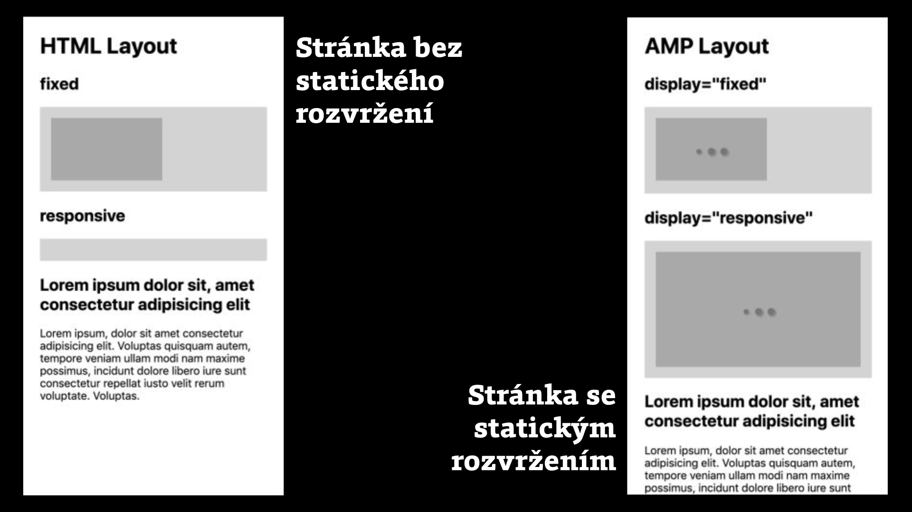

# Upravené fungování prohlížečů

Pokud bychom chtěli aplikovat na současné weby stejný způsob distribuce jako u AMP – tedy nahrání do Cache a například také přednačtení –, chyběly by nám kromě už uvedeného určité vlastnosti prohlížečů. Zde udáváme nejdůležitější tři.

## Statický systém rozvržení

Pokud stojíte o přednačtení stránky, musíte co nejpřesněji a nejrychleji vědět, jak bude cílový dokument vypadat.

Nemělo by se vám například stát, že cílový dokument bude vyžadovat velké externí CSS. Čekalo by se pak na dotaz na server a stažení do prohlížeče – prostě by to bylo pomalé. Proto AMP vynucuje vkládání stylů přímo do HTML dokumentu.

U externích prvků, jako jsou obrázky, mapy, videa a další, zase potřebujete znát prostor, který v layoutu cílové stránky zaberou. Jinak se vám stane, že přednačtete špatnou verzi rozvržení stránky. Očima uživatele by prostě po stažení stránky došlo k nechtěným překreslením, způsobujícím poskakování obsahu.

<figure>

<figcaption markdown="1">
_Obrázek: Všechny prvky v AMP mají statický layout, takže prohlížeč (za pomocí knihovny AMP runtime) přesně ví, jaký prostor jim má ve stránce ponechat._
</figcaption>
</figure>

Například následující prvek drží v layoutu prostor o poměru stran 4 : 3, i když se obrázek dosud nestáhl:

```html
<amp-img alt="Obrázek" src="obrazek.jpg"
  width="400" height="300" layout="responsive">
</amp-img>
```

[Systém layoutu](https://docs.google.com/document/d/1_YjH3UxCrJAd9KTH0laO5YXMaFTv3hD7zkVP3fwMJhw/edit#heading=h.cy8vp2n39jw6) rozepisujeme v samostatném textu.

## Pořádek v prioritách

Prioritizace stahování externích zdrojů není v současných prohlížečích – diplomaticky řečeno – dokonalá.

Na různé způsoby stahování a spouštění JavaScriptu nemají jednotný pohled ani autoři prohlížečů, natož pak weboví vývojáři. Webové fonty, kritické pro zobrazení stránek, se vám klidně začnou stahovat až po posledním obrázku z patičky stránky… Co vám budu vykládat, dobré to rozhodně není. Pracovat s tím z pozice vývojáře nebo vývojářky nějak jde, ale opět potřebujete docela dost znalostí, pokusů a omylů.

AMP řeší prioritizaci lépe, což si ale kromě jiného vynutilo zapomenout na všechny běžné HTML prvky vkládající externí obsah, jako je ``, `<video>`nebo `<iframe>`.

Ty všechny totiž mají problém s udržením statického layoutu (hlavně v responzivním designu). A také se prohlížečům špatně vysvětluje, aby nezačaly okamžitě stahovat nalinkované externí zdroje, což je třeba u obrázků opravdu nepříjemné, protože tím automaticky dostanou přednost před jinými, důležitějšími prvky.

Nechápejte nás ale špatně. Obrázky, videa, „ajfrejmy“ a další prvky v AMP máme. Ovšem jako specifické komponenty. No a díky tomu, že některé prvky byly v AMP vymyšleny nanovo, mohli k nim jeho autoři přidat i další vlastnosti, které v prohlížečích postrádali. Jako třeba tu následující.

## Odložené načtení

Lazy loading je technika, která odloží stažení externích prvků až do chvíle, kdy je uživatelé potřebují, protože k nim posunuli stránku nebo provedli jinou související akci.

V AMP jsou odloženě stahovány všechny externí prvky počínaje obrázkem (komponenta `amp-img`) a reklamou konče (`amp-ad`), nebo vkládaným rámem (`iframe`). Ušetří to dost zbytečně stahovaných dat.

Více informací o odloženém načtení najdete samozřejmě zase na Vzhůru dolů. [vrdl.cz/p/lazy-loading](https://www.vzhurudolu.cz/prirucka/lazy-loading)

## Něco už se dostává do prohlížečů a často tomu pomáhají autoři AMP

Je správné zdůraznit, že všechny zde zmíněné inovace jsou v plánu i v rámci „běžného“ HTML:

* S prvními náznaky statického layoutu přichází návrh standardu pro atribut vnitřních rozměrů prvků: ``  
[googlechrome.github.io/samples/intrinsic-size/](https://googlechrome.github.io/samples/intrinsic-size/)
* Pořádek v prioritách řeší například vývojáři prohlížeče Chrome ve studiích, na které se odkazujeme v textu „Priority v JavaScriptu“.  
[vrdl.cz/p/js-priority](https://www.vzhurudolu.cz/prirucka/js-priority)
* V době, kdy tento text čtete, je už odložené načtení pravděpodobně dostupné nativně, alespoň v některých prohlížečích: ``  
[addyosmani.com/blog/lazy-loading/](https://addyosmani.com/blog/lazy-loading/)

Říkáme-li „A“, musíme přidat také ono pověstné „B“. Všechny tyto standardizované vlastnosti zatím nejsou a dlouho nebudou ve stavu, který je potřebný pro AMP – ať už z pohledu podpory v prohlížečích, nebo šíře možností specifikace.

Nicméně – je výborné, že se osvědčené postupy dostávají do prohlížečů, kam také patří. V ideálním světě (kam doufám směřujeme) AMP nemusí uvedené body řešit, protože jsou dobře vymyšlené už na úrovni prohlížečů.

Snad jsme vás hned ze startu neunavili a předali vám tu hlavní informaci:

AMP je nová distribuční cesta a framework pro snadnější tvorbu rychlých webových stránek.

Ale počkejte… opravdu se musí týkat jen _stránek_?
