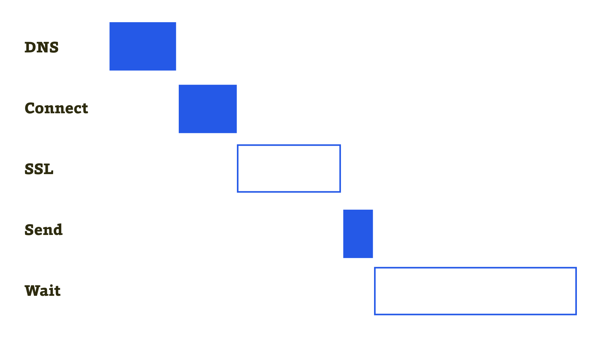
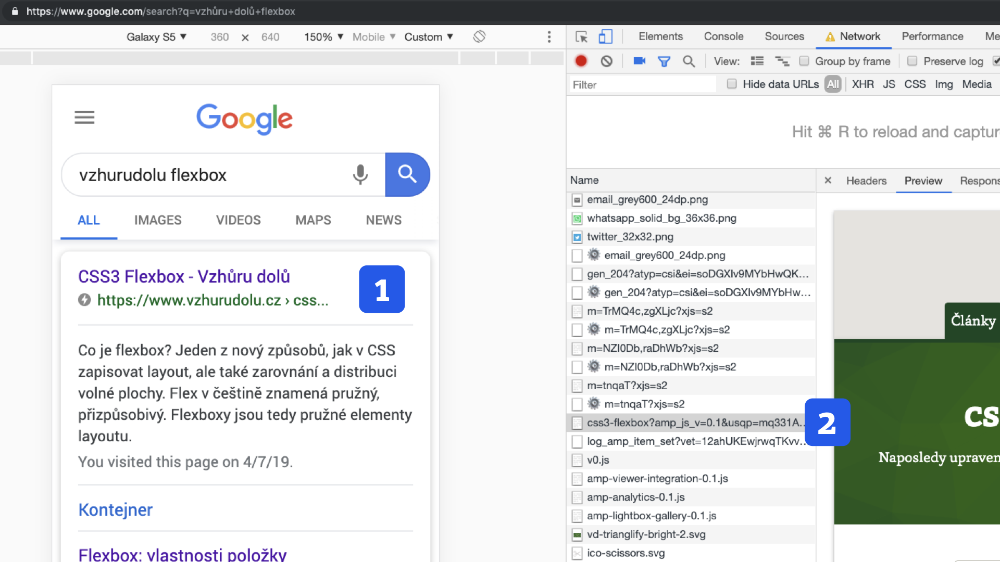

# AMP, rychlost především

Jak dostat rychlost vykreslení jakéhokoliv webu z vteřin na požadované nízké stovky milisekund, abychom se dostali do mezí lidského vnímání „okamžitého zobrazení“? AMP stránce se to může za jistých okolností podařit.

Když se začal Martin zajímat o AMP, změřil rychlost zobrazení několika stránek vyrobených touto technologií po přednačtení ve výsledcích vyhledávání, které jim je poskytnuto po splnění řetězce podmínek.

Výsledky porovnal s běžným webem. U všech stránek to bylo stejné:

<figure>

|                | Běžný web | AMP po preload |
|----------------|----------:|---------------:|
| Cuketka.cz     | 13 s  | 0,16 s |
| VzhuruDolu.cz  | 4,4 s | 0,24 s |

<figcaption markdown="1">
_Tabulka: Porovnání metriky Speed Index pro články na obou webech. Měřeno pomocí WebpageTest na rychlosti „3G Slow“._
</figcaption>
</figure>

Výsledky v řádu nízkých stovek milisekund jsou fantastické, s běžnými weby na ně ale prakticky nelze dosáhnout. Proč? I o tom je tato knížka.

Dřív než se podíváme na způsoby, kterými AMP takové zrychlení zajišťuje, musíme vás upozornit, že „AMP = rychlost“ neplatí vždy a všude. Některé AMP stránky se mohou v některých zobrazovacích kontextech vykreslovat ještě pomaleji než původní web. Obvykle si za to ale mohou autoři webů sami – píšeme o tom [v textu o častých mýtech kolem AMP](amp-kritika-myty.md). Bylo by tedy férovější říkat: „AMP = všechny předpoklady pro rychlý web“.

## Co je to tedy AMP?

Je to HTML, CSS (a trochu i javascriptový) framework určený ke zrychlení načtení webových stránek díky jejich specifické distribuci.

<figure>

<figcaption markdown="1">
_AMP jsou dvě věci. Frontendový framework a specifická distribuce – rozmístění stránek po optimalizovaných serverech._
</figcaption>
</figure>

Co je za tou akademicky znějící „specifickou distribucí“? Umístění stránky na AMP Cache, tedy na rychlém serveru, a její automatické optimalizace. Dále pak zobrazení přes AMP Viewer, „obal“ pro AMP stránky, který dále vylepšuje jejich vykreslení. A nakonec i přednačtení stránky v místech jejího výskytu, jako je například vyhledávání na Googlu.

Výsledkem je pak to zlomky vteřin trvající načtení a zobrazení stránky i na těch nejpomalejších připojeních. Ale to je možné jen díky všem předchozím bodům.

V definici padaly výrazy, které zatím nemusíte znát, ale postupně se k nim dopracujeme.

Když už máme v hlavě definici, řekněme si, co nám díky svým vlastnostem AMP dává a co bere.

## Co AMP přináší a co za to chce?

Hlavní inovace AMP jsou následující:

* Jinak distribuuje obsah k uživateli.
* Stránky optimalizuje a případně přednačítá.

A co za to AMP chce:

* Omezí možnosti HTML, CSS.
* Skoro úplně zakáže vlastní JavaScript.
* Odmítne nevalidní kód.

Teď si to rozeberme trochu více.

## Jinak distribuuje obsah k uživateli

Pokud chcete dostat zobrazení stránky na stovky milisekund, je nutné změnit distribuci.

Pro zobrazení běžného webu je potřeba navázat spojení (už teď jsou stovky milisekund v čudu), vygenerovat HTML na serveru (opět stovky milisekund, ale někdy až sekundy), stáhnout blokující zdroje (CSS a některé JavaScripty, což trvá u většiny webů další dlouhé vteřiny).

<figure>

<figcaption markdown="1">
_Co musí prohlížeč provést u běžného webu, než stáhne první bajt z HTML. Nejvíce času obvykle zaberou operace kolem bezpečnostního certifikátu (SSL) a vygenerování stránky na serveru (Wait). Náročnost těchto operací je u servírování z AMP Cache výrazně snížená._
</figcaption>
</figure>

AMP stránka je umístěná na dočasné paměti u Googlu nebo jiných poskytovatelů AMP Cache. Servery, které obsluhují tuto Cache, jsou rozmístěné po celém světě, taková CDN (Content Delivery Network) pro každého. To je jedna výhoda Cache.

Druhá výhoda spočívá v tom, že stránky se do ní umísťují již jako hotové HTML a CSS. Není tedy nutné čekat na backendové zpracování na našem serveru, které může být při větším vytížení velmi pomalé. Už tady ušetříte stovky milisekund, u většiny webů a na pomalých připojeních dokonce celé vteřiny.

Na to, [jak funguje distribuce AMP](amp-fungovani.md) a co dělá [AMP Cache](amp-cache.md), se podíváme více v dalších textech.

## Stránky optimalizuje a případně přednačítá

Pokud už stránka „sedí“ na AMP Cache, je možné s ní provádět další „legrace“ – nějakým způsobem ji automaticky optimalizovat a hlavně stáhnout dříve, než o to uživatel požádá.

AMP stránka by se z AMP Cache zobrazila rychleji než na našem hostingu, ale ne okamžitě. Tím trikem je přednačtení.

<figure>

<figcaption markdown="1">
_Jedním ze zdrojů načtených v relevantním výsledku vyhledávání na Googlu (1) je také ta AMP stránka, u níž je největší šance, že na ni uživatel klikne (2)._
</figcaption>
</figure>

V určitých vstupních kontextech se totiž může AMP rozhodnout, že stránku stáhne ještě předtím, než uživatel klikne na odkaz, který k ní vede. Pak je zobrazení skutečně okamžité. Děje se to asi v nejznámějším vstupním prostředí – ve výsledcích vyhledávání Googlu. O dalších místech výskytu AMP stránek píšeme v textu [Kde je možné AMP potkat](amp-platformy.md).

Přednačtení má na starosti „zobrazovač“ AMP stránek, [AMP Viewer](amp-viewer.md), ke kterému se také dostaneme.

Tady mnozí z vás začnou uvažovat, proč tenhle přednačítací trik nepoužije vyhledávač i pro běžné stránky. Nejde to, alespoň prozatím. Přednačtení je možné jen za určitých podmínek, ve kterých jde hlavně opět o zajištění dobrého uživatelského prožitku. Ještě se k tomu vrátíme v textu [o kritice a mýtech o AMP](amp-kritika-myty.md).

## Omezuje možnosti HTML, CSS

Jednou z věcí, které se nám na AMP líbí, je to, že staví na webových standardech (a jejich dalším rozšiřování).

Je dobré si připomenout, že technologie vznikla jako konkurence pro Facebook Instant Articles, zcela proprietární a nestandardní technologii pro zápis obsahu a jeho vzhledu. Další konkurent – Apple ve vlastním formátu News – si s webovými standardy hlavu příliš nelámal.

V AMP jsou možnosti HTML i CSS pozměněné. Není například možné používat HTML značky, které nejsou dobře navržené z hlediska požadavků AMP na rychlost a postup vykreslování – příkladem budiž značka pro vložení obrázku ``. V AMP je nahrazena komponentou `<amp-img>`. CSS je potřeba vkládat přímo do HTML – opět kvůli rychlosti vykreslení.

Vše rozvedeme více, nebojte se. O [HTML](amp-html.md) a [CSS](amp-css.md) v AMP máme zvláštní texty. Dostaneme se k nim zanedlouho.

## Skoro úplně zakazuje vlastní JavaScript

Tohle je nejdrsnější omezení. V AMP není možné psát JavaScript tak, jak jej známe z běžných webů. Úplně slyšíme, jak vám spadla čelist.

Určitě se ptáte proč. Je to jednoduché: Jakmile AMP omezí HTML a CSS, povolením celé škály dovedností dnešního JavaScriptu by se zase dostal do situace, kdy je dovoleno vše. Stačí jedno dynamické vložení zakázaného HTML tagu do stránky a omezení neplatí. Rychlost webu pokazí jediný nešťastně použitý `document.write`.

Problém JavaScriptu v prohlížeči je ten, že jej sice lze napsat a udržovat v souladu s nejvyššími požadavky na rychlosti webu, ale naprostá většina současných webů tuto podmínku nesplňuje. Ale hlavně – nedá se strojově, ze strany AMP, zkontrolovat, zda je javascriptový kód k rychlosti webu příznivý.

Hodí se tedy AMP jen na statické stránky? Ani náhodou. To, že je zde zakázaný autorský JavaScript, neznamená, že zde není možné programovat. Například práci s komponentou `amp-bind`, u které se ještě mnohokrát pozastavíme, jinak než programováním nazvat nelze.

Pro běžné komponenty uživatelského rozhraní můžete využít AMP komponenty. Je zde také jistá forma uchovávání stavu. I ke komponentě `amp-state` se ještě dostaneme. V polovině roku 2019 to navíc vypadá, že v pozměněné a omezené formě bude možné psát vlastní skripty.

Více si o tom řekneme v textu [o JavaScriptu v AMP](amp-javascript.md).

## Odmítne nevalidní kód

Webaři mezi námi vědí, že validovat si můžete HTML kód i u běžného webu. Ale taky víte, že to skoro nikdo nedělá. Prohlížeče si prostě na naše chyby v kódu zvykly. Ony i další stroje procházejí naše weby v kůži hrocha.

Jenže AMP musí být validní. Ne podle HTML standardu, ale podle AMP HTML standardu, který jej rozšiřuje a zpřísňuje. Proč? Validní AMP stránka nejenže neobsahuje chyby v kódu, ale také je rychlá a uživatelsky přívětivá.

<figure>

<figcaption markdown="1">
_Ajaj, tady to nevyšlo. Neznamená to ale, že by stránka vypadla z výsledků vyhledávání Googlu. Jen se prostě nezobrazí její AMP verze._
</figcaption>
</figure>

Pokud chcete v AMP publikovat běžný web a distribuovat jej skrze běžné kanály (ano, tohle jde), validní kód nepotřebujete. Ale pokud chcete využít hlavní výhodu – umístění v AMP Cache a případně přednačtení –, musíte poskytnout bezchybnou stránku.

Skrze platnost stránky si AMP Cache ověřuje, že když stránku umístí k sobě, bude rychlá (a také bezpečná pro Cache a uživatele). Pak jí může zajistit i ono kýžené přednačtení.

Shrňme si dosavadní text: AMP nabízí bezkonkurenčně rychlé zobrazení – například z výsledků vyhledávání Googlu – díky automatickému umístění na CDN, optimalizacím a přednačtení stránky. Daní za to je výrazné zmenšení možností nás, autorů webů. Tohle omezení jde ale ruku v ruce s jinými možnostmi.

Vítejte ve světě AMP jako frameworku pro tvorbu webů.
