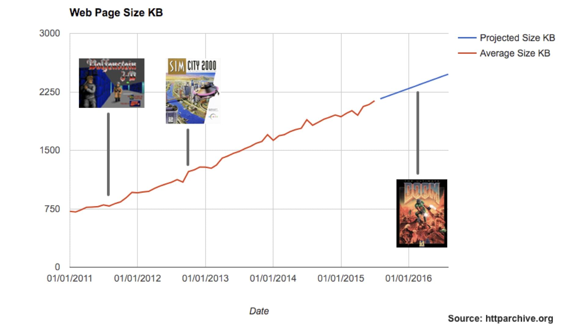
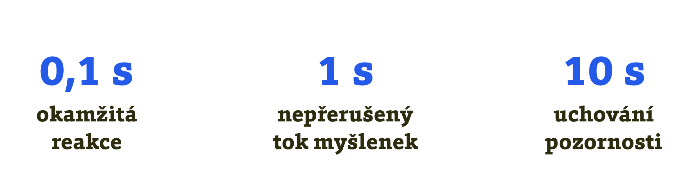

# Rychlost webů? Stále nedostatečná

AMP je především pokus radikálně zrychlit vykreslování webů v prohlížečích uživatelů. Dostupné studie totiž v posledním desetiletí ukazují na neuspokojivou rychlost webů.

## Většina webů je stále pomalá

Za všechny zmiňme například rok 2016, kdy vyšlo najevo, že průměrná velikost stránky je zhruba 2,25 MB. Tedy stejně, jako mělo první vydání legendární hry Doom.

_„The web is Doomed,“_ napsal k tomu na své mnohamegabajtové stránce magazín Wired.

<figure>

<figcaption markdown="1">
_Už v roce 2016 byla průměrná webová stránka velká jako 3D střílečka Doom. Zdroj: Ronan Cremin, [mobiforge.com](https://mobiforge.com/research-analysis/the-web-is-doom)_
</figcaption>
</figure>

A nejde jen o datový objem. I méně obtloustlé stránky se na pomalejších připojeních vykreslují vysoké jednotky vteřin. K tomu nám během vykreslování ošklivě poskakuje obsah, protože se přeskládává layout.

Z většiny stránek jsou prostě nevychovaní otesánci, kteří konzumují baterku našich zařízení a naše peníze prostřednictvím datových limitů. A taky nervy.

## Rychlé weby plní svůj účel lépe

Z dalších studií ovšem vychází, že uživatelé nemají s weby zase takovou trpělivost. Výzkumník R. B. Miller přišel už v roce 1968 na to, že lidé považují za okamžitou reakci takovou, která netrvá déle než 100 milisekund.

<figure>

<figcaption markdown="1">
_Tři milníky ve vnímání rychlosti webů. Zdroj: Nielsen Norman Group, [vrdl.in/4o3d7](https://www.nngroup.com/articles/response-times-3-important-limits/)_
</figcaption>
</figure>

V posledním desetiletí se i velké internetové firmy začaly předhánět ve zveřejňování čísel o tom, jak moc velký vliv má rychlost na obchodní ukazatele webů. Americký gigant Walmart si například spočítal, že každé zrychlení načtení úvodní stránky o vteřinu zvýší konverze jejich webu o dva procentní body.

Z této a dalších případových studií vychází, že rychlost webů ovlivňuje obchodní ukazatele, jako jsou počty zhlédnutých stránek (u obsahových webů) nebo konverzní poměr (u e-shopů).

Pokud byste snad chtěli někoho o výhodách rychlosti přesvědčovat i dalšími argumenty, může vám posloužit text „Proč řešit rychlost načítání webu?“ na Vzhůru dolů. [vrdl.cz/p/rychlost-nacitani-proc](https://www.vzhurudolu.cz/prirucka/rychlost-nacitani-proc)

Že je však rychlost webů problém a příležitost zároveň, už nejspíš víme všichni. Co tedy s tím?
