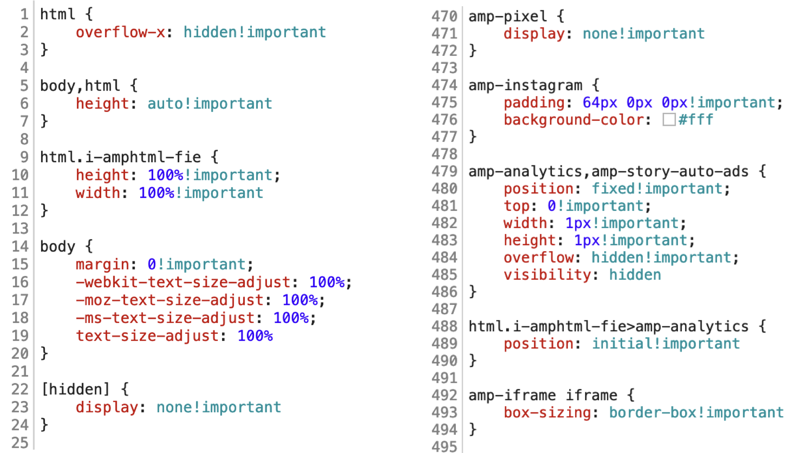

# CSS a webfonty v AMP

I na úrovni CSS nás podobně jako v případě HTML čeká pár zákazů. Nebo jim budeme říkat _inovace_? Těžko říct, jak o tom vlastně psát. Uvidíte, že záleží případ od případu.

Některé zde uvedené body jsou rozumné a daly by se doporučit přinejmenším některým webům realizovaným běžnými technologiemi. Do této kategorie patří zákaz stahování externích skriptů pomocí `@import` v CSS, omezení animací a částečně také vkládání stylů přímo do HTML.

Jiné body bychom jako inovaci neoznačili, spíše je považujeme za z nouze ctnost. Sem patří zákaz důležitosti v CSS (`!important`) nebo omezení dodavatelů externích webových fontů na pouhé čtyři.

Ale konec řečí, pojďme se podívat na kód, který je v AMP stylech jiný než v běžném CSS.

## Veškeré styly musí být v HTML

Žádný `<link rel="stylesheet">`, vše musí být ve speciálně označeném bloku hlavičky dokumentu: `<style amp-custom>`:

```html
<head>
  <style amp-custom>
    /* Naše krásné styly */
  </style>
</head>
```

Velikost je omezená na 50 kB. Proč tomu tak je?

Když jsme nad tím přemýšleli, Martina napadlo, že jde o součást validační strategie. AMP stránka musí být jedním _validním_ celkem. Validováním dvou a více souborů by se věci komplikovaly.

Druhým důvodem bude samozřejmě rychlost. Styly jsou hned po HTML druhým nejkritičtějším zdrojem potřebným k prvnímu renderování stránky. Proto je (i na běžných webech) doporučováno, aby stránka stahovala jen ty styly, které sama potřebuje, a ne o moc víc. Pokud se povede takovou distribuci připravit, dostaneme se na hodnoty kolem 5–10 kB. U takto malých externích kritických zdrojů je už doporučováno přímé vložení do dokumentu, protože zde nebude přínos kešování externího souboru v prohlížeči uživatele tak velký.

Třetím argumentem pro vkládání stylů přímo do HTML je v případě AMP „balíčkování“. Je to jediný soubor, který funguje – a je distribuovaný – vcelku. Stačí k němu na AMP Cache přiložit AMP komponenty a máme funkční stránku.

Dodáváme, že jako limit se počítá datová velikost kódu uvnitř `<style>`, takže minifikace kódu pomůže oddálit dosažení maxima.

## Zavináčová pravidla: Žádný @import prosím

Pravidlo `@import` je zde samozřejmě zakázané, ze stejného důvodu jako v předchozím odstavci. Nechceme přece v kritické vykreslovací cestě stahovat přes síť další soubory.

Povolená pravidla jsou tato: `@font-face`, `@keyframes`, `@media`, `@page` a `@supports`.

Nepovolený je také `@charset`, `@namespace` nebo `@document`. Kvůli těmto pravidlům už ale nejspíš ronit slzy nebudeme. Navíc je možné, že je autoři do AMP nakonec přidají.

## !important je zakázaný

Další zákaz `!important` může bolet, protože v CSS je tohle pravidlo jako droga. Všichni vědí, že užívat ji je nebezpečné, ale jsme jen lidi a každý má někdy slabou chvilku, že ano…?

Proč je to zakázané? Předpokládá se, že AMP dokumenty budou procházet úpravami [v AMP Cache](amp-cache.md) a zobrazovat se [v AMP Vieweru](amp-viewer.md). Během toho se upraví jejich HTML kód. Řada vlastností, které pro potřeby jednoduššího psaní stránek zapisují jako atributy (např. `layout="responsive"`), se ve veřejně publikované AMP stránce přepíší do CSS.

AMP Cache tedy musí přepisovat naše styly. A jediný způsob, jakým může zaručit stoprocentní jistotu přepisu, je právě `!important`.

<figure>

<figcaption markdown="1">
_Světový rekord v počtu klíčových slov !important právě padl ve výchozích stylech pro Google AMP Viewer._
</figcaption>
</figure>

Droga `!important` je tedy rezervovaná pro AMP. A nám nezbývá než se s tím nějak vypořádat a z našich stylů ho odstranit. Jde to, ale bude to chtít nějaký čas. U řady projektů i dost času.

## Zákaz stylování tříd a elementů, které vytváří AMP

Framework také v selektorech nepovoluje používání tříd začínajících na `-amp-` a elementů začínajících na `i-amp`. Takto totiž AMP runtime pojmenovává své vlastní přidané prvky.

## Dobrá rada: Nestylujte AMP komponenty

Z obrázku výše vyplývá i jedna nepříjemná vlastnost frameworku – velmi se nevyplácí navazovat svůj kód přímo na jeho komponenty. Velice pravděpodobně vám některé CSS vlastnosti přebije svými. A znáte to – proti `!important` je veškerý boj marný.

Vždy je lepší opatřit AMP komponentu vlastní obalovací třídou:

```html
<div class="muj-obrazek">
  <amp-img>…</amp-img>
</div>
```

Nestylujte tedy přímo komponentu:

```html
<amp-img class="muj-obrazek">…</amp-img>
```

## Animace: Jen ty akcelerované pomocí GPU a raději do zvláštního bloku

Aktuálně můžete pomocí `transition` nebo `@keyframes` animovat pouze vlastnosti `opacity` a `transform`. Je jich tedy relativně málo, na druhou stranu jsou poměrně silné, takže by to zásadně vadit nemělo.

Opět se tady hraje na výkon, styly zpracovávané pomocí grafického procesoru jsou daleko rychlejší.

Pokud animujete pomocí `@keyframes`, autoři navíc doporučují umístit deklarace do zvláštního bloku `<style amp-keyframes>`. Pokud jej použijete, musí být vždy na konci bloku `<body>`:

```html
  <style amp-keyframes>
    @keyframes mojeAnimace { … }
  </style>
</body>
```

Parsování těchto pravidel prohlížečem je totiž relativně pomalé. Umístění v hlavičce dokumentu by oddálilo zobrazení stránky. I zde máme velikostní limit, v tomhle případě velkorysých 500 kB.

## Webfonty: Jen od povolených dodavatelů

Podobně jako u běžných webů máte i zde svobodnou volbu ve výběru písma, ale to u AMP neplatí u externího dodavatele souborů s písmy.

### První možnost: @font-face

Soubory s webfonty umístíte na svůj server a v CSS je použijete pomocí pravidla `@font-face`. Doporučujeme vám to, protože vlastní písmo obvykle představuje kritický zdroj ke správnému vykreslení stránky. Umístění na vaší doméně nic nebrzdí, není potřeba navazovat nové síťové spojení. V případě nahrání do AMP Cache si stránka s sebou vezme také důležité obrázky a webfonty, takže i tam jsou všechny umístěné na stejné doméně.

Více o vlastnostnosti `@font-face` píše Martin pro zájemce na Vzhůru dolů: [vrdl.cz/p/css3-font-face](https://www.vzhurudolu.cz/prirucka/css3-font-face)

Nahrání do Cache není ovšem vždycky možné, například z licenčních nebo jiných důvodů. Pak je tady ještě starý dobrý `<link>`, který pro tyto účely autoři AMP povolili.

### Druhá možnost: Povolení externí dodavatelé

Tady vám nic nového neřekneme:

```html
<link
  href="https://fonts.googleapis.com/css?family=Roboto…"
  rel="stylesheet">
```

Nic nového, to by mohla být dobrá zpráva. Jenže je tu ještě ta špatná: Můžete použít webfonty jen od pěti dodavatelů, kteří se vyskytují na whitelistu.

|Dodavatel   |Adresa, ze které je možné CSS načíst|
|------------|------------------------------------|
|Fonts.com   | `https://fast.fonts.net`           |
|Google Fonts| `https://fonts.googleapis.com`     |
|Font Awesome| `https://maxcdn.bootstrapcdn.com`  |
|Typekit     | `https://use.typekit.net`          |
|Typography.com| `https://cloud.typography.com`   |

Samozřejmě – není příliš pravděpodobné, že budete potřebovat jiné dodavatele. Většina menších písmolijen například umožňuje instalaci webfontů na vlastní doménu.

I tak to ale omezuje svobodu volby a spadá do bodů, jež na AMP [vnímáme kriticky](amp-kritika-myty.md). Snad i volbu dodavatele webfontové infrastruktury autoři časem otevřou každému, kdo bude schopný splnit jejich přísné podmínky.

Probrali jsme vše, co jsme měli ke stylům na srdci. Teď ještě pár slov k dalšímu členovi triumvirátu, k JavaScriptu. O čem ale psát, když ten je v AMP  zakázaný? Uvidíte sami.
