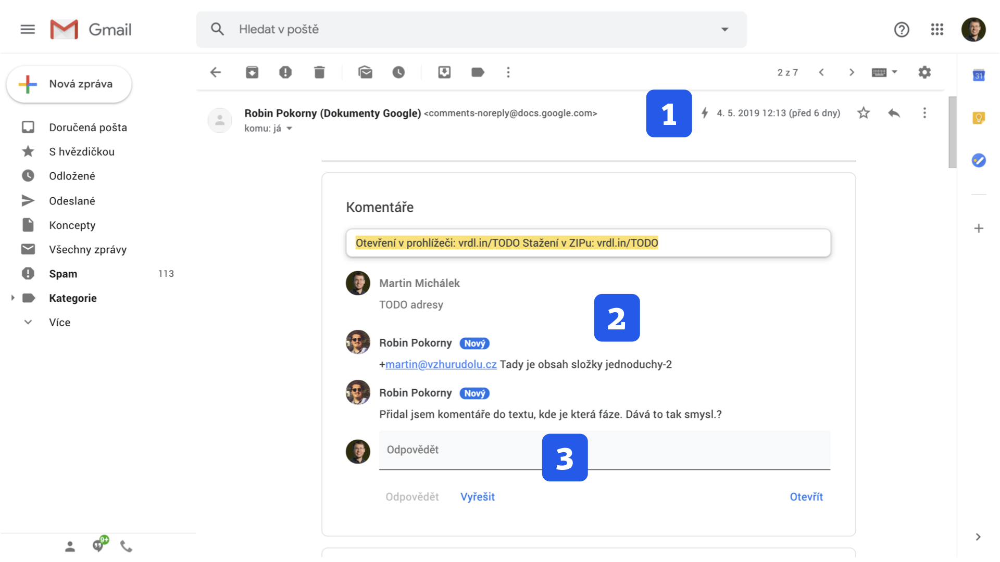
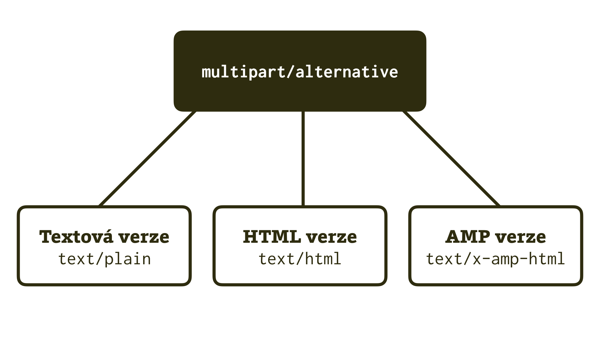

# AMP Email: Tohle může být revoluce ve tvorbě e-mailů

AMP Email je podmnožina frameworku, která slouží ke tvorbě interaktivních e-mailů.

V případě rozšíření by to mohla být opravdová revoluce. Představme si, že bychom jako autoři newsletterů nebo transakčních e-mailů mohli používat komponenty uživatelského rozhraní, jako je akordeon (`amp-accordion`) nebo obrázkový lightbox (`amp-image-lightbox`).

Ale co víc: e-maily vyrobené pomocí AMP jsou plně dynamické – mohou si stáhnout data z vašeho API, mohou reagovat na akce uživatele. Z jeho pohledu je pak možné například:

* Přihlásit se na školení.
* Objednat se k lékaři.
* Vyplnit krátký dotazník.

V polovině roku 2019 je tato věc nasazená na webových e-mailových klientech Gmail, a Mail.Ru. Na nasazení v dalších „webmailech“ – Yahoo Mail a Outlook – se pracuje.

<figure>

<figcaption markdown="1">
_Obrázek: Naše první setkání s AMP e-mailem. Zpráva od Dokumentů Google během práce na knížce… Hádejte o čem? 1) Označení dynamického e-mailu. 2) Komentáře se průběžně aktualizují. 3) Přímo z e-mailu je také možné odpovědět._
</figcaption>
</figure>

## Proč AMP?

Google ve zprávě představující e-mailovou odnož AMP píše, že framework začal jako snaha pomoci vydavatelům, ale teď prý jde o jednu z nejlepších cest, jak vybudovat interaktivní weby.

Klasický framework („AMP Websites“) využívá efektu něco za něco – technologie vás omezí při tvorbě (např. zákazem vlastního JavaScriptu), ale zato nám dá něco, co při běžné tvorbě webu nemáme k dispozici (např. hotové komponenty uživatelského rozhraní).

Zrovna tohle se hodí také e-mailovým platformám – když nebudou muset řešit velké množství variant (a možných chyb) ve vašem javascriptovém kódu, rády tvůrcům poskytnou proprietární funkce navíc.

Více je možné najít v článku „Bringing the power of AMP to Gmail“ na hlavním blogu Googlu. [vrdl.in/ampembr](https://www.blog.google/products/g-suite/bringing-power-amp-gmail/)

Pokud byste snad AMP Email chtěli využít, v tuto chvíli je potřeba se nejprve zaregistrovat u Googlu. [vrdl.in/ampemr](https://developers.google.com/gmail/ampemail/register)

## Kritika

### TechCrunch: „Dochází nám snad záložky v prohlížeči?“

„Dochází nám snad záložky v prohlížeči, že chce Google slučovat tyto dva kontexty?“ ptá se vtipně Devin Coldewey v textu „AMP for email is a terrible idea“ na TechCrunch. Podle něj interaktivitu v e-mailu nepotřebujeme. Je užitečné, že máme sdělování věcí v e-mailu oddělené od jiných aktivit na webech a v aplikacích.

V určitých ohledech má pravdu, ale osobně neočekáváme rozvoj chatování, přenosu videa, složitějšího nakupování nebo dalších komplexních interakcí uvnitř e-mailu. Ony ty „jiné aktivity na internetu“ jsou jako skříň s mnoha šuplíky. Akce typu rychlá objednávka nebo filtrování obsahu patří do šuplíku, který naopak v e-mailu smysl má – rychlá a jednoduchá interakce na základě doručeného obsahu.

Z tohoto pohledu rádi přirovnáváme AMP Email k notifikacím v moderních mobilních operačních systémech. Dříve to byly jen zprávy. Dnes je možné už přímo z nich vykonávat jednoduché akce – například odpovědět na zprávu. A zhruba v téhle oblasti vidíme místo pro dynamický e-mail.  

V článku na TechCrunch se dál bohužel argumentuje opakováním klišé „Google chce vlastnit a kontrolovat další náš obsah“, které může někoho znepokojovat, jiného zase nechává chladným. I v tomto bodě však přichází text se zajímavým postřehem – interaktivní e-mail bude možné díky AMP obohacovat daleko přesnějšími měřeními chování uživatelů s následným využitím pro potřeby reklamy. [tcrn.ch/2o49P24](https://techcrunch.com/2018/02/13/amp-for-email-is-a-terrible-idea/)

### Litmus: Marketéři se těší, ale AMP zároveň přinese nové problémy

Jaina Mistry zase na blogu Litmusu zmiňuje jeden zajímavý potenciální problém: Možnost aktualizace e-mailů po odeslání.

To je velmi zajímavý postřeh a opravdu to problém být může. Příklad: V e-mailovém klientovi hledám hotel v jižních Čechách, který mě zaujal v nabídce od Booking.com z minulého týdne. Jenže obsah e-mailu se mezitím změnil. Bude velmi záležet, jak s tím budou autoři e-mailů pracovat.

Více si můžete přečíst v článku „Marketers Can’t Wait to Use AMP for Email, But Here’s What Will Be Holding Them Back“. [vrdl.in/amplitmus](https://litmus.com/blog/marketers-cant-wait-to-use-amp-for-email-but-heres-what-will-be-holding-them-back)

## AMP Email technicky

Minimální HTML je velmi podobné svému sourozenci u klasického AMP:

```html
<!doctype html>
<html ⚡4email>
  <head>
    <meta charset="utf-8">
    <style amp4email-boilerplate>
      body{visibility:hidden}
    </style>
    <script async src="https://cdn.ampproject.org/v0.js"></script>
  </head>
  <body>
    Ahoj, jsem AMP e-mail!
  </body>
</html>
```

Respektive – jak sami vidíte, jde o směsici prvků použitých u AMP Websites s tím, co známe [od AMP Ads](amp-ads.md).

Kromě vám již známých pravidel tady například platí:

* Jiný typ dokumentu: `<html ⚡4email>` nebo `<html amp4email>`.
* Optimální šířka layoutu je 800 pixelů nebo méně. Autoři upozorňují, že širší obsah se může v některých e-mailových klientech oříznout.
* Pokročilé trackování příjemců e-mailů jako na webech – například pomocí `<amp-analytics>` – v tuhle chvíli možné není. Zůstaneme u klasického měřicího pixelu známého z HTML e-mailů.

### Co zpětná kompatibilita?

Nebojte, kompatibilita je zajištěná. E-mail ve formátu AMP může být odesílán v jednom balíčku spolu s již existujícími formáty. Jde o MIME typ `text/x-amp-html`, který pošleme vedle `text/html` a `text/plain` pod rodičovským typem `multipart/alternative`.

<figure>

<figcaption markdown="1">
_Obrázek: Tři v jednom. Zajištění zpětné kompatibility AMP e-mailů._
</figcaption>
</figure>

A co odpovídání? Klient, který AMP Email zvládá, by měl v odpovědi nebo při přeposlání odmazat AMP část. Je zde proto opravdu důležité, aby existovala alternativa v HTML nebo čistém textu.

To by mohlo pro základní zasvěcení stačit. Vidíte, jak daleko už v knížce právě jste. Pak jistě pochopíte, že pro více informací vás odkážeme na online studium.

* Text „Nová éra e-mailů“ od Superkodérů. [vrdl.in/ampemsk](https://medium.com/superkoders/amp-email-19c85071773b)
* Specifikace AMP Email na amp.dev. [vrdl.in/ampemf](https://amp.dev/documentation/guides-and-tutorials/learn/amp-email-format)
* Komponenty pro AMP Email na amp.dev. [vrdl.in/ampemc](https://amp.dev/documentation/components/?format=email)

A teď už vzhůru do příběhů!
