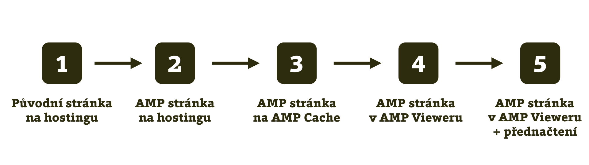
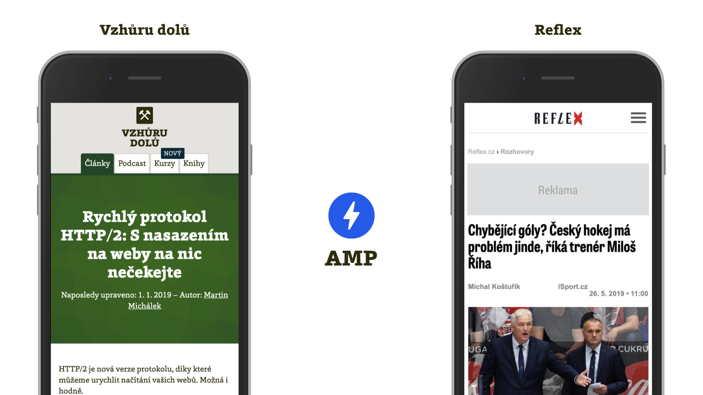
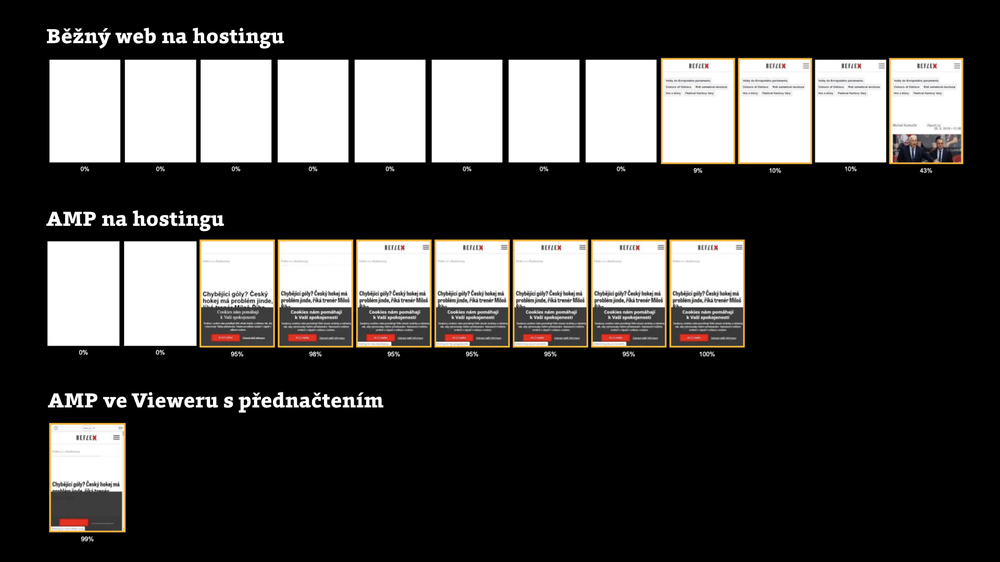

# Rychlost AMP stránky ve fázích distribuce

<div class="web-only" markdown="1">

*Text je ukázkou z e-booku [Vzhůru do AMP](https://www.vzhurudolu.cz/ebook-amp/).*

</div>

AMP se občas vytýká, že ve skutečnosti není tak rychlé, jak se rádo tvrdívá. V řadě konkrétních případů to může být pravda, ale při zobrazení [v AMP Vieweru](amp-viewer.md) s přednačtením hledá tato technologie konkurenci opravdu jen těžko.

<div class="related web-only" markdown="1">
- [Co je to AMP?](amp.md)
- [HTML v AMP](amp-html.md)
- [CSS v AMP](amp-css.md)
- [JavaScript v AMP](amp-javascript.md)
</div>

Jak už víme, než se AMP dostane do této ideální distribuční formy, prochází různými jinými umístěními, nebo také fázemi distribuce. Pojďme si je teď všechny projít a podívat se, jak jsou v nich konkrétní stránky rychlé.

<figure>

<figcaption markdown="1">
_Pět fází distribuce AMP stránky._
</figcaption>
</figure>

Abychom ukázali stav rychlosti v jednotlivých fázích, testovali jsme dvě stránky:

* _Článek na Vzhůru dolů_  
Tady jsme vyšli už z poměrně slušně optimalizované stránky, navíc s velmi malým množstvím JavaScriptu. Další zajímavostí je to, že AMP i non-AMP verze článků na Vzhůru dolů vypadají prakticky stejně, což by měl ostatně být cíl pro všechny AMP weby.
* _Článek z Reflex.cz_  
Pro použití AMP jde o daleko příhodnější a typičtější případ: Nijak zvlášť rychlá stránka, navíc zatížená reklamou, velký vydavatel… Přesně pro tyto typy stránek bylo AMP původně určeno. V tomto případě není vzhled obou verzí úplně jednotný.

<figure>

<figcaption markdown="1">
_Non-AMP verze obou článků na Vzhůru dolů a Reflexu._
</figcaption>
</figure>

Pojďme na testy a jejich výsledky.

<div class="web-only f-6" markdown="1">

Měřené fáze životního cyklu AMP stránky:

1. [Původní stránka na hostingu](#1)
2. [AMP stránka na hostingu](#2)
3. [AMP stránka na AMP Cache](#3)
4. [AMP stránka v AMP Vieweru](#4)
5. [AMP stránka v AMP Vieweru s přednačtením](#5)

</div>

## 1) Původní stránka na hostingu {#1}

Testovat budeme tyto dvě URL adresy:

```url
https://www.vzhurudolu.cz/prirucka/http-2
https://www.reflex.cz/clanek/rozhovory/95433/
```

Poslouží nám jako základní míra, kterou použijeme pro další srovnání. Naměřené metriky rychlosti vykreslování uvidíme vždy v jednoduché tabulce. V tomto případě je stav následující:

|            |První vykreslení|Index rychlosti|První interaktivita|
|------------|---------------:|--------------:|------------------:|
|Vzhůru dolů |5,6 s| 6,9 s| 1,5 s|
|Reflex      |8,2 s|19,8 s|25,0 s|

Mezi námi je jistě mnoho takových, kterým uvedené metriky nic neříkají. Nevadí, vše vysvětlíme. Jde o události, které vznikají během vykreslování stránky:

* _První vykreslení (Start Render)_ – moment, kdy prohlížeč začne zobrazovat první pixely stránky.
* _Index rychlosti (Speed Index)_ – chvíle, v níž je hotové vykreslení první obrazovky, tedy oblasti nad zlomem stránky.
* _První interaktivita (First Interactive)_ – moment, kdy je možné stránku používat, aniž by docházelo ke zpožděným reakcím.

Porovnávaných metrik by mohlo být mnohem více, ale tyhle tři docela slušně popisují uživatelský prožitek člověka čekajícího na obsah testované stránky. Zájemce o hlubší porozumění metrikám rychlosti webů odkážeme opět na Vzhůru dolů. [vrdl.cz/p/metriky-rychlosti](https://www.vzhurudolu.cz/prirucka/metriky-rychlosti)

Pořádek dělá přátele, takže dodejme, že měříme nástrojem WebpageTest.org na emulaci mobilu Nexus 5 a při rychlosti připojení „3G Fast“. Všechny zdrojové testy a jejich výsledky jsou k dispozici na [vrdl.in/ampwpt](https://docs.google.com/document/d/1zz3MtDQ-EhGRWyRA5EQWgyPXbtDF5o5gTpCtjyxhZDI).

<!-- AdSnippet -->

Nyní se podíváme na AMP verzi stránek, ale stále zůstaneme na běžném hostingu.

## 2) AMP stránka na hostingu {#2}

AMP verze obou stránek jsou umístěné na následujících adresách:

```url
https://www.vzhurudolu.cz/amp/prirucka/http-2
https://www.reflex.cz/clanek/rozhovory/95433/?amp=1
```

Ptáte se, jak vypadají?

<figure>

<figcaption markdown="1">
_AMP verze obou článků._
</figcaption>
</figure>

A jak se změnila čísla?

|            |První vykreslení|Index rychlosti|První interaktivita|
|------------|---------------:|--------------:|------------------:|
|Vzhůru dolů|5,6 s|8,6 s|3,7 s|
|Reflex|2,8 s|3,2 s|2,8 s|

### Vzhůru dolů

Nejprve si okomentujme výsledky pro Vzhůru dolů: _První vykreslení_ zůstalo na stejné úrovni, _Index rychlosti_ a _První interaktivita_ se zhoršily. Proč?

Je potřeba si uvědomit dvě věci:

1. Už původní verze článku je velice minimalistická z pohledu použití JavaScriptu. Vystačí si s knihovnou jQuery a dvěma, třemi pluginy. Dohromady nějakých 50 kB kódu.
2. Každá AMP stránka vyžaduje vložení AMP knihovny („AMP runtime“), ve které prohlížeč stahuje a spouští téměř 80 kB kódu, a to nepočítáme javascriptový kód pro jednotlivé komponenty.

K druhému bodu je potřeba říci, že nutnost vkládání AMP runtime je aktuálně jedním z problémů AMP. Autoři ovšem pracují na jeho odstranění.

<div class="web-only" markdown="1">

Problém by měl řešit [projekt Bento](https://amp.dev/community/working-groups/bento/), který umožní používat AMP komponenty bez velké runtime knihovny, nezávisle a třeba i společně s jinými frameworky, což by bylo opravdu skvělé.

</div>

<div class="ebook-only" markdown="1">

Problém by měl řešit projekt Bento, který umožní používat AMP komponenty bez velké runtime knihovny, nezávisle a třeba i společně s jinými frameworky, což by bylo opravdu skvělé.

O projektu Bento najdete více v textu [o kanonických AMP stránkách](amp-implementace-jen-amp.md) třetí kapitoly.

</div>

Dobré to tady pro AMP úplně není. Ostatně kritici technologie s bleskem v logu tento jev velmi rádi používají pro argumentaci, že AMP stránky zase tak rychlé nejsou.

<!-- AdSnippet -->

Nás by to ale trápilo jen v situacích, pokud bychom pomocí AMP vytvářeli i klasickou verzi již poměrně rychlého webu jako je Vzhůru dolů. Ve všech ostatních případech není varianta AMP stránky umístěná na hostingu určená pro lidské návštěvníky, ale jen pro zpracování roboty a nahrání do [AMP Cache](amp-cache.md).

### Reflex

Metriky AMP stránky z webu Reflexu asi nepotřebují komentáře. Došlo k násobnému zlepšení na všech frontách. Dodejme však, že AMP stránka vypadá jinak než ta původní.

## 3) AMP stránka na AMP Cache {#3}

Podívat se na verzi stránek umístěnou právě na tomto místě bude zajímavé:

```url
https://www-vzhurudolu-cz.cdn.ampproject.org/v/s/
  www.vzhurudolu.cz/amp/prirucka/http-2

https://www-reflex-cz.cdn.ampproject.org/v/s/
  www.reflex.cz/clanek/rozhovory/95433/…
```

A čísla?

|            |První vykreslení|Index rychlosti|První interaktivita|
|------------|---------------:|--------------:|------------------:|
|Vzhůru dolů|5,5 s|6,4 s|3,1 s|
|Reflex|3,2 s|3,3 s|3,2 s|

Na [AMP Cache](amp-cache.md) už proběhly automatické úpravy kódu stránky a prvků, které jsou v ní vložené, jako například obrázky.

Celkový obrázek metrik zůstává zhruba na stejné úrovni jako na hostingu, některé se zlepšily, jiné zhoršily… Ale víte co? Na tom ještě pořád nesejde, stále nejsme u cíle a ani na této adrese by stránku uživatelé navštěvovat neměli.

## 4) AMP stránka v AMP Vieweru

<div class="ebook-only" markdown="1">

[AMP Viewer](amp-viewer.md) má za úkol zobrazit weby z AMP Cache, přidat informační lištu s adresou původního webu a ovládacími prvky. Dále by měl pomoci s vykreslením a přednačtením stránky. Adresy našich stránek jsou nyní následující:

</div>

<div class="web-only" markdown="1">

AMP Viewer má za úkol zobrazit weby z AMP Cache, přidat informační lištu s adresou původního webu a ovládacími prvky. Dále by měl pomoci s vykreslením a přednačtením stránky. Adresy našich stránek jsou nyní následující:

</div>

```url
https://www.google.com/amp/s/
  www.vzhurudolu.cz/amp/prirucka/http-2

https://www.google.com/amp/s/
  www.reflex.cz/clanek/rozhovory/95433/…%3famp=1
```

Ukažme si také čísla:

|            |První vykreslení|Index rychlosti|První interaktivita|
|------------|---------------:|--------------:|------------------:|
|Vzhůru dolů|5,6 s|7,5 s|1,8 s|
|Reflex|1,1 s|4,0 s|2,1 s|

Jak je tady vidět, metrika _První interaktivita_ během optimalizací prováděných v jednotlivých krocích klesá. Naopak se zde zhoršil _Index rychlosti_, zobrazení hotové první obrazovky. Příčinou je nutnost vykreslení celé stránky v `<iframe>` a přidání lišty informující o původní adrese webu. Technologie „Signed HTTP Exchanges“ (viz předchozí text o [AMP Cache](amp-cache.md)) ale tento problém pravděpodobně odstraní.

V AMP Vieweru už mohou uživatelé na AMP stránku narazit. Další krok – přednačtení – totiž nemusí „klapnout“, takže se stránka v nejhorším případě opravdu může vykreslovat s těmito hodnotami.

Podívejte se na video „AMP ekosystém: Co je AMP Cache, co Optimizer a co Viewer?“.

YouTube: [youtu.be/l751Or7iZCA](https://www.youtube.com/watch?v=l751Or7iZCA)

Na webu Reflexu došlo v tomto kroku k hezkým zlepšením metrik _První vykreslení_ a _První interaktivita_.

V případě Vzhůru dolů jsme si ve srovnání s původní běžnou non-AMP stránkou zase tak moc nepomohli, že? Není to u AMP úplně obvyklé, ale je to zároveň skvělá příležitost upozornit na jednu důležitou věc – optimalizaci.

### Také AMP stránku je potřeba optimalizovat

Právě _optimalizace_ je totiž něco, čím v době měření AMP verze Vzhůru dolů ještě neprošla. Rovněž AMP verzi webu je třeba nakódovat „optimálně“. V článku „Optimize your hosted AMP pages“ jsou například tipy na prioritizaci důležitých zdrojů pomocí značky `<link rel="preload">`. [vrdl.in/ampopt](https://amp.dev/documentation/guides-and-tutorials/optimize-and-measure/optimize_amp)

### Skoro vždy je AMP už ve Vieweru rychlejší než původní stránka

Znovu zde zdůrazněme výjimečnost měřené stránky ze Vzhůru dolů. Známý americký autor Tim Kadlec ale testoval 50 článků velkých světových webů, odpovídajících spíše webu Reflexu, a jejich AMP verzí a došel k následujícím mediánům _Indexu rychlosti_:

* Původní články: 8 152 ms
* AMP na hostingu: 6 171 ms
* AMP v AMP Vieweru: 3 277 ms

AMP byl prostě ve studii vždycky razantně rychlejší než běžná stránka od stejných autorů. AMP hostovaný na AMP Cache od Googlu ještě více.

A to autor neměřil přednačtenou verzi webu, do čehož se za chvíli pustíme my. Zaměřil se na velké a komplexní weby, u kterých by byla optimalizace rychlosti stávajícího řešení opravdu výzvou. To jsou ovšem projekty, kam právě AMP cílí nejvíce. Více je v Timově textu „How Fast Is Amp Really?“. [vrdl.in/amptim](https://timkadlec.com/remembers/2018-03-19-how-fast-is-amp-really)

Většina zobrazení AMP stránek by měla pocházet z ideální fáze distribuce. Pojďme se na ni podívat.

## 5) AMP stránka v AMP Vieweru s přednačtením

Adresa bude stejná jako v předchozím případě:

```url
https://www.google.com/amp/s/
  www.vzhurudolu.cz/amp/prirucka/http-2

https://www.google.com/amp/s/
  www.reflex.cz/clanek/rozhovory/95433/…%3famp=1
```

Zde ovšem předpokládáme, že AMP Viewer stihl stránku přednačíst, což se děje ve většině případů. Čísla jsou pak na zcela jiné úrovni:

|            |První vykreslení|Index rychlosti|První interaktivita|
|------------|---------------:|--------------:|------------------:|
|Vzhůru dolů|0,1 s|0,2 s|> 0,1 s|
|Reflex|0,1 s|0,2 s|> 0,1 s|

Ano, tohle je ten důvod, proč AMP použít. K takovým hodnotám jednoduše není možné přiblížit se s běžnou stránkou.

Vyjádřeme si ještě rychlost vykreslení stránky ve třech nejzajímavějších fázích distribuce pomocí obrázku.

<figure>

<figcaption markdown="1">
*Porovnání rychlosti vykreslení tří různých forem článku na Reflex.cz. Zdroj: WebpageTest.org [vrdl.in/ampwptf](https://www.webpagetest.org/video/compare.php?tests=190516_FD_f125772934ff0cc7283623273a2dc9fb%2C190516_6B_4b9564a1c50c3e7bc5215cbaca235066%2C190516_WW_596910a9028eae6491f55ed6ff4d8239&thumbSize=200&ival=1000&end=visual)*
</figcaption>
</figure>

### Jak změřit přednačítanou vezi ve WebpageTestu? Ukažme si krásy skriptování

Možná jste u pátého kroku přemýšleli, jak je možné změřit rychlost stránky s přednačtením stránky. Odpovědí je skriptování ve WebpageTestu, tedy jednoduchý prográmek, který říká, co má test provést. [vrdl.in/wptscript](https://github.com/WPO-Foundation/webpagetest-docs/blob/master/user/Scripting.md)

Skript, který jsme zde použili, vypadá takto:

```text
logData 0
navigate https://www.google.com/search?q=http2+vzhuru+dolu
sleep 15
logData 1
execAndWait document.querySelectorAll('a[href="https://www.vzhurudolu.cz/amp/prirucka/http-2"]')[0].click()
```

Vysvětleme:

* `logData 0` – instrukce, aby se zatím neměřilo.
* `navigate …` – přechod na URL s výsledky vyhledávání.
* `sleep 15` – počkáme 15 vteřin a dáme tím Googlu čas na přednačtení AMP stránek.
* `logData 1` – začínáme měřit.
* `execAndWait …` – spustíme JavaScript, v tomto případě obstará kliknutí na výsledek vyhledávání s určenou adresou.

Nezapomeňte pak do „Enter a Website URL“ nevložit žádnou adresu k testování a v záložce „Chromium“ zatrhnout „Emulate Mobile Browser“ s jakoukoliv hodnotou.

### Nemůže být takhle rychlá jakákoliv stránka?

Pokud by vás snad napadlo, že takhle rychlá by mohla být každá přednačtená stránka, máte pravdu. Jenže přednačítat běžné weby zkrátka zatím možné není. O bezpečnostních a výkonnostních rizicích mluvíme ještě v textu [o častých mýtech](amp-kritika-myty.md).

Všechny zdrojové testy jsou k dispozici na [vrdl.in/ampwpt](https://docs.google.com/document/d/1zz3MtDQ-EhGRWyRA5EQWgyPXbtDF5o5gTpCtjyxhZDI).

Přednačtení prostě potřebuje umístění v AMP Vieweru a ten potřebuje umístění v AMP Cache a ta potřebuje použití validního AMP.

AMP stránka tedy _může_ být v určitých fázích pomalejší než ta původní, obvykle ale nebude. Technologie AMP ovšem tvoří nutný předpoklad pro bezkonkurenčně rychlé zobrazení stránky. Snad je to po tomhle rozboru jednotlivých fází distribuce jasnější.

<!-- AdSnippet -->
