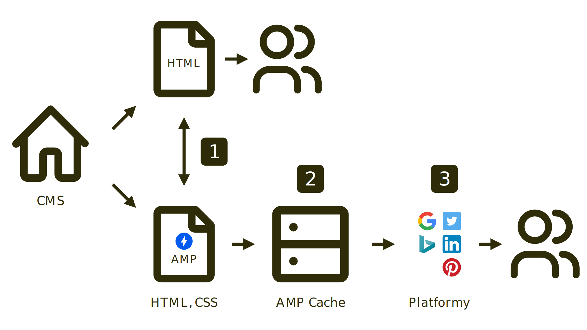

# Jak funguje distribuce AMP stránky?

Proces mezi publikováním a momentem dostupnosti stránky na platformách, které používají AMP, mírně zjednodušíme a technické detaily si necháme na později. Podívejte se nejprve na schéma:

<figure>

<figcaption markdown="1">
_Obrázek: Čím se liší distribuce běžné stránky od AMP?_
</figcaption>
</figure>

Ještě to pojďme popsat slovy. Zatímco u běžné HTML stránky „vyplivne“ váš redakční systém (CMS) nějaký obsah, který je hned k dispozici pro zobrazení v prohlížečích vašich nedočkavých uživatelů, u AMP je distribuce složitější:

1. AMP stránku objeví robot platformy, která stránky ukládá. V našich končinách je to nejčastěji Googlebot od Googlu.
2. Kešovací platforma si AMP stránku stáhne do vlastní mezipaměti, provede na níi optimalizace a vystaví uživatelům. O [AMP Cache](https://drive.google.com/open?id=155OVlQsp8SBCFOT5qmvwnpgbN42TJ4FtqE5ZVs59thI) píšu hned v dalším textu.
3. Stránka je (přes [AMP Viewer](https://drive.google.com/open?id=1K0kr6Z2EuRUBbf_K3J8WsETmv0n5V210MStIyzxqCSc), webovou stránku, která zobrazuje AMP stránky) k dispozici uživatelům.

Distribuce je tady pěkně složitá, že? Podstatný je ale výsledek – zobrazení stránky je rychlejší. Kromě jiného proto, že se vyhýbáme pomalým serverům.

Jak to probíhá z pohledu provozovatele webu? Následuje troška kódu, ale snažím se zde psát tak, abyste mi vy méně techničtí neutekli pryč. Dejte kódu šanci, je to vcelku zajímavé.

## Vyrobíte AMP verzi stránky

AMP stránku vytvoříte ve standardu pro AMP HTML. O něm píšeme více [později](https://docs.google.com/document/d/1kdSK7Q0LxoeU6DblzhJ-1EOtaCBD5IVSQwecr5gZyqQ/edit#). V tuhle chvíli se spokojme s konstatováním, že to je běžné HTML ořezané o malou část prvků a atributů a na druhou stranu doplněné o nové zajímavé komponenty. Také k nim se dostaneme.

Také bych rád zdůraznil, že výroba zvláštní verze stránky nemusí probíhat tak, že kód stránky napíšete úplně odznova. O [možnostech implementace](https://docs.google.com/document/d/1ldmb0EuTf0WchRLBOIqq6DzNoTfTZlnJWvkTZ3weZiQ/edit) se dozvíte dále.

Čím se AMP HTML liší? V HTML vypadá například kód pro vložení obrázku takto:


```html

```


V AMP verzi jej vložíme takhle:


```html
<amp-img src="obrazek.jpg" alt="…"
  layout="responsive" width="640" height="480">
```


Stejně postupujete i s dalšími vkládanými prvky, jako jsou videa, iframe nebo webfonty. Detaily se dozvíte později.

Řekněme, že máme hotovo. Teď samozřejmě AMP stránku publikujeme na zvláštní adrese. Na Vzhůru dolů je například text o nástroji Grunt dostupný na tomto URL:

```
https://www.vzhurudolu.cz/prirucka/grunt
```


AMP verze je pod „lomítko AMP“:

```
https://www.vzhurudolu.cz/amp/prirucka/grunt
```

Znění adresy je zcela na vás, jak uvidíte hned v dalším kroku.

## Řeknete robotům, že máte AMP

Do původní verze stránky vložíme metaznačku informující o tom, že AMP máme:


```html
<link rel="amphtml"
  href="https://www.vzhurudolu.cz/amp/prirucka/grunt">
```


Do AMP verze pak informaci o kanonické adrese, naší původní stránce:


```html
<link rel="canonical"
  href="https://www.vzhurudolu.cz/prirucka/grunt">
```

Ano, je to stejná značka jako v případě, že chcete zabránit duplicitám při optimalizaci pro vyhledávače. Pokud ji neznáte, nevadí. Díky AMP ji poznáte. Lidsky řečeno kanonická adresa určuje, kde leží původní obsah.

Kanonická adresa zde slouží k tomu, aby mohly distribuční platformy nabídnout odkaz nebo přesměrování na původní adresu. Může se hodit také pro případ, že uživatel chce sdílet AMP obsah v místě, kde zobrazování AMP stránky není tak výhodné, jako třeba na Facebooku, který AMP v době psaní tohoto textu nepodporuje.

A v neposlední řadě: uvedení kanonické adresy jednoznačně definuje původní obsah pro vyhledávače. Ty tak mají jasno: vyhledávat se bude obsah právě jen na oné kanonické adrese.


## Roboti uloží AMP stránku na AMP Cache

Googlebot nebo roboti jiných platforem pak prostě stránku stáhnou a následně uloží na CDN. 

U Googlu a českých webů AMP to bude na adresu obsahující `https://example-com.cdn.ampproject.org/s/…`.

Poznámka pro neobeznámené: CDN je Content Delivery Network. Jde o síť serverů, které obvykle pokrývají celou zeměkouli a distribuují obsah tak, aby se k uživateli dostal z blízkého serveru. Dělá i další kejkle, primárním cílem je ale rychlé zobrazení obsahu. 

Běžně si takovou službu mohou dovolit spíše větší weby, u AMP je to zadarmo pro všechny, byť zdaleka ne se všemi možnostmi, které komerční CDN nabízí.


## Stránka na AMP Cache projde optimalizacemi

Určité části předepsaného kódu AMP HTML se musejí převést do podoby, která bude výhodná pro zobrazování stránky na AMP Cache.

Vezměme například povinný kód pro vložení základních stylů do AMP stránky. Zjednodušeně vypadá takto:


```html
<style amp-boilerplate>…</style>
```


Vložení povinných stylů přímo do HTML je výhodné, jen pokud je dokument umístěný na vašem serveru. Více o tom píšeme v textu [o CSS v AMP](https://docs.google.com/document/d/1bTJ-tvBCEEFIQkwp-_KCgCV720L27BQ4u8TPEui7Kdc/edit#).

AMP Cache ovšem uvedený kód odstraní, protože při zobrazování stránky z ní není potřeba. Naopak k `<html>` přidá třídu `i-amphtml-no-boilerplate`. Takových transformací se ovšem provede celá řada, včetně takových, které prospívají rychlosti webu – jako je náhrada obrázků ve formátu JPEG za WebP.


## Kopie z AMP Cache je připravená k zobrazování

Nyní už můžete na verzi stránky z AMP Cache narazit na místech, kde se obvykle setkáváme s běžnými HTML stránkami. Například ve vyhledávání Google, v aplikacích LinkedIn, Twitter nebo Pinterest. Na [místa výskytu AMP](https://docs.google.com/document/d/1W57NJXoq7-EFpKOvdnelft4Qg3xl9KAjp5aFBExlmqc/edit#) se podíváme už za chvíli.

V ideální distribuční cestě se ale AMP stránka načte z AMP Vieweru, který pomáhá prohlížeči s vykreslením. Tady ji najdete už na známé adrese pod doménou Googlu: `https://google.com/amp/s/…`.


## Tři místa výskytu AMP stránek

Zatím jsme čekali na příležitost pro vysvětlení rozdílu mezi různými umístěními AMP stránek. Sláva – právě nastává. V ideální distribuci se stránka vyskytuje na třech místech:

1. Zdroj, „origin“, prostě váš server, například:  
`https://example.com/stranka.amp.html`
2. [AMP Cache](https://docs.google.com/document/d/155OVlQsp8SBCFOT5qmvwnpgbN42TJ4FtqE5ZVs59thI/edit#heading=h.bv7h5ckbspk7), adresa na distribuční CDN, například:  
`https://example-com.cdn.ampproject.org/s/example.com/stranka.amp.html`
3. [AMP Viewer](https://docs.google.com/document/d/1K0kr6Z2EuRUBbf_K3J8WsETmv0n5V210MStIyzxqCSc/edit#heading=h.fcehdvjcsrf3), zobrazovač, například:  
`https://google.com/amp/s/example.com/stranka.amp.html`

Setkání uživatele s AMP stránkou by mělo proběhnout v AMP Vieweru. Ten očekává, že bude mít k dispozici upravenou stránku umístěnou na AMP Cache. A ta si pro zdroje sahá na náš server.

Je možné, že některé zobrazovací kontexty povedou uživatele přímo na zdroj, tedy na doménu majitele obsahu (`https://example.com/stranka.amp.html`), jak to dělá například Twitter. Takhle se ale zdaleka nevyužívá potenciálu AMP. Ten je v mixu frameworku pro tvorbu stránek a specifické distribuční cesty.

Teď si musíme říct více o oné mezipaměti pro ukládání stránek AMP – o AMP Cache.

