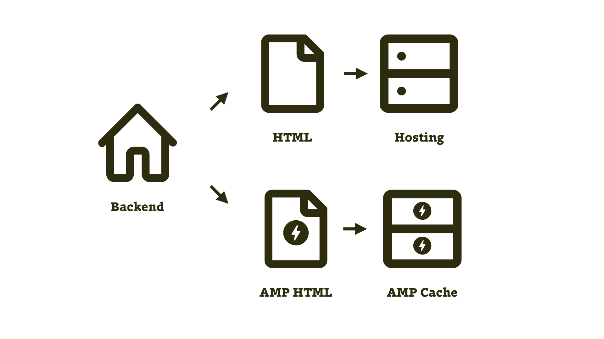
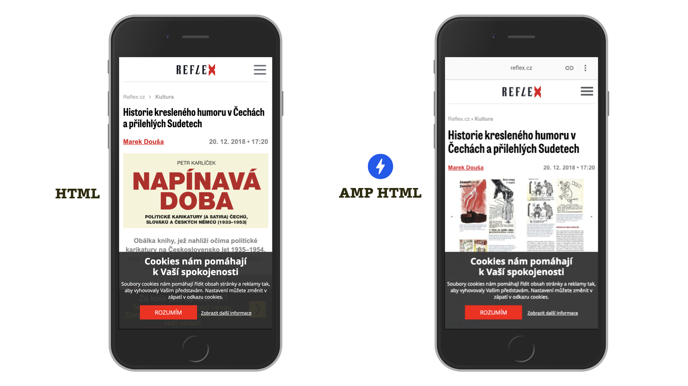

# Dvě oddělené verze webu

Po tomhle řešení sáhnou nejspíš ti, kteří z nějakého důvodu nemohou nebo nechtějí radikálně upravovat stávající web.

Důvodů může být více: Je například možné, že vývojářské a designérské zásahy do webu by byly ve výsledku dražší než vytvoření nové verze. Také se může stát, že na vstupních stránkách AMP chcete plnit jiné cíle a že by tedy měly vypadat jinak.

<figure>

<figcaption markdown="1">
_Schéma vytvoření zvláštní AMP verze webu_.
</figcaption>
</figure>

Jde ostatně o původně jediný a nyní stále převažující způsob tvorby AMP. Za chvíli si přečtete [o přístupech upřednostňujících AMP](amp-implementace-jen-amp.md), které jsou z pohledu dlouhodobé správy efektivnější. Ale teď ještě pár slov o tomto způsobu řešení implementace AMP. Opravdu jen pár, protože na něm není nic složitého.

## Ukázky: Reflex.cz, Ábíčko.cz nebo Alza

Na českém internetu nebylo těžké najít příklady tohoto řešení. Z velkých vydavatelů má asi nejpropracovanější AMP verzi webu časopis Reflex.cz.
<figure>

<figcaption markdown="1">
_HTML a AMP verze webu Reflex.cz._
</figcaption>
</figure>

Pro další příklad nemusíme daleko. Je jím Ábíčko.cz, v našich dětských letech populární časopis ABC, pocházející ze stejného vydavatelství.

V době psaní tohoto textu experimentoval s AMP pomocí vytvoření extra verze také největší český e-shop Alza.cz. Technologii, o které zde píšeme, mají ale nasazenou jen na stránkách produktů, které momentálně nemají na skladě.

## Výhody a nevýhody dvou oddělených verzí

Výhodné v tomto způsobu tvorby je, že nemusíte sahat do současného webu a „problém AMP“ vyřešíte relativně rychle.

Nevýhodou je nutnost údržby dvou verzí webu a pak samozřejmě to, že obě verze mohou vypadat a fungovat odlišně, což bude pro uživatele při přecházení mezi AMP a HTML matoucí.

Podívejme se teď na způsob implementace, který si v základu vystačí s jedinou verzí.
