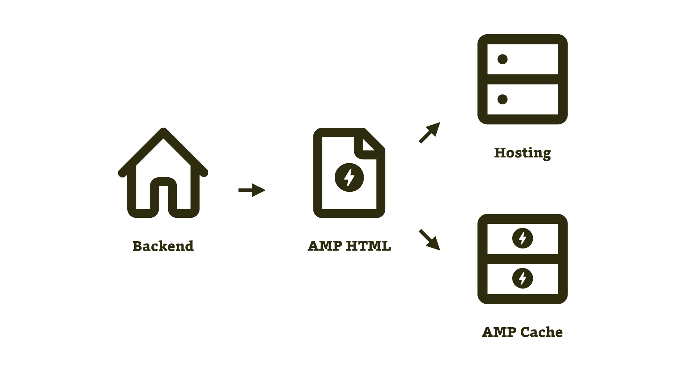
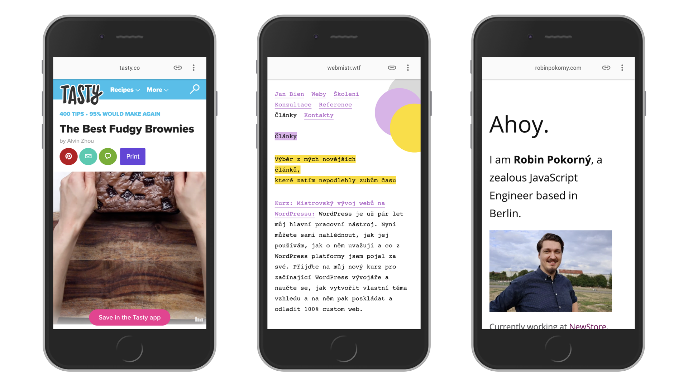
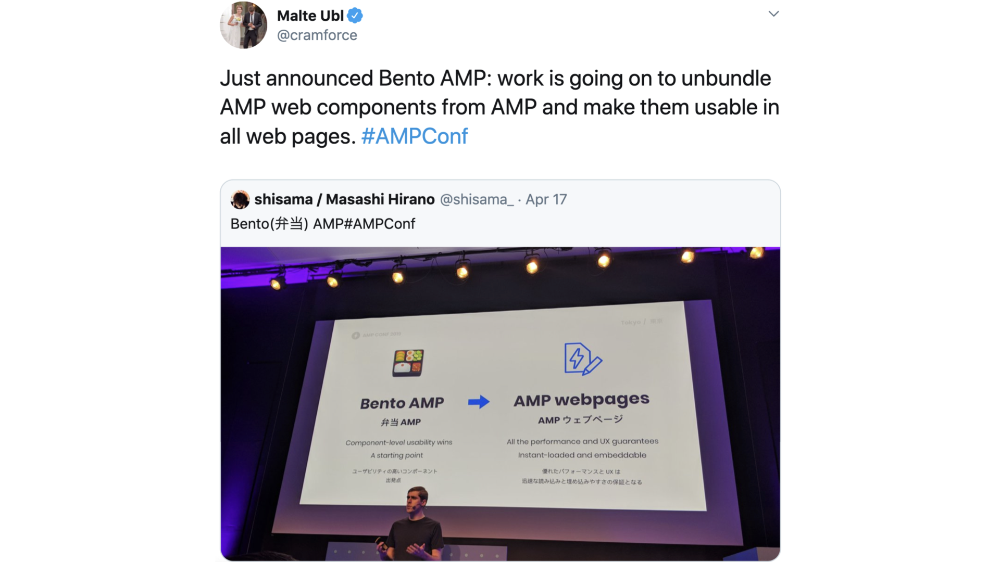

# Jen AMP: Kanonické AMP stránky

Pojďme teď rozebrat způsob tvorby webu s AMP, který by mohl být do budoucna dlouhodobě nejudržitelnější. Zatím má však jeden háček.

Frontendové řešení pro způsob implementace „AMP Only“ je postavené opravdu pouze na AMP komponentách.

<figure>

<figcaption markdown="1">
_Schéma návrhu architektury „AMP Only“._
</figcaption>
</figure>

Tady prostě pro „normální HTML“ není místo. Veškerý frontend je realizovaný pomocí AMP HTML a AMP komponent.

## Proč tak radikálně?

Důvody, proč může být tento postup výhodnější oproti [výrobě zvláštní verze](amp-implementace-extra-verze.md), jsou stejné jako ty, kterými jsme hájili tvorbu responzivních webů oproti údržbě mobilní a desktopové verze stojící vedle sebe: Efektivita, efektivita a ještě jednou efektivita.

## Mobilní webe, už jsi tady zase?

Jasně! Vypráví se zde stejný příběh jako v případě takzvaných „m tečka“ webů – zvláštních mobilních verzí fungujících vedle tehdy běžných webů pro desktopové počítače.

Autorům poměrně rychle vyřeší problém – poskytnutí obsahu mobilním uživatelům.

Jenže kvůli neefektivitě aktualizací dvou webů dříve či později usilovali o přechod na sjednocující verzi, responzivní web.

Přístupy označované v anglických textech jako „AMP First“ a „AMP Only“ jsou ostatně postavené na stejném myšlenkovém paradigmatu jako Mobile First: Udělej jen jednu verzi tak, že ji přizpůsobíš nejvíce omezujícímu kontextu. [vrdl.cz/p/mobile-first](https://www.vzhurudolu.cz/prirucka/mobile-first)

Před lety jsme takto začali uvažovat o řešení pro mobily, dnes se to opakuje i u distribuce obsahu pomocí AMP. Jak už jste asi pochopili, zvláštní verze webu považujeme za fajn dočasné řešení. Efektivita ale týmy požene ke stále většímu sjednocování obou verzí do jedné.

## Ukázky: Tasty.co, Honza Bien a Robin Pokorný

Nesmíme tady zapomenout na ukázky webů postavených pouze na AMP.

<figure>

<figcaption markdown="1">
_Velký „receptový“ web Tasty.co a dva české osobní weby jako příklady totálního upřednostnění AMP._
</figcaption>
</figure>

Tasty.co je krásný příklad „kanonické“ implementace AMP, jak o tomto způsobu nasazení mluví autoři technologie. Když se podíváme do HTML zdroje úvodní stránky Tasty.co, začíná takto:

```html
<!DOCTYPE html>
  <html amp…>
```

Ano, AMP HTML je jediná verze řešící oba způsoby distribuce.

Dále v kódu můžeme najít řadu javascriptových knihoven od AMP:

```html
<script src="https://cdn.ampproject.org/v0.js" async>
</script>
<script async custom-element="amp-experiment"
  src="https://cdn.ampproject.org/v0/amp-experiment-0.1.js">
</script>
<script async custom-element="amp-analytics"
  src="https://cdn.ampproject.org/v0/amp-analytics-0.1.js">
</script>
<script async custom-element="amp-fit-text"
  src="https://cdn.ampproject.org/v0/amp-fit-text-0.1.js">
</script>
```

A pak to nejzajímavější. Nenajdeme tady žádný odkaz na AMP verzi v `<link rel="amphtml">`. V kódu se jen skromně krčí kanonický odkaz:

```html
<link rel="canonical" href="https://tasty.co">
```

Stránka odkazuje sama na sebe jako na kanonickou. Roboti platforem se tedy pokusí validovat tutéž stránku jako AMP verzi.

Tasty také používá dynamičtější komponenty, jako jsou `amp-bind` (pro vyhledávání receptů) nebo `amp-form` (pro zobrazování podobného obsahu). Podívejte se ostatně sami: [Tasty.co](https://tasty.co).

Zmiňme i milé kolegy, Robina Pokorného a Honzu Biena, jejichž weby můžete rovněž zkoumat jako příklady implementace jen pomocí AMP: [Robinpokorny.com](https://robinpokorny.com/) a [Webmistr.wtf](https://www.webmistr.wtf/).

## Výhody a nevýhody: Je to efektivnější, ale může být ještě brzy

Protože AMP věříme a vidíme v něm obrovský potenciál a konkurenční výhodu, toto řešení nemůžeme než doporučit všem obsahovým webům jako dlouhodobý cíl.

Přínos je jasný – nemusíte vytvářet a hlavně spravovat dva weby. Vývojářsky, designérsky, marketingově ani jinak. Máte jednu verzi, případně jen mírně odlišnou v AMP distribuci.

Nevýhody si vypočtete sami – vše přizpůsobujete AMP komponentám. Ty jsou docela mocné, ale ne všechno se vám v AMP podaří. Ne každému vývojáři, ne každé designérce, ne každému klientovi mohou prostě zrovna tahle omezení vyhovovat.

### Závislost na AMP runtime

Pak je tu problém se závislostí komponent na rodičovském JavaScriptu. Bez něj, AMP runtime (`https://cdn.ampproject.org/v0.js`), totiž komponenty nefungují. S AMP runtime se ovšem v době psaní článku stahuje kolem 73 kB dat. Není moc prima startovat vývoj stránky s více než dvojnásobkem velikosti jQuery, aniž by byla použita jediná komponenta. Dalším problémem je závislost webů používajících knihovnu AMP na javascriptovém souboru, umístěném na jediné adrese, která může být momentálně nedostupná.

Při otevírání stránky z AMP Cache nás to sice nemusí až tak trápit, ale v tomto textu  propagujeme přístup použití frameworku i pro běžný web. Co s tím?

<figure>

<figcaption markdown="1">
_Interní projekt Bento AMP slibuje rozporcování._
</figcaption>
</figure>

Tento problém má řešit projekt „Bento AMP“, oznámený na konferenci AMPConf 2019. Podle nás jde rozhodně o krok správným směrem a doufáme, že se ho brzy dočkáme.

### AMP Optimizer: Na vašem serveru jako v bavlnce (nebo v keši)

Vzpomenete si ještě, že jsme v textu [o AMP Cache](amp-cache.md) zmiňovali jednu její součást – Optimizer? Připomínáme jen, že jde o nástroj, který automaticky přechroustá zdrojový kód AMP stránky a upraví jej tak, aby podávala lepší výkon.

AMP stránky jsou považované za zdroje k dalšímu zpracování. To se děje právě za pomocí AMP Optimizeru:

* Důležité zdroje jsou prioritizovány pomocí značky `<link rel="preload">`.
* Odstraňuje [„AMP Boilerplate“](amp-html.md), kód určený pro zobrazování stránky v neoptimalizovaných prostředích.
* Automaticky vkládá CSS jako „kritické“ do značky `<style>`.

Více je v textu článku „How to make AMP even faster“. [vrdl.in/ampopt](https://amp.dev/documentation/guides-and-tutorials/optimize-and-measure/optimize_amp)

Řešení „kanonických AMP stránek“ tedy sjednocuje frontendový kód, ale zase si vyžádá nemálo práce na optimalizacích kódu. A i tak se vám (zatím) kvůli nutnosti vkládání „AMP runtime“ může stát, že AMP stránka bude pomalejší než její non-AMP kolegyně. To snad ale brzy vyřeší projekt „Bento“.

Zde uzavřeme různé typy implementace AMP stránek a jejich vztahů s non-AMP verzí webu. Následuje text o jedné další velmi zajímavé třípísmenné zkratce.
