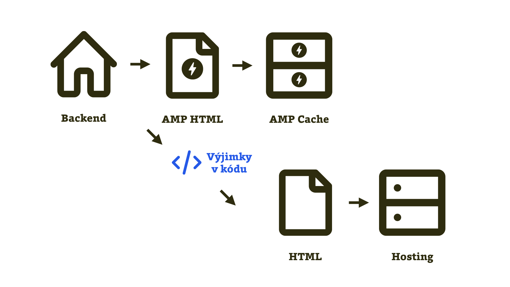

# Nejprve AMP, pak HTML

Buďme teď alespoň na chvíli trochu jako Donald Trump. Že je to strašná představa? No tak, zkuste to. Půjde to lépe, když nacionalismus a fokus na Ameriku vyměníme za víru v naši technologii. Zvolejme: „AMP především!“

Zrychlovací technologii zde upřednostníme jako výchozí verzi. Frontendový kód a komponenty uživatelského rozhraní stavíme na tom, co nabízí AMP.

I když to třeba může znamenat kompromisy pro kanonický web, může to být velmi efektivní z pohledu procesu výroby a údržby webu.

Pak pomocí výjimek v backendovém kódu ošetříte místa, kde by bylo vhodnější servírovat „normální HTML“ nebo případně externí CSS či vlastní JavaScript.

<figure>

<figcaption markdown="1">
_Obrázek: Schéma fungování implementace „AMP First“._
</figcaption>
</figure>

Jde vlastně o obrácený model k implementaci [upřednostněním HTML](https://docs.google.com/document/d/1c1Rf5sfu9rTTh9taijEnO-gn6WlCRBDYKdZpzWAxsJQ/edit#heading=h.intjgxovbb2).

## Příklad s obrázky imaginárního e-shopu

Zapojíme tady fantazii a představíme si imaginární e-shop postavený tímto způsobem.

Rozhodneme se na něm nasadit lazy loading obrázků, odložení jejich stažení až na chvíli, kdy k nim uživatel doroluje stránku. Je to technika, kterou vřele doporučujeme jako významnou optimalizaci množství stažených dat. Zhruba někdy v druhé polovině roku 2019 se ji sice má naučit Chrome a další prohlížeče, ale my zatím vycházíme z toho, že podpora není dostačující. [vrdl.cz/p/lazy-loading](https://www.vzhurudolu.cz/prirucka/lazy-loading)

Dále bychom rádi, aby prohlížeč rezervoval obrázku místo, než dojde k jeho stažení, a layout nám při vykreslování neposkakoval. A nakonec bychom si přáli chytrou prioritizaci stahování obrázků do stránky. Takže zhruba to, co nabízí komponenta `<amp-img>`.

Nikdo neříká, že ji nemůžete použít na běžném webu. Stačí do stránky přidat AMP runtime:

```html
<script async src="https://cdn.ampproject.org/v0.js">
</script>
```

Řekněme, že kromě důležitých obrázků, které chceme indexovat vyhledávači, jako jsou obrázky produktu na jeho samostatné stránce, můžeme „lazyloadovat“ úplně všechny obsahové obrázky webu. A jsme u řešení „AMP First“, nejprve AMP.

Kousek backendového kódu pro vkládání obrázků pak může zjednodušeně vypadat takto:

```html
<amp-img alt="{ $imageAlt }" src="{ $imageSrc }"
  width="{ $imageWidth }" height="{ $imageHeight }"
  layout="responsive">
</amp-img>
```

Něco takového opravdu můžeme nasadit na drtivou většinu obsahových obrázků. Jen pro ty strategicky důležité, u nichž chceme zajistit indexaci například v obrázkovém hledání na Googlu (a nespoléhat se na funkčnost JavaScriptu), uděláme výjimku:

```php
{if $productDetail}

{/if}
```

Možné je i alternativní řešení: Značku `` uveďte uvnitř značky `<noscript>`, která bude uvnitř `<amp-img>.` Sestrojíte dokonalou obrázkovou matrjošku a roboti tedy použijí obrázek z `` namísto z `<amp-img>,` kterému většina z nich nebude rozumět.

Tímhle způsobem, upřednostňujícím AMP, pak můžeme stavět i další části rozhraní: karusely, akordeony, lightboxy… Komponenty AMP v sobě již obsahují osvědčené praktiky z oblasti výkonnosti webu a díky tomu, že to jsou jen javascriptové komponenty, je možné je použít i na běžném webu.

Asi si všimnete, že různými způsoby implementace v textech procházíme od nejopatrnějšího nasazení AMP k řešení, které je zcela závislé na téhle technologii.

Přístup upřednostnění AMP je o kousek dál než dříve zmíněné upřednostnění HTML verze. Ve skutečnosti se ale tyto přístupu budou prolínat a střídat i v rámci jediného projektu.
