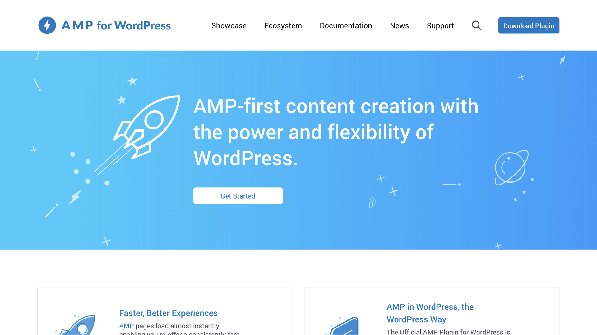

# Pluginy redakčních systémů

Pokud používáte známé redakční systémy jako WordPress nebo Drupal, vytvoření AMP stránek pro vás může být relativně snadné. Jsou zde totiž pluginy, které práci převezmou alespoň částečně za vás.

Jmenujme příklady:

* WordPress: [wordpress.org/plugins/amp](https://wordpress.org/plugins/amp)
* Drupal: [drupal.org/project/amp](https://www.drupal.org/project/amp)
* Joomla: [extensions.joomla.org/extension/jamp](https://extensions.joomla.org/extension/jamp/)

Blíže se podíváme na první jmenované rozšíření do nejpopulárnějšího systému pro správu webů.

## Plugin pro WordPress

<figure>

<figcaption markdown="1">
_AMP plugin pro redakční systém, který někteří vývojáři nemohou vystát, ale skoro všichni uživatelé milují._
</figcaption>
</figure>

Plugin „AMP for WordPress“ nainstalujeme a pak si můžeme vybrat, v jakém režimu bude váš WordPress implementovat AMP:

### Reader

Klasický režim, kdy k článkům dostanete AMP verzi automaticky. Je vytvořená zvláštní šablonou, kterou je možné upravovat jen zlehka. Jedná se o jednoduché řešení, ale pro vážnou práci s AMP to příliš nedoporučujeme, protože design obou verzí stránek bude pravděpodobně dost odlišný.

### Transitional

Na zvláštní URL adrese vytvoří plugin AMP verzi všech stránek, ale použita bude aktuální šablona. Pokud tedy uděláte chybu a AMP verze neprojde validací, jako alternativní řešení je k dispozici běžná verze webu. Jedná se tudíž o implementaci architektury „[nejprve HTML, pak AMP](amp-implementace-vyjimky.md)“ v podání WordPressu.

### Native

Totéž jaké „transitional“, ale neexistují zde zvláštní URL pro AMP verze. Stránka prostě odkazuje sama na sebe. Předpokladem je, že na straně HTML máte [řešení kanonických AMP stránek](amp-implementace-jen-amp.md), ve kterém jsme byli ponoření před chvílí.

Jak vidíte, možností máme dostatek. Při jejich volbě ale sakramentsky záleží na tom, zda a jak vaše šablona pro WordPress podporuje AMP. Být vámi, velmi se na to při výběru šablony soustředíme.

Plugin se velmi rychle vyvíjí vpřed. V poslední verzi přidal mj. podporu pro Service Worker nebo [AMP Stories](amp-stories.md). Více najdete na jeho oficiálním webu: [amp-wp.org](https://amp-wp.org/documentation/how-the-plugin-works/amp-plugin-serving-strategies/).

Následuje příklad toho, že na pluginu pro WordPress může vzniknout úspěšný web AMP.

### Dotekománie.cz

Dotekománie patří k velkým českým webům přinášejícím technologické novinky.

<figure>

<figcaption markdown="1">
_HTML a AMP verze Dotekománie.cz._
</figcaption>
</figure>

Šéfredaktor webu Přemysl Vaculík byl tak laskavý, že se s námi podělil o zkušenosti z aktualizace webu, která proběhla v roce 2018. AMP brali od začátku jako technologii, která je pro provozovatele obsahového webu zajímavá. I tady byli úspěšní. Po spuštění nové verze, která zahrnovala i AMP variantu, získali kolem jedné třetiny návštěvnosti navíc. Noví návštěvníci přicházeli zpravidla ze služeb Googlu jako třeba Google News. V tuto chvíli evidují nárůst používání AMP i z jiných služeb.

## Výhody a nevýhody pluginů

Lesk pluginů může být v jednoduchosti nasazení AMP. Bída pak znovu v oné jednoduchosti: viz třeba režim „Reader“ u rozšíření pro WordPress, kde pro vás nebude možné dosáhnout stejného vzhledu a funkčnosti, jako má váš plnohodnotný web.

To by pro základní přehled o tomto specifickém způsobu implementace mohlo stačit. Došli jsme až na konec třetí kapitoly. Načerpali jsme znalosti o možnosti návrhu architektury zahrnutí AMP do vašich webů a po krátkém testu si prohlédneme weby, které AMP implementovaly.
