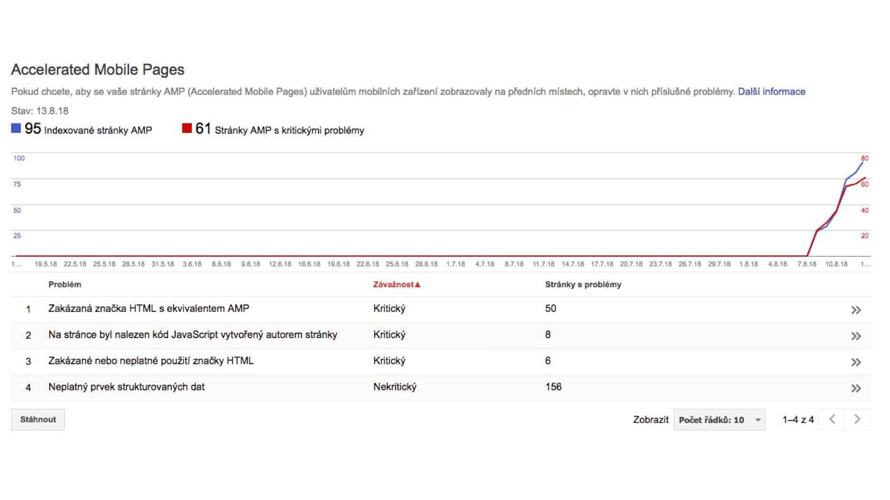

# Implementace AMP: Výjimky v kódu {#vyjimky}

Tohle je tak trochu hybridní řešení: Vezmete stávající web a pokud zjistíte, že by AMP validací neprošly jen jeho konkrétní části, upravíte je pomocí výjimek v kódu na serverové straně.

Jak už víte, je řada věcí, ve kterých musí kód AMP stránky vypada jinak než v případě ne-AMP verze. Měli byste například:

- Do hlavičky vložit „AMP boilerplate“: `<style amp-boilerplate>`.
- Do `<style amp-custom>` vypsat všechny vaše CSS k dané stránce.
- Značky `` nahradit pomocí `<amp-img>`.
- Vkládaný kód z YouTube vyřešit pomocí `<amp-youtube>`.

Seznam výjimek je samozřejmě delší. Ale jsou to pořád výjimky. To znamená, že velká část kódu je totožná pro obě verze.

Toho můžete využít a připravit nové adresy AMP stránek, ve kterých budete ošetřovat právě jen tyhle speciální případy.

V tomhle případě můžu ukázat kousky backendového kódu, protože jsem byl přímo u jeho nasazování. Hádejte, na kterém webu jsem nasazoval AMP poprvé?

## Případ Vzhůru dolů

Ano, na svém vlastním web aktuálně používám tenhle způsob implementace. Princip je jednoduchý. Vezměme, že články mají adresu tohoto typu:

```url
https://www.vzhurudolu.cz/prirucka/css3-flexbox
```

Pak AMP verze budou mít vždy tuto adresu:

```url
https://www.vzhurudolu.cz/amp/prirucka/css3-flexbox
```

AMP-HTML stránka i kanonická HTML stránka pak na sebe odkazují formou meta značek. To už víte.

### Úprava hlavičky HTML kódu

V části kódu běžící na serveru pak máme proměnnou `$ampActive`, která se poté používá pro řešení výjimek. Zde je vidět vkládání stylů v syntaxi používající šablonovací jazyk Latte:

```latte
{if $ampActive}
  {include include/amp/amp-boilerplate.latte}
  {include include/amp/styles.latte}
{else}
  {include include/styles.latte}
{/if}
```

Pro vysvětlení: V části pro AMP-HTML verzi vkládáme „AMP boilerplate“ (soubor amp/amp-boilerplate.latte) a zvláštní styly pro AMP verzi (amp/styles.latte). V HTML verzi pak už jen běžné odkazy na CSS (styles.latte).

### Obrázky

Další změna je vidět ve výstupním filtru, kterým upravujeme kód značky ``:

```php
foreach ($html->find('img') as $element) {
  if ($ampActive) {
    $element->tag = 'amp-img';
    $element->layout = 'responsive';
    $element->width = '1.6';
    $element->height = '0.9';
    $element->outertext = $element->makeup() . sprintf('</%s>', $element->tag);
  }
}  
```

V PHP kódu se děje následující:

- Najdeme všechny tagy `` (`$html->find('img')`, používáme zde knihovnu „PHP Simple HTML DOM Parser“) a procházíme je cyklem.
- Pokud jsme na AMP-HTML verzi, měníme značku z `` na `<amp-img>`.
- Přidáváme také atributy s hodnotami `layout=responsive`, který znáte z textu o layoutu.
- Pak také související poměr stran: `width=1.6`a `height=0.9`.
- Nakonec to celé v části `$element->outertext` poskládáme dohromady.

Tímhle způsobem prochroustáme všechny HTML prvky, které se pro obě verze budou lišit.

### Kód třetích stran

Kromě obrázků je to zejména kód třetích stran. Na blogu používám následující:

- `<amp-youtube>` za běžný vkládaný kód z YouTube.
- `<amp-twitter>` namísto vkládaného kódu z Twitteru.
- `<amp-iframe>` pro vkládání kódu dalších služeb, jako je SoundCloud.

## Pohled do Search Console

Jako i pro jiné účely vám vřele doporučuji v případě nasazení AMP sledovat [Search Console](google-search-console.md) od Google.

<figure>

<figcaption markdown="1">
*Chvíli po nasazení AMP na Vzhůru dolů. Počet indexovaných stránek je skoro stejně vysoký jako počet chyb*
</figcaption>
</figure>

Je asi dobré zmínit, že AMP stránky se ve výsledcích vyhledávání začaly zobrazovat asi dva dny po přidání meta značek propojujících obě verze.

Ale jak vidíte z prvního obrázku, Search Console začala hned hlásit vysoký počet chyb. Většinou šlo o zakázané značky: vkládané iframe třetích stran. To jsme vyřešili filtry, které jsou uvedené výše. Další problémy bly v kouscích javascriptového kódu přímo v HTML, což je v AMP zakázáno.

Po úpravách je to následovně:

<figure>

<figcaption markdown="1">
*Pohled už z nové Search Console: Počet chyb je minimální*
</figcaption>
</figure>

Dovolím si tady krátkou obecnou odbočku: Pokud vaše AMP stránka neprojde validací, neznamená to, že nejste v Google. Jste tam. Dokonce v původních pozicích. Jen vás reprezentuje běžný web, nikoliv AMP.

## Výhody a nevýhody řešení výjimkami

Nevýhody jsou jasné – trošku si zkomplikujete backendový kód. Prostě ty výjimky musíte někde ošetřit. Za sebe mohu říct, že ono řešení pomocí filtrů zase tak složité a čitelnost kódu komplikující není.

Výhoda z pohledu vývojáře se nabízí. Nespravujeme dvě různé verze webu.

V dalším kroku se nabízí pohled na design projektu a aplikovaní stejné logiky. Pokud totiž používáme různé javascriptové knihovny pro jednu věc (lightbox), nebylo by lepší je prostě sjednotit a i na běžném webu použít verzi pro AMP?

## Aktuální stav na Vzhůru dolů a výhled do budoucna

V tuhle chvíli je AMP nasazené jen na detailech článků. Nechávám to chvíli běžet a pak si tuhle část pro sebe vyhodnotím.

Pokud s tím budu spokojený, nastane fáze dvě - nasazení AMP na všechny stránky webu. A maximální využití knihoven pro prvky uživatelského rozhraní, které AMP nabízí. Jdu tedy směrem k AMP-first webu.

