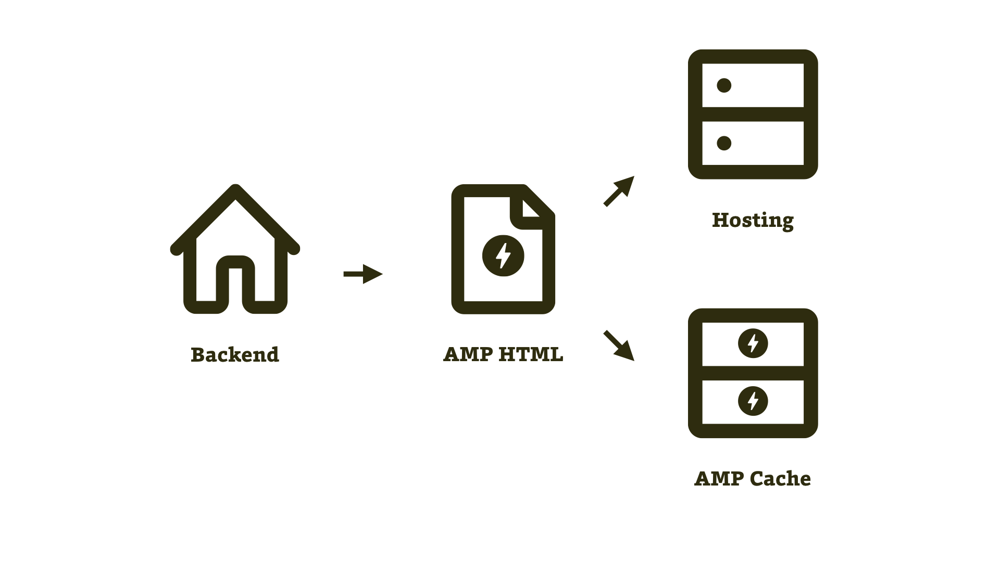

# Nejprve HTML, pak AMP

Tohle je tak trochu hybridní řešení: Vezmete stávající web, a pokud zjistíte, že by validací AMP neprošly jen jeho konkrétní části, upravíte je pomocí výjimek v kódu na serverové straně.

<figure>

<figcaption markdown="1">
_Implementace AMP výjimkami v kódu. Základ aplikace a HTML kódu je totožný. Pro AMP distribuci se však udělá na úrovni backendu několik výjimek._
</figcaption>
</figure>

Jak už [víte z druhé kapitoly](amp-html-css-komponenty.md), je zde řada věcí, ve kterých musí kód AMP stránky vypadat jinak než v případě non-AMP verze. Měli byste například do hlavičky vložit „AMP Boilerplate“ (`<style amp-boilerplate>`). Změn oproti non-AMP verzi je samozřejmě více. Ale jsou to pořád výjimky. To znamená, že velká část kódu může být totožná pro obě verze.

Toho můžete využít a připravit nové adresy AMP stránek, ve kterých budete ošetřovat právě jen tyto zvláštní případy.

Na následujícím příkladu můžeme ukázat kousky backendového kódu, protože jsme byli přímo u jeho nasazování. Hádejte, na který web aplikoval jeden z autorů knihy AMP poprvé?

## Případ Vzhůru dolů

Ano, tenhle způsob implementace aktuálně používá Martin na svém vlastním webu.

<figure>

<figcaption markdown="1">
_non-AMP a AMP verze článku o… no hádejte!_
</figcaption>
</figure>

Princip je jednoduchý. Řekněme, že články mají adresu tohoto typu:

```url
https://www.vzhurudolu.cz/prirucka/css3-flexbox
```

AMP verze pak budou mít v případě Vzhůru dolů vždy tuto adresu:

```url
https://www.vzhurudolu.cz/amp/prirucka/css3-flexbox
```

AMP stránka i kanonická HTML stránka na sebe odkazují formou metaznaček. To už víte [z první kapitoly](amp-fungovani.md).

### Úprava hlavičky HTML kódu

V části kódu běžící na serveru pak máme proměnnou `$ampActive`, která se poté používá pro řešení výjimek. Zde je vidět vkládání stylů v syntaxi používající šablonovací systém Latte:

```php
{if $ampActive}
  {include include/amp/amp-boilerplate.latte}
  {include include/amp/styles.latte}
{else}
  {include include/styles.latte}
{/if}
```

Pro vysvětlení:

* V části pro AMP verzi vkládáme „AMP Boilerplate“ (soubor `amp/amp-boilerplate.latte`) a zvláštní styly pro AMP verzi (`amp/styles.latte`).
* V HTML verzi pak už jen běžné odkazy na CSS (`styles.latte`).

### Obrázky

V původní verzi má obrázek zhruba tento kód:

```html

```

Předmětem další úpravy tedy bude jeho převedení na AMP komponentu `<amp-img>` pomocí výstupního filtru v PHP:

```php
foreach ($html->find('img') as $element) {
  if ($ampActive) {
    $element->tag = 'amp-img';
    $element->layout = 'responsive';
    $element->width = '1.6';
    $element->height = '0.9';
    $element->outertext = $element->makeup() . sprintf('</%s>', $element->tag);
  }
}
```

V předchozím PHP kódu se děje toto:

* Najdeme všechny tagy `` (`$html->find('img')` – používáme zde knihovnu „PHP Simple HTML DOM Parser“) a procházíme je cyklem.
* Pokud je uživatel na AMP verzi, měníme značku z `` na `<amp-img>`.
* Přidáváme také atributy s hodnotami `layout=responsive`, které znáte [z textu o layoutu](amp-layout.md).
* Pak také související poměr stran: `width=1.6` a `height=0.9`, protože všechny obrázky na blogu mají poměr stran 16 : 9. Nakonec to celé v části `$element->outertext` poskládáme dohromady.

S výsledkem by už měl být AMP validátor spokojený:

```html
<amp-img src="obrazek.jpg" alt="Obrázek"
  width="1.6" height="0.9" layout="responsive">
</amp-img>
```

Tímhle způsobem přechroustáme všechny HTML prvky, které se v obou verzích mají lišit.

### Kód třetích stran

Kromě obrázků jde zejména o kód třetích stran. Na blogu používáme například následující komponenty od AMP:

* `<amp-youtube>` se vkládá namísto běžného `<iframe>` z YouTube.
* `<amp-twitter>` namísto vkládaného kódu z Twitteru.
* `<amp-iframe>` u kódu dalších služeb, jako je SoundCloud.

Když už jsme u konkrétního webu, podívejme se, jak nasazení vypadalo v praxi.

## Pohled do Search Console

Nasazení technologie s bleskem v logu na web vám doporučujeme sledovat v nástroji Search Console od Googlu. [vrdl.cz/p/google-search-console](https://www.vzhurudolu.cz/prirucka/google-search-console)

<figure>

<figcaption markdown="1">
_Chyby na AMP stránkách ve starém rozhraní Search Console chvíli po nasazení AMP na Vzhůru dolů. Počet indexovaných stránek je skoro stejně vysoký jako počet chyb._
</figcaption>
</figure>

Je asi dobré zmínit, že AMP stránky se ve výsledcích vyhledávání začaly zobrazovat asi dva dny po přidání metaznaček propojujících obě verze.

Ale jak vidíte z prvního obrázku, nástroj Search Console začal hned hlásit vysoký počet chyb. Většinou šlo o zakázané značky, zde hlavně vkládané `<iframe>` třetích stran. To jsme vyřešili filtry, které jsou popsané výše.

Další problémy spočívaly v kouscích javascriptového kódu přímo v HTML. Už víte, že to je to poslední, za co by vás AMP validátor mohl pochválit.

Po úpravách je to následovně:

<figure>

<figcaption markdown="1">
_Pohled už z nové Search Console: Počet chyb je minimální._
</figcaption>
</figure>

Tady si dovolíme krátké zopakování pro ty z vás, kteří snad nečtete slovo od slova: Pokud vaše AMP stránka neprojde validací, neznamená to, že nejste v Googlu. Jste tam. Dokonce v původních pozicích. Jen vás reprezentuje běžný web, nikoliv AMP.

## Výhody a nevýhody řešení „nejprve HTML, pak AMP“

Nevýhody jsou jasné – trošku si zkomplikujete backendový kód. Ty výjimky zkrátka musíte někde ošetřit. Za sebe ale můžeme říct, že ono řešení pomocí filtrů zase tak složité a komplikující není.

Výhoda z pohledu vývojáře se nabízí – nespravujeme dvě různé verze webu.

Vsadíme se, že mnoha čtenářům právě v hlavě naskočila následující otázka. Řekněme, že třeba pro lightbox na kanonické, non-AMP stránce používáme nějaký jQuery plugin typu Fancybox a na AMP stránce pak `<amp-lightbox>`.

Pokud už tedy máme dvě komponenty pro jednu věc, nebylo by lepší je sjednotit a i na kanonickém webu použít komponentu `<amp-lightbox>`?

Nevíme jak vy, ale my si odpovídáme: Ano, bylo by to lepší.

## Aktuální stav na Vzhůru dolů a výhled do budoucna

V tuhle chvíli je AMP nasazené jen na detailech článků, detailech školení a několika málo dalších typových stránkách. V přípravě je fáze dvě – nasazení zrychlovací technologie na všechny stránky webu. A ve výhledu třetí fáze – maximální využití knihoven pro prvky uživatelského rozhraní, které AMP nabízí.

Případovou studii nasazení na Vzhůru dolů tedy právě teď zneužíváme jako oslí můstek k dalšímu řešení – napřed AMP, pak AMP.
