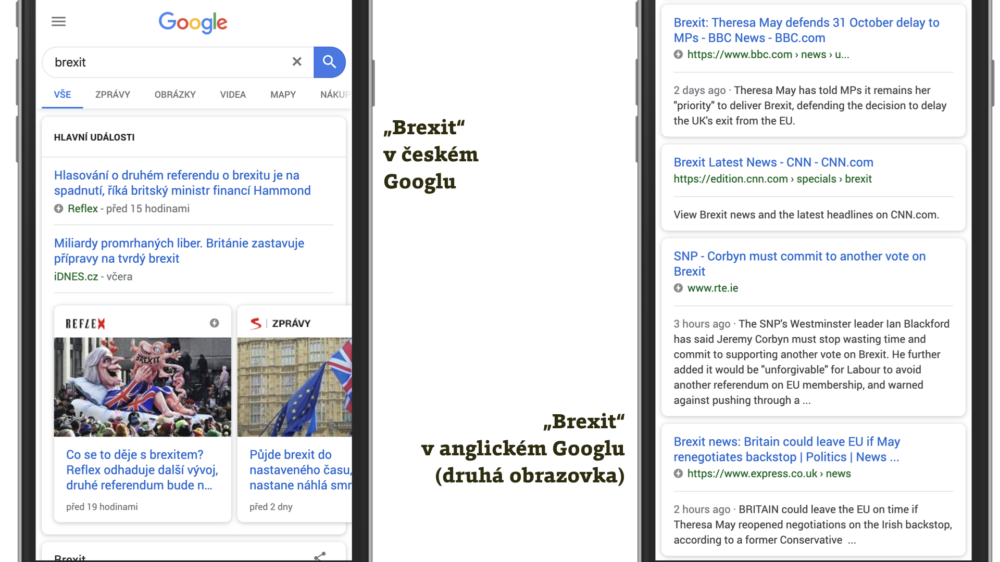

# Dává pro vás AMP smysl?

I když působnost AMP omezíme na statičtější weby, tedy ty obsahové a částečně i e-shopy, je potřeba říct, že nasazení této technologie nemusí být vhodné úplně pro všechny.

V této části se na věc podíváme z té druhé, jednodušší strany. Pro koho se hodí nejvíc?

## Měli byste nasadit AMP?

Položíme vám sadu otázek. Čím víc kladných odpovědí nasbíráte, tím pravděpodobnější je, že byste měli AMP zvážit.

### 1) Máte hodně obsahu a hodně konkurence?

Možná děláte zpravodajství, recepty nebo v konkurenčních segmentech v e-shopech. Pak je jasné, že máte hodně konkurence na Googlu, Facebooku a dalších platformách, ze kterých uživatelé na web přistupují.

V takovém případě pro vás může AMP znamenat nezanedbatelnou konkurenční výhodu, jak už víte z textu [o přínosech nasazení AMP](https://docs.google.com/document/d/1suLlfSI9Fkjn4WxG0JU2s82C3W02nK49J-zaTAtg63g/edit) v první kapitole. Pravděpodobně získáte vyšší návštěvnost z mobilních výsledků vyhledávání na Googlu, budete zastoupení na místech, kde bez AMP máte nižší šanci se dostat (zpravodajský karusel), a hlavně dostanete příležitost vylepšit si klíčové obchodní ukazatele stránek enormně rychlým vstupem.

<figure>

<figcaption markdown="1">
_Obrázek: V českém Googlu jsou AMP stránky zatím relativně vzácné. O to zajímavější je to pro jejich majitele. Do karuselu s obrázky se jiné než AMP stránky skoro nedostanou._
</figcaption>
</figure>

### 2) Jsou pro vás klíčové vstupy, kde se používá AMP Cache?

Ať už vás zajímají nákupní konverze, nebo jiné cíle, jako je třeba počet zhlédnutých stránek, rychlý vstup na web z AMP Cache vaši uživatelé ocení.

Už z textu [Kde je možné potkat AMP stránky?](https://drive.google.com/open?id=1W57NJXoq7-EFpKOvdnelft4Qg3xl9KAjp5aFBExlmqc) víte, že tohle platí v českém prostředí zejména pro vstupy z Googlu – hlavně z jeho výsledků vyhledávání nebo z navrhovaných článků v Chromu. Dále pak z mobilní aplikace od LinkedIn nebo z některých částí mobilního Twitteru.

Pro celosvětový trh je ještě zajímavý vyhledávač Bing nebo mobilní aplikace od Pinterest. Navíc předpokládáme, že míst, kde se použije zakešovaný obsah, bude přibývat.

### 3) Máte flexibilní vývojářské prostředí?

Otázku pokládáme především z pohledu řešení pro správu obsahu. Dokážete snadno produkovat upravenou verzi webu?

Z [druhé kapitoly](https://drive.google.com/open?id=1ldmb0EuTf0WchRLBOIqq6DzNoTfTZlnJWvkTZ3weZiQ) víte, že například WordPress nebo Drupal umožňují vytvářet AMP verzi na jedno kliknutí. Zároveň  to ale není kvůli odlišnému designu nejlepší řešení. Pravděpodobně budete potřebovat upravit výchozí šablony webu, zajistit produkování AMP i non-AMP varianty.

Pokud dodavatel vašeho redakčního systému AMP nepodporuje, hned mu napište.

### 4) Pracujete na novém webu?

Tohle je samozřejmě bod, který přebíjí vše. Pokud začínáte pracovat na redesignu nebo změně technického řešení a zároveň máte jakýkoliv statický nebo polostatický obsah (články nebo e-commerce), pak vám velmi, velmi doporučujeme nad AMP přinejmenším uvažovat.

### 5) Oceníte zkratku ke zrychlení webu?

AMP také může znamenat rychlou výrobu rychlého webu. Neradi bychom zapomněli ani na tento důležitý argument pro nasazení technologie s bleskem v logu. Jak jsme psali v první kapitole, [složitost současného webdesignu](https://docs.google.com/document/d/1HN4Y1Pr7O8mKVobUZbri_CwbJH5fG1wSLPP8XcETl8A/edit#heading=h.e61oil9g090r) často komplikuje cestu za rychlejším webem. Někteří Martinovi klienti by mohli vyprávět… Vytvoření zvláštní AMP verze tak může být u komplexních webů právě zkratkou k výrobě výrazně rychlejší verze.

Jdete do toho?

Ještě než začnete navrhovat a programovat, přečtěte si pár dobře míněných rad.

## Tři rady, než začnete pracovat na AMP verzi

### Design a funkčnost? Nedělejte to napůl

Následující vzorec chování jsme odsledovali hned na několika webech:

_– Zadavatel: Pojďme udělat AMP verzi._  
_– Webař: Bezva, stojí to tolik a tolik._  
_– Zadavatel: Ježiš, to je moc. Kolik by to stálo, kdybychom to nasadili jen tady na tyhle stránky, neudělali tam košík a navigaci taky vyhodili?_  
_– Webař: To by stálo jenom tolik._  
_– Zadavatel: Beru._  

_(Přestávka, během níž se diváci občerství, následuje střih zpět: Po měsíci vývoje a dvou měsících měření.)_

_– Zadavatel: Koukal jsem do analytiky a ta AMP verze má hodně slabý čísla._  
_– Webař: Jo, on ten AMP je celej divnej…_  

Ano, když se to udělá napůl, obvykle to nefunguje. Pro tohle uvažování „vyzkoušíme a uvidíme“ však máme i my pochopení.

Úplně stejné to bylo, když na web vtrhly mobily. Spousta firem investovala do narychlo spíchnutých, polovičatě fungujících mobilních webů… Aby po letech znova investovala do pořádně udělaných responzivních webů. S AMP jsme bohužel nucení stejný příběh opakovat.

Radíme vám tedy, abyste udělali AMP verzi pořádně z pohledu designu. Snažte se především zajistit, aby vypadala a používala se stejně (či velmi podobně) jako váš běžný web. Lidé budou při konzumaci vašeho obsahu přecházet mezi oběma verzemi a každý kompromis v designu uvidíte v číslech.

Pokud máte omezené prostředky, ušetřete na množství šablon, kde vám AMP běží.

### Chcete ušetřit? Nasaďte AMP na omezenou část webu

Je dobré si uvědomit, že výhody AMP ocení vaši uživatelé nejvíce na vstupu na web.

Pokud tedy provozujete například e-shop, nemusíte příliš přemýšlet, jak do AMP převést košík a celý nákupní proces. Ten klidně může zůstat na běžném webu. Klíčové jsou „landing pages“ typu detail produktu nebo kategorie produktů.

Pomozme si s několika příklady z praxe českého webu:

* Alza.cz zkoušela AMP na detailu už neprodávaného produktu, který je z pohledu designu řádově jednodušší než jiné vstupní stránky.
* Na Vzhůru dolů nasadil Martin AMP nejprve na detail článku, což je nejčastější vstupní stránka z výsledků vyhledávání.

Pavel Jašek z Googlu nám dal hezký tip na výrobu specializované AMP landing page pro dobře kontrolovatelnou návštěvnost, jako jsou PPC kampaně nebo newsletter. Tady je i možné testovat vliv AMP na konverze a nejen to.

Pavel dodává: „Zároveň se tím odstíní velké množství efektů chování na webu od původní hypotézy, ve které chceme ověřit, zda rychlejší uživatelský prožitek na přechodu z nějakého zdroje na web může způsobit efekt ve sledované metrice.“

### Testujte, testujte a ještě jednou… měřte

Případové studie o AMP ze světa i ČR vypadají docela přitažlivě. Nejsou ovšem žádnou zárukou toho, že nasazení technologie bude dobře fungovat i vám. Riziko, že ji špatně nasadíte, je zhruba stejně velké jako to, že ji špatně změříte.

Pokud můžete AMP vyzkoušet na jedné, dvou vstupních stránkách, máte vyhráno.

Google Ads nabízí hezký návod „Testování kampaní AMP“, kde je možné naučit se posílat návštěvnost z reklamy na AMP i non-AMP verzi a výsledek vyhodnotit. A/B testy dvou verzí doporučuje dělat pomocí nástrojů „Koncepty a experimenty“ nebo „Varianty reklam“. [vrdl.in/AMPSplit](https://support.google.com/google-ads/answer/9124739)

Další problém může nastat při měření. O tom bychom vám mohli vyprávět! Můžete třeba zkoušet porovnávat konverzní čísla AMP verze nasazené na omezeném počtu stránek se všemi stránkami běžného webu. Nebo si neuvědomíte, že čím dále je AMP stránka od místa skutečných konverzí, tím hůř je možné posuzovat její vliv na obchodní výkon. Pomoci vám může skvělý text „So your AMP test doesn’t perform — now what?“. [vrdl.in/oesnter](https://blog.amp.dev/2018/11/08/so-your-amp-test-doesnt-perform%E2%80%8A-%E2%80%8Anow-what/)

V tuto chvíli snad už víte všechno, abyste mohli AMP nasadit. O způsobech technické implementace píšeme [ve třetí kapitole](https://docs.google.com/document/d/1ldmb0EuTf0WchRLBOIqq6DzNoTfTZlnJWvkTZ3weZiQ/edit#heading=h.m7vqjp3s0dt), takže pokud jste jí dosud nevěnovali pozornost, předejte ji alespoň svým vývojářům. A my se teď podíváme na samotné měření návštěvnosti v AMP verzi.
