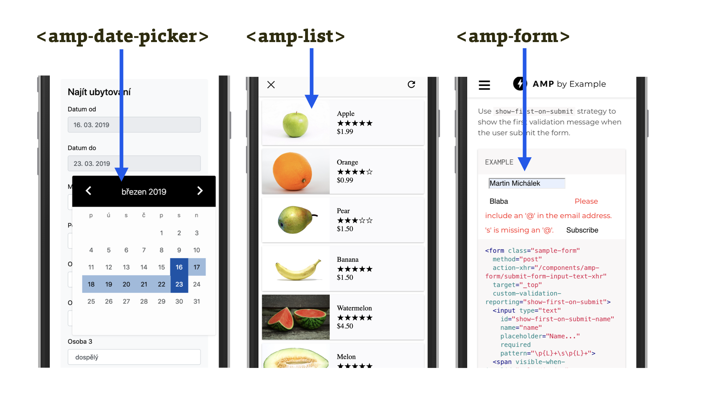

# AMP komponenty pro dynamickou práci s obsahem

Důležitá a pro leckoho překvapivá směsice komponent, které nějakým způsobem pracují na dynamičnosti uživatelského prožitku.

Náhradu frontendových frameworků jako React nebo Vue.js zde nehledejte, ale základní dynamická funkčnost typu „někam kliknu, něco se stane“ nebo „při načítání stránky stáhni aktuální verzi dat“ je AMP vlastní. I přes slovo „Pages“ v názvu technologie.

## amp-bind

Důležitá komponenta pro „bajndování“, provázání jednotlivých částí stránky. Umožňuje akce typu „klikni sem, stane se tohle“. Podívejme se spolu na příklad z dokumentace.

<figure>

<figcaption markdown="1">
_Obrázek: Výchozí text „Hello World“ se po kliknutí na tlačítko změní na „Hello AMP“. Bezva, právě jsme si zaprogramovali v AMP._
</figcaption>
</figure>

Takhle to uvidíte ve zdrojáku:

```html
<p [text]="'Hello ' + foo">
  Hello World
</p>

<button on="tap:AMP.setState({foo: 'AMP'})">
  Change text
</button>
```

Vidět často nestačí, takže ještě vše vysvětlíme:

* Stránka ve výchozím stavu zobrazuje odstavec s textem „Hello World“ a tlačítko.
* Kliknutím nebo tapnutím na tlačítko (`on="tap:…"`) se mění stav stránky, konkrétně proměnná `foo` v něm.
* V odstavci `<p>` pak atribut `[text]` ukazuje dynamickou vazbu. Prostě to, jak má vypadat obsah po vyvolání změny. `'Hello ' + foo` je výraz popisující konkrétní obsah po vyvolání změny.

Vyzkoušet můžete zde: [jsbin.com/gulegul](https://jsbin.com/gulegul/edit?html,output)

Počkejte – stav? Ano, stav! Mrkněme se na něj více.

## Stav aplikace a amp-state

Stav nebo také výchozí datovou strukturu aplikace je možné inicializovat a upravovat. Skoro jako v moderních javascriptových frameworcích. Nejprve výchozí nastavení stavu:

```html
<amp-state id="myLocalState">
  <script type="application/json">
    {
      "foo": "bar"
    }
  </script>
</amp-state>
```

Stav je ale možné inicializovat i z externího zdroje, třeba vašeho webu:

```html
<amp-state id="myRemoteState"
  src="https://example.com/data.json">
</amp-state>
```

Nad strukturou dat udržujících stav lze také samozřejmě provádět nějaké operace:

### AMP.setState()

Nastaví stav, jak už jste viděli u příkladu s tlačítkem. Aktualizovat je pochopitelně možné i složitější struktury dat zapsaných pomocí JSON formátu:

```js
AMP.setState({
  employee: {
  name: 'John Smith',
  age: 47,
  vehicle: 'Car'
  }
})
```

Jsou zde ale i další akce:

* `AMP.pushState()` – je vlastně totéž co `setState()`. Jen ještě navíc přidá záznam do historie prohlížení stránek, podobně jako `history.pushState()`.
* `AMP.printState()` – slouží k vypsání stavu do vývojářské konzole. Je ale potřeba, aby AMP stránka běžela ve vývojářském módu, tedy s `#development=1` v URL adrese.

Detailní informace o fungování „bajndování“ a stavů v AMP jsou už mimo obsahový rámec textu, který čtete. Pro detaily si skočte na dokumentační stránku komponenty `amp-bind`. [vrdl.in/ampbind](https://amp.dev/documentation/components/amp-bind)

Vsadíme boty, že mnohým z vás právě teď docvaklo, že zákaz autorského JavaScriptu není díky takovýmto komponentám zase tak limitující. Podobné to bude i u dalších rozšíření podporujících dynamičnost stránky.

<figure>

<figcaption markdown="1">
_Obrázek: Některé další dynamické komponenty._
</figcaption>
</figure>

Tady je celý seznam dynamických komponent:

* `amp-date-picker` – velice robustní (a dle našeho názoru z uživatelského hlediska hezky udělaná) komponenta pro vkládání data nebo rozsahu dat. Obdoba takto zaměřených pluginů pro jQuery nebo třeba React.
* `amp-form` – vložení formuláře, který je možné validovat a odesílat na straně prohlížeče. Obsahuje také polyfilly pro chybějící vlastnosti prohlížečů, týkající se validace obsahu uživatelských vstupů. Důležitá je možnost odeslání AJAXem pomocí atributu `action-xhr`.
* `amp-geo` – řekne vám, v jaké zemi se uživatel právě nachází.
* `amp-list` – seznam položek aktualizovaný přes data stahovaná z vašeho serveru. Skvělé pro jakékoliv seznamy, které se mění v čase, nebo pro uživatele – aktuální ceny nebo třeba personalizovaný seznam podobných článků.
* `amp-live-list` – opět seznam položek, jen tentokrát aktualizovaný v reálném čase. Vhodné například pro živé přenosy.
* `amp-mustache` – silná komponenta pro zobrazování obsahu pomocí šablon Mustache.
* `amp-next-page` – experimentální komponenta pro načtení dalšího obsahu. Je to podobné jako „nekonečné“ rolování stránky, ale nový obsah umožňuje načíst jen tři dokumenty do stránky.
* `amp-selector` – možnost vložení vlastního výběru.

U poslední komponenty se hodí pozastavit. Opět tím chceme upozornit na široký význam komponent v AMP.

## amp-selector a záložková navigace

`amp-selector` můžete využít jako náhradu pluginů pro rozšíření významu prvku `<select>` – například tak, aby jednotlivé položky zobrazovaly obsah i s obrázky.

Ve skutečnosti má ale komponenta širší záběr. Lze ji použít pro jakékoliv seznamy, kde je potřeba dynamické změny obsahu stránky po aktivaci položky seznamu. Třeba záložkové navigace:

```html
 <amp-selector role="tablist" class="tab-container">
  <h2 role="tab" class="tab-selector"
    selected option="a">
    První záložka
  </h2>
  <div role="tabpanel" class="tab-content">
    Obsah první záložky…
  </div>
  <h2 role="tab" class="tab-selector"
    option="b">
    Druhá záložka
  </h2>
  <div role="tabpanel" class="tab-content">
    Obsah druhé záložky…
  </div>
</amp-selector>
```

Pro inspiraci vás odkazujeme na dokumentaci `amp-selector` nebo na příklady ke knížce Ruadhana O'Donoghueho. [theampbook.com/ch4](https://theampbook.com/ch4/)

## Potřebujete přihlášení uživatele? Půjde to

Do téhle kategorie patří i další komponenty, které s dynamičností stránky souvisejí spíše nepřímo, ale mohou se hodit těm projektům, které živí placení za obsah.

<figure>

<figcaption markdown="1">
_Obrázek: Různé komponenty pro ošetřování přístupu k obsahu na webu The Washington Post._
</figcaption>
</figure>

Tady je opět celý seznam:

* `amp-access` – umožňuje implementaci „paywall“, platební zdi pro obsah. Například po určitém počtu článků zobrazených zdarma.
* `amp-access-laterpay` – paywall implementovaný pomocí mikroplatební služby LaterPay.
* `amp-byside-content` – vložení dynamického obsahu službou BySide.
* `amp-consent` – implementace souhlasu uživatele s podmínkami webu, nejčastěji asi pro modální okno v případě potřeby souhlasu s použitím cookies.
* `amp-install-serviceworker` – instalace Service Worker, což je samo o sobě velmi zajímavé, protože umožní běh kódu v prohlížeči nezávisle na tom, zda se uživatel na aktuální AMP stránku ještě vrátí. Díky Service Workeru můžeme na AMP stránce například přednačíst obsah plnohodnotného webu, jak to zmiňují v textu „Preload your Progressive Web App from your AMP pages“. [vrdl.in/amppwa](https://www.ampproject.org/docs/integration/pwa-amp/amp-to-pwa)
* `amp-user-notification` – lišta pro informování uživatele. Prostě notifikace, která na moment vyjede z dolní části obrazovky.
* `amp-web-push` – vyvolá dialog prohlížeče o možnosti přihlášení k push notifikacím ze stránky. Ty opět využívají Service Worker.

Další komponenty se týkají oblasti, bez které by měly některé dnešní weby poloviční velikost.
