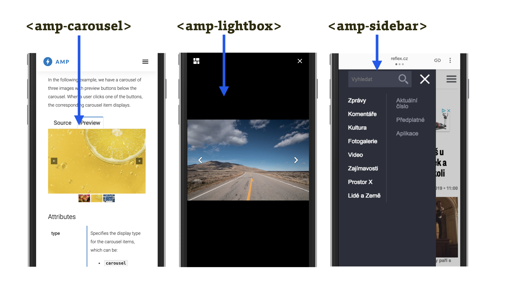
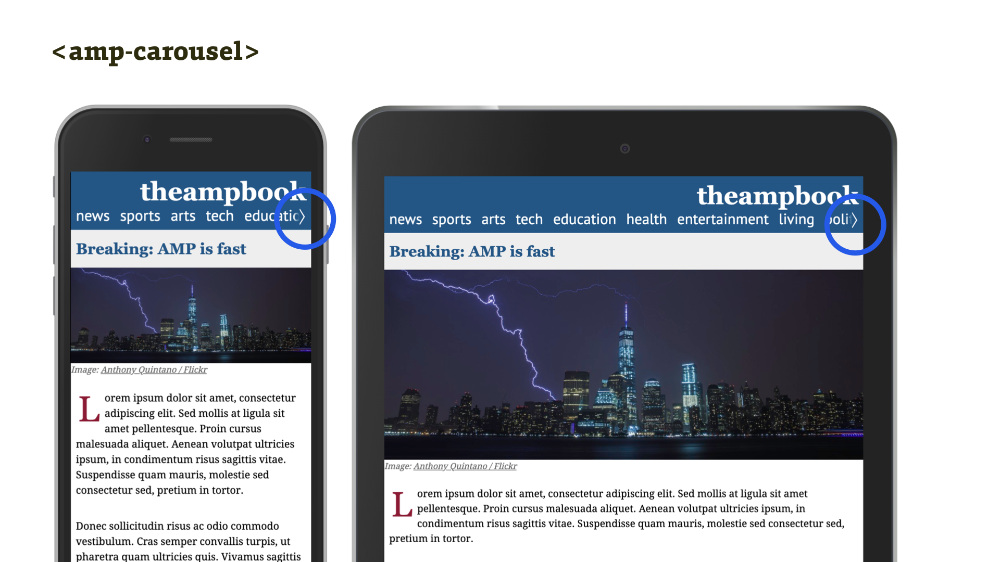
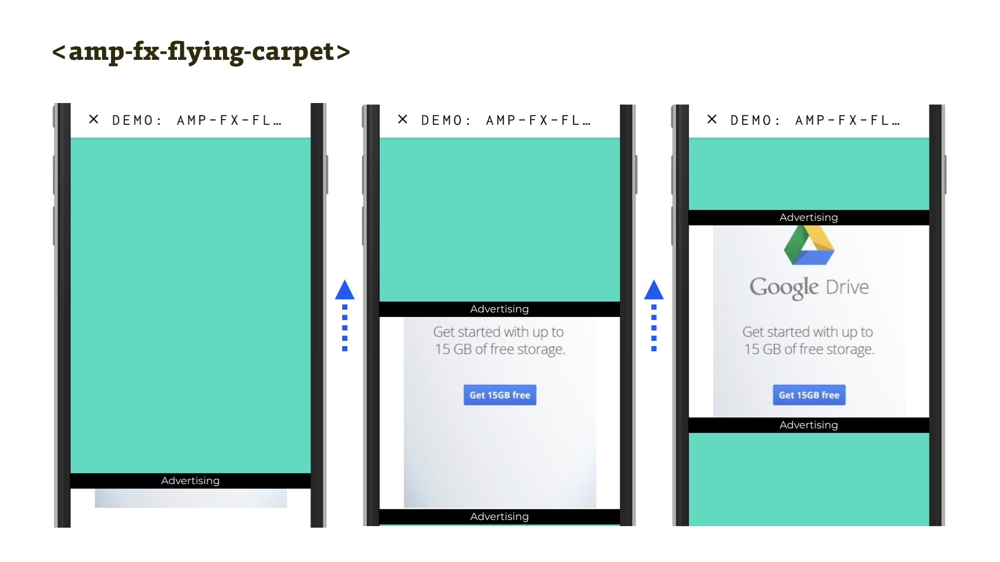

# Komponenty AMP pro uživatelské rozhraní

Tyto komponenty zajišťují kromě rozvržení stránky také nejrůznější prvky uživatelského rozhraní, jako jsou karusely nebo lightboxy.

Je možné je rozdělit do několika podkategorií: [Layout](amp-layout-atribut.md), o kterém už jsme psali dříve v této kapitole, komponenty uživatelského rozhraní, observery (pozorovače), efekty a – tramtadadá – iframe. Jenže neobyčejný iframe.

## Komponenty uživatelského rozhraní

Z tvorby běžných webů znáte komponenty pro tvorbu složitějších prvků uživatelského rozhraní jako všechny možné pluginy pro jQuery a jiné frontendové frameworky.

<figure>

<figcaption markdown="1">
_Obrázek: Tři z obvyklých komponent uživatelských rozhraní webů, tentokrát v podání AMP._
</figcaption>
</figure>

Karusel a lightbox vás zřejmě nepřekvapí. Na obrázku je ale vidět i další – možnost implementace mobilní navigace pomocí komponenty `amp-sidebar`, zde navíc v plné kráse na webu Reflex.cz.

Následuje celý seznam komponent této kategorie:

* `amp-accordion` – „akordeon“, komponenta s možností otevírání sekcí na klik.
* `amp-app-banner` – reklama na mobilní aplikaci, která se ale zobrazí jen v AMP Vieweru. Při zobrazení stránky v prohlížeči dostane přednost systémový „app banner“.
* `amp-carousel` – rolovatelný vodorovný výpis položek, prostě karusel.
* `amp-image-lightbox` – lightbox, tedy komponenta, která obrázek po kliknutí zobrazí v plné velikosti.
* `amp-image-slider` – specifická komponenta pro porovnání dvou verzí obrázku pomocí posuvníku.
* `amp-lightbox-gallery` – lightbox, který umí zobrazit více fotek najednou.
* `amp-lightbox` – opět zobrazení lightboxu, ovšem ne pro obrázek, ale HTML obsah.
* `amp-sidebar` – boční panel, vhodný zejména pro zobrazení navigace na mobilech.

### amp-carousel a abstraktní vnímání komponent

Je dobré si uvědomit, že komponenty jsou v AMP vymyšleny pro snad největší možnou úroveň abstrakce, co se vzhledu týče.

`amp-carousel` tak nemusíme používat jen k zobrazení karuselu (nebo _slajderu_, jak se v Česku občas říká jeho specifické formě) na úvodní stránce webu. Máme jej používat k zobrazení jakéhokoliv obsahu, který se při nedostatku prostoru v okně prohlížeče posunuje doleva nebo doprava.

Je možné najít příklady, ve kterých se tato komponenta používá k výpisu položek „posuvné“ navigace, jež je vždy jednořádková a vypíše takový počet položek, který se v dané šířce okna vejde.

<figure>

<figcaption markdown="1">
_Obrázek: amp-carousel použitý pro zobrazení responzivní posuvné navigace._
</figcaption>
</figure>

```html
<amp-carousel layout="fixed-height" height="1.8rem"
  controls type="carousel">
  <a href="#">News</a>
  <a href="#">Sports</a>
  <a href="#">Arts</a>
  <a href="#">Technology</a>
  <a href="#">Education</a>
</amp-carousel>
```

Vysvětlíme:

* Atributy `layout` a `height` říkáme, že jde o rozvržení fixní výšky, a navigace se tedy nikdy nezalomí.
* Pomocí `controls` uvádíme, že se v případě potřeby mají zobrazit ovládací prvky.
* Atribut `type="carousel"` říká, že jde o karusel, nikoliv o slajdr, který zobrazuje vždy jen jeden prvek a který bychom spustili změnou hodnoty atributu na `slider.`

Zájemce odkazujeme na online ukázku z knížky „AMP: Building Accelerated Mobile Pages“. [theampbook.com/ch4/](https://theampbook.com/ch4/)

## Observery (pozorovače)

„Observery“ asi znáte z JavaScriptu. Autoři AMP některé z nich převedli do vlastních komponent, aby umožnili efekty vznikající na základě změny orientace zařízení a úrovně posunu stránky v prohlížeči. Zde se nezapisují javascriptovým kódem, ale specifickou „HTML značkou“.

Pozorovače můžete využít ve dvou variantách:

* `amp-orientation-observer` – hlídá orientaci zařízení a vyvolává akce. Je možné jej využít v kombinaci s `amp-animation` nebo některými přehrávači videa z dílny AMP.
* `amp-position-observer` – hlídá pozici prvku ve stránce. Na jejím základě lze pouštět například specifické animace.

Chápete to správně – po změně orientace nebo po narolování stránky na určitou pozici je možné spustit animace, navíc ošetřené z hlediska vykreslovacího výkonu, na což u AMP můžete docela sázet.

## Efekty

Jde o kombinaci animací s různými dalšími styly prvků.

* `amp-fx-collection` – kolekce vizuálních efektů a animací. Aktuálně umožňuje efekty typu `parallax` (animaci objektu při posunu stránky), `fade-in` (animované zobrazení objektu při posunu stránky k němu), `fade-in-scroll` (totéž, ale jen s úrovní průhlednosti ovlivňovanou posunem stránky), `fly-in` (vjetí objektu do viewportu při posunu na něj).
* `amp-fx-flying-carpet` – efekt létajícího koberce. Namísto přirozeného umístění se prvek tváří jako fixně pozicovaný na pozadí a stránka přes něj letí jako onen koberec, takže při rolování zobrazuje jen výřez obrázku. Používá se například pro reklamy.

<figure>

<figcaption markdown="1">
_Obrázek: amp-fx-flying-carpet, čili efekt létajícího koberce na webu. Zelené šipky  znázorňují směr rolování tyrkysového obsahu stránky._
</figcaption>
</figure>

## amp-iframe

O komponentě `amp-iframe` se občas mluví jako o „izolepě pro AMP“. Je snad tak silně lepící a univerzálně použitelná?

Rozhodně je silně _zalepující_. Dokáže _zalepit _to, co mnozí vývojáři považují za největší nevýhodu AMP – nepřítomnost JavaScriptu. Do `amp-iframe` je totiž možné psát jakýkoliv JavaScript. Ale zadarmo to nebude, to si nemyslete.

`amp-iframe` je přísnější varianta běžného `<iframe>`:

* Neumožňuje vložení na začátek dokumentu. Není možné jej umístit do prvních `600px` nebo `75%` výšky viewportu, pokud pro něj není definován `placeholder`, tedy zástupný obrázek.
* Je striktně „sandboxovaný“, takže v něm neběží žádné skripty, neotevírá odkazy mimo vlastní rámec a tak dále, dokud to nepovolíte parametrem.
* Zdroj musí být stažen přes zabezpečený protokol HTTPS.
* Zdroj musí být na jiné doméně, než je umístěná AMP stránka, dokud to nezměníte v atributu `allow-same-origin`.

Síla `amp-iframe` je právě v tom, že umožňuje běh klientského JavaScriptu, pokud mu to dovolíte atributem `allow-scripts`.

`amp-iframe` se tak může hodit pro vkládání vlastních specifických komponent. Nebo kódu třetích stran, který nemá vlastní komponentu v AMP. Typickým příkladem je vložení mapy z Google Maps:

```html
<amp-iframe width="200" height="100"
  sandbox="allow-scripts allow-same-origin"
  layout="responsive"
  src="https://www.google.com/maps/embed/…">
  <amp-img layout="fill" 
    src="https://example.com/mapa.png"
    placeholder>
  </amp-img>
</amp-iframe>
```

Kromě vkládání googlích nebo seznamáckých map jsme viděli použití `amp-iframe` i pro komentářovou službu Disqus nebo placení přes rozhraní prohlížeče Payment Request API.

Stránka vložená do `amp-iframe` samozřejmě nemusí být validní, takže sem se toho vejde… Jak ale autoři nabádají – před `amp-iframe` dávejte vždycky přednost existujícím AMP komponentám.

Pro více informací o „izolepě AMP“ vám doporučujeme dokumentaci na amp.dev. [vrdl.in/ampiframe](https://amp.dev/documentation/components/amp-iframe)

Ostatně – všechny komponenty jsou hezky zdokumentované na amp.dev. Podívejte se tam, protože konkrétní popis jejich vlastností je už nad rámec našich textů. [amp.dev/documentation/components](https://amp.dev/documentation/components/)

A teď se vypravíme do světa multimédií.
