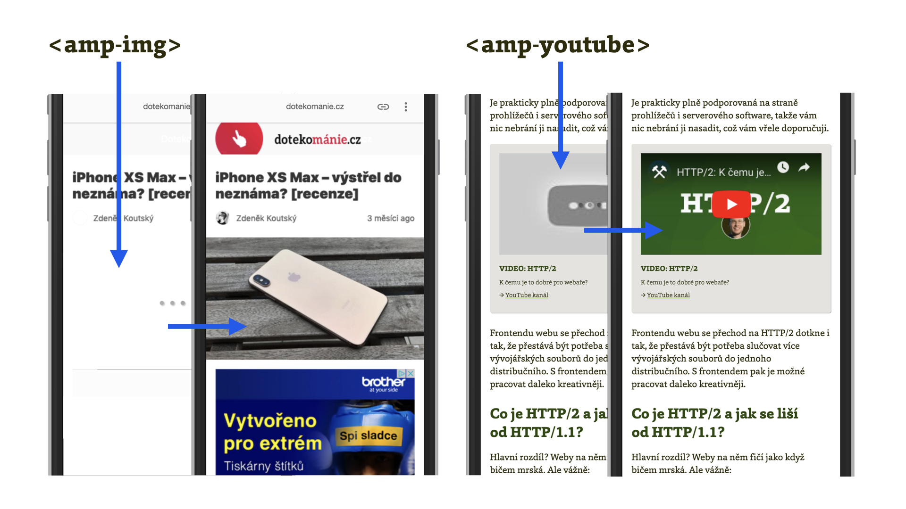

# Komponenty AMP pro multimediální obsah

Obstarávají vkládání externího multimediálního obsahu – obrázky, video a audio.

Tohle je zvláštní směska obecných komponent s těmi velmi konkrétními, určenými pro vkládání obsahu třetích stran, jako jsou videa na YouTube. Podívejme se hlavně na ty obecné a pak na pár nejznámějších konkrétních.

<figure>

<figcaption markdown="1">
_Obrázek: Dvě fáze načítání komponent amp-img a amp-youtube. Nejdříve zástupný symbol, pak obsah. Je tady krásně vidět, že prohlížeč na pomalém připojení díky AMP nestáhne média hned. Tím šetří výkon. A vaše data, samozřejmě._
</figcaption>
</figure>

## amp-img

Asi nejpoužívanější komponenta.

```html
<amp-img alt="Naše chata"
  src="images/chata.jpg"
  width="400"
  height="300"
  layout="responsive">
</amp-img>
```

Rozeberme si to:

* `alt` a `src` – povinné atributy už znáte z klasického HTML.
* `width`, `height` a `layout` – jak už víte z dřívějšího textu, obstarávají udržení plochy v okně prohlížeče ještě před stažením obrázku.

Další možné atributy jsou například:

* `attribution` – přisouzení autorských práv.
* `srcset` a `sizes` – ty už asi znáte. Umožňují vložit zdroje a rozměry v layoutu pro responzivní design. [vrdl.cz/p/srcset-sizes](https://www.vzhurudolu.cz/prirucka/srcset-sizes)

### Preload scanner. Proč AMP nahrazuje značky?

`<amp-img>` umí přinejmenším dvě věci, které běžný tag `` zatím v prohlížečích nezvládne.

Za prvé lazy loading, tedy načtení odložené na moment, kdy uživatel posune stránku směrem k obrázku, což mu ušetří stahování nemalého množství dat.

A pak také rezervaci místa v rozvržení stránky, pomocí atributu `layout`, který už znáte [z dřívějšího textu](amp-layout-atribut.md). Tedy zamezení poskakování stránky při jejím vykreslování.

Běžná značka `` má také jednu tradiční nevýhodu. V prohlížečích existuje funkce známá jako preload scanner, který rychle přečte HTML a hned začne stahovat důležité zdroje: CSS, JavaScript a také obrázky v ``.

V tomto jsou prohlížeče značně tvrdohlavé a špatně se jim například vysvětlí, aby stažení obrázků mimo první viditelnou obrazovku neprováděly, když to vy sami jako autoři webu nechcete. Když ale procházíte stránku s výsledky vyhledávání Googlu, stránky AMP  se průběžně stahují a připravují k vykreslení. Se stažením HTML kódu těchto stránek by se ovšem díky preload scanneru stahovaly také všechny obrázky.  Použití značky `` na stránkách AMP by tedy znamenalo, že už na stránce s výsledky vyhledávání Googlu se bude stahovat velké množství zbytečných dat.

To jen jako příklad problémů, které v AMP zcela logicky vyřešili náhradou některých HTML značek vlastními komponentami. Více najdete v článku „Why AMP HTML does not take full advantage of the preload scanner“.  [vrdl.in/ampscan](https://medium.com/@cramforce/why-amp-html-does-not-take-full-advantage-of-the-preload-scanner-7e7f788aa94e)

A co další mediální rozšíření? Pojďme na ně.

## Obecná rozšíření pro média

* `amp-anim` – speciální značka pro animovaný obrázek, např. `<amp-anim src="kotatko.gif"></amp-anim>`. Výhodou oproti `amp-img` je to, že se AMP pokouší zredukovat vytížení procesoru mobilu, když je animace mimo viditelný výřez stránky.
* `amp-audio` – sesterská značka pro `<audio>` v HTML, umožňuje ale odložené načtení zvukového zdroje.
* `amp-video` – obdoba `<video>`, jen opět s nějakými vylepšeními z pohledu rychlosti načítání a vykreslování.
* `amp-video-iframe` – sourozenec `<amp-iframe>`, avšak pro účely přímého vložení videopřehrávače, jenž nemá vlastní AMP komponentu. Je to užitečné například pro ty, kteří jsou zvyklí využívat přehrávače třetích stran, např. JwPlayer nebo Video.js.

## Konkrétní rozšíření pro vkládání obsahu třetích stran

AMP obsahuje řadu mediálních komponent určených pro vkládání obsahu konkrétní třetí strany. Jde o náhražky pro standardní vkládací kód těchto poskytovatelů, poněvadž ty se k rychlosti vaší stránky obvykle chovají nehezky. Například:

* `amp-youtube` – vložení videa z populárního portálu.
* `amp-vimeo` – vložení videa z Vimeo.
* `amp-soundcloud` – vložení zvukového souboru ze Soundcloud.
* `amp-gist` – vložení ukázky kódu přes Gist od Githubu.
* `amp-google-document-embed` – vložení Google dokumentu, včetně formátů PDF nebo Word.

Je jich ale mnohem víc. V den psaní této části textu jsme mediálních komponent napočítali téměř třicet. Tím chceme říct, že i když do webu vkládáte média exotičtější třetí strany, snad pro ni v AMP tu správnou komponentu najdete.

Na okraj: Takový počet rozšíření pro konkrétní třetí strany nás přivádí k zamyšlení, proč to tady autoři AMP neudělali stejně jako u reklamy a analytiky. Tedy proč neposkytli jednotné, z pohledu rychlosti správně udělané rozhraní pro univerzální vložení audia i videa? Snad na to jednou přijdeme. Anebo to třeba časem autoři AMP udělají.

Pro více informací vás opět odkážeme na web [amp.dev/documentation/components](https://amp.dev/documentation/components/).

V dalším textu se podíváme na důležité komponenty, které rozšiřují AMP o dynamické chování.
