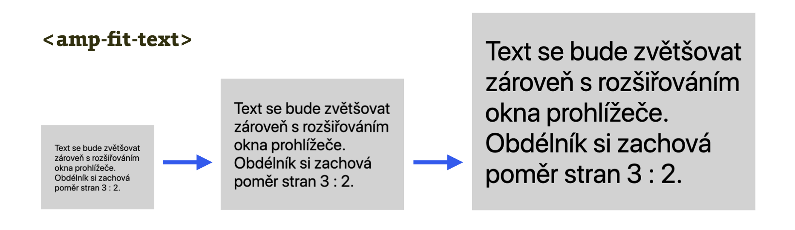

# AMP: Prezentační komponenty

Tato kategorie působí trochu jako „atakdále“, směska menších věcí, které se jinam nevešly. Očekávejte komponenty pro animování, vkládání webfontů, vizualizací, nebo třeba odpočet času a data.

Zato náhradu pro prvek `<marquee>`, běžící text, proslavený v dřevních dobách webdesignu, zde nenajdete.

Teď ale vážně, pojďme si to všechno projít.

<figure>

<figcaption markdown="1">
_Obrázek: Zajímavá je komponenta amp-fit-text, která využívá schopnosti technologie mít pod kontrolou layout v prohlížeči. Definujete poměr stran vnějšího prvku a další parametry, velikost textu už je na prohlížeči. Demo: [jsbin.com/gidoxuw](https://output.jsbin.com/gidoxuw)_
</figcaption>
</figure>

## amp-animation

Jak už víte z textu [o CSS v HTML](amp-css.md), na úrovni CSS je možné animovat pouze vlastnosti `opacity` a `transform`. Ani pořádné animace nám tu ale nejsou upřeny. `amp-animation` je dosti silná komponenta. Silná proto, že využívá Web Animations API.

Pro příklad si tentokrát zajdeme na CodePen, web plný jednoduchých demíček. Jde o animaci kolečka, které se po zmáčknutí tlačítka posune o dvacet procent šířky okna doprava:

```html
<amp-animation id="anim1" layout="nodisplay">
<script type="application/json">
{
  "selector": ".drop",
  "duration": "1s",
  "keyframes": { "transform": "translateX(20vw)" }
}
</script>
</amp-animation>
```

Pojďme vysvětlovat:

* `<amp-animation>` – obal pro deklaraci animace. V `id="anim1"` označujeme jméno animace a pak také zajišťujeme, aby byla animační deklarace skrytá před uživatelem – pomocí `layout="nodisplay"`.
* `<script type="application/json">` – samotná deklarace. Jak už víme, pro nastavování komponent je `<script>` v AMP povolený.
* `selector` – označuje prvek, kte kterému se animace váže. Ten je v HTML jako `<div class="drop"></div>`.
* `keyframes` – definice samotné animace. V době psaní tohoto textu je zde možné používat jen vlastnosti `opacity`, `transform`, `visibility` a `offset-distance`.

Asi jste si všimli, že jde o tytéž vlastnosti, jaké jste zvyklí používat při animování pomocí CSS. A například pro `@keyframes` je opravdu možné použít zápis v kaskádových stylech.

Spuštění animace pak obstarává tlačítko:

```html
<button on="tap:anim1.start">
  Start
</button>
```

Celý CodePen: [cdpn.io/e/yWLRNW](https://codepen.io/machal/pen/yWLRNW).

## Další prezentační komponenty

Balík prezentačních komponent čítá následující položky:

* `amp-date-countdown` – odpočet data. Třeba do startu rakety, kdybyste to náhodou potřebovali.
* `amp-date-display` – zobrazení data a času v lokálním formátu.
* `amp-timeago` – zobrazení uběhlého času. Například pro sdělení o čerstvosti stránky. Pomocí této komponenty můžete prostě vložit něco jako „Aktualizováno před 1587 lety“.
* `amp-dynamic-css-classes` – docela užitečná věc, jež vám do stránky přidá třídu, díky níž můžete zjistit, odkud k vám uživatel přišel, a podle toho AMP stránku upravit. Třída `amp-viewer` například oznamuje, že se prohlížení stránky odehrává  – hádejte kde, no ano – v zobrazovači, [AMP Vieweru](amp-viewer.md). Třída `amp-referrer-google-com` zase napráská, odkud uživatel přišel.
* `amp-fit-text` – umožňuje vložit text a říct mu, ať vyplní celou plochu rodičovského prvku. To vidíte na obrázku. Velikost písma si prohlížeč určí sám podle velikosti viewportu a definovaných parametrů.
* `amp-font` – definuje způsob zobrazení webfontů během jejich stahování. V zásadě to ale dnes řeší CSS vlastnost `font-display`, takže této komponentě bychom nepřikládali velký význam.
* `amp-mathml` – vkládá matematické výrazy pomocí MathML.

Jsou zde ještě dvě experimentální, ale zajímavá rozšíření:

* `amp-pan-zoom` – komponenta pro možnost kliknutí a zvětšení vkládaných objektů. Užitečné to může být pro různá schémata nebo mapy, vložení přes SVG.
* `amp-viz-vega` – vložení vizualizace pomocí gramatiky Vega, která používá známou knihovnu D3. Tímhle způsobem zvládnete jakýkoliv graf nebo i pokročilou vizualizaci.

To je vše. Pojďme se teď podívat na poslední kategorii. Rozšíření pro oblast, bez které bychom nedostávali pravidelný přísun fotek roztomilých koťátek a náš život by byl kvůli tomu výrazně chudší: sociální sítě.
